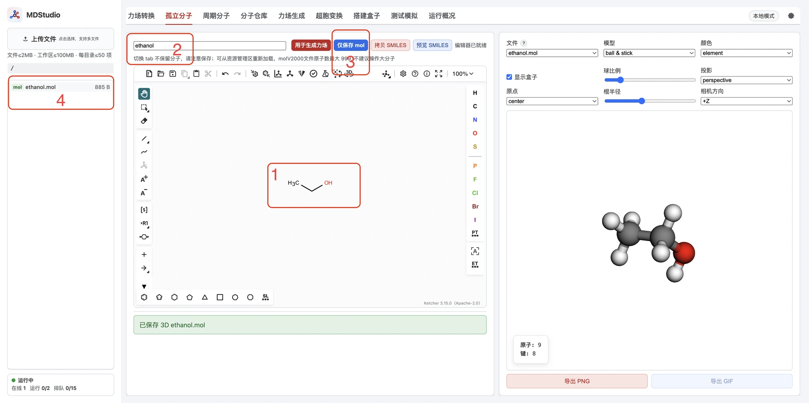
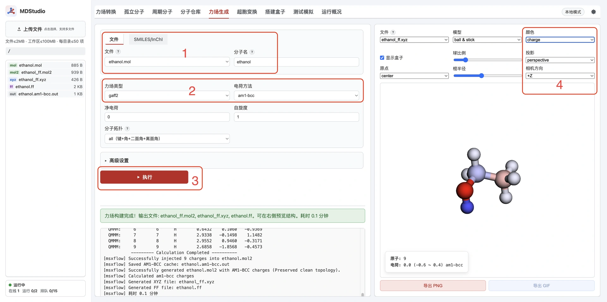
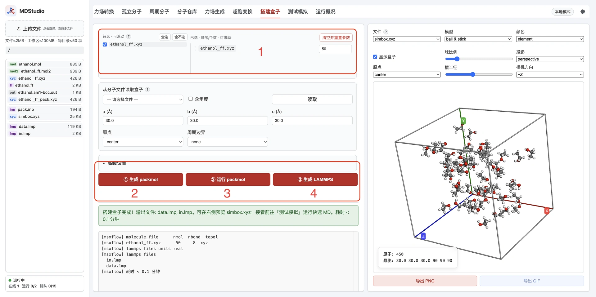
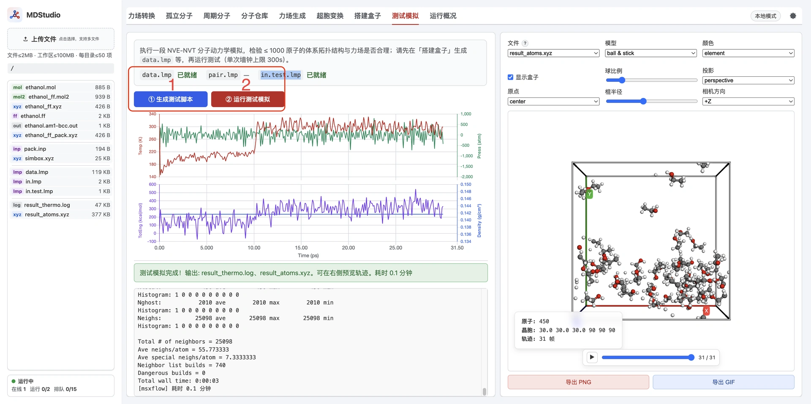

> **系列标签：** `MDStudio` · `Quickstart` · `乙醇`

新开一个分子动力学课题，往往卡在同一件事：分子画好了，力场、装盒、Lammps 输入却要在好几个软件之间来回传。[MDStudio](https://mdstudio.molsimulx.com) 是面向分子动力学用户的**轻量级在线工作室**——在浏览器里画分子、生成力场、搭建模拟盒子，一路写到 Lammps 常用输入，不必先搭本机命令行流水线。

终局两份文件（有时还会多出一份势参数片段）可以这样理解：

| 文件                 | 是什么                                                                        |
| ------------------ | -------------------------------------------------------------------------- |
| **`data.lmp`**     | 盒子里有什么：原子坐标、分子拓扑，以及力场落地后的数据                                                |
| **`in.lmp`**       | 怎么跑：积分、系综、输出等控制指令（Lammps 的启动脚本）                                            |
| **`pair.lmp`**（若有） | 势 / pair 相关片段，一般由生成流程写出，**会被 in.lmp 引用或并入**，可当作 in.lmp 体系的一部分，不必单独当「第三条主线」 |

跑通之后，还可以在站内做一次短时**测试模拟**，确认输入能启动、体系看起来稳定、分子拓扑结构不变。密度收敛、长轨迹、物性分析不在这里做——输入齐了，再下载到[本机或集群](../../在线资源/01-技术文档/T01-分子模拟工作平台搭建.md)正式算。

本文是 **Quickstart**：用一条故意做小的**乙醇体系**路径，大约 10–15 分钟走完「绘制 → 力场 → 装盒 → 测试」。学完能带走：该点哪些按钮、工作区里会出现哪些文件名、成功时右侧预览长什么样。各 Tab 与界面地图见 [MDStudio 功能与界面总览](M03-MDStudio功能与界面总览.md)，左侧文件面板见 [MDStudio 资源管理器（工作区文件）](M04-MDStudio资源管理器.md)；**正式使用前务必了解 [MDStudio 使用须知与限制](M02-MDStudio使用须知与限制.md)。**

---

## 一、案例目标（乙醇纯液）

| 项 | 建议 |
|----|------|
| **分子** | 乙醇（画板绘制；或力场页直接用 SMILES） |
| **力场** | GAFF2 + 电荷 AM1-BCC（快，适合入门） |
| **盒子** | 约 **10** 个乙醇分子（约 90 原子，小体系好过一遍；与免费档装盒上限一致） |
| **目标** | 10–15 分钟内走通；测试模拟跑完；可下载 `data.lmp` / `in.lmp` |
| **不算什么** | 密度收敛、轨迹分析、正式生产采样 |

---

## 二、推荐步骤

### 1. 孤立分子：绘制乙醇结构

1. 打开 **孤立分子** Tab，用画板画出乙醇。
2. 分子名处输入：**ethanol**
3. 点击 **仅保存 mol**，产生 **ethanol.mol** 文件写入左侧工作区。
4. 右侧可视化区自动展示 **ethanol.mol**；若没有，可单击该文件；双击可查看文件内容。

### 2. 力场生成：`.ff` + `.xyz`

1. 打开 **力场生成** Tab，选择上一步的 **ethanol.mol**；分子名会默认取该文件的 `stem`。（也可跳过步骤 1：直接输入乙醇 SMILES 码 `CCO`，并手动填写分子名。）
2. 力场选 **GAFF2**，电荷选 **AM1-BCC**，其他默认即可。
3. 点击 **执行** 提交任务，等待完成。
4. 工作区产生：
   - **ethanol_ff.mol2**：原子坐标与拓扑
   - **ethanol_ff.xyz**：原子坐标（后续搭建盒子用）
   - **ethanol.ff**：分子力场（后续生成 Lammps 输入用）
5. 右侧可视化区自动展示 **ethanol_ff.xyz**；颜色选 **charge** 可按电荷给原子着色；鼠标悬停某一原子，可查看其基本信息。

### 3. 搭建盒子：三步

1. 打开 **搭建盒子** Tab，勾选 **ethanol_ff.xyz**，个数设为 **10**，其他参数默认即可。
2. 点击 **生成 Packmol**，得到 **pack.inp** 与 **ethanol_ff_pack.xyz**，供下一步 Packmol 装盒使用。（需要时打开 **pack.inp** 编辑，可改装盒设置。）
3. 点击 **运行 Packmol**：后台读入 **pack.inp** 与 **ethanol_ff_pack.xyz**，生成 **simbox.xyz**；右侧可视化区自动展示装盒后的体系。
4. 点击 **生成 Lammps**：用 **simbox.xyz** 以及对应的分子结构、力场文件，写出 **data.lmp** 与 **in.lmp**。（需要时打开 **in.lmp** 编辑，可改模拟控制；若工作区还有 **pair.lmp**，一般随 `in.lmp` 一并使用即可。）
5. **data.lmp** 与 **in.lmp** 可下载，用于在本地或集群提交正式模拟。

### 4. 测试模拟

1. 打开 **测试模拟**，确认 **data.lmp** 显示已就绪。
2. 点击 **生成测试脚本**，生成 **in.test.lmp**；确认 **in.test.lmp** 显示已就绪。
3. 点击 **运行测试模拟** 启动；绘图区会动态展示温度、压力、能量、密度等变化，完成后可视化区展示模拟轨迹。
4. 测试模拟主要用于检查**能否稳定起步**、分子拓扑是否完整——验证流水线能跑，**不能**当作生产 MD。正式长跑请下载 `data.lmp` / `in.lmp`（及如有的 `pair.lmp`），到[本机或集群](../../在线资源/01-技术文档/T01-分子模拟工作平台搭建.md)继续算。

---

## 三、成功验收清单

- [ ] 工作区有 **ethanol.mol**（或等价结构）、**ethanol_ff.xyz**、**ethanol.ff**、**simbox.xyz**、**data.lmp**、**in.lmp**（有则还有 **pair.lmp** / **in.test.lmp**）
- [ ] 测试模拟跑完；绘图区 / 轨迹预览有输出
- [ ] 可将 **data.lmp**、**in.lmp** 下载到本地

---

## 四、常见问题

| 问题 | 处理 |
|------|------|
| Tab 提示开通会员 | 确认已登录；权益说明见 [MDStudio 使用须知与限制](M02-MDStudio使用须知与限制.md) |
| 力场失败 / 超时 | 分子是否过大；电荷是否仍为 AM1-BCC；打开任务日志看报错 |
| 装盒提示下载 `run_packmol.sh` | 本案例把分子数保持约 10 再试；其它情形见须知 |
| 测试模拟不能启动 | 确认 **data.lmp**、**in.test.lmp** 均显示就绪；仍不行再对照须知 |
| 右侧没有自动预览 | 在左侧工作区单击对应文件；双击可查看文本内容 |

---

## 小结

1. MDStudio 把「结构 → 力场 → 盒子 → Lammps 输入」收进浏览器；记住 **`data.lmp` 是数据，`in.lmp` 是怎么跑**（`pair.lmp` 有则跟 `in.lmp` 一起用）。
2. 乙醇 × 10 这条小路径，用来快速验证点击顺序与产物文件名。
3. 装盒用 **`ethanol_ff.xyz` + `ethanol.ff`** 成对保留；测试用 **`in.test.lmp`**，生产长跑另用下载的 **`in.lmp`**。遇开通或报错，再读须知即可。

---

## 学习路径

**前置阅读：**

- 无（可从本文开始）

**下一步：**

- [MDStudio 使用须知与限制](M02-MDStudio使用须知与限制.md) —— 使用中需要时再读
- [MDStudio 功能与界面总览](M03-MDStudio功能与界面总览.md) —— 界面地图与主路径
- [MDStudio 资源管理器（工作区文件）](M04-MDStudio资源管理器.md) —— 上传、下载与手改文件
