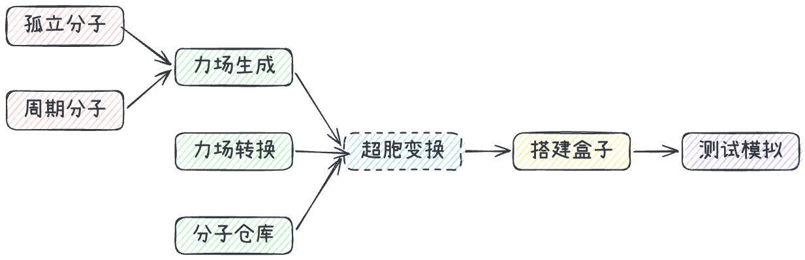

> **系列标签：** `MDStudio` · `总览` · `界面`

第一次进入 MDStudio，会看到中间一排 Tab、左侧一组文件，以及右侧的 3D 结构。其实只要记住一句话：**Tab 大致从左到右，串起一条「结构 → 力场 → 装盒 → 测试」的主线，其间穿插若干拓展工具。** 认清这条主线和三大分区，就不容易在力场转换、力场生成等功能之间迷路。

本文是**功能与界面总览**：介绍界面分区、功能顺序，以及每个 Tab 输入什么、输出什么、输出文件有什么用途。具体操作见 Quickstart 和各 Tab 详解；文件管理见 [MDStudio资源管理器](M04-MDStudio资源管理器.md)。**正式使用前，请先阅读 [MDStudio使用须知与限制](M02-MDStudio使用须知与限制.md)。** 若发现界面异常、功能与本文描述不符或疑似 bug，欢迎经官网[联系我们](https://www.molsimulx.com/contact_us/) 反馈；有效反馈我们会按情况回馈积分。

---

## 一、MDStudio 是什么

MDStudio 可以在浏览器中将分子结构逐步转化为可运行的 Lammps 输入：

**结构来源 → 力场参数 → Packmol 装盒 → Lammps 输入（`data.lmp` / `in.lmp`，必要时还有 `pair.lmp`）→ 可选短时测试模拟。**

入口：[https://mdstudio.molsimulx.com](https://mdstudio.molsimulx.com)

---

## 二、界面分区

| 区域                | 作用                                                                                               |
| ----------------- | ------------------------------------------------------------------------------------------------ |
| **左：资源管理器 / 工作区** | 当前项目的文件都在这里管理，包括上传、下载、重命名、预览和删除。各 Tab 读取与输出的文件也会落在当前工作区。详见 [MDStudio资源管理器](M04-MDStudio资源管理器.md) |
| **中：功能 Tab**      | 从左到右排列各项功能，是完成结构构建、力场生成、装盒和测试的主要操作区 |
| **右：3D 预览**       | 点选工作区中的结构文件（`.xyz` / `.mol` / `.cif` / `.mol2` 等）即可查看三维结构；支持按元素或电荷（若有）着色，文件含晶胞或盒子信息时还可显示边界框。是否能够预览取决于文件格式与结构规模 |

三者配合：**中间选择功能，左侧提供和接收文件，右侧查看结构结果。**

---

## 三、八个 Tab 逐个看

下面按界面顺序逐一介绍八个 Tab，分别说明其**功能、输入、输出和输出用途**。输出文件会出现在左侧工作区，结构类文件通常可以在右侧预览。

### 1. 力场转换

**核心功能：** 将其他在线力场生成工具的输出，一键转换为 MolSimulX 可识别的分子结构和力场文件。

| 项 | 内容 |
|----|------|
| **输入** | LigParGen 输出的 `.gro` + `.itp`，或 ATB 输出的 `.pdb` + `.itp` |
| **输出** | `<mol>.xyz`、`<mol>.ff` |
| **输出用途** | `<mol>.xyz` 保存分子坐标，`<mol>.ff` 保存转换后的拓扑与力场参数。二者可直接进入「搭建盒子」，无需再经过 MDStudio 内置的「力场生成」 |

详解：[MDStudio力场转换](M05-MDStudio力场转换.md)

### 2. 孤立分子

**核心功能：** 使用 Ketcher 绘制孤立分子，将结构保存为 `.mol` 文件，也可把 SMILES 复制到剪贴板。

| 项        | 内容                                                  |
| -------- | --------------------------------------------------- |
| **输入**   | 在 Ketcher 画板中绘制的二维分子结构 |
| **输出**   | `{name}.mol`；SMILES 文本                              |
| **输出用途** | `{name}.mol` 是生成三维坐标后的单分子结构，可送入「力场生成」；SMILES 文本也可以直接作为「力场生成」的输入 |

详解：[MDStudio孤立分子](M06-MDStudio孤立分子.md)

### 3. 周期分子

**核心功能：** 使用 ASE 构建周期性或低维结构，包括主体晶体、晶体表面、MX2、碳纳米管、石墨烯带和团簇等，并保存为 `.cif` 文件。

| 项 | 内容 |
|----|------|
| **输入** | 结构模板及相应参数，如化学式、晶向、层数、重复数和真空层等 |
| **输出** | `{name}.cif` |
| **输出用途** | `{name}.cif` 记录原子结构和晶胞信息，可以在右侧预览，也可送入「力场生成」继续处理；晶体、表面和纳米结构通常从这里起步 |

详解：[MDStudio周期分子](M07-MDStudio周期分子.md)

### 4. 分子仓库

**核心功能：** 检索和预览平台收录的常用分子结构及配套力场，并将所需文件直接导入工作区。

| 项        | 内容                                                                    |
| -------- | --------------------------------------------------------------------- |
| **输入**   | 分类、标签或名称关键词；也可直接选择仓库条目 |
| **输出**   | 预览不会复制文件；执行导入后，结构文件及配套 `.ff` 会复制到当前工作区 |
| **输出用途** | 导入后的结构文件（如 `.zmat` 或 `.xyz`）与 `.ff` 可以直接参与装盒。水模型、离子液体单体等因此无需重新绘制结构或准备力场 |

详解：[MDStudio分子仓库](M08-MDStudio分子仓库.md)

### 5. 力场生成

**核心功能：** 接收多种分子结构文件或 SMILES，选择经典力场和电荷方法，生成后续装盒所需的坐标与力场文件，并即时预览三维结构和电荷分布。

| 项        | 内容                                                                                                                                                     |
| -------- | ------------------------------------------------------------------------------------------------------------------------------------------------------ |
| **输入**   | 结构文件（`.xyz` / `.pdb` / `.mol` / `.mol2` / `.cif`）或 SMILES；同时选择力场类型（GAFF / GAFF2 / DREIDING）和电荷方法（mmff94 / am1-bcc / eqeq / resp / none，实际可选项取决于结构类型） |
| **输出**   | `{name}_ff.xyz`、`{name}.ff`、`{name}_ff.mol2`；周期性结构的 `{name}_ff.xyz` 会保留晶胞信息 |
| **输出用途** | `{name}_ff.xyz` 是后续装盒使用的坐标文件，第二行记录电荷方法和晶胞信息；`{name}.ff` 是 MolSimulX 的力场中间格式，记录原子类型、电荷、非键参数及键 / 角 / 二面角等参数；`{name}_ff.mol2` 保留最终电荷和成键信息，便于检查与复用 |
| **参数兜底** | 当所选经典力场缺少部分原子的非键参数时，程序可使用 UFF 参数补足；UFF 不是此处独立可选的力场类型 |
| **预览**   | 右侧可查看三维结构，并按元素或电荷着色，辅助检查结构和电荷分布是否合理 |

详解：[MDStudio力场生成](M09-MDStudio力场生成.md)

### 6. 超胞变换

**核心功能：** 对结构执行扩胞、非正交晶胞正交化、平移和旋转等几何变换。

| 项        | 内容                                                           |
| -------- | ------------------------------------------------------------ |
| **输入**   | `.xyz` 结构；优先读取第二行的 `cell` 信息，若文件不含晶胞，则根据结构包围盒补充盒子 |
| **输出**   | `*_trans.xyz`，第二行包含变换后的盒子信息 |
| **输出用途** | 输出文件保存变换后的结构，可将单胞扩展为超胞、将非正交晶胞转换为更便于处理的正交盒子，或完成平移 / 旋转后再进入「搭建盒子」 |

详解：[MDStudio超胞变换](M10-MDStudio超胞变换.md)

### 7. 搭建盒子

**核心功能：** 使用 Packmol 将一种或多种分子装入模拟盒子，并生成 Lammps 初始结构和运行脚本。

| 步              | 输入                                                  | 输出                                   | 输出用途                                                                                       |
| -------------- | --------------------------------------------------- | ------------------------------------ | ------------------------------------------------------------------------------------------ |
| **生成 Packmol 输入** | 一种或多种分子的坐标文件（常见为 `_ff.xyz`）和对应 `.ff`，以及分子个数、盒子尺寸等设置 | `pack.inp`、各物种 `*_pack.xyz` | `pack.inp` 是可继续编辑的装盒配置；`*_pack.xyz` 是提供给 Packmol 的单分子坐标 |
| **运行 Packmol** | `pack.inp` | `simbox.xyz` | 保存装盒后整个体系的原子坐标和空间位置 |
| **生成 Lammps**  | `simbox.xyz` + 各物种 `.ff` | `data.lmp`、`in.lmp`，必要时还有 `pair.lmp` | `data.lmp` 保存整盒坐标、拓扑和力场信息；`in.lmp` 是 Lammps 运行脚本；`pair.lmp` 保存部分 pair 参数，并由 `in.lmp` 引用 |

详解：[MDStudio搭建盒子](M11-MDStudio搭建盒子.md)

### 8. 测试模拟

**核心功能：** 根据已有 Lammps 输入生成 `in.test.lmp`，再运行一次小体系简单测试，检查拓扑和力场，并追踪温度、能量与结构变化。

| 项          | 内容                                                                                            |
| ---------- | --------------------------------------------------------------------------------------------- |
| **输入**     | 工作区中的 `data.lmp`、`in.lmp`，以及 `in.lmp` 引用时所需的 `pair.lmp` |
| **生成测试脚本** | 从 `data.lmp` 和 `in.lmp` 提取体系与力场设置，生成专用于简单测试的 `in.test.lmp`；若正式输入依赖 `pair.lmp`，系统也会检查该文件 |
| **运行测试**   | Lammps 实际运行 `in.test.lmp`，执行简化的能量最小化及短时 NVE / NVT 测试，而不是直接执行 `in.lmp` 中的完整生产流程 |
| **输出**     | `result_thermo.log`、`result_atoms.xyz`，以及由日志绘制的温度 / 能量曲线和结构变化预览 |
| **输出用途**   | 用于确认测试脚本能够启动、温度和能量无明显异常、分子拓扑未立即破坏；正式生产模拟仍使用 `in.lmp`，并应在本机或集群上运行 |

详解：[MDStudio测试模拟](M12-MDStudio测试模拟.md)

---

## 四、三条常见路径

根据结构来源不同，常见工作流可以分为三条：

1. **孤立分子：** 孤立分子绘制 / SMILES → 力场生成 →（可选超胞变换）→ 搭建盒子 → 测试模拟
2. **现成结构与力场：** 分子仓库导入 / 力场转换 →（可选超胞变换）→ 搭建盒子 → 测试模拟
3. **周期性或低维结构：** 周期分子 → 力场生成 →（可选超胞变换）→ 搭建盒子 → 测试模拟

> **Tips：** 最短闭环见 [Quickstart从画分子到测试模拟](M01-Quickstart从画分子到测试模拟.md)；晶体、表面和纳米结构通常从「周期分子」开始。

---

## 小结

1. 界面由左侧工作区、中间功能 Tab 和右侧 3D 预览组成。
2. 主线是：**结构来源 → 力场生成 → 搭建盒子 → 测试模拟**；力场转换、周期分子和超胞变换提供其他结构来源或几何处理能力。
3. `{name}_ff.xyz` + `{name}.ff` 用于装盒；装盒生成 `data.lmp` + `in.lmp`；测试 Tab 再生成并运行 `in.test.lmp`。
4. 八个 Tab 均有独立详解，三条常见路径覆盖大多数使用场景。
5. 遇到 bug、界面异常或文档与产品不一致，欢迎经[联系我们](https://www.molsimulx.com/contact_us/) 反馈；有效反馈我们会按情况回馈积分。

---

## 学习路径

**前置阅读：**

- [Quickstart从画分子到测试模拟](M01-Quickstart从画分子到测试模拟.md)
- [MDStudio使用须知与限制](M02-MDStudio使用须知与限制.md)

**下一步：**

- [MDStudio资源管理器](M04-MDStudio资源管理器.md)
- [MDStudio孤立分子](M06-MDStudio孤立分子.md)
- [MDStudio力场生成](M09-MDStudio力场生成.md)
- [MDStudio搭建盒子](M11-MDStudio搭建盒子.md)
