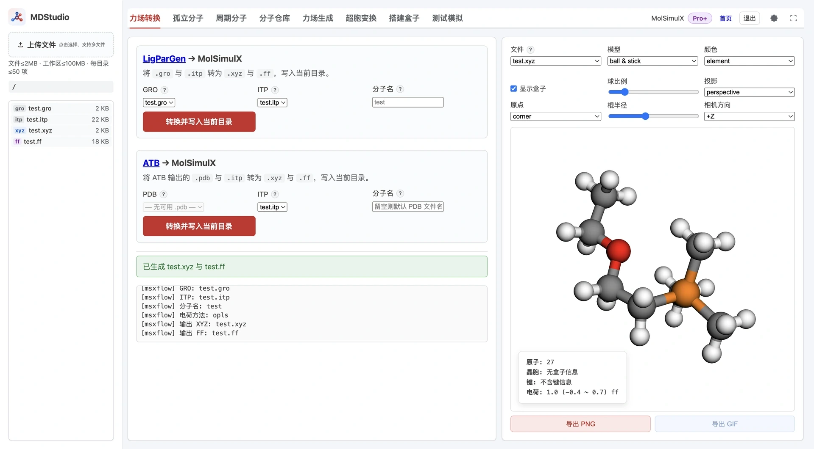

> **系列标签：** `MDStudio` · `LigParGen` · `ATB` · `力场转换`

有些体系的力场不方便在 MDStudio 里现算——例如已经在 [LigParGen](https://zarbi.chem.yale.edu/ligpargen/index.html)（OPLS-AA）或 [ATB](https://atb.uq.edu.au/)（GROMOS 54A7）上导出了 GROMACS 格式的拓扑。**力场转换** Tab 把这些外部力场配对成 MolSimulX 的 `.xyz` + `.ff`，直接进入装盒流程。

**上传成对的结构 + 拓扑 → 选择配对 → 转换 → 得到 `{name}.xyz` 与 `{name}.ff`。**

本文详细介绍两个转换入口（LigParGen、ATB）、需要准备哪些文件、表单字段与命名规则、两条转换管线各自读取什么、单位如何换算、输出 `.ff` 的势函数样式，以及哪些内容**不会**被转换。这里的「转换」是把已有参数**平移**成 MolSimulX 格式，不重新计算电荷或原子类型。

---

[erphpdown]

## 一、整体功能与数据流

力场转换 Tab 上下叠放**两个独立表单**，按你点哪个提交决定走哪条管线：

| 入口 | 输入 | 电荷方法 | 输出 |
| --- | --- | --- | --- |
| **LigParGen → MolSimulX** | `.gro` + `.itp`（OPLS-AA） | `opls` | `{name}.xyz` + `{name}.ff` |
| **ATB → MolSimulX** | `.pdb` + `.itp`（GROMOS 54A7） | `gromos` | `{name}.xyz` + `{name}.ff` |

**与力场生成的区别**：力场生成（见 [MDStudio力场生成](M09-MDStudio力场生成.md)）是依据内置参数库现场分配原子类型与电荷；力场转换则**照搬** `.itp` 里已有的电荷、原子类型和键连参数，不重建拓扑、也不重算电荷。因此转换结果的质量完全取决于你上传的 `.itp`。

转换是**同步**完成的：提交后立即在工作区写出文件并刷新资源管理器，不经过后台任务队列。

---

## 二、准备文件

两条管线都要求**成对**的结构与拓扑，且它们必须来自**同一分子的同一次导出**：

| 入口 | 结构文件 | 拓扑文件 | 坐标单位 |
|------|----------|----------|----------|
| **LigParGen** | `.gro` | `.itp` | GRO 用 nm，转换时自动 ×10 变 Å |
| **ATB** | `.pdb` | `.itp` | PDB 本就是 Å，保持不变 |

上传后，界面会**自动把同目录、同文件名（stem）的 `.itp`** 匹配给所选的 `.gro` / `.pdb`。因此建议成对文件同名，如 `ligand.gro` + `ligand.itp`。也可手动在下拉里改选其它 `.itp`。

转换过程会核对结构与拓扑的**原子数、序号、原子名**是否一致；只要对不上就报错（见常见问题），避免坐标和拓扑张冠李戴。

---

## 三、两个转换表单

两个表单字段结构相同：

| 字段 | 说明 |
|------|------|
| **GRO / PDB** | 选择结构文件；当前目录无可用文件时该项禁用 |
| **ITP** | 选择拓扑；默认自动匹配同名 `.itp`，可改选 |
| **分子名** | 输出文件名；留空按默认规则 |
| **提交按钮** | 「转换并写入当前目录」；缺结构或缺 `.itp` 时禁用 |

**分子名默认规则**：

- **LigParGen**：取 `.gro` 的 stem；若以 `UNK_` 开头会**自动去掉该前缀**，例如 `UNK_12297C.gro` → `12297C`。
- **ATB**：取 `.pdb` 的 stem，**不做**前缀处理，例如 `ATB_P2PB.pdb` → `ATB_P2PB`。

分子名不能为空，也不能含 `\ / : * ? " < > |` 等非法字符。输出写入资源管理器**当前文件夹**。

---

## 四、LigParGen（OPLS-AA）转换细节

从 `.itp` 读取并换算为 `.ff`：

| `.itp` 段 | 读取内容 | 单位换算 |
|-----------|----------|----------|
| `[ atomtypes ]` | 类型名、质量、电荷、σ、ε | σ：nm → Å（×10）；ε：kJ/mol 保留 |
| `[ atoms ]` | 序号、类型、原子名、电荷、质量 | — |
| `[ bonds ]` | `r0`、`k` | `r0`：nm → Å（×10）；`k`：kJ/mol/nm² → /Ų（÷100） |
| `[ angles ]` | `θ0`、`k` | 角度与角力常数保持不变 |
| `[ dihedrals ]` funct 3 | Ryckaert-Bellemans 系数 C0..C5 | 映射为 `nharmonic` |
| `[ dihedrals ]` funct 4 | 离面角（improper） | 映射为 `four` |

坐标从 `.gro` 读入并 nm → Å（×10）。二面角走 RB → `nharmonic` 换算（$A_i = (-1)^{i-1} C_{i-1}$，末尾极小系数截断）；funct 4 离面角写成 `four`，中心原子取第 3 个类型。输出 `.ff` 头部标注 `# charge_method opls`，键连参数按**力场类型**（非原子名）索引。

> 只处理 OPLS-AA 常见导出：仅支持二面角 funct 3 / 4，不解析 `[ pairs ]`、`[ cmap ]`、其它 funct 或多 `moleculetype`。

---

## 五、ATB（GROMOS 54A7）转换细节

ATB 的单分子 `.itp` **不含 `[ atomtypes ]`**，因此 LJ 参数从平台内置的 `gromos54a7_atb/ffnonbonded.itp` 按类型名查表补齐：GROMACS 的 `c6 / c12` 换算为 σ / ε（$\sigma_\text{Å} = 10\,(c_{12}/c_6)^{1/6}$，$\varepsilon = c_6^2/(4 c_{12})$），仅取 `ptype = A` 的行；类型查不到即报错。

各段的势函数样式：

| `.itp` 段 / funct | `.ff` 样式 |
|-------------------|-----------|
| `[ bonds ]` funct 2 | `gromos` |
| `[ angles ]` funct 2 | `cosinesq` |
| `[ dihedrals ]` funct 1（proper） | `four`（同一组多重项合并为 `four N ...`） |
| `[ dihedrals ]` funct 2（improper） | `impharm`（中心原子重排到首位） |

坐标从 `.pdb` 读入（Å，不变）。输出 `.ff` 头部标注 `# charge_method gromos`。

> ATB 的 `[ nonbond_params ]` 交叉项**不写入** `.ff`（装盒阶段按几何混合规则处理），`[ pairs ]` / `[ exclusions ]`（1-4 特殊缩放）也**不解析**。只覆盖 ATB 常见的 bond 2 / angle 2 / dihedral 1、2。

关于「离面角 = 不当二面角」的术语说明见 [搭建模拟盒子](M11-MDStudio搭建盒子.md)。

---

## 六、产物与命名

| 产物 | 内容 | 后续用途 |
|------|------|----------|
| `{name}.xyz` | 原子名与坐标（Å）；第二行引用 `{name}.ff` | 送入搭建盒子 / 可视化 |
| `{name}.ff` | 原子类型、质量、电荷、LJ 与键连参数（样式见上） | 与 `.xyz` 成对，供装盒写 Lammps |

装盒时务必选**本次转换得到的这一对**，不要与仓库或力场生成的同名分子混用。转换后可在可视化区打开 `.xyz` 检查坐标与电荷是否合理。

---

## 七、限制

- **无单独的原子数上限**：转换本身不设原子数限制，但受工作区总配额约束。
- **不经力场生成管线**：电荷、类型、键连均来自 `.itp`，转换器不做拓扑重建或电荷重算。

---

## 八、常见问题

| 问题 | 处理 |
|------|------|
| 提示原子数不一致 | `.gro`/`.pdb` 与 `.itp` 不是同一次导出；重新从 LigParGen / ATB 一次性导出成对文件 |
| 提示原子名 / 序号不一致 | 结构被改过但仍配旧 `.itp`；重新配对 |
| 找不到可选 `.itp` | 先把 `.itp` 上传到与结构同一目录，文件名尽量与结构同名 |
| ATB 提示某类型不在 ffnonbonded | 该 GROMOS 类型不在内置非键表内；确认 `.itp` 来自标准 ATB 54A7 导出 |
| 装盒找不到力场 | 刷新工作区；确认 `.ff` 与 `.xyz` 同名且在同一目录 |
| 期望的 1-4 缩放 / 交叉项没体现 | 转换不写 `[ pairs ]` / `[ nonbond_params ]`；装盒按几何混合处理交叉 LJ |

---

## 小结

1. 力场转换有两个入口：LigParGen（`.gro`+`.itp`）与 ATB（`.pdb`+`.itp`），产物都是 `.xyz` + `.ff`。
2. 它**平移**已有参数，不重算电荷或类型；成对文件必须来自同一次导出。
3. LigParGen 走 OPLS（nm→Å、RB→nharmonic）；ATB 走 GROMOS（从内置非键表补 LJ，bond `gromos`/angle `cosinesq`）。
4. 转换是同步的、无原子数上限；`[ pairs ]` / 交叉项等不写入。
5. 拿到 `.xyz` + `.ff` 后直接进入搭建盒子。

[/erphpdown]

---

## 学习路径

**前置阅读：**

- [MDStudio 使用须知与限制](M02-MDStudio使用须知与限制.md)
- [MDStudio 功能与界面总览](M03-MDStudio功能与界面总览.md)
- [MDStudio 资源管理器（工作区文件）](M04-MDStudio资源管理器.md)

**下一步：**

- [搭建模拟盒子（Packmol 三步）](M11-MDStudio搭建盒子.md)
- [MDStudio力场生成](M09-MDStudio力场生成.md)
