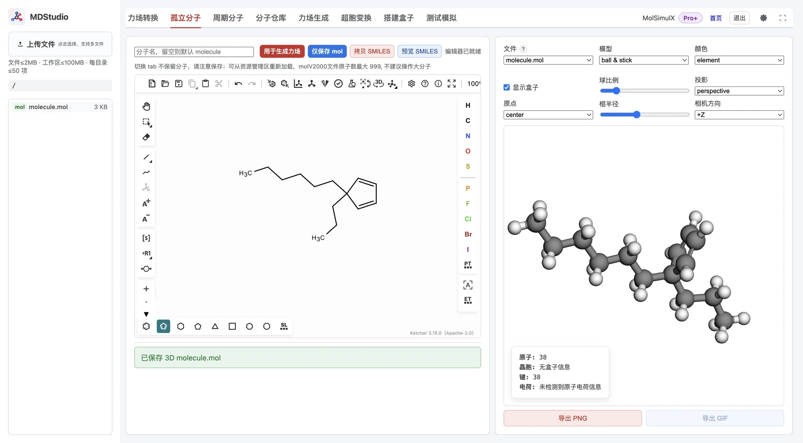

> **系列标签：** `MDStudio` · `Ketcher` · `绘制` · `孤立分子`

手头没有现成的结构文件，只想「随手画一个小分子再进 MD」——**孤立分子** Tab 内嵌 [Ketcher](https://github.com/epam/ketcher)（EPAM，Apache-2.0）绘图器：画好二维结构，一键生成带氢的三维 `.mol`，写入工作区。

**在画板画结构 → 生成三维（加氢 + 3D 坐标）→ 得到 `{name}.mol` → 送入力场生成。**

本文详细介绍界面与四个按钮、二维到三维怎么做、命名与去重规则、SMILES 的使用范围、原子数上限，以及画板打不开时怎么排查。这里只产出**结构**，不产出力场。



---

[erphpdown]

## 一、整体功能与数据流

孤立分子 Tab 由一个 Ketcher 画板加一排工具按钮组成，全部动作都读取画板上的**实时结构**：

1. 在 Ketcher 画二维结构（原子、键、电荷）。
2. 点按钮生成三维：平台自动补氢并生成三维坐标。
3. 结果以 `{name}.mol` 写入资源管理器**当前文件夹**。

数据流：

```text
Ketcher 画板（2D 结构）
        │  自动加氢 + 生成三维坐标
        ▼
   三维 .mol（含氢）
        │
        ▼
   力场生成 → 装盒 → 冒烟
```

> **切换 Tab 不保留画板内容**，请及时保存；已保存的 `.mol` 可从资源管理器重新载入画板继续编辑。

---

## 二、界面与操作

| 控件 | 作用 |
|------|------|
| **画板（Ketcher）** | 绘制二维结构；加载需要浏览器支持跨源隔离（见第六节） |
| **分子名** | 输出文件名；留空默认 `molecule` |
| **用于生成力场** | 保存三维 `.mol`，并直接跳到「力场生成」Tab 载入该文件 |
| **仅保存 mol** | 只把三维 `.mol` 写入工作区 |
| **拷贝 SMILES** | 把画板结构的 SMILES 复制到剪贴板 |
| **预览 SMILES** | 在提示条显示当前结构的 SMILES |

典型操作：画好结构 → 填分子名（可选）→ 点「用于生成力场」一步到位；或点「仅保存 mol」留在工作区稍后处理。画板为空时会提示先绘制结构。

---

## 三、三维化怎么做

保存时，平台把画板上的二维结构自动转成三维：

- **自动补氢**：**二维图里可以不画氢**，三维化时会按价态自动补齐显式氢原子；
- **生成并优化三维坐标**：给出一套合理的初始三维构型。

- **只输出 `.mol`**：这是本 Tab 唯一支持的导出格式。
- **MDL V2000 上限 999 原子**：这是格式硬限制；不建议在画板里处理大分子。

---

## 四、命名与去重

- **默认名**：分子名留空时用 `molecule`。
- **自动去重**：同目录已存在同名时依次生成 `molecule`、`molecule2`、`molecule3`……
- **纯数字名保留**：像 `123456` 这类纯数字名不会被当作序号后缀处理。
- 分子名非法（含路径分隔符、以 `.` 开头等）会被拒绝。

---

## 五、SMILES 在本 Tab 的范围

本 Tab 的 SMILES 只用于**从画板读出**（拷贝 / 预览），**没有**手动粘贴 SMILES / InChI 的输入框；保存始终由画板结构自动加氢生成三维。

如果你想**直接输入 SMILES / InChI 生成结构并配力场**，请到「力场生成」Tab 的 SMILES/InChI 模式（见 [MDStudio力场生成](M09-MDStudio力场生成.md)）——那里会按隐式价态自动补氢、生成三维并直接进入电荷与力场流水线。两者都能加氢生成三维，但入口不同。

---

## 六、限制

- **单分子原子数上限**：由配置决定（默认约 1000，见 [MDStudio 使用须知与限制](M02-MDStudio使用须知与限制.md)）。因为会自动加氢，平台还会做一个**保守预警**：若重原子数在加氢后可能超限，会提前提示简化结构。
- **工作区配额**：写入受工作区总大小与单文件大小限制约束。

---

## 七、接着做

- **一步到力场**：点「用于生成力场」会保存 `.mol` 并自动切到 [MDStudio力场生成](M09-MDStudio力场生成.md) 的文件模式，已选中该文件；入门常用 GAFF2 + AM1-BCC。
- **装盒与冒烟**：[搭建模拟盒子（Packmol 三步）](M11-MDStudio搭建盒子.md) → [测试模拟（Lammps 冒烟）](M12-MDStudio测试模拟.md)。
- **最短闭环**：[MDStudio Quickstart：从画分子到测试模拟](M01-Quickstart从画分子到测试模拟.md)。

---

## 八、常见问题

| 问题         | 处理                                          |
| ---------- | ------------------------------------------- |
| 画板空白 / 打不开 | 确认为 HTTPS 或 localhost、浏览器较新；硬刷新重试           |
| 保存 / 三维化失败 | 检查价键是否闭合、有无游离原子；缩小分子；查提示中的报错信息              |
| 提示原子数超限    | 分子过大或加氢后超限；简化结构，或按须知确认上限                    |
| 想用现成分子     | 改走 [分子仓库（浏览、预览与导入）](M08-MDStudio分子仓库.md) 导入 |
| 切走后结构没了    | 画板不跨 Tab 保留；请先保存，再从资源管理器重新载入                |

---

## 小结

1. 孤立分子 Tab 用 Ketcher 画二维，自动加氢生成带氢三维 `.mol`。
2. 只产出结构不产出力场；只导出 `.mol`，受 MDL 999 原子上限约束。
3. 默认名 `molecule`，同名自动 `molecule2`…；纯数字名保留。
4. 本 Tab 只从画板读 SMILES；要输入 SMILES/InChI 建结构请用力场生成 Tab。
5. 下一步几乎总是力场生成，「用于生成力场」按钮可一键跳转。

[/erphpdown]

---

## 学习路径

**前置阅读：**

- [MDStudio Quickstart：从画分子到测试模拟](M01-Quickstart从画分子到测试模拟.md)
- [MDStudio 使用须知与限制](M02-MDStudio使用须知与限制.md)
- [MDStudio 功能与界面总览](M03-MDStudio功能与界面总览.md)

**下一步：**

- [MDStudio力场生成](M09-MDStudio力场生成.md)
- [分子仓库（浏览、预览与导入）](M08-MDStudio分子仓库.md)
- [搭建模拟盒子（Packmol 三步）](M11-MDStudio搭建盒子.md)
