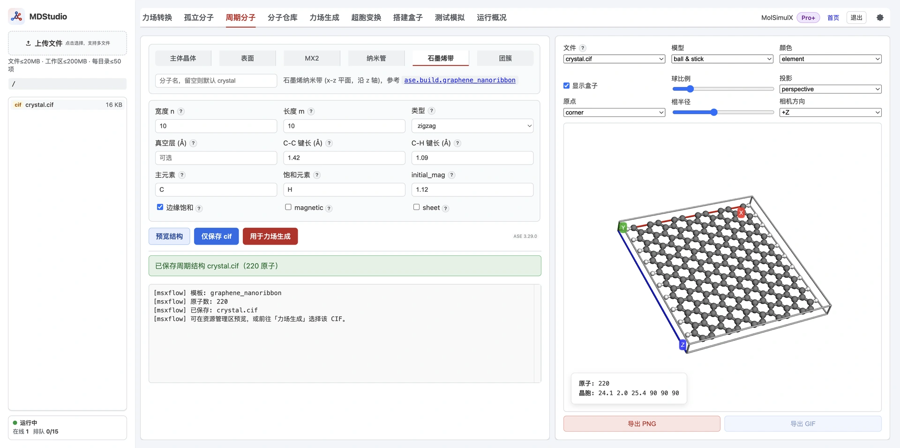

> **系列标签：** `MDStudio` · `ASE` · `CIF` · `周期分子`

需要一块有晶胞的材料、表面、纳米结构或团簇，而不是溶液里漂着的孤立分子——**周期分子** Tab 用 [ASE](https://wiki.fysik.dtu.dk/ase/) 的结构生成器，按模板长出结构并写成 `.cif`，再送去力场生成或装溶剂。

**选类别 → 选子模板 → 填参数 → 预览确认 → 保存 `{name}.cif`（可一键接力场生成）。**

本文详细介绍六大类模板及各自参数、真空层与 CIF 导出的处理、命名规则、原子数校验与权限，以及生成后如何接力场（框架材料常用 EQeq）与超胞变换。这里只产出**结构**，不产出力场。



---

[erphpdown]

## 一、整体功能与数据流

周期分子 Tab 提供六类结构生成器，底层调用 ASE 构建原子模型，再统一写成 `.cif`：

```text
选择类别 + 参数
        │  ASE build
        ▼
   原子模型（含/不含晶胞）
        │  补足三维晶胞（有限体系加真空盒）
        ▼
   {name}.cif  →  力场生成 / 超胞变换 / 装溶剂
```

生成是**同步**的。底部三个按钮分工如下：

| 按钮 | 作用 |
|------|------|
| **预览结构** | 按当前参数在右侧可视化窗口查看三维结构，**不写入**资源管理器；调参时可反复点，避免工作区堆出一串同名 CIF |
| **仅保存 cif** | 把结构写成 `{name}.cif` 写入资源管理器当前文件夹（同名自动去重） |
| **用于力场生成** | 写出 CIF 后自动跳到「力场生成」Tab 并载入该文件 |

典型操作：选好模板、填参数 → 先点「预览结构」确认晶胞与形貌 → 再点「仅保存 cif」或「用于力场生成」。预览与正式保存受**同一套原子数上限**约束，超限会直接拒绝。

---

## 二、六大类模板

| 类别 | 生成对象 | 典型用途 |
|------|----------|----------|
| **主体晶体 crystal** | `ase.build.bulk` 体相晶体 | 金属、简单晶体、离子晶体 |
| **表面 surface** | 常见低指数面 / 任意 Miller 面 slab | 切面、表面吸附建模起步 |
| **MX2** | 过渡金属硫属化物单层（如 MoS₂） | 二维材料 |
| **纳米管 nanotube** | 碳纳米管等 `(n, m)` 管 | 一维纳米结构 |
| **石墨烯带 graphene_nanoribbon** | 锯齿 / 扶手椅纳米带或无限片 | 石墨烯带 / 片 |
| **团簇 cluster** | 层指定立方簇 / Wulff / 二十面体等 | 纳米颗粒 |

选定类别后，界面再用下拉选择子模板（表面预设、团簇预设等），并只显示该子模板相关的参数字段；可用「预览结构」在右侧确认晶胞是否合理，再正式保存。

> **复杂周期结构暂需本地自备。** 本 Tab 覆盖的是上面六类相对规整的晶体 / 表面 / 纳米结构；像 **COF、MOF、氧化石墨烯（GO）** 这类拓扑复杂、需要专门构建器或数据库的周期材料，目前**请在本地用相应工具生成 `.cif`，再上传到工作区**接后续的力场生成 / 超胞变换 / 装溶剂。相关的构建工具与模块**后续会陆续接入** MDStudio 辅助生成，敬请期待。

---

## 三、各类参数详解

各字段旁的「?」提示给出 ASE 官方含义，参数的完整定义与取值范围请参阅 [ASE 官方文档](https://ase.gitlab.io/ase/ase/build/build.html#module-ase.build)。下面按类别列主要参数（默认值以界面为准）。

### 3.1 主体晶体（crystal → `ase.build.bulk`）

| 参数 | 说明 |
|------|------|
| **元素 / 化学式** | 如 `Cu`、`MgO`、`NaCl`（必填） |
| **晶体结构** | `sc / fcc / bcc / hcp / diamond / rocksalt / zincblende / fluorite / wurtzite …`；留空则按元素猜测 |
| **a / b / c** | 晶格常数（可选，视结构而定） |
| **alpha** | 菱方晶格角度 |
| **covera** | hcp 的 c/a 比 |
| **u** | 纤锌矿内坐标 |
| **orthorhombic / cubic** | 强制正交 / 立方晶胞 |
| **nx / ny / nz** | 生成后按此重复扩胞（默认 1） |

> 若元素与所选结构不匹配又没给晶格常数，会报错提示补 `a`（例如 Cu 天然是 fcc，要按 bcc 建时须手填 `a`）。

### 3.2 表面（surface）

预设涵盖 `fcc100/110/111/211`、`bcc100/110/111`、`hcp0001/hcp10m10`、`diamond100/111`，以及 `miller`（任意 Miller 面）。

| 参数 | 说明 |
|------|------|
| **预设 / 元素** | 选择面型与元素（如 `fcc111` + `Al`） |
| **nx / ny / layers** | 面内重复与层数 |
| **真空层 vacuum** | slab 两侧真空厚度 |
| **a / c** | 晶格常数覆盖（`c` 仅 hcp 用） |
| **orthogonal** | 是否强制正交胞 |
| **periodic** | 沿法向做成体相式周期胞 |

部分预设有约束：`fcc211` 的 `nx` 需为 3 的倍数并强制正交；`hcp10m10` 的 `ny` 需为偶数；正交模式下 `fcc111`/`bcc110`/`bcc111`/`hcp0001`/`diamond111` 的 `ny` 需为偶数。选 `miller` 时填 `h k l`、层数、真空、`tol`，以及可选的 bulk 晶格类型（指定时须填 `a`）。

### 3.3 MX2

| 参数 | 说明 |
|------|------|
| **化学式** | 默认 `MoS2` |
| **kind** | `2H` 或 `1T` |
| **a / thickness** | 晶格常数与层厚 |
| **nx / ny / nz / vacuum** | 重复与真空 |

### 3.4 纳米管（nanotube）

| 参数 | 说明 |
|------|------|
| **n / m** | `(n, m)` 手性指数（`m` 可为 0） |
| **length** | 沿轴重复单元数（整数，非 Å） |
| **bond / symbol** | 键长与元素（默认 C，1.42 Å） |
| **vacuum / verbose** | 真空；打印手性角/直径到日志 |

### 3.5 石墨烯带（graphene_nanoribbon）

| 参数 | 说明 |
|------|------|
| **n / m** | 带宽 / 沿 z 长度（扶手椅 n 可为半整数如 2.5，锯齿须整数） |
| **type** | `zigzag` / `armchair` |
| **saturated** | 边缘是否加饱和原子（默认 H） |
| **C_C / C_H** | 键长 |
| **vacuum** | 非周期方向留空则用 ASE 默认最小胞 |
| **magnetic / initial_mag / sheet** | 边缘磁矩 / 是否做无限片 |
| **main_element / saturate_element** | 骨架 / 边缘饱和元素 |

### 3.6 团簇（cluster）

七种子预设：`layers_fcc / layers_bcc / layers_sc`（层指定立方簇）、`wulff`（Wulff 构型）、`icosahedron`、`octahedron`、`decahedron`。

| 子预设 | 关键参数 |
|--------|----------|
| **layers_\*** | `surfaces`（Miller 面列表）、`layers`（各面层数，个数须与面一致）、`vacuum`、可选 `a` |
| **wulff** | `surfaces`、`energies`（各面表面能，个数须与面一致）、`size`（目标原子数）、`structure`（fcc/bcc/sc）、`rounding`（closest/above/below） |
| **icosahedron** | `noshells`（壳层数 ≥1） |
| **octahedron** | `length`、`cutoff`（0=正八面体，>0=截角）、`alloy` |
| **decahedron** | `p / q / r` |

公共项：`element`（默认 Cu）、可选晶格常数 `a`、真空。生成后日志会给出直径、Miller 面/层信息等。

---

## 四、真空层与 CIF 导出

CIF 需要完整的三维晶胞，因此对**非完全周期**的结构会补足：

- 表面、纳米管、纳米带等在**非周期方向**上按 `center(vacuum=…)` 建盒；仍不足三维时兜底再加约 1 Å；
- 完全非周期的团簇按需在各方向居中留真空。

各类别的 `vacuum` 字段控制**实际隔离厚度**（决定像间距离），CIF 导出的补足只是让写文件成功的最小兜底。因此需要足够真空隔离时，请显式在 `vacuum` 里填数值，别只靠兜底。

生成的 CIF 写入标准 `_cell_length_*` / `_cell_angle_*` 与 `_atom_site_*`。注意：**真正的周期性**（真材料晶胞）与「为有限体系补的真空盒」在 CIF 里都表现为一个晶胞——下游是否当作周期体系，取决于是否含晶胞信息与你的选择。

---

## 五、产物与命名

| 产物 | 用途 |
|------|------|
| `{name}.cif` | 力场生成、超胞变换、装溶剂 / 客体、可视化 |

分子名默认 `crystal`，写入资源管理器**当前文件夹**；同名自动去重（`crystal`、`crystal2`…）。分子名不能含路径分隔符或以 `.` 开头。

「预览结构」**不会**在资源管理器里留下正式 CIF；只有「仅保存 cif」或「用于力场生成」才会按上面的命名规则落盘。

---

## 六、限制

- **原子数两次校验**：生成前先按参数**预估**原子数，超上限直接拒绝（避免真去构建巨型超胞）；生成后再按**实际**原子数复核。上限同「单分子处理上限」。预览与正式保存均受此限制。
- **条目上限**：当前目录文件/文件夹数达上限时先清理再**保存**；纯预览不占用资源管理器条目。

---

## 七、接着做

- **一键接力场**：点「用于力场生成」会写出 CIF 并跳到 [MDStudio力场生成](M09-MDStudio力场生成.md) 载入它。
  - **框架 / 周期材料常用 EQeq 电荷**：EQeq 仅适用于**含晶胞信息的周期性 CIF**；纯有限团簇（无晶胞）不能用 EQeq，会被拒绝。
- **扩胞 / 变换**：需要更大或近正交超胞时接 [MDStudio超胞变换](M10-MDStudio超胞变换.md)。
- **装溶剂 / 客体**：把框架与溶剂一起送入 [搭建模拟盒子（Packmol 三步）](M11-MDStudio搭建盒子.md)。

---

## 八、常见问题

| 问题 | 处理 |
|------|------|
| 预览的胞怪 / 太扁 | 检查是否选错子模板或真空层过薄；显式加大 `vacuum`；可反复「预览结构」调参，满意后再保存 |
| 报错要求补晶格常数 `a` | 元素与所选结构不匹配（如 Cu 建 bcc）；手填 `a` |
| 表面报 `nx`/`ny` 约束错 | 依预设要求调整（如 `fcc211` 的 nx 取 3 的倍数、部分正交预设 ny 取偶数） |
| 力场不接受该 CIF | 团簇（无胞）不能走 EQeq；改用其它电荷方法或补真空当周期体系看 |
| 体系太大被拦截 | 缩小模板 / 减少重复层数；或先小超胞再扩（注意装盒与冒烟上限） |
| 想建 COF / MOF / 氧化石墨烯 | 本 Tab 暂不覆盖；先在本地用相应工具生成 `.cif` 再上传（后续会接入辅助模块） |

---

## 小结

1. 周期分子用 ASE 生成器产出 `.cif`，涵盖晶体、表面、MX2、纳米管、石墨烯带、团簇六类。
2. 可先「预览结构」确认形貌，再「仅保存 cif」或「用于力场生成」落盘；预览不占用资源管理器条目。
3. 有限体系导出 CIF 会补真空盒；需要真隔离请显式填 `vacuum`。
4. 生成前后各校验一次原子数（预览同样受限）。
5. 框架材料常配 EQeq 电荷，且 EQeq 只认有晶胞的周期 CIF。
6. 保存后可一键接力场生成，或先做超胞变换。

[/erphpdown]

---

## 学习路径

**前置阅读：**

- [MDStudio 使用须知与限制](M02-MDStudio使用须知与限制.md)
- [MDStudio 功能与界面总览](M03-MDStudio功能与界面总览.md)

**下一步：**

- [MDStudio超胞变换](M10-MDStudio超胞变换.md)
- [MDStudio力场生成](M09-MDStudio力场生成.md)
- [搭建模拟盒子（Packmol 三步）](M11-MDStudio搭建盒子.md)
