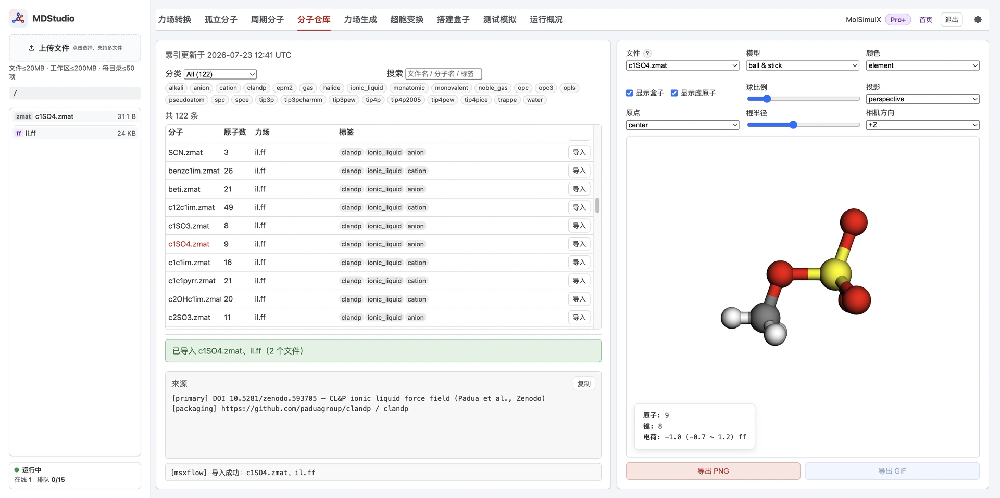

> **系列标签：** `MDStudio` · `分子仓库` · `导入`

不想画分子、也不想到处找水模型文件——**分子仓库**里已经分门别类放好了常见溶剂、水模型、离子液体阴阳离子、离子等，每条都带配套 `.ff` ，可先浏览预览，再一键导入工作区，直接装盒。

**检索 / 筛选 → 3D 预览确认 → 导入（结构 + `.ff`）到当前目录 → 直接搭建盒子。**

本文详细介绍库里有什么、怎么浏览筛选与预览、导入会复制哪些文件、水与离子如何配套，以及浏览/导入的权限差异。仓库条目**已带力场**，因此通常可跳过力场生成，直接进入装盒。



---

[erphpdown]

## 一、整体功能与数据流

分子仓库是一个**只读**的结构库：平台预先建好索引，浏览时只读索引、不实时扫描磁盘。

```text
浏览 / 筛选（分类 / 标签 / 关键字）
        │
        ▼
   3D 预览（原地读取，不复制）
        │  导入
        ▼
   复制 结构 + .ff 到当前文件夹  →  搭建盒子
```

关键特点：**库里每个条目都是「结构 + 它内部声明的 `.ff`」的成对包**。因为力场已经写好，导入后**不必再经力场生成**，可直接进入 [搭建模拟盒子](M11-MDStudio搭建盒子.md)。

---

## 二、库里有什么

**分类**（category）：

| 分类                                          | 内容                                |
| ------------------------------------------- | --------------------------------- |
| **small_molecule**                          | 小分子、溶剂、气体（气体在 `gas/` 并带 `gas` 标签） |
| **water**                                   | 水模型                               |
| **ion**                                     | 离子（非离子液体系列）                       |
| **ionic_liquid**                            | 离子液体阴 / 阳离子单体                     |
| **metal**                                   | 金属 LJ 参数                          |


**结构格式**：`.xyz`、`.zmat`、`.mol`、`.pdb`（`.ff` 引用写在结构文件内：`.zmat` 末行、`.xyz` 第二行注释、`.mol` 头部、`.pdb` 的 `COMPND` 行）。

**成对关系可为 1:1 或 N:1**：例如离子液体 CL&P 系列的几十个阴阳离子 `.zmat` 共享同一个 `il.ff`。

---

## 三、浏览与筛选

筛选表单提供三种方式，可组合：

| 方式 | 说明 |
|------|------|
| **分类** | 按上表类别过滤 |
| **标签** | 按条目标签过滤（如 `gas`、离子对应的水模型系列等） |
| **关键字** | 在文件名、分子名、标签里做子串匹配 |

> 关键字搜索**不匹配路径**，只匹配文件名 / 分子名 / 标签，避免因目录结构误命中。

列表按分子名、原子数、力场、标签分列显示，并给出结构总数与索引时间。

---

## 四、预览

点条目的分子名即可在右侧做 **3D 预览**（元素/电荷着色、晶胞框等）。预览是**原地读取**库文件，**不往工作区复制任何东西**——放心多点几个对比后再决定导入哪个。

---

## 五、导入

点「导入」会把**结构文件 + 它配套的 `.ff`** 复制到资源管理器**当前文件夹**：

- **不改名**，保留原始文件名（如 `PF6.zmat` + `il.ff`）；
- 目录已存在同名结构时**拒绝覆盖**并提示（不会覆盖你已有的文件）；
- 若配套 `.ff` 已在目录中则复用、不重复复制。

因此一次导入通常写入**两个文件**（结构 + `.ff`）；N:1 共享力场时，后续同系列条目只补结构文件。

> **导入后会提示力场来源，请先核对是否满足需求。** 导入结果面板会列出该条目的**力场族**与**来源**（可能是文献 DOI、GitHub 仓库或某次 MDStudio 生成任务），并把这些溯源信息随结构一起保存。装盒前请对照**力场出处、电荷方法、适用体系**确认它符合你的目标（例如水模型系列是否一致、离子力场文献是否对得上），不要仅凭分子名就直接使用。

---

## 六、水模型与离子液体

**水模型**（详见库内 `.ff` 与水模型说明）：`spc`、`spce`、`tip3p`、`tip3pew`、`tip3pcharmm`（三点，`lj/cut/coul/long`）与 `tip4p`、`tip4pew`、`tip4pice`、`tip4p2005`、`opc`（四点，M 点由 Lammps 隐式处理，`lj/cut/tip4p/long`）。它们都是三显式原子的 `.zmat` + `.ff`，**不经力场生成**，参数已在库内 `.ff` 写好。

**离子液体**：CL&P 系列阴阳离子（如 `c4c1im`、`BF4`、`PF6`、`ntf2` 等），共享 `il.ff`。

> **水与离子请选同一系列**：库里的离子按目标水模型分组，可用**标签**筛选出对应系列。装盒时请选与水相同模型的离子变体，否则 LJ / 静电参数与文献不一致。

---

## 七、限制

- **无导入次数限制**：不限每日/每次导入条数；仅受工作区总大小配额约束（见 [MDStudio 使用须知与限制](M02-MDStudio使用须知与限制.md)）。

---

## 八、常见问题

| 问题 | 处理 |
|------|------|
| 导入按钮不可用 | 确认已登录并具备相应权限 |
| 导入提示同名未导入 | 当前目录已有同名结构；换目录或先重命名已有文件 |
| 导入后装盒缺力场 | 正常情况下会连 `.ff` 一起复制；确认 `.ff` 与结构同名同目录，未被误删 |
| 找不到目标分子 | 换关键字或改用分类/标签；库里没有就走 [孤立分子](M06-MDStudio孤立分子.md) 绘制或 [力场转换](M05-MDStudio力场转换.md) |
| 不确定力场是否合适 | 看导入结果面板的「力场族」与「来源」，核对电荷方法与文献出处是否匹配你的体系 |
| 水和离子参数不一致 | 选同一水模型系列的离子变体 |

---

## 小结

1. 分子仓库是只读结构库，每条都带配套 `.ff`，导入后可直接装盒、不必再做力场生成。
2. 支持分类 / 标签 / 关键字筛选，点名字即 3D 预览（原地读取，不复制）。
3. 导入复制「结构 + `.ff`」到当前目录，不改名、同名不覆盖；结果面板会提示**力场族与来源**，用前请核对是否满足需求。
4. 水与离子请选同一系列，避免混模型硬装。
5. 不限导入次数，仅受工作区配额约束。

[/erphpdown]

---

## 学习路径

**前置阅读：**

- [MDStudio 使用须知与限制](M02-MDStudio使用须知与限制.md)
- [MDStudio 功能与界面总览](M03-MDStudio功能与界面总览.md)
- [MDStudio 资源管理器（工作区文件）](M04-MDStudio资源管理器.md)

**下一步：**

- [搭建模拟盒子（Packmol 三步）](M11-MDStudio搭建盒子.md)
- [MDStudio力场生成](M09-MDStudio力场生成.md)
- [测试模拟（Lammps 冒烟）](M12-MDStudio测试模拟.md)
