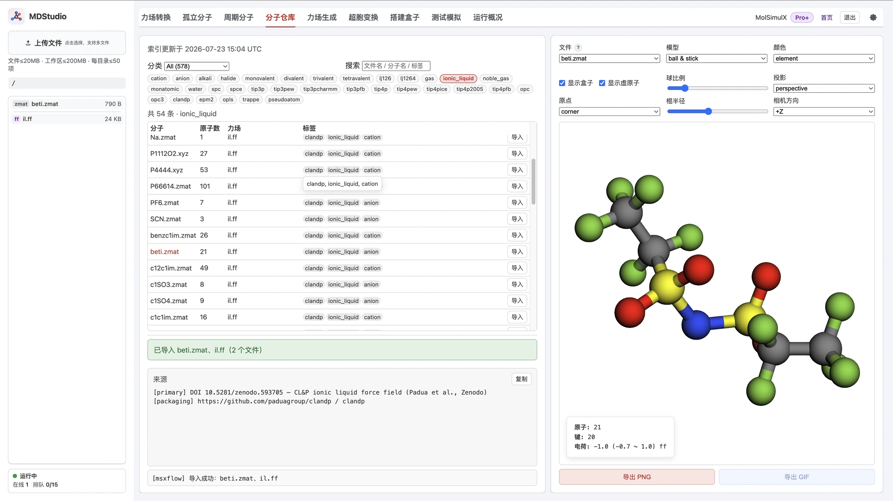

> **系列标签：** `MDStudio` · `分子仓库` · `导入`

不想画分子、也不想到处找水模型文件——**分子仓库**收录可浏览、预览并导入的结构；库内容会随索引更新，条目数以界面当前索引为准。条目若声明配套 `.ff`，导入时会一并复制，可直接衔接装盒。

**分类 / 标签 / 搜索 → 预览（结构 + 来源）→ 导入（结构 + 可用的 `.ff`）→ 后续处理。**

带有配套 `.ff` 的条目导入后通常可跳过力场生成，直接进入装盒；没有 `.ff` 的条目仍需按实际用途补力场。



---

[erphpdown]

## 一、整体功能与数据流

分子仓库是一个**只读**结构库：平台预先建好索引，浏览时只读索引、不实时扫描磁盘。

```text
分类 + 搜索
    │
标签按钮（随分类变化，可多选）
    │
    ▼
列表筛选结果
    │  点分子名
    ▼
右侧 3D 预览（原地读取）+ 底部「来源」
    │  导入（需相应权限）
    ▼
复制结构 + 配套 .ff（若有）到当前文件夹
```

关键特点：索引记录结构及其力场引用；条目声明且存在配套 `.ff` 时，导入会将二者一起复制。此类条目可直接进入 [MDStudio搭建盒子](M11-MDStudio搭建盒子.md)。

---

## 二、库里有什么

界面上的**分类**下拉为英文显示名（括号内为条目数），与库内 `category` id 对应如下：

| 界面显示               | category id      | 内容概要                                |
| ------------------ | ---------------- | ----------------------------------- |
| **All**            | （空）              | 全部条目                                |
| **Small Molecule** | `small_molecule` | 小分子 / 溶剂 / 气体（`gas/` 下另有 `gas` 等标签） |
| **Water**          | `water`          | 常见刚性水模型                             |
| **Ion**            | `ion`            | 离子（按目标水模型等分组）                       |
| **Ionic Liquid**   | `ionic_liquid`   | 离子液体阴 / 阳离子单体                       |

**结构格式**：`.xyz`、`.zmat`、`.mol`、`.pdb`。`.ff` 引用写在结构文件内（`.zmat` 末行、`.xyz` 注释行、`.mol` 头部、`.pdb` 的 `COMPND` 等）。

**成对关系可为 1:1 或 N:1**：例如 CL&P 系列大量阴阳离子 `.zmat` 共享同一个 `il.ff`；部分条目也可能没有 `.ff`。

### 常见内容与标签（英文）

标签在界面上全部为**英文 id**，例如：

| 用途 | 示例标签 |
|------|----------|
| 气体 / 类型 | `gas`、`trappe`、`epm2`、`noble_gas`、`monatomic`、`opls` |
| 虚位点 | `pseudoatom`（含虚原子 `M` 的条目，如部分 TraPPE） |
| 水模型 | `spc`、`spce`、`tip3p`、`tip4p`、`opc`、`opc3` … |
| 离子液体 | `clandp`、`ionic_liquid`、`cation`、`anion` |
| 离子 | `alkali`、`halide`、`monovalent` / `divalent` / `trivalent` / `tetravalent`、`lj126` / `lj1264`，以及对应水模型标签（如 `spce`） |

可用标签集合会随**当前分类**变化：例如选 Water 时主要出现水模型相关标签，选 Small Molecule 时出现 `gas` / `trappe` / `pseudoatom` 等。

---

## 三、浏览与筛选

筛选区布局：

1. **第一行**：左侧 **分类** 下拉 + 右侧 **搜索** 框（同排）。
2. **其下**：一排可换行的**标签按钮**（无「标签」二字标题）。点选高亮；可**多选**。多选时为 **AND**：条目须同时具备所选标签。再点一次可取消。
3. 切换分类时，标签按钮集合会刷新，并清空已选标签，避免跨分类残留。

| 方式 | 说明 |
|------|------|
| **分类** | 按上表过滤；切换后标签选项同步更新 |
| **标签按钮** | 英文 tag；多选 AND；仅显示当前分类下实际出现过的 tag |
| **搜索** | 在文件名 / 分子名 / 标签中做子串匹配（**不匹配路径**） |

列表列包括：**文件名、分类、原子数、力场引用、标签、审阅状态、力场族**，并提供导入操作。顶部会显示匹配条数；面板会显示索引更新时间。

---

## 四、预览与来源

点列表中的**分子名**：

- 右侧做 **3D 预览**（元素 / 电荷着色、盒子等；含虚原子时可用「显示虚原子」开关）。预览是**原地读取**库文件，**不复制**到工作区。
- 底部结果区会尽量展示该条目的 **来源**（DOI、GitHub、说明等），即使尚未导入、或导入失败，也尽可能显示。来源区可一键复制。

---

## 五、导入

浏览、筛选、预览与查看来源免费；点「导入」需要 **VIP**。导入会把**结构文件 + 配套 `.ff`**（若有）复制到资源管理器**当前文件夹**：

- **不改名**（如 `PF6.zmat` + `il.ff`）；
- 目录已有同名结构时**拒绝覆盖**并提示；
- 若条目有配套 `.ff` 且该文件已在目录中，则复用、不重复复制。

有配套 `.ff` 时首次导入通常写入两个文件；没有 `.ff`，或 N:1 共享力场且该 `.ff` 已存在时，只写入结构文件。

导入结果区：

- **简短日志**：主要提示导入成功或失败（及复制到的文件名）；
- **来源**：详细溯源仍放在「来源」区，请装盒前核对力场族、文献 / 上游出处是否符合你的体系。

> 不要仅凭分子名就直接使用；务必看来源与适用条件（例如水模型系列是否与离子一致）。

---

## 六、水模型与离子液体

**水模型**：`spc`、`spce`、`tip3p`、`tip3pew`、`tip3pcharmm`、`tip3pfb`（三点，常用 `lj/cut/coul/long`）与 `tip4p`、`tip4pew`、`tip4pice`、`tip4p2005`、`tip4pfb`、`opc`（四点；M 点常由 LAMMPS tip4p 类 pair **隐式**处理）以及 `opc3` 等。均为库内 `.zmat` + `.ff`，**不必再走力场生成**。

**离子液体**：CL&P（`clandp`）阴阳离子（如 `c4c1im`、`BF4`、`PF6`、`ntf2` 等），共享 `il.ff`。

离子参数见下一节。

---

## 七、离子（Ion）

分类选 **Ion**。用标签缩小范围，例如：

| 怎么筛 | 点哪些标签 |
|--------|------------|
| 阴 / 阳离子、价态 | `cation` / `anion`，以及 `monovalent`、`divalent`、`trivalent`、`tetravalent`（价态按离子区分） |
| 碱金属 / 卤素 | `alkali`、`halide` |
| 12-6 或 12-6-4 | `lj126`、`lj1264` |
| 配套水模型 | `tip3p`、`spce`、`tip4pew`、`opc`、`opc3`、`tip3pfb`、`tip4pfb` 等 |

列表里会看到 Joung–Cheatham、Li/Merz 等来源不同的条目；点分子名可看 **来源**，导入后直接装盒即可。参数说明与文献索引也可对照 Amber 官方页面：[Amber Ion Parameters](https://ambermd.org/AmberModels_ions.php)。

> **水与离子选同一水模型标签**：水体若用 TIP3P，离子也选带 `tip3p` 的条目，不要混用 `spce` 等其它变体。

带 `lj1264` 的条目含 12-6-4 势中的 **C4** 贡献。当前 Web 端装盒与测试冒烟仍按常规 12-6 LJ + 库仑处理；**如何在 LAMMPS 中考虑 C4、并用 RDF 读水合结构**见 [离子水合结构与lj1264力场](../../在线资源/02-实战案例/C07-离子水合结构与lj1264力场.md)。

---

## 八、气体类型与 TraPPE 虚原子

**Small Molecule** 下常见气体类型包括 EPM2、TraPPE、惰性气体（标签 `noble_gas`）以及 OPLS-AA 示例分子（`opls`）等。

### TraPPE 与 `pseudoatom`

`small_molecule/gas/TraPPE/` 中 **CH₄、NH₃、N₂、O₂、H₂S** 等含质量为 0 的虚位点 **`M`**，条目带标签 **`pseudoatom`**（及 `trappe`、`gas`）。**CO₂** 等无虚位点，不带 `pseudoatom`。

- 预览时可用「显示虚原子」核对 `M` （显示为紫色）。
- 装盒 / 冒烟写入 LAMMPS data 时，MDStudio 会对这类位点**自动赋一个很小的质量**（便于积分，**不是**物理质量）。
- 正式模拟通常按文献作 **rigid** 处理；勿把虚位点当成可自由振动的普通原子。

### 虚粒子怎么处理（三种常见方案）

库内虚位点大致两类：**显式 `M`**（TraPPE 等，data 里有原子、质量≈0 / 极小质量）与 **隐式 M**（TIP4P / OPC 等，由 tip4p 类 pair 从 O–H 重建）。正式模拟不要把虚位点当普通柔性原子硬跑谐振子。

| 方案 | 适用 | 要点 |
|------|------|------|
| **A. 整分子 rigid** | 多数 TraPPE 小分子（CH₄、NH₃、N₂…） | `fix rigid/nvt/small`；关掉 bond / angle；**不要**再开 `fix shake` |
| **B. 隐式 M + SHAKE 实原子键** | tip4p / opc 等四点水 | pair 用 tip4p 类；对 O–H（等）`fix shake`（**不用** rigid） |
| **C. 柔性骨架 + 局部约束** | 大分子局部带虚电荷点 | 定义 `M` 的键 / 角用 SHAKE（或重建坐标）；其余键保持柔性（**不用**整分子 rigid） |

**方案 A — 全刚性（仓库 `pseudoatom` TraPPE 首选）**

用 `fix rigid/nvt/small` 保形并做 NVT。几何已由 rigid 固定时，**须删除 / 不要同时使用 `fix shake`**，否则 LAMMPS 会报错（同一自由度不能既 rigid 又 SHAKE）。

```lammps
read_data       system.data
bond_style      zero
bond_coeff      *
angle_style     zero
angle_coeff     *
pair_style      lj/cut/coul/long 12.0
# pair_coeff ...
kspace_style    pppm 1.0e-5
# 不要再写 fix shake
fix             RIGID all rigid/nvt/small molecule temp 298.0 298.0 100.0
```

也可从 data 去掉 Bonds / Angles，并省略 `bond_style` / `angle_style`。

**方案 B — 隐式虚位点 + SHAKE（四点水）**

```lammps
# 三点显式原子的 tip4p/opc data；M 由 pair 隐式处理
pair_style      lj/cut/tip4p/long 1 2 1 1 0.1546 12.0
# pair_coeff ... ; kspace_style ...
# 本方案用 shake，不要同时 fix rigid/*
fix             SHAKE all shake 1.0e-4 20 0 b 1 a 1
# b/a 类型号按你的 data：约束 O–H 键与 H–O–H 角（以模型为准）
```

**方案 C — 既有虚位点、又有柔性键**

定义虚位点的局部几何用约束；其它键继续用谐振子等。同样：**不要**再对同一批原子叠整分子 `fix rigid/*`。

```lammps
bond_style      hybrid harmonic
# 或：柔性键用 harmonic，约束键在 shake 里列出
angle_style     hybrid harmonic
# ...
fix             SHAKE all shake 1.0e-4 20 0 b 2 3
# 假设 bond type 2、3 是「实原子–M」等须固定的键；type 1 等柔性键不列入
```

不要给质量≈0 的 `M` 挂一套还在振动的键势。若引擎对零质量 SHAKE 不友好，优先 **rigid（A）** 或 **隐式重建（B）**。

MDStudio **测试冒烟**未必已按上表配置；正式跑请对照条目来源与模型原文改输入。温度、截断、`pair_style`、shake 的键 / 角类型号均须按装盒输出改写。

---

## 九、限制

- **无导入次数限制**：不限每日 / 每次导入条数；写入受每目录 **50 项**与 VIP 工作区 **200 MB** 配额约束。
- **导入本身不检查 `max_molecule_atoms`**：较大结构仍可复制进工作区，但后续力场生成、结构变换或装盒按各自闸门检查。
- **浏览免费、导入 VIP**：导入按钮不可用时，仍可筛选、预览并看来源。

---

## 十、常见问题

| 问题 | 处理 |
|------|------|
| 导入按钮不可用 | 确认已登录并具备导入权限；仍可预览与看来源 |
| 导入提示同名未导入 | 当前目录已有同名结构；换目录或先重命名已有文件 |
| 导入后装盒缺力场 | 确认 `.ff` 已一并复制且与结构同目录 |
| 找不到目标分子 | 换分类 / 点标签 / 改关键字；库中没有则走 [MDStudio孤立分子](M06-MDStudio孤立分子.md) 或 [MDStudio力场转换](M05-MDStudio力场转换.md) |
| 换了分类标签变少了 | 正常：标签只显示该分类下出现过的 tag |
| 多选标签结果变少 | 多选为 AND，需同时满足所有已选标签 |
| 不确定力场是否合适 | 看底部「来源」与力场族，核对文献 / 适用体系 |
| 水和离子参数不一致 | 选同一水模型系列的离子变体 |
| TraPPE 多出紫色 / `M` | 虚原子；用 `pseudoatom` 筛选。小分子用 `fix rigid/nvt/small` 且**不要**再 `fix shake`；四点水用 tip4p + SHAKE（不用 rigid） |
| 选了 `lj1264` 但模拟像普通 LJ | 正常：当前装盒 / 冒烟尚未启用 C4；LAMMPS 中如何加 C4 并分析水合壳见 [离子水合结构与lj1264力场](../../在线资源/02-实战案例/C07-离子水合结构与lj1264力场.md) |

---

## 小结

1. 分子仓库是只读索引库；条目数以界面索引为准，配套 `.ff` 存在时随结构一起导入。
2. 筛选为 **分类 + 搜索同行**，其下为**英文标签按钮**（随分类变化、可多选 AND）。
3. 点分子名可 **3D 预览**，底部尽量显示 **来源**（含未导入 / 导入失败时）。
4. 浏览免费、导入需 VIP；导入复制结构与可用的 `.ff`，且不检查单分子原子数。
5. 离子见第七节：与水选同一水模型标签；`lj1264` 的 C4 用法见 [离子水合结构与lj1264力场](../../在线资源/02-实战案例/C07-离子水合结构与lj1264力场.md)。
6. 含虚位点时按第八节三种方案处理。选用 **rigid/nvt/small** 时须去掉相关 **shake**，否则会报错。
7. 不限导入次数，仅受工作区配额约束。

[/erphpdown]

---

## 学习路径

**前置阅读：**

- [MDStudio使用须知与限制](M02-MDStudio使用须知与限制.md)
- [MDStudio功能与界面总览](M03-MDStudio功能与界面总览.md)
- [MDStudio资源管理器](M04-MDStudio资源管理器.md)

**下一步：**

- [MDStudio搭建盒子](M11-MDStudio搭建盒子.md)
- [MDStudio力场生成](M09-MDStudio力场生成.md)
- [MDStudio测试模拟](M12-MDStudio测试模拟.md)
