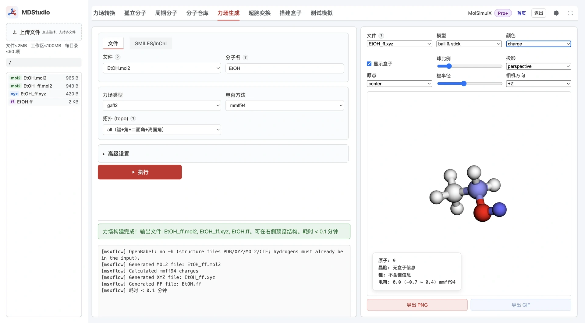

> **系列标签：** `MDStudio` · `力场生成` · `GAFF` · 电荷

有了分子坐标，还需要确定原子类型、部分电荷、Lennard-Jones 非键参数，以及键、角、二面角和离面角参数，才能继续装盒并生成 Lammps 输入。MDStudio 的**力场生成**将这些步骤串成一条流水线：

**结构文件或 SMILES / InChI → 标准化 MOL2 → 计算电荷 → 分配原子类型 → 匹配力场参数 → 输出 `_ff.mol2`、`_ff.xyz` 与 `.ff`。**

本文详细介绍支持的输入文件、表单参数、电荷方法、拓扑层级、输出命名，以及 `.ff`、`.xyz`、`.mol2` 三种输出各自保存什么。这里的「生成」是依据内置参数库进行原子类型分配和参数匹配，不等同于从量子化学数据重新拟合一套力场。



---

[erphpdown]

## 一、整体功能与数据流

一次成功的力场生成通常会完成以下步骤：

1. **读取结构**：从当前文件夹选择 `.xyz`、`.mol2`、`.pdb`、`.mol`、`.cif`，或直接输入 SMILES / InChI。
2. **结构标准化**：将输入转换为流水线使用的 `.mol2`；SMILES / InChI 会生成三维坐标。
3. **确定键连与拓扑层级**：识别键，并按表单中的「分子拓扑」决定是否继续生成角、二面角和离面角。
4. **计算部分电荷**：根据结构类型和所选方法使用 MMFF94、AM1-BCC、RESP、EQeq 或零电荷。
5. **分配原子类型**：使用 GAFF、GAFF2 或 Dreiding 的类型规则。
6. **匹配参数**：查找质量、LJ、键、角、二面角和离面角参数；缺少非键参数时可用 UFF 作 LJ 兜底。
7. **规范电荷**：对最终电荷作小幅归整，使总电荷精确落在最近的整数上。
8. **写出文件**：输出最终 `.mol2`、装盒坐标 `.xyz ` 和 `.ff ` 力场文件。

三个核心输出必须这样理解：

| 输出               | 保存内容                                 | 后续用途                            |
| ---------------- | ------------------------------------ | ------------------------------- |
| `{name}_ff.mol2` | 标准化后的结构、键连、最终原子名与部分电荷                | 检查电荷与成键；后续复用或格式转换               |
| `{name}_ff.xyz`  | 原子名与笛卡尔坐标；第二行引用 `{name}.ff`，周期体系还含晶胞 | 直接送入「搭建盒子」或「超胞变换」               |
| `{name}.ff`      | 原子类型、质量、部分电荷、LJ 和键连参数                | 与 `_ff.xyz` 配套，供装盒及生成 Lammps 输入 |

---

## 二、支持的输入

### 2.1 文件模式

当前工作区文件选择器支持：

| 文件 | 读取重点 | 使用提示 |
|------|----------|----------|
| **`.mol`** | MDL molfile 坐标与键块 | 适合从「孤立分子」画板保存后直接进入力场生成 |
| **`.mol2`** | 原子名、坐标、Sybyl 类型、电荷、键与可选 `CRYSIN` | 已经是可靠标准 MOL2 时，可配合「跳过重输出 mol2」 |
| **`.pdb`** | `ATOM/HETATM` 坐标、元素列及 `CONECT` | 优先读第 77–78 列元素；缺显式键时会按元素与几何重新感知 |
| **`.xyz`** | 原子标签与笛卡尔坐标 | 普通 XYZ 不携带显式键；元素取自每行第 1 列标签，再按几何识别键 |
| **`.cif`** | 原子位置、晶胞、空间群；也支持无晶胞的团簇 CIF | 有晶胞 CIF 走周期结构路径，可自动展开 P1；成键用的元素优先取 `_atom_site_type_symbol` |

下列 MolSimulX 流水线产物会被排除，避免把输出再次送回力场生成造成重复后缀或错误拓扑：

- `simbox.xyz`
- `*_ff.xyz`、`*_ff.mol2`
- `*_pack.xyz`、`*_trans.xyz`
- `result*.xyz`

> **注意：文件模式不会自动补氢。** MOL、MOL2、PDB、XYZ、CIF 应已经包含需要参与模拟的全部氢原子。少氢结构可能导致价态、原子类型、净电荷和键连均不正确。

### 2.2 SMILES / InChI 模式

切换到「SMILES/InChI」后，可直接输入例如：

```text
CCO
```

或：

```text
InChI=1S/C2H6O/...
```

该模式会按 SMILES / InChI 的隐式价态**自动补氢**并生成三维坐标，再进入电荷和力场流水线。与文件模式不同，SMILES / InChI 没有可沿用的文件名；「分子名」留空时默认使用 `molecule`。

### 2.3 分子名与输出位置

- 文件模式默认使用输入文件的 **stem**，例如 `ethanol.mol` → `ethanol`。
- 手动填写的分子名用于所有输出：`ethanol_ff.mol2`、`ethanol_ff.xyz`、`ethanol.ff`。
- 输出写入资源管理器**当前文件夹**。
- 分子名不要带路径；若误填扩展名，程序会去掉常见结构扩展名。
- 相同分子名再次成功执行时，会更新同名力场输出；重要版本请先复制或重命名保存。

---

## 三、基础表单参数

| 参数 | 默认值 | 作用 |
|------|--------|------|
| **输入模式** | 文件 | 在工作区文件与 SMILES / InChI 之间切换 |
| **文件** | 当前文件夹内首个可用文件 | 选择要处理的结构 |
| **SMILES / InChI码** | 空 | 直接提供线性结构表达式 |
| **分子名** | 文件 stem；文本输入为 `molecule` | 决定所有输出文件名及 XYZ 第二行中的分子标识 |
| **力场类型** | `gaff2` | 选择 GAFF2、GAFF 或 Dreiding |
| **电荷方法** | `mmff94` | 选择可用于当前结构类型的电荷方法 |
| **净电荷** | `0` | AM1-BCC / RESP 计算时使用的体系总电荷 |
| **自旋度** | `1` | AM1-BCC / RESP 计算时使用的自旋多重度，最小为 1 |
| **分子拓扑** | `all` | 决定 `.ff` 写入哪些键连层级 |
| **unwrap** | 关闭 | 仅 CIF 显示；展开跨晶胞分子，使分子片段在同一晶胞中完整 |

「净电荷」和「自旋度」只在选择 **AM1-BCC** 或 **RESP** 时显示。净电荷应填写整数；闭壳层中性有机物通常为 `0` 和 `1`，但自由基、离子或过渡金属体系不能机械套用。

---

## 四、支持的力场

界面提供三种可直接选择的力场：

| 力场 | 特点 | 常见用途 |
|------|------|----------|
| **GAFF2** | GAFF 的后续版本；当前默认选项 | 常见有机小分子、聚合物重复单元等 |
| **GAFF** | Amber General Force Field | 需要与既有 GAFF 参数或旧工作流保持一致时 |
| **Dreiding** | 通用材料力场，类型覆盖面较广 | 有机、无机及材料体系的初步建模；仍需检查参数匹配结果 |

此外还有两类辅助参数来源，但它们**不是表单中的独立力场选项**：

1. **UFF fallback**  
   当所选 GAFF / GAFF2 / Dreiding 找不到某原子的非键参数时，程序可从 UFF 获取该原子的 LJ 参数（质量按元素补全），并在 `.ff` 中标记 `[UFF fallback]`。UFF 在这里**只兜底 ATOMS 段的非键参数**；键、角、二面角和离面角不会自动改用完整 UFF 参数。

2. **`custom.dat`**  
   平台可用内部自定义表按源结构原子名锁定类型、质量与 LJ，或覆盖特定键连参数。命中时会标记 `[custom preset]`。这属于平台参数库维护能力，不是普通表单参数。

### 参数匹配与 `[guess]`

生成键连参数时，程序先按力场类型精确匹配，并考虑键两端互换、角两端互换、二面角整体反转等对称关系。找不到精确条目时，可按元素相似性或当前几何寻找近似参数，并写入：

```text
[guess]
```

或：

```text
[guess] (near ...)
[guess] (geometry ...)
```

因此，「任务成功」只说明文件成功生成，**不代表每一项参数都有高质量的精确匹配**。生成后应搜索 `.ff` 中的 `[guess]`、`[UFF fallback]` 和 `[custom preset]`，重点检查陌生元素、金属中心及特殊官能团。

---

## 五、电荷方法

### 5.1 结构类型与可选方法

| 输入类型                                         | `mmff94` | `am1-bcc` | `resp` | `eqeq` | `none` |
| -------------------------------------------- | -------- | --------- | ------ | ------ | ------ |
| 孤立分子：MOL / MOL2 / PDB / XYZ / SMILES / InChI | ✓        | ✓         | ✓      | —      | ✓      |
| 有晶胞的周期性 CIF                                  | ✓        | —         | ✓      | ✓      | ✓      |
| 无晶胞团簇 CIF                                    | ✓        | —         | ✓      | —      | ✓      |

界面会根据输入扩展名和当前可用权限过滤下拉选项，因此实际显示项可能少于上表。

### 5.2 各方法做什么

| 方法 | 实现与特点 | 需要注意 |
|------|------------|----------|
| **MMFF94** | 计算 MMFF94 经验部分电荷；速度快 | 「MMFF94」在这里是**电荷方法**，不会把表单选择的 GAFF2 / GAFF / Dreiding 替换成 MMFF94 力场 |
| **AM1-BCC** | 通过 AmberTools `antechamber` 计算；生成可复用的 `{name}.am1-bcc.out` | 仅孤立分子路径；使用净电荷与自旋度；较大结构可能转为离线续跑 |
| **RESP** | 通过 CP2K 生成静电势并拟合 RESP 电荷；生成 `{name}.resp.out` 缓存 | 孤立分子会先做一次几何优化，因此最终坐标可能与输入略有变化；周期性 CIF 直接走周期单点路径 |
| **EQeq** | 读取 CIF 与晶胞后计算 EQeq 电荷 | 仅适用于含晶胞信息的周期性 CIF；无晶胞 CIF 会被拒绝 |
| **none** | 将所有原子电荷设为 0 | 只适合明确不需要静电项的模型或调试；不要把它当作普适默认值 |

无论使用哪种方法，写文件前都会对电荷作小幅数值归整，使总和精确等于最近的整数。这样可避免格式化小数导致总电荷出现 `0.000001` 一类残差。

---

## 六、分子拓扑

「分子拓扑」控制 `.ff` 写入哪些键合项：

| 选项 | 写入内容 |
|------|----------|
| **all** | 键 + 角 + 二面角 + 离面角 |
| **bond** | 仅键 |
| **bond+angle** | 键 + 角 |
| **bond+angle+dihedral** | 键 + 角 + 二面角 |
| **bond+angle+improper** | 键 + 角 + 离面角 |
| **none** | 不识别键连，仅保留 ATOMS / CHARGES 中的质量、电荷与 LJ |

一般分子使用默认 `all`。以下情形可考虑其它层级：

- 只想先验证非键模型：`none`
- 金属团簇或粗略颗粒体系：常用 `none`
- 已知某一类高阶参数不可靠：选择只写到 bond 或 angle
- 不需要离面角但需要二面角：`bond+angle+dihedral`

`topo=none` 不只是少写几个段：它还会跳过结构转换中的成键识别，并清空 MOL2 的键块。CIF 的 unwrap 依赖成键结果，因此选择 `none` 时 unwrap 会被忽略。

---

## 七、高级设置

### 7.1 `.ff` 格式

| 选项 | 内容 | 适用场景 |
|------|------|----------|
| **2（默认）** | `ATOMS` 按原子类型合并，位点电荷放在独立 `CHARGES` 段 | 推荐；重复单元、聚合物可显著减少 Lammps atom type 数 |
| **1（旧版）** | `ATOMS` 每个原子一行，电荷直接写在第 4 列；没有 `CHARGES` 段 | 与旧版 `.ff`、旧脚本或人工模板兼容 |

两种版本的文件扩展名都仍是 `.ff`，不会写成 `.ff2`。装盒程序会根据 `# ff_format 2` 和 `CHARGES` 段自动识别。

### 7.2 键长容差

默认：

```text
0.35 Å
```

它主要影响 **CIF、XYZ**，以及缺少可靠显式键块的 **PDB** 等结构：程序会按「两原子共价半径之和 + 键长容差」判断是否成键，也会影响跨周期边界成键与 unwrap。

- 太小：真实键可能被漏掉，分子或框架断裂。
- 太大：相邻但不成键的原子可能被误连。
- 普通体系先用默认值；出现明显断键或多键时再小幅调整并重新检查。

**提醒：需要按元素判断键信息时，msxff 从哪里取元素？**

力场生成在识别键时，用的是**结构文件里的元素信息**，不是 `.ff` 里的力场类型，也不是装盒阶段才写入的标签。来源按输入格式不同：

| 输入 | 元素来源（用于共价半径 / 成键） |
|------|--------------------------------|
| **CIF** | 优先 `_atom_site_type_symbol`；若无则回退 `_atom_site_label`，再解析为元素符号 |
| **XYZ** | 每行第 1 列原子标签（如 `C`、`C0`、`Ow`），经内部规则解析成元素 |
| **PDB** | 优先 `ATOM/HETATM` 第 77–78 列元素字段；无效时再从第 13–16 列原子名解析 |
| **MOL** | 若出现 OPLS/MDL 风格原子类型标签，会先规范成元素符号再转换 |
| **MOL2** | 通常沿用文件中的显式 `@<TRIPOS>BOND`；周期 MOL2（含 `CRYSIN`）还会尽量保留原拓扑，不按容差重判键 |
| **SMILES / InChI** | 由表达式本身决定元素与隐式价态，再生成三维结构 |

因此：CIF 应写清 `_atom_site_type_symbol`；XYZ 第 1 列不要写成无法解析的力场类型串；PDB 应尽量填好元素列。元素解析错了，容差再调也对不上真实键长。

判定形式可理解为：

$$
\text{距离} \le r_{\mathrm{cov}}(\text{元素 }i) + r_{\mathrm{cov}}(\text{元素 }j) + \text{键长容差}
$$

### 7.3 跳过重输出 mol2

该选项对应 `skip_mol2`。只有当输入本身已经是**可靠、标准、可直接解析的 MOL2** 时才建议勾选：

- 不再重建 MOL2 拓扑，也跳过本 Tab 的电荷重算；
- 将输入复制为 `{name}_ff.mol2`；
- 直接沿用输入 MOL2 中已有的坐标、键块和电荷，再执行改名、原子类型分配与 `.ff` 生成。

因此，勾选前必须确认 MOL2 已经带有你希望使用的最终电荷；此时表单里选择的 MMFF94 / AM1-BCC / RESP 等不会重新计算电荷。不要对 XYZ、PDB、MOL、CIF 或格式不规范的 MOL2 勾选。界面虽然显示该开关，但程序会把输入按 MOL2 读取，误用可能直接失败或产生错误结构。

### 7.4 保留原始原子名

默认情况下，最终 MOL2、XYZ 与 `.ff` 中的位点名会统一改为：

```text
C0 C1 H2 O3 ...
```

勾选后尽量保留标准化 MOL2 中的原始 ATOM 名称。不同输入格式的名称来源不同：

- MOL2：ATOM 第 2 列；
- CIF：`_atom_site_label`；
- PDB：`ATOM/HETATM` 原子名；
- XYZ：每行第 1 列；
- MOL：转换后的 MDL 原子标签。

保留名称适合需要和外部拓扑、实验位点或 `custom.dat` 对齐的情况。但名称必须唯一、稳定，并在 `_ff.mol2`、`_ff.xyz` 与 `.ff` 之间一致；否则 format 2 的 `CHARGES` 无法可靠匹配结构位点。

### 7.5 RESP / CP2K 参数

选择 RESP 时会显示：

| 参数 | 默认值 | 说明 |
|------|--------|------|
| **泛函** | PBE | 可选 PBE、B3LYP、BLYP |
| **基组** | DZVP-MOLOPT-SR-GTH | 另有 DZVP-MOLOPT-GTH、TZV2P-MOLOPT-GTH |
| **最大 SCF** | 128 | SCF 最大迭代次数 |
| **EPS_SCF** | `5.0E-6` | SCF 收敛阈值 |
| **EPS_DEFAULT** | `1.0E-12` | CP2K Quickstep 数值精度 |

这些参数会直接影响 RESP 计算的速度、收敛和成本。不了解 CP2K 设置时，建议先保持默认。

---

## 八、`.ff` 文件详解

`.ff` 是 MolSimulX 在力场生成、力场转换、装盒和 Lammps 输入生成之间传递参数的**纯文本中间格式**。它不重复保存坐标，而是与结构文件配套使用。

### 8.1 段结构

常见段如下：

| 段 | 保存内容 |
|----|----------|
| **ATOMS** | 原子类型或类型模板、力场类型、质量、电荷占位/真实值、LJ `σ` 和 `ε` |
| **CHARGES** | format 2 的逐位点电荷与类型引用 |
| **BONDS** | 类型对、势函数、平衡键长和力常数 |
| **ANGLES** | 类型三元组、平衡角和角力常数 |
| **DIHEDRALS** | 类型四元组及 Fourier 等二面角参数 |
| **IMPROPER** | 离面角参数；也接受段名 `IMPROPERS` |

段名不区分大小写，空行会忽略，`#` 后为注释。推荐顺序为：

```text
ATOMS
CHARGES
BONDS
ANGLES
DIHEDRALS
IMPROPER
```

### 8.2 format 2（默认）

示意：

```text
# Generated from ethanol.mol
# charge_method am1-bcc
# ff_format 2
# Summary: 9 atoms, 4 atom_types, 9 charge_sites, 8 bonds, ...

ATOMS
c3    c3    12.011    0.000000  lj  3.399670  0.457730
hc    hc     1.008    0.000000  lj  2.649530  0.065690
oh    oh    15.999    0.000000  lj  3.066473  0.880314
ho    ho     1.008    0.000000  lj  0.000000  0.000000

CHARGES
C0    -0.120000  c3
H1     0.040000  hc
O7    -0.620000  oh
H8     0.420000  ho

BONDS
c3  hc  cons  1.0900  2820.00
c3  oh  harm  1.4300  2677.76
```

`ATOMS` 的列布局为：

```text
<type_id> <ff_type> <mass> <charge占位> lj <sigma> <epsilon>
```

`CHARGES` 为：

```text
<atom_name> <q> <type_ref>
```

同一 `(ff_type, mass, σ, ε)` 的原子共享一个 `ATOMS` 模板，但可在 `CHARGES` 中拥有不同电荷。这就是 format 2 能减少 Lammps atom type 数、同时保留 RESP 位点电荷差异的原因。

### 8.3 format 1（兼容格式）

示意：

```text
ATOMS
C0  c3  12.011  -0.120000  lj  3.399670  0.457730
H1  hc   1.008   0.040000  lj  2.649530  0.065690
```

第 1 列是结构原子名，第 4 列就是该原子的真实部分电荷；没有独立 `CHARGES` 段。原子数较多时，这种写法通常会产生更多 Lammps atom type。

### 8.4 单位与常见样式

| 物理量 | `.ff` 单位 | 手改时注意 |
|--------|------------|------------|
| 质量 | amu | 改 LJ / 质量后，format 2 可能需要拆/并 `ATOMS` 行 |
| 电荷 | e | format 2 改 `CHARGES` 第 2 列；format 1 改 `ATOMS` 第 4 列 |
| 长度、平衡键长、LJ `σ` | Å | — |
| 能量、LJ `ε`、二面角幅值 | kJ/mol | 不是 kcal/mol |
| 键力常数 `harm`/`cons` | kJ/mol/Ų | **不含** 1/2；装盒写 Lammps 时会再换算 |
| 角力常数 `harm`/`cons` | kJ/mol/rad² | **不含** 1/2；文件里平衡角写**度** |
| 平衡角、相位、离面角 | 度 | — |

MDStudio 力场生成常见样式：

- `BONDS`：`harm`、`cons`
- `ANGLES`：`harm`、`cons`
- `DIHEDRALS`：`four`
- `IMPROPER`：GAFF 常见 `four`，Dreiding 常见 `umbrella`

其中 `cons` 与 `harm` 使用相同谐振势形式，但 `cons` 会在后续 Lammps 输入中用于 SHAKE 约束。通常 X–H 键及 H–X–H 角会写为 `cons`。

外部「力场转换」产生的 `.ff` 还可能包含 `gromos`、`cosinesq`、`opls`、`nharmonic`、`impharm` 等样式；它们属于 `.ff` 格式的能力范围，但不一定由本 Tab 的 GAFF / Dreiding 流水线产生。

### 8.5 各段列布局（方便手改）

以下按装盒程序实际解析的列顺序列出。`#` 后为注释，可保留 `[guess]` 等标记，也可删掉；装盒时不依赖注释。

#### ATOMS

```text
<col1>  <ff_type>  <mass>  <charge>  lj  <sigma>  <epsilon>
```

| 列 | format 1 | format 2 |
|----|----------|----------|
| `col1` | 结构原子名（如 `C0`） | 类型模板 id（如 `c3`、`c3_1`） |
| `ff_type` | 力场类型 | 同左；键连段按它匹配 |
| `mass` | amu | 同左 |
| `charge` | **真实电荷** | **占位**，建议 `0.0` |
| `lj` | 固定写 `lj` | 同左 |
| `sigma` / `epsilon` | Å / kJ/mol | 同左 |

LJ 形式为：

$$
U = 4\varepsilon\left[\left(\frac{\sigma}{r}\right)^{12}-\left(\frac{\sigma}{r}\right)^{6}\right]
$$

手改电荷时：format 2 不要改 ATOMS 第 4 列，改 `CHARGES`。

#### CHARGES（仅 format 2）

```text
<atom_name>  <q>  <type_ref>
```

三列都必填。`atom_name` 必须与 `_ff.xyz` / `_ff.mol2` 中的原子名一致；`type_ref` 必须能对应到某行 `ATOMS` 的 `type_id`（或唯一的 `ff_type`）。

#### BONDS

```text
<type1>  <type2>  <style>  <r0>  <k>
```

| style | 行写法 | 单位 |
|-------|--------|------|
| `harm` / `cons` | `c3 hc cons 1.0900 2820.00` | `r0` Å，`k` kJ/mol/Ų |
| `gromos` | `… gromos r0 k` | `r0` Å，`k` kJ/mol/Å⁴ |

`harm` / `cons`：

$$
U = \frac{1}{2} k (r - r_0)^2
$$

`gromos`：

$$
U = \frac{1}{4} k (r^2 - r_0^2)^2
$$

两端类型可对调匹配。把 `harm` 改成 `cons`（或反过来）只影响后续是否走 SHAKE，不改变谐振形式。

#### ANGLES

```text
<type1>  <type2>  <type3>  <style>  <theta0>  <k>
```

`type2` 是角顶点。

| style | 行写法 | 单位 |
|-------|--------|------|
| `harm` / `cons` | `hc c3 oh harm 109.50 418.40` | `theta0` 度，`k` kJ/mol/rad² |
| `cosinesq` | `… cosinesq theta0 k` | `theta0` 度，`k` kJ/mol |

`harm` / `cons`：

$$
U = \frac{1}{2} k (\theta - \theta_0)^2
$$

`cosinesq`：

$$
U = \frac{1}{2} k \left[\cos\theta - \cos\theta_0\right]^2
$$

#### DIHEDRALS

四列类型顺序为 **i–j–k–l**，`j–k` 为旋转轴。

**`four`（本 Tab 默认写出）：**

```text
<t1>  <t2>  <t3>  <t4>  four  <n_terms>  <V1>  <n1>  <phase1>  [<V2> <n2> <phase2> …]
```

例如两项：

```text
c3  c3  c3  hc  four  2  0.6500  3.0000  0.0000  0.2500  1.0000  180.0000
```

$$
U = \sum_i V_i \left[1 + \cos\left(n_i\phi - \mathrm{phase}_i\right)\right]
$$

`V` 单位 kJ/mol，`phase` 单位度。改幅值时只改对应的 `V`；改项数时必须同步改 `n_terms` 和后面的三元组个数。

**其它常见样式（多来自力场转换，也可手写）：**

```text
…  opls  <K1> <K2> <K3> <K4>
…  nharmonic  <n>  <A1> <A2> … <An>
```

#### IMPROPER

段名可写 `IMPROPER` 或 `IMPROPERS`。

| style | 行写法 | 中心原子 | 说明 |
|-------|--------|----------|------|
| `four` | `t1 t2 t3 t4 four n_terms V n phase …` | **第 3 列** | 与二面角 `four` 同形；GAFF 常见 |
| `umbrella` | `I J K L umbrella omega0 K` | **第 1 列 I** | Dreiding 离面；`omega0` 度，`K` kJ/mol |
| `impharm` | `center J K L impharm chi0 k` | **第 1 列** | 谐振子离面 |

示例：

```text
c3  c3  c3  hc  four  1  4.6024  2.0000  180.0000
C_R C_R C_R H_  umbrella  0.00  167.36
```

### 8.6 手改参数时建议

1. **先改电荷**：format 2 只动 `CHARGES` 的 `q`；不要只改 ATOMS 占位列。
2. **改 LJ / 质量**：改对应 `ATOMS` 行的 `sigma`、`epsilon`、`mass`。若同一 `ff_type` 要拆成两组不同 LJ，format 2 需新增 `type_id`（如 `c3_1`），并把相关 `CHARGES.type_ref` 指过去。
3. **改键 / 角**：直接改 `r0`/`theta0` 或 `k`；不要改错类型列顺序（角的顶点在中间）。
4. **改二面角**：优先改 `V`；增删傅里叶项时保证 `n_terms` 与后续三列一组的数量一致。
5. **类型名要对齐**：`BONDS`/`ANGLES`/`DIHEDRALS`/`IMPROPER` 用的是力场类型（通常等于 `ATOMS` 的 `ff_type`），不是结构原子名；format 2 的结构原子名只出现在 `CHARGES`。
6. **不要只改一边**：`_ff.xyz` 原子名、`CHARGES.atom_name`、必要时 `_ff.mol2` 原子名必须保持一致。
7. **改完再装盒 / 测试**：双击打开 `.ff` 编辑并保存后，重新进入「搭建盒子」或测试模拟，确认参数已生效。
8. **保留备份**：手改前复制一份 `ethanol.ff.bak` 之类；再次点「力场生成」会覆盖同名 `{name}.ff`。

---

## 九、`_ff.xyz` 文件详解

`{name}_ff.xyz` 是装盒最常用的结构输入。格式为：

```text
<原子数>
<分子名> <力场文件> [cell a b c alpha beta gamma]
<原子名> <x> <y> <z>
...
```

以乙醇为例：

```text
9
ethanol ethanol.ff
C0            0.123456   0.234567  -0.345678
C1            1.234567   0.456789  -0.123456
O2            2.100000  -0.100000   0.200000
...
```

周期体系示意：

```text
42
COF COF.ff cell 20.0 20.0 25.0 90.0 90.0 120.0
```

要点：

1. 第一行是原子数。
2. 第二行的第一个字段是分子名，第二个字段是配套 `.ff` 文件名。
3. 若有晶胞，第二行追加 `cell a b c α β γ`。
4. 后续每行是**原子名**和笛卡尔坐标，单位 Å。
5. XYZ 本身不保存部分电荷、LJ 或键连参数；这些都在配套 `.ff` 中。
6. 原子名必须与 `.ff` 的 format 1 `ATOMS` 或 format 2 `CHARGES` 对得上。

因此不要只保留 `_ff.xyz` 而删除同名 `.ff`。装盒时缺少 `.ff`，即使坐标看起来正常，也无法建立完整 Lammps 类型和参数。

---

## 十、`_ff.mol2` 与标准 MOL2 格式

`{name}_ff.mol2` 是力场流水线的最终结构文件。它采用 Tripos / Sybyl 风格的分段文本格式，按 `@<TRIPOS>…` 组织分子头、原子、键，以及可选晶胞。

它的主要价值是：

1. 检查最终电荷是否写回；
2. 检查结构标准化、原子命名和键连；
3. 为后续外部软件或格式转换保留一份信息更完整的结构；
4. AM1-BCC / RESP 续跑时作为结构或缓存匹配依据。

MOL2 中的 Sybyl 类型不等同于 `.ff` 中最终用于参数匹配的全部类型表；真正供 MolSimulX 装盒和写 Lammps 使用的参数仍以 `{name}.ff` 为准。

### 10.1 整体结构

推荐最小可用顺序：

```text
@<TRIPOS>MOLECULE
…分子头…
@<TRIPOS>ATOM
…原子行…
@<TRIPOS>BOND
…键行…
@<TRIPOS>CRYSIN          # 仅周期体系需要
…晶胞一行…
```

坐标单位 Å，部分电荷单位 e。空行通常可忽略；字段按空白分隔。

### 10.2 `@<TRIPOS>MOLECULE`

段标题后常见四行有效内容：

| 顺序 | 含义 | 示例 |
|------|------|------|
| 1 | 分子名 | `acetone` |
| 2 | `n_atoms n_bonds n_subst n_feat n_sets` | `10 9 0 0 0` |
| 3 | 分子类型标签 | `SMALL` |
| 4 | 电荷描述符 | `MMFF94_CHARGES`、`RESP_CHARGES`、`NO_CHARGES` 等 |

力场生成写出的 `_ff.mol2` 会把当前电荷方法写入第 4 行。右侧预览用它显示「电荷方法」标签；真正的逐原子电荷仍以 `ATOM` 行末列为准。`n_bonds` 应与 `BOND` 段行数一致；`topo=none` 时程序可能清零键数并去掉键块。

### 10.3 `@<TRIPOS>ATOM`

```text
<id>  <name>  <x>  <y>  <z>  <sybyl_type>  <subst_id>  <subst_name>  <charge>
```

| 列 | 作用 |
|----|------|
| `id` | 从 1 起的原子序号；键段用它引用端点 |
| `name` | 位点名；最终需与 `_ff.xyz` / `.ff` 的 `CHARGES` 对齐 |
| `x y z` | 笛卡尔坐标（Å） |
| `sybyl_type` | Sybyl 原子类型，如 `C.2`、`O.2`、`H` |
| `subst_id` / `subst_name` | 子结构编号与名称；小分子常为 `1` 与分子名 |
| `charge` | 部分电荷（e），行末一列 |

默认会把 `name` 改成 `C0`、`H1`…；勾选「保留原始原子名」时尽量保留本列原名。Sybyl 类型用于标准化和显示，**不是** `.ff` 里的 GAFF / Dreiding `ff_type`。

### 10.4 `@<TRIPOS>BOND`

```text
<bond_id>  <atom_i>  <atom_j>  <bond_type>
```

常见 `bond_type`：`1` / `2` / `3`（单 / 双 / 三键），以及 `am`（酰胺）、`ar`（芳香）等。端点序号对应 `ATOM.id`（从 1 计）。

含 `CRYSIN` 的周期 MOL2 进入流水线时，程序会尽量保留原拓扑，避免再按键长容差重判键。CIF 路径则先按共价半径写结构键，再做类型标准化。

### 10.5 `@<TRIPOS>CRYSIN`

```text
a  b  c  alpha  beta  gamma  [space_group  setting]
```

`a b c` 单位 Å，角度单位度。预览画盒子、判断周期体系、周期性 RESP 都会读这一行。孤立分子不要写空的 CRYSIN。

### 10.6 示例：丙酮（孤立分子）

下面用丙酮示意一份自洽的标准 MOL2（坐标为教学近似值）。与前文乙醇 XYZ 示例刻意区分，便于对照两种文件各自保存什么。

```text
@<TRIPOS>MOLECULE
acetone
10 9 0 0 0
SMALL
MMFF94_CHARGES

@<TRIPOS>ATOM
      1 C1        0.0000    0.0000    0.0000 C.2   1 acetone   0.4500
      2 O2        1.2200    0.0000    0.0000 O.2   1 acetone  -0.4500
      3 C3       -0.7800    1.2800    0.0000 C.3   1 acetone  -0.1800
      4 C4       -0.7800   -1.2800    0.0000 C.3   1 acetone  -0.1800
      5 H5       -0.4200    1.9000    0.8900 H     1 acetone   0.0600
      6 H6       -0.4200    1.9000   -0.8900 H     1 acetone   0.0600
      7 H7       -1.8600    1.1800    0.0000 H     1 acetone   0.0600
      8 H8       -0.4200   -1.9000    0.8900 H     1 acetone   0.0600
      9 H9       -0.4200   -1.9000   -0.8900 H     1 acetone   0.0600
     10 H10      -1.8600   -1.1800    0.0000 H     1 acetone   0.0600

@<TRIPOS>BOND
     1     1     2    2
     2     1     3    1
     3     1     4    1
     4     3     5    1
     5     3     6    1
     6     3     7    1
     7     4     8    1
     8     4     9    1
     9     4    10    1
```

周期体系在文件末尾追加例如：

```text
@<TRIPOS>CRYSIN
  12.500  12.500  12.500  90.000  90.000  90.000  1  1
```

力场生成默认改名后，ATOM 名可能变为 `C0`、`O1`、`C2`…，并与 `acetone_ff.xyz` / `acetone.ff` 中的位点名一致。

### 10.7 使用注意

- 勾选「跳过重输出 mol2」时，输入必须已是可靠标准 MOL2，且 ATOM 末列电荷就是最终要用的值。
- 只改 MOL2 的 Sybyl 类型，不会自动改 `.ff` 的 LJ / 键参数。
- 手改原子名时，`_ff.mol2`、`_ff.xyz` 与 `.ff` 的 `CHARGES` 必须同步。

---

## 十一、右侧可视化区如何读取 `_ff.xyz` 与 `_ff.mol2`

力场生成完成后，单击资源管理器中的 `_ff.xyz` 或 `_ff.mol2`，右侧 3D 预览会读取结构、晶胞、键连、电荷等信息。两种文件的读取方式不同。

### 11.1 预览 `_ff.xyz`

`_ff.xyz` 的坐标行只有：

```text
原子名 x y z
```

因此，右侧预览会分两步读取：

1. **坐标与元素**：从 XYZ 原子行读取原子名和坐标，并把原子名解析成元素用于 3D 显示。
2. **电荷与力场类型**：根据第二行的 `{name}.ff` 引用，在同目录寻找配套 `.ff`，再按原子名匹配电荷和力场类型。

对于 format 2 `.ff`，可视化按 `CHARGES` 段读取逐原子电荷：

```text
CHARGES
C0  -0.120000  c3
```

这里的 `C0` 必须与 XYZ 原子名一致；`c3` 再映射到 `ATOMS` 段中的真实力场类型。对于 format 1 `.ff`，则直接按原子名从 `ATOMS` 行读取电荷和类型。

这也解释了为什么 `_ff.xyz` 和 `.ff` 必须成对保留：**XYZ 负责坐标，`.ff` 负责电荷与力场类型**。若 `.ff` 缺失、改名，或 XYZ 原子名与 `.ff` 不一致，3D 预览仍可能显示结构，但不会显示正确的电荷信息，也无法可靠按电荷着色。

### 11.2 `_ff.xyz` 的盒子信息

对于 XYZ，右侧预览只从**当前文件自身**读取盒子，不会自动去猜 `data.lmp` 或其它文件。读取规则是第二行包含：

```text
cell a b c alpha beta gamma
```

例如：

```text
COF COF.ff cell 20.0 20.0 25.0 90.0 90.0 120.0
```

这时可视化区会画出晶胞 / 盒子边框。若第二行没有 `cell ...`，即使同目录有 `data.lmp` 或 `simbox.xyz`，该 `_ff.xyz` 预览也不会自动借用它们的盒子。

例外是测试模拟输出 `result_atoms.xyz`：它会优先从同目录的 `data.lmp` 读取 Lammps 正交或三斜盒子，用于显示测试轨迹的边界。

### 11.3 预览 `_ff.mol2`

MOL2 文件自身信息更完整，右侧预览会直接读取：

| 信息 | 来源 |
|------|------|
| 原子元素 | `@<TRIPOS>ATOM` 中的 atom type / atom name |
| 坐标 | `@<TRIPOS>ATOM` 的 x、y、z |
| 电荷 | `@<TRIPOS>ATOM` 每行最后一列 |
| 键连 | `@<TRIPOS>BOND` |
| 盒子 / 晶胞 | `@<TRIPOS>CRYSIN` 后的 6 个晶胞参数 |
| 电荷方法 | `@<TRIPOS>MOLECULE` 块中的 charge descriptor（如 `MMFF94_CHARGES`、`RESP` 等） |

也就是说，`_ff.mol2` 预览电荷不依赖同名 `.ff`；它直接使用 MOL2 ATOM 行最后一列。若 MOL2 含 `CRYSIN`，可视化会从中读取 `a b c α β γ` 并画盒子。

### 11.4 HUD 中显示什么

右侧预览的 HUD 会尽量显示：

- 原子数与元素组成；
- 质量估算；
- 晶胞 / 盒子（若文件中能读到）；
- 键连信息（MOL2、MOL、PDB 等格式可从文件中读；CIF 预览不在 HUD 中显示键）；
- 电荷总和、最小值、最大值和电荷方法；
- 若开启电荷着色，会显示着色说明。

电荷显示格式大致为：

```text
总电荷 (最小电荷 ~ 最大电荷) 电荷方法
```

例如：

```text
0.0 (-0.6 ~ 0.4) am1-bcc
```

---

## 十二、CIF 的特殊处理

### 12.1 P1 展开

周期 CIF 进入力场流水线前，需要得到可明确枚举全部原子的 P1 结构：

- 输入已经是 P1：可直接继续；
- 输入包含更高空间群对称性：自动展开为 `*_P1.cif`；
- 无法可靠解析或展开：任务会停止并报告 CIF / 对称性问题。

### 12.2 跨晶胞成键与 unwrap

CIF 成键会使用晶胞和 minimum-image 几何，识别跨周期边界的键。勾选 unwrap 后：

1. 先展开 P1；
2. 根据成键图识别分子片段；
3. 将跨边界的同一分子搬回相邻镜像，使片段在一个晶胞表示中保持完整；
4. 输出 `*_unwrap.cif` 或 `*_P1_unwrap.cif`。

框架、无限网络或大比例贯穿晶胞的连通结构不会被当成普通孤立分子随意搬动。`topo=none` 时没有成键图，unwrap 不生效。

### 12.3 缓存与可见衍生文件

力场流水线可能产生：

| 文件 | 是否可见 | 作用 |
|------|----------|------|
| `*_P1.cif` | 是 | P1 展开结果 |
| `*_unwrap.cif` / `*_P1_unwrap.cif` | 是 | 分子 unwrap 结果 |
| `.<cif名>.msx_cif_cache.mol2` | 否 | CIF → 结构 MOL2 缓存 |
| `.<cif名>.msx_cif_cache.json` | 否 | 缓存的输入时间、容差、unwrap、topo 等元数据 |

相同 CIF 和参数再次执行时可复用缓存；CIF 修改或参数变化后会原位重建。删除 CIF 时，资源管理器会顺带删除与该文件直接关联的隐藏缓存；可见的 P1 / unwrap 文件仍由用户自行管理。

---

## 十三、较大电荷任务与续跑

AM1-BCC 或 RESP 超过在线阈值时，任务可能不是失败，而是进入「需远端计算电荷」的挂起状态。

### AM1-BCC

工作区会提供：

```text
run_ambertools.sh
{name}.mol2
```

在服务器运行脚本后，将结果：

```text
{name}.am1-bcc.out
```

放回同一工作目录，再保持原输入和表单设置不变重新执行。程序会识别并复用缓存。

### RESP

工作区会提供：

```text
run_cp2k.sh
{name}.resp.inp
```

远端计算完成后，将 RESP 侧车结果按提示保存为：

```text
{name}.resp.out
```

放回同一目录，再用相同输入、分子名、净电荷、自旋度和 RESP 参数重新执行。

不要随意改缓存文件的分子名，也不要在续跑前更换输入结构；否则原子数、顺序或坐标不一致，缓存可能无法复用或会得到错误电荷。

---

## 十四、推荐操作流程

1. **确认结构完整**：先在右侧 3D 检查元素、坐标、氢原子和周期晶胞。
2. **选择输入**：文件模式选择当前目录结构；或切换到 SMILES / InChI。
3. **确认分子名**：简短、稳定，不带扩展名；它决定三个核心输出名。
4. **选力场**：一般有机体系可先用 GAFF2；需要兼容旧参数时用 GAFF；材料通用场景可评估 Dreiding。
5. **选电荷**：先依据结构类型过滤，再考虑精度、成本和是否需要续跑。
6. **确认净电荷 / 自旋度**：AM1-BCC、RESP 尤其重要。
7. **确认 topo**：普通分子保留 `all`；金属团簇或仅非键模型再考虑 `none`。
8. **高级设置先用默认**：format 2、0.35 Å、不跳过 MOL2、不保留名称、不 unwrap。
9. **执行并看日志**：检查结构转换、电荷、类型分配和参数匹配各阶段是否成功。
10. **检查三件套**：`_ff.mol2`、`_ff.xyz`、`.ff` 是否都生成。
11. **搜索异常标记**：双击 `.ff`，查找 `[guess]`、`[UFF fallback]`。
12. **预览并进入下一步**：单击 `_ff.xyz` 看结构；需要扩胞时进入 [MDStudio超胞变换](M10-MDStudio超胞变换.md)，否则进入 [MDStudio搭建盒子](M11-MDStudio搭建盒子.md)。

---

## 十五、常见问题

| 现象 | 原因与处理 |
|------|------------|
| 文件不出现在下拉框 | 扩展名不支持、文件位于其它文件夹，或属于被排除的 `_ff` / `_pack` / `_trans` / `result` 产物 |
| 文件模式生成结果少氢 | 文件输入不会自动加氢；回到结构来源补全氢后重做。SMILES / InChI 模式会按隐式价态自动补氢 |
| CIF 选择 EQeq 后报无晶胞 | 该 CIF 是无晶胞团簇；改用 MMFF94、RESP 或 `none` |
| AM1-BCC / RESP 任务挂起 | 超过在线电荷阈值；按第十三节运行脚本并回传缓存，再用同一设置重试 |
| RESP 后坐标略有变化 | 孤立分子 RESP 前会做一次几何优化，属于当前流程设计 |
| `_ff.xyz` 能预览但装盒报缺力场 | 配套 `{name}.ff` 被删除、改名，或 XYZ 第二行仍引用旧文件名 |
| `.ff` 中出现 `[UFF fallback]` | 所选力场缺少该原子的 LJ 参数，系统只用 UFF 补非键；需重点检查键连参数 |
| `.ff` 中有大量 `[guess]` | 参数库没有精确匹配；不应直接把「任务成功」当作参数可靠 |
| 想手改电荷 / LJ / 键参数 | 按第八节列布局改；format 2 电荷改 `CHARGES`，键连类型列用 `ff_type` 不是原子名；改完保留备份再装盒 |
| 勾选「跳过重输出 mol2」后失败 | 输入不是可靠标准 MOL2；取消该选项，让系统先标准化 |
| unwrap 没反应 | 仅 CIF 显示；无晶胞结构或 `topo=none` 时会被忽略 |
| CIF / XYZ 成键明显不对 | 先核对元素来源（见 7.2）：CIF 的 `_atom_site_type_symbol`、XYZ 第 1 列、PDB 第 77–78 列；元素错了再调键长容差也无效 |
| 原子名对不上 | 不要分别手改 `_ff.xyz` 和 `.ff`；如需保留外部名称，应从「保留原始原子名」重新生成 |
| 只有 `.ff` 没有 `_ff.xyz` | 任务可能中途失败或被终止；失败清理会删除不完整的 `_ff.*`，先检查任务日志 |

---

## 小结

1. 力场生成不是单纯「写一个 `.ff`」，而是结构标准化、电荷、原子类型、拓扑和参数匹配的端到端流水线。
2. 支持 MOL、MOL2、PDB、XYZ、CIF 与 SMILES / InChI；文件输入不自动加氢，SMILES / InChI 会按隐式价态自动补氢。
3. 可选力场是 GAFF2、GAFF、Dreiding；UFF 仅用于缺失 LJ 的兜底，并非独立可选力场。
4. 电荷方法取决于结构类型：孤立分子与周期 CIF 的可选集合不同。
5. 默认 format 2 用合并的 `ATOMS` + 逐位点 `CHARGES`，可减少 Lammps atom type。
6. `_ff.xyz` 保存坐标并引用 `.ff`；电荷和参数不在 XYZ 中，两者必须成对保留。
7. `.ff` 可按第八节列布局手改电荷、LJ、键角二面角；format 2 电荷在 `CHARGES`，键连按 `ff_type` 匹配。
8. 生成后应检查 `_ff.mol2`、3D 结构，以及 `.ff` 中的 `[guess]` / `[UFF fallback]`，再进入超胞或装盒。

[/erphpdown]

---

## 学习路径

**结构来源：**

- [MDStudio孤立分子](M06-MDStudio孤立分子.md)
- [MDStudio周期分子](M07-MDStudio周期分子.md)
- [MDStudio分子仓库](M08-MDStudio分子仓库.md)

**下一步：**

- [MDStudio超胞变换](M10-MDStudio超胞变换.md)
- [MDStudio搭建盒子](M11-MDStudio搭建盒子.md)
- [MDStudio Quickstart：从画分子到测试模拟](M01-Quickstart从画分子到测试模拟.md)
