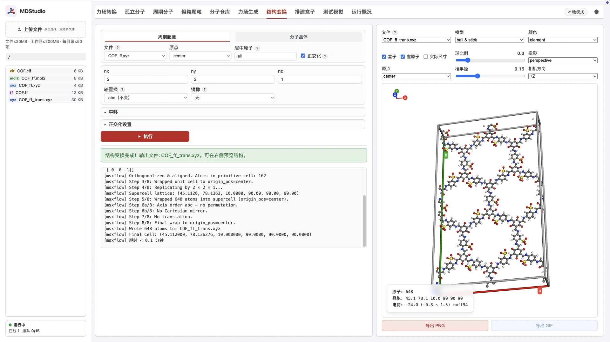

> **系列标签：** `MDStudio` · `结构变换` · `周期超胞` · `分子晶体`

需要把斜胞拉正、把单胞扩成超胞，或把孤立分子摆正再堆成分子晶体——**结构变换** Tab 对**已带力场**的单个结构做几何处理，产物是 `{stem}_trans.xyz`，沿用原来的力场。

界面顶部两个子模式互斥：

| 模式 | 输入 | 做什么 |
|------|------|--------|
| **周期超胞** | **必须**含晶胞（目前仅 `.xyz` 第二行 `cell`） | 正交化、扩胞、轴置换、镜像、平移 |
| **分子晶体** | **必须**无晶胞（孤立分子） | 摆正姿态；可选按密堆模式建胞并扩展 |

**选模式 → 选引用 `.ff` 的结构 → 填参数 → 写出 `{stem}_trans.xyz`。**

本文介绍两种模式的数据流、表单参数、流水线差异、分子晶体的四种堆叠与 padding 约定，以及原子数与权限。这里只做**几何**处理，不改电荷或力场类型。



---

[erphpdown]

## 一、整体功能与数据流

结构变换对一个**已声明 `.ff` 的结构文件**做几何操作，写出新的坐标文件：

```text
输入（.xyz / .zmat / .mol / .pdb，须引用 .ff）
        │
        ├─ 周期超胞：居中 → 正交化 → 扩胞 → 轴置换/镜像 → 平移 → wrap
        │
        └─ 分子晶体：居中 → 对齐/镜像/旋转 →（可选）建胞+扩展 → 平移 → 整分子 wrap
        ▼
   {stem}_trans.xyz（仍引用同一个 .ff；建胞或超胞后带更新后的 cell）
```

输出第二行保留原有前缀（分子名、`.ff` 引用等），并按需重写 `cell`。任务在后台异步执行，可随时终止。

> 两种模式对晶胞的要求**正好相反**，界面也刻意分开：有 cell 走「周期超胞」，无 cell 走「分子晶体」；选错会直接报中文错误。

---

## 二、输入与输出

- **输入**：当前文件夹中**引用了 `.ff` 的结构**（常见为[MDStudio力场生成](M09-MDStudio力场生成.md)得到的 `{name}_ff.xyz`）。也支持 `.zmat` / `.mol` / `.pdb`，但**晶胞目前只来自 `.xyz` 第二行注释**；其余格式读进来一律视为无 cell，只能走分子晶体。
- **输出**：`{stem}_trans.xyz`，写入**同一文件夹**，仍指向同一个 `.ff`。

| 模式 | 晶胞要求 | 典型来源 |
|------|----------|----------|
| 周期超胞 | 必须有 `cell` | 周期结构力场后的 `_ff.xyz`；或已扩过的 `_trans.xyz` |
| 分子晶体 | 必须无 `cell` | 孤立分子力场后的 `_ff.xyz` |

> 通常排在**力场生成之后**：先在小体系上生成力场，再变换得到 `{name}_ff_trans.xyz`，随后进入装盒。

---

## 三、共享参数

两种模式顶部共用：

| 参数 | 默认 | 作用 |
|------|------|------|
| **模式** | 周期超胞 | 切换「周期超胞 / 分子晶体」 |
| **文件** | 当前目录首个可用 | 选择引用 `.ff` 的结构 |
| **原点** | center | `center`=胞中心在原点；`corner`=一角在原点 |
| **居中原子** | all | 参与居中的原子：`all` 或 `0 1 2`（**0 基**下标） |
| **平移 x/y/z (Å)** | 0 | 整体平移（折叠「平移」；晶体模式下在建胞之后生效） |

---

## 四、周期超胞

对**已有晶胞**的周期结构：正交化、扩胞、重排晶轴、镜像与平移。本模式**不做**惯量轴对齐与欧拉旋转（那属于分子姿态）。

### 4.1 参数

| 参数 | 默认 | 作用 |
|------|------|------|
| **正交化** | 开 | 搜索整数变换，把斜胞转成近正交超胞（见 4.3） |
| **nx / ny / nz** | 1 | 三个方向的整数扩胞倍数 |
| **轴置换** | abc | `abc / bac / acb / cba / bca / cab`；奇置换会自动恢复右手系 |
| **镜像** | 无 | `-x / -y / -z`：**原子与晶格同时**镜像，枢轴为盒心 |

**「正交化设置」（折叠）：**

| 参数 | 默认 | 作用 |
|------|------|------|
| **max_abs** | 1 | 整数变换矩阵元素绝对值上限 |
| **max_det** | 12 | 变换矩阵行列式上限 |
| **dedupe tol (Å)** | 0.001 | 去除重复原子映像的距离容差 |
| **angle_tol (deg)** | 1.0 | 判定「近正交」的角度容差 |

### 4.2 流水线

1. 居中选定原子（按原点）
2. 可选正交化：搜索整数变换 → 填满新胞 → 轴对齐
3. wrap → `nx×ny×nz` 复制 → wrap
4. 可选轴置换 → 可选笛卡尔镜像
5. 可选平移 → 最终 wrap → 写出带 cell 的 xyz

理解顺序有助于预期结果：扩胞在正交化之后，轴置换 / 镜像 / 平移在扩胞之后。

### 4.3 正交化怎么做

斜胞（`α/β/γ ≠ 90°`）在装盒和很多分析里不方便。这里的正交化不是简单拉直，而是：

1. **搜索整数变换矩阵 P**，使新晶格尽量接近正交（在 `angle_tol` 内），并受 `max_abs` / `max_det` 约束；
2. **用原子映像填满新的正交胞**；
3. **轴对齐**并按 `dedupe_tol` 去除边界上的重复原子。

因此正交化可能**改变原子数**（新胞体积与原胞不同）。找不到严格正交解时，会退回偏差最小的近似解并在日志中提示。

---

## 五、分子晶体

对**无晶胞的孤立分子**：先摆正姿态，再可选按密堆模式建胞并扩展。建胞后的 wrap 按**分子质心**整分子折回，避免大分子贴边被撕开。

### 5.1 姿态参数

| 参数 | 默认 | 作用 |
|------|------|------|
| **对齐原子** | all | 参与惯量对齐的原子；为空则跳过对齐 |
| **主轴对齐** | +Z | 长轴（最小惯量轴；两原子时取键向）对齐到的方向 |
| **次轴对齐** | +X | 次轴对齐方向；**不能与主轴同向或反向**（如 `+Z` 与 `-Z`） |
| **镜像** | 无 | `-x / -y / -z`：只镜像原子（绕分子几何中心） |
| **旋转 x/y/z (deg)** | 0 | 欧拉旋转 |

### 5.2 建胞块（勾选「建分子晶体」后出现）

| 参数 | 默认 | 作用 |
|------|------|------|
| **建分子晶体** | 开 | 关掉则只输出摆正姿态的分子（无 cell） |
| **堆叠模式** | simple | `simple` / `hex` / `fcc` / `hcp`（见 5.4） |
| **正交化** | 开 | 六角胞换成直角惯胞（**解析换胞**，不做搜索；见 5.5） |
| **nx / ny / nz** | 1 | 水平复制；fcc/hcp 的 **nz = 堆叠层数**（不是胞复制数） |
| **padding (Å)** | 1.5 | 各向一致的分子间距留白 |

### 5.3 流水线

1. 居中：所选原子几何中心 → 笛卡尔原点
2. 对齐：主轴 → 主轴方向；再绕主轴扭转，次轴 → 次轴方向
3. 镜像 → 欧拉旋转  
   ── 到此为「姿态」；不勾选建胞则写出无 cell 的分子 ──
4. 建胞：按堆叠模式 + padding 造晶胞并放置分子
5. 扩展：nx / ny（fcc/hcp 的 nz 是层数）
6. 平移 → 质心 wrap → 按原点对齐 → 再质心 wrap → 写出

### 5.4 四种堆叠与间距

设分子在**摆正之后**的包围盒尺寸为 `Lx, Ly, Lz`，padding 为 `p`：

```text
水平最近邻   d = max(Lx, Ly) + 2p
垂直层距     h = Lz + 2p                 （simple / hex：层正对堆叠）
             h = Lz + 2√(2/3)·p          （fcc / hcp：层嵌进空隙，≈ Lz + 1.633p）
```

| 堆叠 | 含义 | 正交化关（六角胞） | 正交化开（直角惯胞） |
|------|------|--------------------|----------------------|
| **simple** 简单正交 | 一分子一胞，保留 Lx/Ly 各向异性 | `(Lx+2p)×(Ly+2p)×(Lz+2p)` | 同左（本就正交） |
| **hex** 平面密堆 | 面内三角排列，γ=120° | `d×d×h`，1 分子/胞 | `d×d√3×h`，2 分子/胞 |
| **fcc** fcc 密堆 | ABC 循环 | `d×d×n·h`，γ=120° | `d×d√3×n·h`，每层 2 分子 |
| **hcp** hcp 密堆 | AB 循环 | 同上 | 同上 |

`simple` 是唯一保留 `Lx/Ly` 各向异性的模式；其余三种面内一律用 `d`。

**`nz` 语义：**

| 堆叠 | nx / ny | nz |
|------|---------|-----|
| simple、hex | 晶胞水平复制次数 | 晶胞 z 向复制次数 |
| fcc、hcp | 晶胞水平复制次数 | **堆叠层数**（之后 z 向不再复制） |

若要 z 向无缝周期：**fcc 取 3 的倍数、hcp 取偶数**（否则 ABC/AB 循环在盒边界处接不上）。

### 5.5 晶体模式的「正交化」≠ 超胞搜索

这里的正交化**不做整数矩阵搜索**——晶格是按公式造的，正交变换已知：六角原胞 `(a, a, γ=120°)` → 直角胞 `(a, a√3, 90°)`，胞内水平分子数加倍。

结果是**同一套结构的两种写法**：最近邻距离与每分子体积完全一致，只是胞形不同。因此没有 `max_abs` / `angle_tol` 之类的高级参数。

---

## 六、几种典型用法

| 目的 | 模式与填法 |
|------|------------|
| **周期结构纯扩胞** | 周期超胞；只设 `nx/ny/nz`，其余默认 |
| **斜胞正交化** | 周期超胞；勾「正交化」，`nx=ny=nz=1` |
| **正交化 + 扩胞** | 周期超胞；勾「正交化」并设倍数 |
| **交换晶轴** | 周期超胞；「轴置换」选如 `bac`（a↔b） |
| **只摆正孤立分子** | 分子晶体；关掉「建分子晶体」 |
| **孤立分子堆成 hcp 晶体** | 分子晶体；勾建胞，堆叠选 hcp，设 `nx/ny` 与层数 `nz` |
| **fcc/hcp 要正交惯胞** | 分子晶体；勾建胞且勾「正交化」 |

---

## 七、限制

- **输入按单分子上限校验**：提交时检查所选结构的原子数是否在单分子处理上限内。
- **扩胞 / 建胞后原子数会增长**：超胞的 `nx×ny×nz`（叠加正交化体积变化）或分子晶体的堆叠层数，都会让 `{stem}_trans.xyz` 变大；**这一步不拦，但会在后续装盒 / 冒烟撞上限**。变换前先估算总量。详见[MDStudio使用须知与限制](M02-MDStudio使用须知与限制.md)。

---

## 八、常见问题

| 问题 | 处理 |
|------|------|
| 文件列表里找不到结构 | 输入必须**引用 `.ff`**；先在力场生成得到 `{name}_ff.xyz` |
| 提示「周期超胞需要含 cell」 | 选了超胞模式但文件无晶胞；改用分子晶体，或换带 `cell` 的 `.xyz` |
| 提示「分子晶体需要无 cell」 | 选了晶体模式但文件已有晶胞；改用周期超胞，或去掉 cell |
| 正交化后原子数变了 | 超胞模式正常：正交胞体积与原胞不同；必要时调 `max_det` / `dedupe_tol` |
| 主轴 / 次轴选项灰掉 | 二者不能同向或反向；换一组正交方向（如 `+Z` 与 `+X`） |
| fcc/hcp 周期接不上 | `nz` 是层数：fcc 用 3 的倍数，hcp 用偶数 |
| 变换后装盒提示过大 | 减小扩胞倍数或堆叠层数；或参考须知走本地装盒 |
| `.mol` / `.pdb` 能走超胞吗 | 目前这些格式读入无 cell，只能走分子晶体；超胞请用带 `cell` 的 `.xyz` |

---

## 小结

1. **结构变换** Tab 有两条流水线：**周期超胞**（要 cell）与**分子晶体**（不要 cell），产物 `{stem}_trans.xyz` 沿用同一力场。
2. 超胞：居中 → 正交化（搜索）→ 扩胞 → 轴置换 / 镜像 → 平移；逐原子 wrap。
3. 晶体：居中 → 对齐 / 镜像 / 旋转 → 可选四种堆叠建胞；整分子质心 wrap；正交化是解析换胞。
4. fcc/hcp 的 `nz` 是**层数**；水平间距用 `d = max(Lx,Ly)+2p`，fcc/hcp 垂直用 `Lz+2√(2/3)p`。
5. 输入按单分子上限校验；变换后的规模在装盒 / 冒烟阶段才受限。

[/erphpdown]

---

## 学习路径

**前置阅读：**

- [MDStudio力场生成](M09-MDStudio力场生成.md)
- [MDStudio周期分子](M07-MDStudio周期分子.md)
- [MDStudio使用须知与限制](M02-MDStudio使用须知与限制.md)

**下一步：**

- [MDStudio搭建盒子](M11-MDStudio搭建盒子.md)
- [MDStudio测试模拟](M12-MDStudio测试模拟.md)
