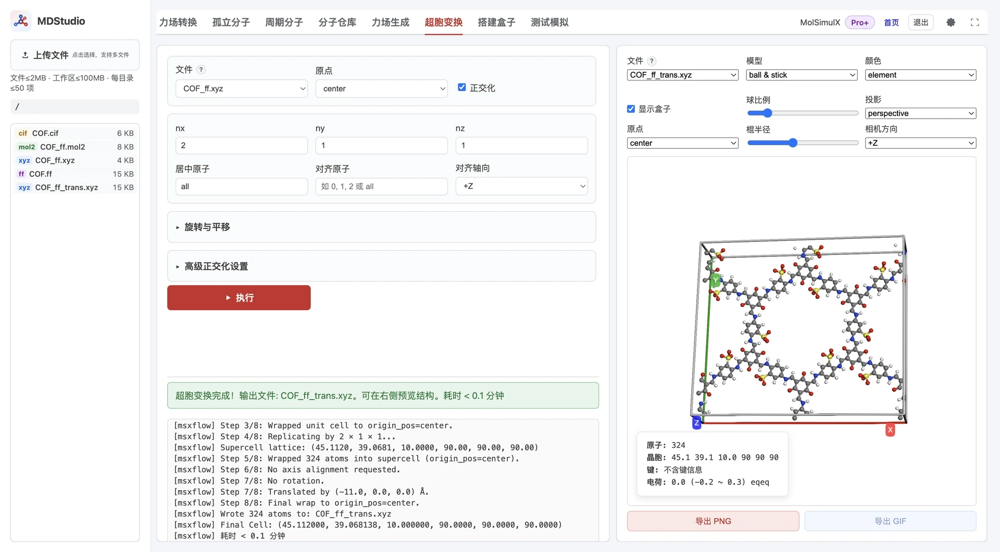

> **系列标签：** `MDStudio` · `超胞` · `正交化` · `几何变换`

胞太小装不下溶剂、晶胞是斜的不好处理、分子朝向需要摆正——**超胞变换** Tab 在装盒前对结构做超胞复制与刚性几何变换，产物是 `{stem}_trans.xyz`，沿用原来的力场。

**选一个引用 `.ff` 的 `.xyz` → 居中 / 正交化 / 扩胞 / 对齐 / 旋转平移 → 写出 `{stem}_trans.xyz`。**

本文详细介绍输入输出、表单参数、内部八步流水线、正交化如何搜索近正交超胞、几种典型用法，以及原子数与权限。这里只做**几何**处理，不改电荷或力场类型。



---

[erphpdown]

## 一、整体功能与数据流

超胞变换对一个**已带力场的坐标文件**做一连串几何操作，写出新的坐标文件：

```text
{name}_ff.xyz（引用 {name}.ff，第二行含晶胞）
        │  居中 → 正交化 → 扩胞 → 对齐 → 旋转/平移 → 回卷
        ▼
   {name}_ff_trans.xyz（仍引用同一个 .ff）
```

因为输出保留原文件第二行（对 `.ff` 的引用与晶胞信息），**扩胞后的结构继续复用同一套力场**——原子类型只是被整体复制。任务在后台异步执行，可随时终止。

---

## 二、输入与输出

- **输入**：当前文件夹中**引用了 `.ff` 的 `.xyz`**（通常是[力场生成](M09-MDStudio力场生成.md)对周期结构得到的 `{name}_ff.xyz`）。晶胞信息取自该文件第二行注释。
  - 若文件**没有晶胞信息**：程序按坐标包围盒自动生成一个正交盒（各方向 +5 Å 留白），并**跳过正交化**。
- **输出**：`{stem}_trans.xyz`，写入**同一文件夹**，第二行沿用原文件（因此仍指向同一个 `.ff`）。

> 因为输入必须带 `.ff` 引用，超胞变换通常排在**力场生成之后**：先在小胞/原胞上生成力场，再扩胞得到 `{name}_ff_trans.xyz`，随后进入装盒。

---

## 三、表单参数

**基础：**

| 参数 | 默认 | 作用 |
|------|------|------|
| **文件** | 当前目录首个可用 | 选择引用 `.ff` 的 `.xyz` |
| **原点** | center | `center`=胞中心在原点；`corner`=一角在原点 |
| **正交化** | 开 | 是否把斜胞转成近正交超胞（见第五节） |
| **nx / ny / nz** | 1 | 三个方向的整数扩胞倍数 |
| **居中原子** | all | 把这些原子的质心移到原点/胞心，如 `0,1,2` 或 `all` |
| **对齐原子** | 空 | 用这些原子确定一个方向向量并对齐到指定轴 |
| **对齐轴向** | +Z | 对齐目标轴：`+Z/-Z/+X/-X/+Y/-Y` |

**「旋转与平移」（折叠）：**

| 参数 | 默认 | 作用 |
|------|------|------|
| **平移 x/y/z (Å)** | 0 | 整体平移 |
| **旋转 x/y/z (deg)** | 0 | 绕对应轴的欧拉旋转 |

**「高级正交化设置」（折叠）：**

| 参数 | 默认 | 作用 |
|------|------|------|
| **max_abs** | 1 | 整数变换矩阵元素绝对值上限 |
| **max_det** | 12 | 变换矩阵行列式上限 |
| **max_supercell_det** | 64 | 正交化允许的超胞体积（行列式）上限 |
| **dedupe tol (Å)** | 0.001 | 去除重复原子映像的距离容差 |
| **angle_tol (deg)** | 1.0 | 判定「近正交」的角度容差 |

---

## 四、处理流水线（八步）

程序按固定顺序执行，日志里会逐步打印：

1. **读取并解析晶胞**：从 `.xyz` 第二行取胞；无胞则自动包围盒（+5 Å）。
2. **居中所选原子**：按 `居中原子` 与 `原点` 把质心移到目标位置。
3. **正交化（可选）**：搜索整数变换、填新胞、轴对齐（auto-box 时跳过）。
4. **回卷到单胞**：按原点把原子卷回胞内。
5. **扩胞**：按 `nx×ny×nz` 复制，更新晶胞。
6. **回卷到超胞**：旋转/平移可能把原子推出胞外，先卷回。
7. **对齐 + 旋转 + 平移**：先按 `对齐原子→对齐轴向` 转向，再做欧拉旋转，最后平移。
8. **最终回卷并写出** `{stem}_trans.xyz`。

理解这个顺序有助于预期结果：例如扩胞发生在正交化之后，对齐/旋转发生在扩胞之后。

---

## 五、正交化怎么做

斜胞（`α/β/γ ≠ 90°`）在装盒和很多分析里不方便。正交化并不是简单拉直，而是：

1. **搜索整数变换矩阵 P**，使新晶格 `L·P` 尽可能接近正交（在 `angle_tol` 容差内），并受 `max_abs` / `max_det` / `max_supercell_det` 约束以免搜出过大的胞；
2. **用原子映像填满新的正交胞**；
3. **轴对齐**并按 `dedupe_tol` 去除边界上的重复原子。

因此正交化可能**改变原子数**（新胞体积与原胞不同）。若输入没有晶胞信息（走自动包围盒），正交化会被跳过。

---

## 六、几种典型用法

| 目的 | 怎么填 |
|------|--------|
| **纯扩胞** | 只设 `nx/ny/nz`，其余留默认 |
| **只正交化** | 勾「正交化」，`nx=ny=nz=1` |
| **正交化 + 扩胞** | 勾「正交化」并设倍数（先正交后扩） |
| **把某个键/长轴对到 Z** | 「对齐原子」填两个原子（键向）或多个原子（主轴），轴向选 `+Z` |
| **微调朝向 / 位置** | 用「旋转与平移」里的欧拉角与平移量 |

---

## 七、限制

- **输入按单分子上限校验**：提交时检查所选 `.xyz` 的原子数是否在单分子处理上限内。
- **扩胞后原子数会成倍增长**：`nx×ny×nz`（叠加正交化的体积变化）会让 `{stem}_trans.xyz` 变大，**这一步不拦，但会在后续装盒 / 冒烟撞上限**。扩胞前先估算总量。

---

## 八、常见问题

| 问题 | 处理 |
|------|------|
| 文件列表里找不到结构 | 输入必须是**引用 `.ff` 的 `.xyz`**；先在力场生成得到 `{name}_ff.xyz` |
| 正交化后原子数变了 | 正常：正交胞体积与原胞不同；必要时调 `max_det` / `dedupe_tol` |
| 变换后装盒提示过大 | 扩胞倍数过大；减小 `nx/ny/nz`，或参考须知走本地装盒 |
| 对齐没效果 | 「对齐原子」和「对齐轴向」都要填；两原子按键向、多原子按主轴 |
| 没有晶胞也能跑吗 | 可以，按包围盒 +5 Å 处理并跳过正交化 |

---

## 小结

1. 超胞变换对**引用 `.ff` 的 `.xyz`** 做几何处理，产物 `{stem}_trans.xyz` 沿用同一力场。
2. 八步固定顺序：居中 → 正交化 → 扩胞 → 对齐/旋转/平移 → 回卷写出。
3. 正交化靠整数变换搜索近正交超胞，可能改变原子数；无胞则跳过。
4. 输入按单分子上限校验；扩胞后的规模在装盒/冒烟阶段才受限。
5. 通常排在力场生成之后、装盒之前。

[/erphpdown]

---

## 学习路径

**前置阅读：**

- [MDStudio力场生成](M09-MDStudio力场生成.md)
- [周期分子（晶体 / 表面 / 纳米结构）](M07-MDStudio周期分子.md)
- [MDStudio 使用须知与限制](M02-MDStudio使用须知与限制.md)

**下一步：**

- [搭建模拟盒子（Packmol 三步）](M11-MDStudio搭建盒子.md)
- [测试模拟（Lammps 冒烟）](M12-MDStudio测试模拟.md)
