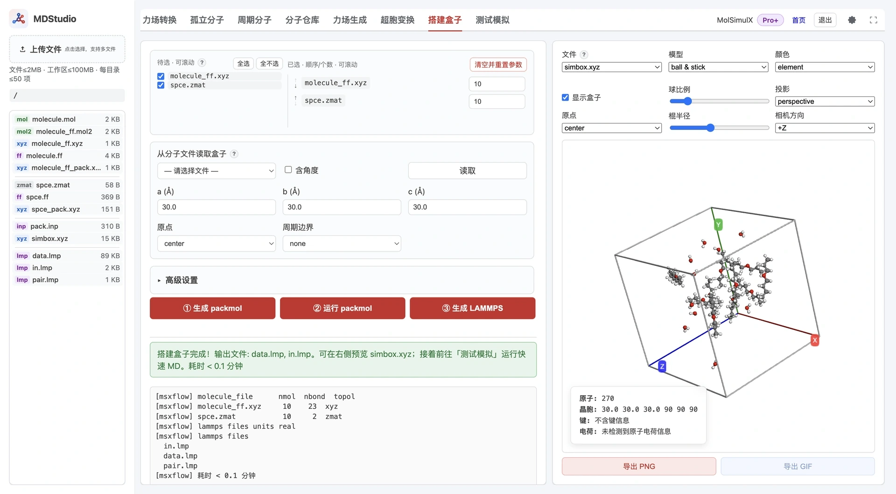

> **系列标签：** `MDStudio` · `搭建盒子` · `Packmol` · `Lammps`

有了各组分的结构和 `.ff`，还差把它们按配比塞进同一个周期盒子，并写出 Lammps 能直接读的 `data.lmp` / `in.lmp`。MDStudio 的**搭建盒子**把这件事串成一条流水线：

**选择物种（结构 + `.ff`）与个数 → 设定盒子 → 生成 `pack.inp` → 运行 Packmol 得 `simbox.xyz` → 生成 `data.lmp`、`in.lmp`（必要时 `pair.lmp`）。**

本文详细介绍支持的输入、物种与个数设置、盒子尺寸与周期、三步操作与产物、单分子拓扑如何确定、多分子 LAMMPS type 为何不合并、各产物文件的内容与注释约定，以及规模超限时的处理。这里的「搭建」是把已知的单分子模板复制装盒并写出 Lammps 输入，不重新计算电荷或重拟合力场。



---

[erphpdown]

## 一、整体功能与数据流

一次完整的装盒通常经历三步，对应界面上的三个按钮：

1. **① 生成 Packmol**：读取已选物种的结构与拓扑，按盒子尺寸写出 `pack.inp` 和各组分的 `*_pack.xyz`。
2. **② 运行 Packmol**：以 `pack.inp` 为输入调用 Packmol，把所有分子无重叠地填入盒子，得到 `simbox.xyz`。
3. **③ 生成 Lammps**：结合 `simbox.xyz` 与各物种模板，写出 `data.lmp`、`in.lmp`（type 较多时另出 `pair.lmp`）。

整个流程有两种进入方式：

- **模式 A（默认）**：从 ① 一路走到 ③，由平台生成 `pack.inp` 并在线跑装盒。
- **模式 B**：工作区已有合规的 `simbox.xyz`（例如线下装好后上传）时，可跳过 ① ②，直接点 ③ 只生成 Lammps 文件。此时不再重新猜键，拓扑完全来自各物种的结构与 `.ff` 模板。

三步的核心产物这样理解：

| 产物 | 阶段 | 保存内容 | 后续用途 |
| --- | --- | --- | --- |
| `pack.inp`、`*_pack.xyz` | ① | Packmol 输入脚本与各组分装盒坐标 | 送入 Packmol；可手改后复用 |
| `simbox.xyz` | ② | 装盒后全体系坐标，末行写入 cell 注释 | 生成 Lammps；也可做可视化检查 |
| `data.lmp` | ③ | `atom_style full`：Masses、Atoms、键连 Coeffs 与拓扑 | Lammps 读取的体系数据 |
| `in.lmp` | ③ | 单位、pair/kspace、minimize、MD 各阶段、dump、restart | Lammps 运行脚本 |
| `pair.lmp` | ③（可选） | 全部或多数 `pair_coeff` | type 数多时被 `in.lmp` include |

---

## 二、支持的输入

### 2.1 物种文件与 `.ff` 引用

物种选择器列出**当前文件夹**中满足以下条件的结构文件：

| 文件 | 说明 |
|------|------|
| **`.xyz`** | 最常用；力场生成得到的 `{name}_ff.xyz` 即属此类，第二行注释引用 `{name}.ff` |
| **`.zmat`** | 内坐标结构，`ff` 行声明力场 |
| **`.mol`** | MDL molfile，首行 `name ff.ff` 声明力场 |
| **`.pdb`** | `ATOM/HETATM` 坐标，`COMPND name ff.ff` 声明力场 |

关键前提：**每个物种文件都必须能定位到对应的 `.ff`**。选择器只显示「已声明并能找到 `.ff`」的文件；缺 `.ff` 的结构不会出现在待选列表里。这也是为什么正常路径是先在[力场生成](M09-MDStudio力场生成.md)得到 `{name}_ff.xyz` + `{name}.ff`，再来装盒。

下列 MolSimulX 流水线中间产物会被排除，避免把装盒结果又当作物种送回去：

- `simbox.xyz`
- `*_pack.xyz`

### 2.2 从分子文件读取盒子

盒子尺寸既可手填，也可从一个已含晶胞信息的文件读取，支持：

| 文件 | 读取重点 |
|------|----------|
| **`.xyz`** | 第二行 cell 注释（如力场生成 / 超胞变换写入的晶胞） |
| **`.cif`** | 晶胞参数 `a b c α β γ` |
| **`.mol2`** | `@<TRIPOS>CRYSIN` 晶胞行 |

该列表同样排除 `simbox.xyz`、`*_pack.xyz`。选择文件后点「读取」：程序解析盒子信息并填入 `a / b / c`，同时把**周期边界设为 `xyz`**；勾选「含角度」时连 `α / β / γ` 一并读入。若文件不含 cell 信息会给出提示。

---

## 三、物种与个数

物种区分「待选」和「已选」两栏：

- **待选（左）**：当前目录中所有合规物种，可勾选；支持「全选 / 全不选」。
- **已选（右）**：勾选后进入右栏，按行显示；每行可**上移 / 下移**调整顺序，并填写**个数**（最小 1，默认 1）。
- **清空并重置参数**：清空已选并把整表参数复位为默认。

多组分示例可直觉对应配比：溶质 N 个 + 水 M 个；离子液体阴阳离子按化学计量比；混合溶剂按摩尔比给个数。

物种顺序与各物种个数不仅写进 `pack.inp`，也决定了 `simbox.xyz` 中原子的排列次序，进而决定 ③ 生成 Lammps 时坐标与拓扑的对应关系（见第五节 ③ 的关键提醒）。**跑完 Packmol 后不要再改顺序或个数**，否则要从 ① 重新生成并重跑 ②。

> 每个物种自身的原子数、以及「个数 × 单分子原子数」求和得到的体系总原子数都有上限；超限的处理见第十节。

---

## 四、盒子尺寸与周期

| 参数                | 默认值    | 作用                                                    |
| ----------------- | ------ | ----------------------------------------------------- |
| **a / b / c (Å)** | 30     | 盒子三条边长；正交盒填三个数即可                                      |
| **原点**            | center | `center`=盒子中心在原点，坐标范围约 `[-L/2, L/2]`；`corner`=盒子一角在原点，坐标范围约 `[0, L]` |
| **周期边界**          | none   | `none / xyz / xy / yz / xz / x / y / z`；决定跨界成键是否用最小镜像 |

- **周期边界（PBC）** 影响单分子建模阶段的跨边界判键：设为 `xyz` 时，跨盒面相邻的原子会按最小镜像成键；`none` 则只在盒内判键。装盒得到的坐标不因此改变，但拓扑识别会不同。
- **原点** 决定盒子相对坐标原点的摆放，因而决定坐标区间：
  - `center`：盒子中心在原点，每个方向坐标约落在 `[-L/2, L/2]`（如 L=30 时约 `[-15, 15]`）；
  - `corner`：盒子一角在原点，每个方向坐标约落在 `[0, L]`（如 L=30 时约 `[0, 30]`）。
  两者与后续 Lammps 盒子定义配套，物理体系相同，只是整体平移。
- 非正交盒（`α / β / γ ≠ 90°`）在**高级设置**里填角度；三个角都是 90° 时按正交盒处理。

> **⚠️ 三斜盒子（triclinic）目前仅提供支持，尚未做完善测试。** 常规模拟建议优先使用正交盒（`α = β = γ = 90°`）。确需三斜盒时，请务必在可视化区检查装盒结果，并核对 `data.lmp` 中的盒子/倾斜（tilt）定义与拓扑是否合理后再使用。

> 网页表单以「给定盒子尺寸」为主。命令行 `msxflow box` 还支持用密度 `-r`（mol/L）反推立方盒边长，网页端未开放该入口，需要定密度装盒时可手改 `pack.inp` 或走命令行。

---

## 五、三步操作

### ① 生成 Packmol

点「① 生成 Packmol」后，平台按已选物种、个数与盒子设置写出：

- `pack.inp`：Packmol 主输入，含每个物种的 `structure ... number ... inside box ...`；
- `*_pack.xyz`：各组分供 Packmol 使用的单分子坐标。

生成成功后，平台会记下这份自动生成的 `pack.inp` 作为基线，用于后续判断它是否被手动编辑过。

### ② 运行 Packmol

点「② 运行 Packmol」，平台以 `pack.inp` 为输入调用 Packmol，成功后得到 `simbox.xyz`，并在第二行末尾写入 cell 注释（供可视化与生成 Lammps 复用）。

运行前会做规模校验：程序**同时**按表单估算和按 `pack.inp` 里 `structure × number` 估算总原子数，取较大值比对在线上限，防止手改 `number` 绕过限额。超限时的分支见第十节。

### ③ 生成 Lammps

点「③ 生成 Lammps」，平台先校验 `simbox.xyz` 的原子数是否与当前物种×个数一致，一致后写出 `data.lmp`、`in.lmp`（必要时 `pair.lmp`）。

若原子数对不上，通常是改了个数却没重跑装盒，或 `simbox.xyz` 与当前设定不匹配——按提示删除 `simbox.xyz` 重新运行 ②，或修正个数后重来。

> **⚠️ 关键：③ 的物种顺序与各物种个数，必须与生成当前 `simbox.xyz` 时完全一致。**
>
> 生成 Lammps 时，平台**按已选物种的顺序**，为每个物种依次从 `simbox.xyz` 取「个数 × 单分子原子数」个坐标，套上该物种的原子类型与键连拓扑。也就是说：`simbox.xyz` 里原子的排列次序，和表单里「物种顺序 + 各物种个数」是一一对应的。
>
> 而 ②/③ 的校验**只比对总原子数**，不检查这个对应关系。因此如果在跑完 Packmol 后又调整了物种顺序、增减了某物种个数（但总数恰好不变，例如把 A 少 1 个、B 多 1 个），校验依然通过，但**B 的坐标会被套上 A 的键与类型**，生成一份看似正常、实则拓扑错乱的 `data.lmp`。
>
> 因此：**从 ① 到 ③ 之间不要改物种顺序或个数**；若确需改动，请从 ① 重新生成 `pack.inp` 并重跑 ②，再生成 Lammps。模式 B（上传外部 `simbox.xyz`）时，也要保证表单里的物种顺序与个数，和当初写 `pack.inp`（装出这份 `simbox.xyz`）时严格一致。

### pack.inp 覆盖保护

`pack.inp` 允许手动编辑（[资源管理器](M04-MDStudio资源管理器.md)里改，或做特殊约束）。平台会将其与上次自动生成的基线对比来识别改动：

- 一旦检测到 `pack.inp` 被手动编辑，界面提示可**直接点 ② 使用当前文件**；
- 若仍想用表单重新「① 生成 Packmol」覆盖它，需先勾选「覆盖手动编辑的 pack.inp」，随后新文件会直接覆盖旧的手改版。重要脚本请自行在[资源管理器](M04-MDStudio资源管理器.md)里复制备份。

这样既能保留手改脚本，又避免误覆盖。

---

## 六、高级设置

| 参数 | 默认值 | 作用 |
|------|--------|------|
| **α / β / γ (°)** | 90 | 非正交盒的晶胞角度；三斜盒子仅提供支持、未做完善测试，建议优先正交盒 |
| **Packmol 容差** | 2.5 | Packmol `tolerance`，分子间最小允许间距；太小易失败，太大浪费空间 |
| **键长容差 (Å)** | 0.35 | 几何判键容差：`距离 ≤ 两元素共价半径之和 + 容差` 时判为成键 |
| **键角容差 (°)** | 15 | 由键推导角时的角度容差 |
| **单位** | real | Lammps `units`：`real` 或 `metal`；能量随单位换算 |
| **LJ 混合** | arithmetic | `pair_modify mix`：`arithmetic`（算术）/ `geometric`（几何） |
| **LJ 输出规则** | same | `same`=只写对角（及必要交叉）；`all`=写出全部 I–J `pair_coeff`（通常进 `pair.lmp`） |

键长 / 键角容差主要影响 **`.xyz`**（无显式键块，需按几何判键）与缺可靠键块的结构。`.mol` / `.pdb` 有显式键块时优先用文件键。判键形式可理解为：

$$
\text{距离} \le r_{\mathrm{cov}}(\text{元素 }i) + r_{\mathrm{cov}}(\text{元素 }j) + \text{键长容差}
$$

---

## 七、单分子模板与拓扑

装盒前，平台先为每个物种建立**单分子模板**（`build_molecule`）：确定坐标、键连拓扑，并从 `.ff` 匹配参数。不同输入的来源不同：

| 输入 | 坐标 | 键拓扑 | `.ff` 引用 |
|------|------|--------|------------|
| **`.xyz`** | 文件 | **不用文件键**；按 `.ff` 的平衡键长 + 键长容差几何判键 | 第二行注释 `<name>.ff` |
| **`.zmat`** | 内坐标转笛卡尔 | 默认文件拓扑；必要时几何判键 | `ff` 行或命令行 |
| **`.mol`** | 文件 | 优先 MDL 键块；否则几何判键 | 首行 `name ff.ff` |
| **`.pdb`** | `ATOM/HETATM` | 优先 `CONECT`；否则几何判键 | `COMPND name ff.ff` |

拓扑确定后，键连参数在 `.ff` 里**先按原子类型、再按原子名**精确匹配，并考虑键 / 角 / 二面角的对称重排。角、二面角多由键推导，`.zmat` 的离面角可来自文件。

> **术语：离面角 = 不当二面角。** 本文的「离面角」对应 LAMMPS 的 `improper`，在 K 系列力场文章里一直称作「不当二面角」（improper dihedral），指的是同一样东西——约束一个中心原子与其三个相邻原子构成的平面外偏离（如保持羰基、芳环共面）。下文的 `IMPROPER` 段、`improper_style` 均指此项。

> **与力场生成的区别**：装盒阶段的键连匹配**不做** `[guess]` 近似兜底——参数应在[力场生成](M09-MDStudio力场生成.md)阶段就匹配好、检查完。装盒只是复用这些模板。

**需要按元素判键时，元素信息从哪里来？**

对需要几何判键的输入（尤其 `.xyz`），共价半径取自**结构文件里的元素**，不是 `.ff` 里的力场类型：

| 输入 | 元素来源 |
|------|----------|
| **`.xyz`** | 每行第 1 列标签（如 `C`、`C0`、`Ow`），按内部规则解析成元素 |
| **`.pdb`** | 优先第 77–78 列元素字段，无效时再从原子名解析 |
| **`.mol` / `.zmat`** | 文件自带的原子 / 元素信息 |

因此 `.xyz` 第一列不要写成无法解析的力场类型串，否则判键会出错，容差再调也对不上真实键长。

---

## 八、LAMMPS atom type：多分子不合并

这是搭建盒子的一条明确约定：**不同物种的物理等价 type 不会被合成同一个 LAMMPS type。**

- **单分子内**：按 `.ff` 归 type（format 2 用 `type_id`，format 1 用原子名）。
- **多分子之间**：type 的签名带上物种名，即 `(species, type_id | atom_name)`，跨物种不合并；同物种的多个副本共用一套 type。

为什么不合并：

1. **可调物种间相互作用**：每个物种独立编号后，可在 `pair.lmp` / `pair_coeff` 里单独调 A–B（溶质–溶剂、阴阳离子等）的交叉项，而不动种内相互作用。
2. **参数安全**：不同 `.ff` 里同名 `ff_type`（如都叫 `ca`）的质量 / σ / ε 未必相同，按物种隔离避免悄悄用错非键参数。

代价是 type 数可能随物种数近似线性增加；type 较多或选了「LJ 输出规则 = all」时会写出 `pair.lmp`。电荷 `q` **不进入** type 签名——format 2 下同 `type_id` 可有不同位点电荷，写在 `Atoms` 行上。

**水模型**：库内 TIP4P / OPC 等只含三个显式原子，M 点由 Lammps `lj/cut/tip4p/*` 隐式处理。装盒时按物种识别水模型并写入对应 `pair_style` / `qdist`；有机分子 + TIP4P 会使用 hybrid pair 样式。水物种的 type 仍服从上面的按物种隔离规则。

---

## 九、产物详解

### 9.1 `pack.inp` / `*_pack.xyz`

Packmol 的输入脚本与各组分坐标。`pack.inp` 里每个物种一段 `structure`，含 `number`（个数）与 `inside box`（装填区域），顶部有 `tolerance`、`output simbox.xyz` 等全局设置。可手改后直接点 ②（见第五节覆盖保护）。

### 9.2 `simbox.xyz`

装盒后的全体系坐标，末行写入 cell 注释。可在可视化区检查是否有明显重叠、空腔或分子跑出盒子。生成 Lammps 前会校验其原子数与设定一致。

### 9.3 `data.lmp`

`atom_style full`，包含 Masses、Atoms、以及 Bond/Angle/Dihedral/Improper 的 Coeffs 与拓扑。注释约定：

| 段 | 注释内容 |
|----|----------|
| **Masses** | 仅**元素符号**（如 `# C`、`# H`），便于从 dump 解析元素 |
| **Atoms** | 单分子：`# 原子名`；多分子追加物种名：`# 原子名 species` |
| **Bonds / Angles / …** | 消歧前的原子名串，如 `# C1-C2` |
| **pair_coeff** | `ff_type`：对角 `# ca`，交叉 `# ca-ha` |

### 9.4 `in.lmp`

运行脚本，默认写入完整的一套流程（温度、压强、随机种子等以 `variable` 形式在脚本顶部，可改）：

```text
minimize            # 能量最小化
fix nve  run 1000   # NVE 弛豫，快速释放局部应力
fix nvt  run 100000 # NVT 弛豫，温度均匀化
fix npt  run 1000000# NPT 生产，收集轨迹
```

并配套 `dump`（文本 `.lammpstrj` + 二进制 `.dcd`）、`restart` 与最终 `write_data`。这套默认流程用于打通与冒烟，**生产长跑请下载到计算节点，按体系调整步数、系综与参数**。

### 9.4.1 SHAKE 约束的来源

`in.lmp` 里的 `fix ... shake`（若出现）**不是**平台凭经验加的，而是来自 `.ff`：当某些**键或角在 `.ff` 中被标为约束样式 `cons`（刚性约束）**时，程序收集这些键/角对应的 type 编号，写成：

```text
fix myshake all shake 0.0001 20 0 b <bond types> a <angle types>
```

最常见的来源是**库内刚性水模型**（如 TIP3P：刚性 O–H 键、H–O–H 角以 `cons` 声明）。因此：想让某键/角被 SHAKE 固定，就在对应 `.ff` 里用 `cons` 样式；`.ff` 里没有 `cons` 项时，`in.lmp` 就不会出现 `fix shake`。

### 9.4.2 多种势函数样式自动 hybrid

装盒把多个物种（或同一物种内不同官能团）合到一个体系后，同一类键连项可能出现**多种势函数样式**。此时程序会**自动改用 LAMMPS 的 `hybrid` 样式**，而不是强行合并：

- 键：`bond_style hybrid ...`
- 角：`angle_style hybrid ...`
- **二面角：`dihedral_style hybrid ...`**
- **离面角：`improper_style hybrid ...`**

仅当某一类只有单一样式时才写普通样式（如 `dihedral_style opls`）。用了 hybrid 后，`data.lmp` 中对应的 `Bond/Angle/Dihedral/Improper Coeffs` 每行会在系数前多写一个**样式名前缀**，以标明该 type 属于哪种样式。这样混合来源的体系不必手工拼 hybrid，也不会因样式不一致而丢参数。

### 9.5 `pair.lmp`（可选）

当「LJ 输出规则 = all」，或 atom type 数超过阈值（> 10）时，`pair_coeff` 会集中写入 `pair.lmp`，由 `in.lmp` 用 `include pair.lmp` 载入；否则直接写在 `in.lmp` 内。混合规则由「LJ 混合」控制，能量按单位换算。

---

## 十、规模与超限

平台按「每个物种个数 × 单分子原子数」求和得到体系总原子数，并在多个环节与上限比对：

- **每个物种**自身原子数有上限（与力场生成一致）；
- **体系总原子数**有在线装盒上限；② 运行 Packmol 时取「表单估算」与「`pack.inp` 估算」的较大值校验，手改 `number` 无法绕过。

超限时的行为分几种：

| 情况 | 行为 |
|------|------|
| **超出在线装盒总原子上限** | 直接拦截，请缩小体系（减少个数 / 缩小盒子） |
| **超出在线 Packmol 处理规模** | 任务挂起并生成 `run_packmol.sh`：可下载 `pack.inp` + `run_packmol.sh` 到自有计算节点装盒，跑完把 `simbox.xyz` 上传回工作区，再点 ② 校验 |
| **已上传合规 `simbox.xyz`** | ② 只校验原子数并补 cell 注释，随后即可点 ③ |

具体阈值数字、`run_packmol.sh` 的使用与 10 万原子以上的定制装盒，见 [MDStudio 使用须知与限制](M02-MDStudio使用须知与限制.md)。

---

## 十一、推荐流程

1. 在[力场生成](M09-MDStudio力场生成.md)为每个组分得到 `{name}_ff.xyz` + `{name}.ff`，并检查 `.ff`。
2. 打开搭建盒子，勾选物种、填个数、调整顺序。
3. 设盒子尺寸（或从含晶胞的文件「读取」），确认原点与周期边界。
4. 依次点 ①②③；每步看结果面板与日志。
5. 可视化检查 `simbox.xyz`，确认无穿插、无大空腔。
6. 下载 `data.lmp` / `in.lmp`（及 `pair.lmp`）备份到本机。
7. 先做[测试模拟（Lammps 冒烟）](M12-MDStudio测试模拟.md)，通过后再下载到计算节点做生产长跑。

---

## 十二、常见问题

| 问题 | 处理 |
|------|------|
| 物种列表里找不到某文件 | 该结构未声明或找不到 `.ff`；先在力场生成得到配套 `.ff` |
| Packmol 失败 | 读日志：盒子过小 / 分子重叠 / 容差过小；适当放大盒子或调 Packmol 容差 |
| ③ 提示原子数不一致 | 改了个数却没重跑 ②；删除 `simbox.xyz` 后重新运行 ② |
| ③ 通过了但结果拓扑不对 | 跑完 ② 后改了物种顺序或各物种个数（总数恰好不变）；校验只看总数，须从 ① 重新生成并重跑 ② |
| 改完 `pack.inp` 又被重置 | 重新生成 ① 前需勾选「覆盖手动编辑的 pack.inp」；否则直接点 ② 用当前文件 |
| type 数很多 / 出现 `pair.lmp` | 多物种不合并 type 的正常结果，`in.lmp` 会 `include pair.lmp` |
| 体系太大被拦截或挂起 | 缩小体系，或走 `run_packmol.sh` 本地装盒后上传 `simbox.xyz` |

---

## 小结

1. 装盒固定三步：**pack.inp → Packmol（simbox.xyz）→ data/in.lmp**。
2. 物种必须带 `.ff`；正常路径是先做力场生成，再来装盒。
3. 多分子**不合并** LAMMPS type，便于人工调物种间相互作用，也避免异源同名 type 混参。
4. **③ 的物种顺序与个数必须与生成 `simbox.xyz` 时一致**；校验只看总原子数，改动后务必从 ① 重来。
5. 过大体系会被拦截或改走本地 `run_packmol.sh`，属限额而非故障。
6. 默认 `in.lmp` 用于打通与冒烟；生产长跑请下载后离线跑。

[/erphpdown]

---

## 学习路径

**前置阅读：**

- [MDStudio力场生成](M09-MDStudio力场生成.md)
- [MDStudio 资源管理器（工作区文件）](M04-MDStudio资源管理器.md)
- [MDStudio 使用须知与限制](M02-MDStudio使用须知与限制.md)

**下一步：**

- [测试模拟（Lammps 冒烟）](M12-MDStudio测试模拟.md)
- [MDStudio 资源管理器（工作区文件）](M04-MDStudio资源管理器.md)
