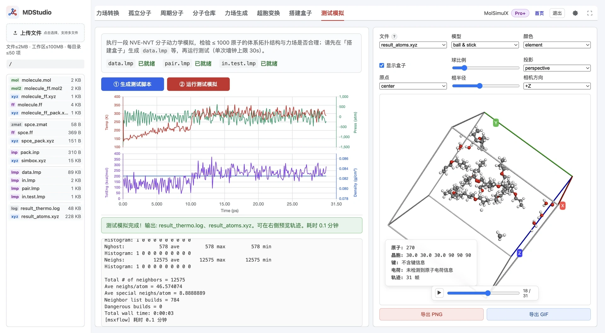

> **系列标签：** `MDStudio` · `测试模拟` · `Lammps` · 冒烟测试

装盒生成了 `data.lmp` / `in.lmp`，但心里还没底：这套输入一喂给 Lammps 会不会立刻报错、类型对不上、或者能量瞬间发散？**测试模拟**用极短的墙钟在服务器上跑一段 minimize → NVE → NVT，**验证输入能被 Lammps 接受、拓扑与力场自洽**，而不是替你做生产采样。

**流程：确认装盒产物齐 → ① 由 `data.lmp` + `in.lmp` 派生 `in.test.lmp` → ② 短跑 Lammps → 看实时热力学曲线与日志判断是否闭合。**

本文详细介绍测试模拟做什么/不做什么、需要哪些文件、两步操作、测试脚本 `in.test.lmp` 与生产 `in.lmp` 的差异、运行时看什么、成功判据，以及原子数与墙钟上限。这里的「测试」是冒烟，不追求密度收敛或轨迹质量。

---

[erphpdown]

## 一、整体功能与数据流

测试模拟是**两步**，对应界面上的两个按钮：

1. **① 生成测试脚本**：读取工作区的 `data.lmp` 与 `in.lmp`（必要时 `pair.lmp`），派生出一份短跑专用的 `in.test.lmp`。
2. **② 运行测试模拟**：用 `in.test.lmp` 调用 Lammps 短跑，实时输出热力学量与轨迹。

数据流与产物：

| 文件 | 角色 | 来源 / 去向 |
| --- | --- | --- |
| `data.lmp` | 输入 | 搭建盒子 ③ 生成 |
| `in.lmp` | 输入（模板） | 搭建盒子 ③ 生成；仅作为派生源，本 Tab 不直接运行它 |
| `pair.lmp` | 输入（条件） | 仅当 `in.lmp` 里有 `include pair.lmp` 时需要 |
| `in.test.lmp` | ① 产物 / ② 输入 | 由上面派生的短跑脚本 |
| `result_thermo.log` | ② 产物 | 热力学日志，供实时曲线解析 |
| `result_atoms.xyz` | ② 产物 | 短跑轨迹（每 1000 步一帧） |

**明确边界**：测试模拟只回答「这套输入能不能正常启动并稳定跑起来」。它**不**判断密度是否收敛、RDF 是否合理、需要跑多少 ns——那些属于生产与分析，请下载后到本地或集群完成（见 [集群与 SLURM 简明教程](T10-集群与SLURM简明教程.md)）。

---

## 二、前提与文件就绪

界面顶部用三个状态标记（chip）显示就绪情况：

| 文件 | 状态含义 |
|------|----------|
| **`data.lmp`** | `已就绪` / `缺失`；缺失说明还没做搭建盒子 ③ |
| **`pair.lmp`** | `—`（`in.lmp` 未 `include pair.lmp`，不需要）/ `已就绪` / `缺失` |
| **`in.test.lmp`** | `缺失`（没生成）/ `已就绪` / `已过期`（源文件比它新，需重新生成 ①） |

除了文件，启动还有几道前置校验：

- **`data.lmp` 与 `in.lmp` 必须都在**；`pair.lmp` 仅在 `in.lmp` 声明 `include pair.lmp`（通常 type 数多时出现）时才必需。
- **原子数不超上限**：程序读取 `data.lmp` 头部的 `N atoms` 行；超过上限直接拦截（按钮不可用）。
- **服务器已配置 Lammps 可执行文件**：否则会提示无法启动。
- **当前目录条目未满**：文件/文件夹数量达上限时先清理再试。

当有任何一项不满足，界面会在按钮上方给出对应的「阻塞提示」。

---

## 三、两步操作

### ① 生成测试脚本

点「① 生成测试脚本」，平台从 `data.lmp` + `in.lmp` 派生出 `in.test.lmp`（详见第四节差异）。生成时会：

- 从 `data.lmp` 的 `Masses` 段注释读取每个 type 的**元素符号**，用于轨迹 dump 的元素标注（这也是搭建盒子把 Masses 注释写成纯元素符号的用处，见 [搭建模拟盒子](M11-MDStudio搭建盒子.md) 的 `data.lmp` 说明）；
- 校验原子数不超上限，超限则拒绝生成。

### ② 运行测试模拟

点「② 运行测试模拟」，平台用 `in.test.lmp` 启动 Lammps 短跑。启动前要求 `in.test.lmp` **存在且不过期**、Lammps 可执行、原子数合规。

### 「已过期」是什么意思

`in.test.lmp` 是从 `data.lmp` / `in.lmp` / `pair.lmp` 派生的**快照**。一旦这些源文件比 `in.test.lmp` 新（例如你回到搭建盒子重新生成了 `data.lmp`），界面会把 `in.test.lmp` 标为**已过期**，需要重新点 ① 再跑 ②，避免拿旧脚本跑新体系。

---

## 四、`in.test.lmp` 与生产 `in.lmp` 的差异

`in.test.lmp` 不是简单复制 `in.lmp`，而是为「快速、可独立启动的冒烟」做了改写：

**沿用 `in.lmp` 的部分**（截取到 `minimize` 之前）：单位、`atom_style`、各 `*_style`（含自动 hybrid）、`special_bonds`、`read_data`、`pair_coeff`（或 `include pair.lmp`）、以及顶部的 `variable`（如 `mytemp`、`myrand`）。

**为短跑所做的改写**：

| 改写点               | 处理                                                                                               | 目的                      |
| ----------------- | ------------------------------------------------------------------------------------------------ | ----------------------- |
| **长程静电求解器**       | 删除 `kspace_style`                                                                                | 短跑无需 Ewald/PPPM，启动更快    |
| **长程 pair_style** | 长程版换成截断版（如 `.../coul/long` → `.../coul/cut`、`lj/cut/tip4p/long` → `.../tip4p/cut`）               | 与去 kspace 配套，使脚本自洽可独立运行 |
| **SHAKE 约束**      | 若 `in.lmp` 有 `fix ... shake`，予以保留                                                                | 刚性水等约束在测试中同样生效（来源见 M11） |
| **MD 阶段**         | 只做 `minimize → NVE → NVT`（各约万步量级），**不做 NPT**                                                     | 冒烟只验证稳定启动，不做定压弛豫        |
| **热力学与轨迹**        | 加 `thermo_style`（step、time、temp、pe/ke/etotal、press、vol、density）、每 1000 步 dump `result_atoms.xyz` | 供实时曲线与轨迹预览              |

因此 `in.test.lmp` 是一份**自洽、能独立启动**的短脚本；生产长跑仍应使用完整的 `in.lmp`。

---

## 五、运行时看什么

测试模拟运行时，界面右侧实时刷新两组曲线（来自 `result_thermo.log`）：

- **温度 / 压力**（Temp、Press）
- **总能 / 密度**（TotEng、Density）

同时可看**日志尾部**滚动输出。判断「跑得健康」的直觉：

- 温度在设定值附近波动，不持续飙升或跌到 0；
- 总能有限、不出现 `NaN` 或指数式发散；
- 没有 `ERROR:` 之类致命信息。

轨迹 `result_atoms.xyz` 每 1000 步记一帧，可用于粗看结构有没有炸开。

---

## 六、成功长什么样

测试模拟属于冒烟，判据宽松：

- 任务**正常结束**，或**到达墙钟上限被按时终止**——后者不是失败，短跑本就可能跑不完预设步数；
- 日志无致命错误，热力学量有限、无发散；
- 输入文件仍可在资源管理器下载。

**不要求**：密度已收敛、能量已平衡、RDF 好看、跑满多少 ns。这些都留给生产。

---

## 七、规模与时间上限

测试模拟有两条硬约束，均由服务器配置决定：

| 约束 | 默认量级 | 说明 |
|------|----------|------|
| **原子数上限** | 约千原子 | 超过则 ① / ② 直接拦截，请回搭建盒子减少分子数重装 |
| **单次墙钟上限** | 数十秒量级 | 到时按时终止；这是冒烟的正常边界，不是报错 |

界面会显示当前生效的原子数上限与墙钟秒数；权威阈值与整体额度见 [MDStudio 使用须知与限制](M02-MDStudio使用须知与限制.md)。需要更大体系或更长模拟，请下载输入到本地 / 集群运行。

---

## 八、常见问题

| 问题 | 处理 |
|------|------|
| ① / ② 按钮灰、点不动 | 看阻塞提示：多半是原子数超上限、缺 `data.lmp`/`pair.lmp`、或未配置 Lammps |
| `in.test.lmp` 显示「已过期」 | 源文件（`data.lmp` 等）已更新，重新点 ① 生成再跑 ② |
| 一启动就 `ERROR` 退出 | 读日志：缺文件、pair/bond 类型不匹配、盒子异常；多数要回力场生成 / 搭建盒子修正 |
| 温度或能量迅速发散 | 结构有重叠或参数不当：检查装盒是否有穿插、`.ff` 是否有 `[guess]` 未核对 |
| 跑到一半就停了 | 到墙钟上限的正常终止；冒烟通过即可，生产请下载离线跑 |
| 想把步数改大当生产用 | 不要在线改；下载 `in.lmp`（生产脚本）到集群按需调整 |

---

## 九、为什么这不是生产

测试模拟刻意做小、做短、去掉长程静电求解，就是为了**几十秒内给出「能不能跑」的结论**。真正的采样需要长程静电、更长时间、合适系综与平衡判据，应使用完整的 `in.lmp`，下载到本地或集群运行（见 [本地与集群文件传输](T09-本地与集群文件传输.md)、[集群与 SLURM 简明教程](T10-集群与SLURM简明教程.md)）。

---

## 小结

1. 测试模拟只验证输入能被 Lammps 正常启动并稳定跑起来，是冒烟不是生产。
2. 两步：① 由 `data.lmp` + `in.lmp` 派生 `in.test.lmp`；② 短跑并看实时曲线。
3. `in.test.lmp` 去 kspace、长程 pair 换截断、只跑 minimize→NVE→NVT，自洽且可独立启动。
4. 源文件更新后 `in.test.lmp` 会「过期」，需重新生成。
5. 原子数与墙钟都有上限；到墙钟正常终止不算失败。生产采样请下载后离线跑。

[/erphpdown]

---

## 学习路径

**前置阅读：**

- [搭建模拟盒子（Packmol 三步）](M11-MDStudio搭建盒子.md)
- [MDStudio 使用须知与限制](M02-MDStudio使用须知与限制.md)
- [MDStudio Quickstart：从画分子到测试模拟](M01-Quickstart从画分子到测试模拟.md)

**下一步：**

- [集群与 SLURM 简明教程](T10-集群与SLURM简明教程.md)
- [MDStudio 资源管理器（工作区文件）](M04-MDStudio资源管理器.md)
- [MDStudio 功能与界面总览](M03-MDStudio功能与界面总览.md)
