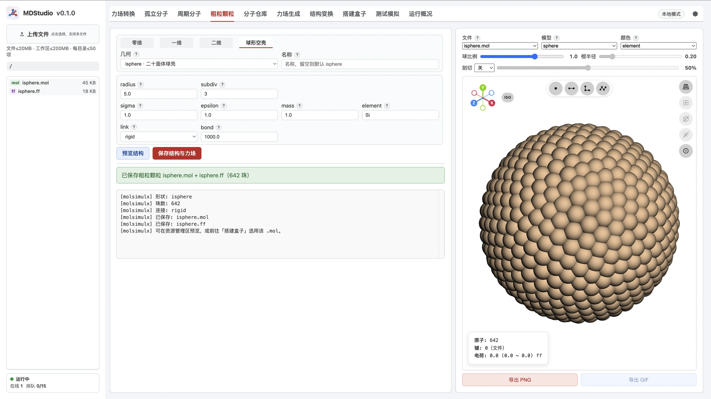

> **系列标签：** `MDStudio` · `粗粒化` · `CG` · `对比单位`

想跑一盒 LJ 溶剂、一根刚性棒、一片二维薄片，或一个空心球壳——这些体系没有 SMILES，也没法用 GAFF 去派原子类型：它们是**由若干相同珠子摆出来的粗粒模型**。**粗粒颗粒** Tab 直接按几何把珠子排好，同时写出配套的单类型 LJ 力场。

**选维度 → 选几何 → 填尺寸与连接方式 → 预览 → 保存 `{name}.mol` + `{name}.ff`。**

产物可以直接进「搭建盒子」，**不需要**再走「力场生成」。默认全部使用**对比单位**（σ=ε=m=1），适合 LJ 教学体系、胶体 / 纳米颗粒模型与自定义 CG 模型的起手结构。粗粒化的概念背景见[粗粒化与加速模型](../../在线资源/00-知识文档/K04-粗粒化与加速模型.md)，对比单位见[对比单位与无量纲化](../../在线资源/00-知识文档/K15-对比单位与无量纲化.md)。



---

[erphpdown]

## 一、整体功能与数据流

粗粒颗粒不做任何化学识别，只做两件事：**按几何摆珠子**、**写一套单类型 LJ 参数**。

```text
选维度 + 几何 + 尺寸参数
        │  按解析公式生成珠子坐标（质心自动移到原点）
        ▼
   珠子集合（可选键 / 角）
        │
        ▼
   {name}.mol  +  {name}.ff   →  搭建盒子
```

几个贯穿全 Tab 的约定：

| 约定 | 说明 |
|------|------|
| **单一 type** | 所有珠子共用一个原子类型（默认标签 `Si`），`.ff` 里只有一行 LJ 参数 |
| **对比单位** | σ = ε = mass = 1，电荷 0；需要真实单位自行改 `.ff` |
| **质心在原点** | 生成后统一把质心平移到原点，便于装盒与旋转 |
| **同步生成** | 点击即出结果，不排队；但仍受单分子原子数上限约束 |
| **不接力场生成** | `.mol` + `.ff` 已成对，直接进「搭建盒子」 |

底部两个按钮：

| 按钮 | 作用 |
|------|------|
| **预览结构** | 写入临时 `preview.cgnp.mol` / `.ff` 并在右侧显示，**不占用**正式文件名；调参可反复点 |
| **保存结构与力场** | 写出 `{name}.mol` + `{name}.ff` 到当前文件夹（同名自动去重） |

> **Tips：** 预览与正式保存受**同一套原子数上限**约束。二维大片或 `subdiv=3` 球壳若超限，缩小尺寸 / 增大 spacing / 降低 subdiv 后再试。限额见 [MDStudio使用须知与限制](M02-MDStudio使用须知与限制.md)。

### 1.1 右侧可视化：珠子画多大

粗粒模型的珠间距往往接近或小于显示用的「球半径」，默认看起来会**挤成一团**或**互相穿插**。右侧可视化区有两处专门控制**显示尺寸**（只影响预览，不改 `.ff` 里的 σ / ε）：

| 控件 | 作用 |
|------|------|
| **实际尺寸** | 勾选后以力场 LJ **σ/2** 为基准半径（无 `.ff` 时退回元素范德华半径）；**不**自动改「球比例」滑条，滑条仍可独立倍率缩放 |
| **球比例** | 显示半径的倍率（**0～1.5**，默认 **0.3**） |

**基准半径怎么定：**

1. **有配套 `.ff`（粗粒颗粒默认如此）**：按力场里的 LJ **σ** 取 `半径 = σ / 2`，再乘「球比例」。默认 σ=1 → 基准半径 0.5；勾选「实际尺寸」时显示直径约等于 σ。
2. **没有 `.ff`**：退回按**元素**的范德华半径缩放（与 `element` 标签有关）；本 Tab 保存后一般总有 `.ff`，走第 1 条。

因此：

- 想核对「珠子软球是否按 σ 接触」→ 勾选 **实际尺寸**，并把球比例调到接近 **1**，模型选 `sphere` 或 `ball & stick`。
- 想看清棒 / 片 / 壳的骨架与键 → 保持默认球比例 **0.3**，或继续调小滑条。
- 改 `element` 只影响**配色**（在有 `.ff` 时），**不改变**按 σ 算出的球大小；要改显示与相互作用尺度，改表单里的 **sigma**。

> **Tips：** 其它 Tab 的 3D 预览共用同一套「实际尺寸 / 球比例」控件。粗粒珠间距常 ≈ σ，默认 0.3 倍显示最不容易误判「重叠」。

---

## 二、四个维度子模式

顶部一排子 tab 决定可选几何：

| 子模式 | 几何 | 珠子摆法 |
|--------|------|----------|
| **零维** | `bead` 单珠 | 一颗珠子在原点 |
| **一维** | `rod` 棒 / `chain` 链 | 沿指定轴等距排列 |
| **二维** | `disk` 圆形 / `rect` 平行四边形 | 在 xy 平面按点阵填充 |
| **球形空壳** | `isphere` 二十面体球壳 | 正二十面体细分后投影到球面，**只有壳、没有内部** |

`rod` 与 `chain` 几何完全相同，区别只在**默认连接方式**：`chain` 默认成键（`bond`），`rod` 默认刚体（`rigid`）。

> **注意：** 切换维度时，界面会按该维度的默认重置 `link`（一维切到 `chain` → `bond`，其余 → `rigid`）。若你刚改过连接方式，换维度后请再确认一次。

---

## 三、共用参数

无论哪个维度，下面几组字段都在（各字段旁的「?」与下表含义一致）：

| 参数          | 默认      | 说明                                                           |
| ----------- | ------- | ------------------------------------------------------------ |
| **名称**      | 空（用几何名） | 输出 stem：`{name}.mol` / `{name}.ff`；留空则用当前几何名（如 `bead`、`rod`） |
| **sigma**   | 1.0     | LJ σ（对比单位）；同时决定可视化基准球半径                                      |
| **epsilon** | 1.0     | LJ ε（对比单位）                                                   |
| **mass**    | 1.0     | 珠子质量（对比单位）                                                   |
| **element** | `Si`    | 珠子标签 / 唯一 type；可改 `C`、`S`、`Fe` 等换预览配色，仍是单 type               |
| **link**    | rigid   | 连接方式，见第七节；零维无此行                                              |
| **bond**    | 1000    | `link=bond/angle` 时的谐振子键力常数 k                                |
| **angle**   | 100     | `link=angle` 时的谐振子角力常数 k（eq = 180°）；球形空壳不显示                  |

> **Tips：** `element` 只是标签。写 `Fe` 不会让珠子获得铁的质量或 LJ 参数——质量与 σ/ε 完全由上表字段决定。有 `.ff` 时球大小跟 **sigma**，跟 element 无关。

---

## 四、一维：棒与链

三个尺寸字段**联动**，改一个另两个跟着算：

| 参数 | 默认 | 说明 |
|------|------|------|
| **length** | 5 | 端到端长度 L，**必填**，作为主尺寸固定；改 length 时保持珠数、重算 `spacing = L/(N−1)` |
| **spacing** | 0.5 | 珠间距 d；改它 → `number = L/d + 1`（取整） |
| **number** | 11 | 珠数 N ≥ 2；改它 → `spacing = L/(N−1)` |
| **axis** | x | 棒 / 链轴向：`x` / `y` / `z` |

也就是说：**length 是锚，spacing 与 number 二选一驱动**。棒沿轴居中，两端对称分布在原点两侧。

> **Tips：** 若要固定珠间距，先定 length 与 spacing，让 number 自动算出；若要固定珠数，改 number，spacing 会跟着变。

---

## 五、二维：圆片与平行四边形

先选**点阵**，再选形状边界，落在边界内的格点就是珠子。

| 参数 | 默认 | 说明 |
|------|------|------|
| **点阵** | square | `square` 正方格点；`hex` 三角（六角密排）格点 |
| **spacing** | 0.5 | 点阵最近邻距离（Å / 对比单位） |
| **中心** | 点阵点 | `点阵点`＝形状中心落在某个格点上；`元胞中心`＝中心落在原胞中心（中心处无珠） |

形状参数按几何显示：

| 几何 | 参数 | 说明 |
|------|------|------|
| **disk** 圆形 | radius（默认 5） | 圆心在原点 |
| **rect** 平行四边形 | lx / ly（默认 5）、gamma（默认 90°） | γ=90° 且 lx=ly → 正方形；γ=90° → 矩形；lx=ly 且 γ≠90° → 菱形；否则斜平行四边形 |

珠子数量由**面积 ÷ 点阵密度**决定：spacing 减半，珠数约变 4 倍。调大尺寸或调小 spacing 之前先估一下总数。

> **注意：** γ 不能为 0° 或 180°（面积为零）。hex 点阵在同样 spacing 下比 square 更密，同样尺寸珠数更多。

---

## 六、球形空壳：二十面体细分

空心球壳不是「实心球挖空」，而是**测地球（icosphere）**：取正二十面体，把每个三角面反复四分，顶点投影到球面。

| 参数 | 默认 | 说明 |
|------|------|------|
| **radius** | 5 | 球壳半径；所有珠子严格落在球面上，质心在原点 |
| **subdiv** | 2 | 细分次数 n，取 **0～3**；珠数 \(N=10\cdot 4^{n}+2\) |

| subdiv | 0 | 1 | 2 | 3 |
|--------|---|---|---|---|
| 珠数 | 12 | 42 | 162 | 642 |

珠间距不是自由参数：给定半径和细分次数后，网格边长就定了（约 \(R\cdot\sqrt{4\pi/(N\sqrt{3})}\) 量级）。想要更密的壳就加大 `subdiv` 或减小 `radius`。

球壳**只支持 rigid / bond**，不支持 angle——弯曲壳面上的 180° 共线角没有意义；界面也不显示 angle 选项。

> **Tips：** `subdiv=3` → 642 珠，已接近 MOL V2000 的 999 上限，也更容易撞单分子原子数限额。先用 `subdiv=1` 或 `2` 预览，满意再加大。

---

## 七、连接方式 link

| 取值 | 写什么 | 适用 |
|------|--------|------|
| **rigid** | 不写键；珠子只有 LJ | 刚性颗粒；LAMMPS 里可再配 `fix rigid` |
| **bond** | 最近邻 / 网格边谐振子键 | 柔性链、弹性片、可变形壳 |
| **angle** | 在 bond 基础上再加**平面内约 180° 的共线角** | 一维 / 二维，需要抗弯刚度时 |

**默认全部是 rigid，只有一维 `chain` 默认 bond。** angle 仅在一维和二维可选；零维单珠没有连接，球形空壳只到 bond。

键的对象按几何而定：一维是相邻珠，二维是最近邻格点，球壳是三角网格的每条边。角只在**近似共线**（≈180°）的三元组上生成——直棒沿链方向、二维点阵的对顶最近邻。

键平衡长度 r₀ 取几何间距：一维 / 二维为 spacing，球壳为网格边长均值；角平衡为 180°。

> **注意：** `rigid` 不会在 `.ff` 里写 `BONDS`。若要用柔性键，请显式选 `bond` 或 `angle`。

---

## 八、输出文件

| 文件 | 内容 |
|------|------|
| `{name}.mol` | MOL V2000：珠子坐标 + **连接表**（`link=bond/angle` 时才有键行）；首行引用 `{name}.ff` |
| `{name}.ff` | format 2：一行 `ATOMS`（单 type LJ）+ 逐珠 `CHARGES`；有键时 `BONDS`、有角时 `ANGLES` |

`.ff` 的 `BONDS` / `ANGLES` 是**类型参数表**，不是连接表——所有珠子同一 type，所以各只有一行：

```text
ATOMS
# type_id  type  m/uma  q/e  pot  sigma  eps(kJ/mol)
Si     Si       1.000000   0.000000  lj    1.000000   1.000000

BONDS
# i j  pot  r0/A  k/(kJ/mol/A^2)
Si   Si   harm    0.500000    1000.0000
```

具体连哪两颗珠，记录在 `.mol` 的连接表里。`.ff` 格式细节见 [MDStudio力场生成](M09-MDStudio力场生成.md)。

> **Tips：** 想要多种珠子？本 Tab 只写单 type。做法是分别生成几个单 type 的 `.mol` + `.ff`，在「搭建盒子」里作为不同物种一起装。

---

## 九、几种典型用法

| 目的 | 怎么填 |
|------|--------|
| **LJ 溶剂珠** | 零维 `bead`；直接保存，装盒时给个数即可 |
| **刚性棒状颗粒** | 一维 `rod`；填 length 与 number；link 保持 rigid |
| **柔性 CG 链** | 一维 `chain`；填 length 与 number；link = bond（默认） |
| **抗弯半刚性链** | 一维 `chain`；link = angle，按需调大 angle 力常数 |
| **二维薄片 / 纳米片** | 二维 `rect`；lx / ly + hex 点阵；link = rigid 或 bond |
| **圆盘状颗粒** | 二维 `disk`；radius + spacing |
| **空心纳米壳 / 囊泡骨架** | 球形空壳 `isphere`；radius + subdiv；link = bond 得到弹性壳 |

---

## 十、限制

- **VIP-only**；同步执行，不进任务队列、无墙钟。
- **珠数上限**：有效单分子原子数（VIP / 机房 **1000**）与 MOL V2000 **999** 取更紧者，实务顶为 **999**；提交前会先按参数预估珠数。详见 [MDStudio使用须知与限制](M02-MDStudio使用须知与限制.md)。
- **不做参数标定**：给的是 σ=ε=1 的占位 LJ；真实体系的 CG 参数需要自己标定或查文献，再改 `.ff`。

---

## 十一、常见问题

| 问题 | 处理 |
|------|------|
| 提示原子数超限 | 二维减小尺寸或调大 spacing；球壳减小 subdiv |
| 二维中心到底有没有珠 | 由「中心」决定：`点阵点` 有，`元胞中心` 没有 |
| 一维改了 spacing，number 自己变了 | 正常：length 固定，spacing 与 number 互相推算 |
| 球壳选不了 angle | 球面没有共线三元组，只支持 rigid / bond |
| `.ff` 里 BONDS 只有一行 | 正常：那是 type–type 参数，连接表在 `.mol` 里 |
| 想要不同 σ / ε 的两种珠 | 生成两个文件，装盒时当两个物种 |
| 珠子看起来互相穿插 / 太大 | 默认球比例 0.3；要按 σ 看「实际软球」请勾选右侧 **实际尺寸**（见 §1.1） |
| 换了 element 但球一样大 / 质量没变 | 有 `.ff` 时尺寸跟 **sigma**；质量改 **mass**；element 只管标签与配色 |
| 保存后想再改参数 | 改完重新保存；同名会自动加序号，不会覆盖 |
| 切到 chain 后 link 变了 | 正常：chain 默认 bond；其它几何默认 rigid |

---

## 小结

1. **粗粒颗粒**按几何摆相同珠子，同时写出单 type LJ 力场，产物 `{name}.mol` + `{name}.ff` 直接进装盒，**不经过力场生成**。
2. 四个子模式：零维单珠、一维棒 / 链、二维圆片 / 平行四边形、球形空壳。
3. 一维以 length 为锚，spacing 与 number 互推；二维按点阵填充形状；球壳珠数 \(N=10\cdot4^{n}+2\)（12 / 42 / 162 / 642）。
4. link 默认 rigid，仅一维 chain 默认 bond；angle 只在一维 / 二维可用。
5. 默认对比单位 σ=ε=m=1，是**占位**参数；真实 CG 模型请自行标定后改 `.ff`。
6. 右侧可视化：有 `.ff` 时球半径按 **σ/2 × 球比例**；「实际尺寸」只切换基准半径来源，球比例滑条（0～1.5）单独调节显示倍率。

[/erphpdown]

---

## 学习路径

**前置阅读：**

- [MDStudio功能与界面总览](M03-MDStudio功能与界面总览.md)
- [粗粒化与加速模型](../../在线资源/00-知识文档/K04-粗粒化与加速模型.md)
- [对比单位与无量纲化](../../在线资源/00-知识文档/K15-对比单位与无量纲化.md)

**下一步：**

- [MDStudio搭建盒子](M11-MDStudio搭建盒子.md)
- [MDStudio测试模拟](M12-MDStudio测试模拟.md)
