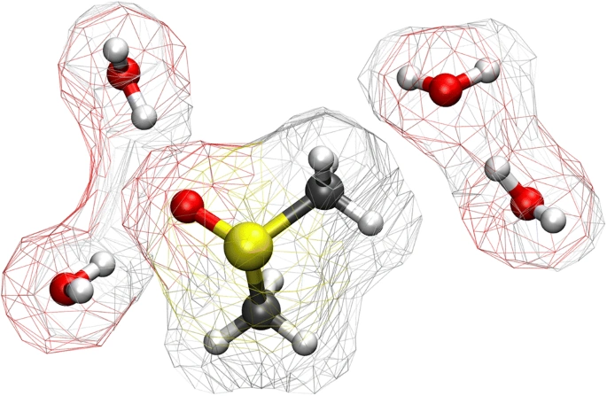

> **系列标签：** `知识文档` · `分子模拟` · `方法地图` · `MolSimulX`

刚接触「分子模拟」时，名字就容易把人绕晕：**分子动力学**（Molecular Dynamics, **MD**）、**蒙特卡洛**（Monte Carlo, **MC**）、**密度泛函理论**（Density Functional Theory, **DFT**）、**第一性原理分子动力学**（ab initio MD / **AIMD**）、**粗粒化**（Coarse-grained / **CG**）、**量子力学/分子力学**（Quantum Mechanics / Molecular Mechanics, **QM/MM**）…… 论文 Methods 里一笔带过，软件手册又默认你已经选对了方法。结果是：能跟着教程跑通一个算例，却说不清自己为什么用这条路、旁边还有哪些路。

本文画一张**分子模拟方法地图**：典型方法在算什么、适合问什么、和本站哪篇文章对接。**不讲**软件命令、力场参数细节或完整 MD 流程——那些分别见后续专文。  

**本站以经典 MD 为主线。** 经典 MD 既**经常单独使用**（溶液结构、扩散、界面、限域等大量课题），也**常常与其他方法耦合**（增强采样、MC、粗粒化、QM/MM、机器学习势等）。本文看完后，请接着读[分子动力学模拟概述](K02-分子动力学模拟概述.md)。

---

## 一、分子模拟在算什么

理查德·费曼曾说：若只能给后人留一句话，最值得留的是**原子假说**——万物由原子组成，原子永不停息地运动，稍远则相吸、挤近则相斥。

分子模拟做的，正是把这幅图像搬进计算机：**用程序里的点（粒子）代表原子或粗粒化单元，按选定的相互作用规则「推」它们运动或抽样构型，再从微观轨迹里读出结构、热力学或动力学量。** 实验室测的是宏观平均；模拟则先把原子假说变成可算的模型，再往回对实验。下文先对齐「化学对象 ↔ 程序里的粒子」怎么叫，再谈选方法时绕不开的三个轴。

化学里你熟悉的是**分子**和**原子**：一滴水里有大量水分子，每个水分子由氧、氢原子组成。程序里通常不说「我移动了第 37 号水分子的氧」，而统称移动了某个**粒子**（particle）。先把对应关系钉死，后面读「粒子」才不会悬空：

| 化学 / 日常说法      | 模拟里常叫什么               | 一句话                                                                                                            |
| -------------- | --------------------- | -------------------------------------------------------------------------------------------------------------- |
| **原子**（C、O、H…） | 一个**粒子**（全原子模型里最常见）   | 有质量、有坐标；经典 MD 里往往还带电荷等参数                                                                                       |
| **分子**（水、蛋白质…） | 若干粒子用**化学键**（或约束）连在一起 | 「一个分子」= 一组有连接关系的粒子，不是单点                                                                                        |
| **粗粒化珠子**      | 也叫粒子 / bead           | 一个珠子可代表一截链、几个原子，甚至一小团溶剂                                                                                        |
| **电子**         | 一般**不**当成牛顿力学里的经典粒子来推 | 经典力场把电子效应写进参数；要显式算电子 → 量子化学 / AIMD。例外：部分**极化力场**用 **Drude** 等附加自由度近似「可动的电荷云」——形式上像多了一个轻粒子，但仍是力场技巧，不是真在解电子薛定谔方程 |

所以后文说的「粒子怎么排、怎么互相推拉」，在全原子 MD 里多半就是**原子怎么排、原子之间怎么作用**；说「分子」时，指的是这些原子按键连成的整体。

对象对齐之后，面对具体课题还要再选路：用多细的模型、怎么采样、要回答哪类问题——这就是**方法怎么匹配问题**。可以把选择压成三个轴（后文表格都按这三轴摆）：

| 轴 | 在问什么 | 例子 |
|----|----------|------|
| **物理层次** | 电子？原子？粗粒珠子？还是连续体？ | DFT vs 全原子 MD vs 粗粒化 vs 连续介质仿真 |
| **采样方式** | 跟时间走，按概率抽构型，还是几乎不采核构型？ | MD 轨迹 · MC / kMC · 静态 DFT（给定/优化构型，不算系综采样） |
| **问题类型** | 结构/热力学，动力学/输运，还是反应/电子结构？ | **径向分布函数**（radial distribution function, RDF）、自由能、扩散、能垒 |

这里的**采样**（sampling），不是问卷抽样，而是：体系可能的微观状态（构型、动量）极多，计算机只能访问其中一部分。MD 沿着时间轨迹「路过」一批状态；MC 按概率规则「抽取」一批构型。采样够不够，直接决定统计量稳不稳、稀有事件看不看得见——后文「采样方式」这一轴，说的就是这件事。

> **Tips：** 没有「万能最好」的方法，只有「对这个问题是否匹配」。本站主线把经典 MD 走深；其他方法在地图上点到，细节进对应专题。

---

## 二、粒子、连续、量子：三条路怎么摆

分子模拟常和工程里的**连续介质仿真**、以及**量子化学计算**放在一起谈，但各自回答的问题不同：

| 路线                        | 在算什么                                   | 适合问什么              | 典型工具感           |
| ------------------------- | -------------------------------------- | ------------------ | --------------- |
| **分子模拟**（MD / MC / AIMD…） | 离散粒子的构型与运动                             | 微观结构、涨落、扩散、吸附、反应机理 | 「原子电影」或「构型抽样」   |
| **连续介质仿真**                | 把材料当成连续体（应力、应变、流场）                     | 大尺度力学、工程结构、宏观流动    | 「整块材料怎么变形 / 流动」 |
| **量子化学计算**                | 给定原子核坐标下的电子结构、能量与力；常做单点、几何优化、反应路径上的若干点 | 能垒、光谱、精确小分子性质      | 「算清这一构型的电子结构」   |

上表三行不是互斥阵营，而是三条常用入口：**分子侧**管离散粒子，**连续侧**管宏观场，**量子侧**管电子结构。入门时先认清自己问的是哪一类问题，再谈怎么衔接。

连续侧名字很多，本站统一这样理解即可——不必当三门课来学：

- **连续介质**：物理图像（不把材料拆成一个个原子，而当成连续场）  
- **有限元**（FEM）等：解连续介质方程的常见数值手段（固体力学里最常见）  
- **计算流体力学**（CFD）：连续介质图像下专门算流体（流动、传热、对流等）的一类仿真  

它们都在「连续」这一格；和 MD 的差别是**描述层次**，不是「谁更高级」。

量子侧也要分清用法：多数入门课题里的「量子化学计算/DFT」是在**给定或优化好的少数核构型**上算电子能量与力——这是电子结构计算，**不是**上一节说的采样。若让原子核在量子力下随时间积分，才进入地图里的 **AIMD**（以及含时电子动力学等更专门的方向）。同一量子根基，两种用法。

名字也容易撞车：本站与量子化学文献里说的 **DFT**，默认指**电子**密度泛函理论（算电子结构）。软物质 / 统计力学里还有**经典 DFT**（classical DFT, cDFT）：不写电子波函数，而用粒子密度场写平衡自由能——更靠近连续 / 场论一侧。二者缩写都叫 DFT，不是同一套方法；后文未特别声明时，DFT = 电子 DFT。

### 1. 谁更「根本」

若**只谈物理根基、暂不考虑算力**：描述物质最底层的是量子力学——电子与原子核如何相互作用。量子化学正是在解（或近似解）这类问题，所以常叫**第一性原理**（ab initio / first-principles）：力与能量尽量从基本物理方程出发，而不是事先拟合一套「推拉规则」。

「最根本」不等于「每个课题都该从这里开跑」。经典力场 MD 可以看成：把量子世界里「有效」的相互作用，压缩成可快速计算的公式——用可承受的代价，换更大体系、更长时间。

### 2. 三者如何耦合

| 关系               | 常见做法                                               |
| ---------------- | -------------------------------------------------- |
| **量子 → 经典 MD**   | 用量子计算标定/训练力场或机器学习（Machine Learning, ML）势，再跑大规模 MD  |
| **量子 + 经典同框**    | [QM-MM思想](K27-QM-MM思想.md)：反应中心用量子，环境用力场            |
| **量子自己也动起来**     | [第一性原理分子动力学与核量子效应](K26-第一性原理分子动力学与核量子效应.md)（AIMD）  |
| **分子 → 连续：参数传递** | 分子模拟给出黏度、扩散系数、模量等，喂给连续介质模型（如 CFD）                  |
| **分子 + 连续：同框分区** | 例如胶体、悬浮液：颗粒（或近场）用分子/粗粒描述，远场溶剂用连续流体；或固–液界面一侧原子、一侧连续 |

同框比「只传一个宏观参数」更紧：两边在空间上同时存在、在边界交换力或通量。本站主线仍落在分子侧；知道连续侧可以接上，判断时就不会非此即彼。

---

## 三、方法地图（总表）

按「常见程度 × 与本站相关度」排列。每行一句话定位；深挖见右侧链接。

| 家族             | 代表方法                                                           | 在算什么                                             | 典型问题                  | 本站去向                                                              |
| -------------- | -------------------------------------------------------------- | ------------------------------------------------ | --------------------- | ----------------------------------------------------------------- |
| **经典 MD**      | 全原子 MD、粗粒化 MD                                                  | 牛顿（或朗之万）方程下的时间演化                                 | 溶液结构、扩散、界面、生物大分子涨落    | → [分子动力学模拟概述](K02-分子动力学模拟概述.md)（本站重点）                             |
| **随机 / 耗散动力学** | **朗之万 / 布朗**、**DPD**、**Stokesian Dynamics** 等；再往上可接 SPH、LB、CFD | 摩擦 + 随机力，或介观/连续介质流；常作**隐式或粗粒化溶剂**，也可在显式 MD 里当热浴  | 胶体、水动力学、粗时间尺度         | → [朗之万、布朗与溶剂介质方法](K25-朗之万布朗与溶剂介质方法.md)                            |
| **蒙特卡洛（MC）**   | Metropolis、**巨正则 MC**（GCMC）、**动能蒙特卡洛**（kinetic MC, **kMC**）等   | 按目标系综接受/拒绝构型；kMC 则按速率抽样**事件序列**（反应、扩散跳跃等）        | 相平衡、吸附等温线；表面反应、缺陷动力学等 | → [分子动力学与蒙特卡洛](K24-分子动力学与蒙特卡洛.md)                                 |
| **增强采样**       | 伞形采样、元动力学等                                                     | 稀有事件与自由能面                                        | 成核、结合、高垒构象转变          | → [增强采样与自由能](K14-增强采样与自由能.md)                                     |
| **非平衡 MD**     | **非平衡分子动力学**（Non-Equilibrium MD, NEMD）等                        | 外场 / 剪切 / 梯度下的响应                                 | 粘度、热导的驱动算法            | → [非平衡分子动力学概述](K22-非平衡分子动力学概述.md)                                 |
| **量子化学**       | DFT、波函数方法等                                                     | 给定构型算电子能量与力（单点、优化、反应路径扫描等；通常**不**跑长核轨迹，**不算**采样） | 反应能垒、光谱、小体系精确结构       | 概念点到；本站不展开软件                                                      |
| **第一性原理 MD**   | AIMD / ab initio MD                                            | 每步用力来自电子结构，积分原子核运动                               | 键断裂、电子重排、有时间的反应路径     | → [第一性原理分子动力学与核量子效应](K26-第一性原理分子动力学与核量子效应.md)                     |
| **多尺度混合**      | QM/MM 等                                                        | 局部量子 + 环境经典                                      | 酶活性中心反应等              | → [QM-MM思想](K27-QM-MM思想.md)                                       |
| **数据驱动**       | ML 势、**图神经网络**（Graph Neural Network, GNN）等                     | 用数据逼近势能或性质                                       | 加速/扩展力场、性质预测          | → [机器学习数据基础](K28-机器学习数据基础.md) · [神经网络与深度学习基础](K29-神经网络与深度学习基础.md) |

同一「经典 MD」家族里，还有分辨率与精度选择：默认全原子见 [经典全原子力场](K03-经典全原子力场.md)；算得快见 [粗粒化与加速模型](K04-粗粒化与加速模型.md)；算得准见 [高精度力场与机器学习势](K05-高精度力场与机器学习势.md)；怎么选见 [力场怎么选](K06-力场怎么选.md)。

### 尺度与成本（直觉）

| | 更贵、更细 | 居中（本站主战场） | 更粗、更长 |
|--|------------|-------------------|------------|
| **层次** | 电子 + 核（AIMD） | 原子 + 力场（经典 MD） | 粗粒珠子 / 隐式溶剂 |
| **时间** | 常为 **皮秒**（picosecond, ps）量级 | **纳秒–微秒**（ns–μs，视体系） | 可更长 |
| **体系** | 很小 | 千–百万原子常见 | 可更大 |

> **Tips：** 入门先把经典 MD 走通。AIMD 很强，但贵几个数量级；多数溶液、材料体相、生物大分子课题，经典力场仍是主力。

---

## 四、经典 MD：本站为什么把它当重点

一句话：

> **给定粒子怎么排、粒子之间怎么推拉（力场），用牛顿定律往前推，得到轨迹，再统计出宏观性质。**

| 你得到什么 | 依赖什么 |
|------------|----------|
| 结构、密度、扩散、界面等 | 力场是否合适、采样是否够 |
| 一条「原子电影」 | 时间步长、积分与热浴/压浴设置 |
| 可与实验对照的统计量 | 后处理与误差估计 |

经典 MD **不**直接算电子：键与电荷规则写在力场里。好处是快、体系可以大；代价是经典力场没覆盖的化学（如断键成键）默认「不会发生」——那时要看反应力场、AIMD 或 QM/MM。

它既是大量课题的**完整方案**（单独跑通即可回答问题），也常是多方法流程里的**底座**（上面挂增强采样、接 ML 势、或与 MC / 连续模型分工）。下一篇 [分子动力学模拟概述](K02-分子动力学模拟概述.md) 把这条主线的名词与流程讲透。

---

## 五、怎么选题（决策表）

| 你的问题更像…            | 优先考虑                                                    |
| ------------------ | ------------------------------------------------------- |
| 溶液结构、扩散、膜涨落、材料体相平衡 | **经典 MD**（本站主线；常可单独完成）                                  |
| 吸附等温线、相共存、粒子数可变    | **MC / GCMC**                                           |
| 表面反应、缺陷跳跃、事件驱动动力学  | **kMC**（常与 MD / 第一性原理速率配合）                              |
| 要断键、电子重排、精确反应路径    | **AIMD** 或 **QM/MM**（或反应力场）；只要平衡几何/能垒可用 DFT             |
| 势垒高、常规轨迹采不到        | **增强采样**（常挂在 MD 上）                                      |
| 只要平衡结构、不要真实时间      | MC 或长时间 MD 均可，看体系与习惯                                    |
| 体系极大、只要介观行为        | **粗粒化** / 布朗动力学等                                        |
| 剪切、热流、电场下的输运       | **NEMD** 或平衡 MD + Green–Kubo（见 [输运系数谱系](K21-输运系数谱系.md)） |
| 用数据加速势能或做构象学习      | **ML 势 / 特征学习**（接 MD 或电子结构数据）                           |

方法可以**组合**：MC 做平衡 + MD 看动力学；QM/MM；ML 势驱动 MD。地图上的格子不是互斥单选题。

---

## 六、小结

1. 分子模拟共享原子（或粗粒）图像；与**连续介质**、**量子化学**分工不同，常通过参数传递或同框分区**耦合**。  
2. 量子化学更「根本」（第一性原理），经典 MD 用可承受代价换尺度；MD **可单独用，也可与别的方法衔接**。  
3. 方法怎么匹配问题：看**层次、采样方式、问题类型**；用总表定位，再进专题。  
4. **本站主线是经典 MD**；随机/耗散动力学多为隐式溶剂或热浴，不是「真空无溶剂」的同义词。  
5. 下一篇把 MD 的流程与核心名词讲透；再进入力场 → 建盒子/算力 → 积分与平衡 → 分析；统计力学加深与其他方法放后面。

---

## 学习路径

**前置阅读：** 无

**下一步：**

- [分子动力学模拟概述](K02-分子动力学模拟概述.md) —— 本站重点：MD 在算什么  
- 力场块（建议）：[经典全原子力场](K03-经典全原子力场.md) → 按需 [粗粒化与加速模型](K04-粗粒化与加速模型.md) / [高精度力场与机器学习势](K05-高精度力场与机器学习势.md) → [力场怎么选](K06-力场怎么选.md)  
- 然后按模拟流程：[边界条件与初始条件](K07-边界条件与初始条件.md) → … → 分析；加深见 [统计力学基础与系综](K23-统计力学基础与系综.md)  
- [分子动力学与蒙特卡洛](K24-分子动力学与蒙特卡洛.md) —— 需要构型采样对照时  
- [第一性原理分子动力学与核量子效应](K26-第一性原理分子动力学与核量子效应.md) / [QM-MM思想](K27-QM-MM思想.md) —— 需要反应与电子结构时  
- [分子模拟工作平台搭建](../01-技术文档/T01-分子模拟工作平台搭建.md) —— 开始动手  
