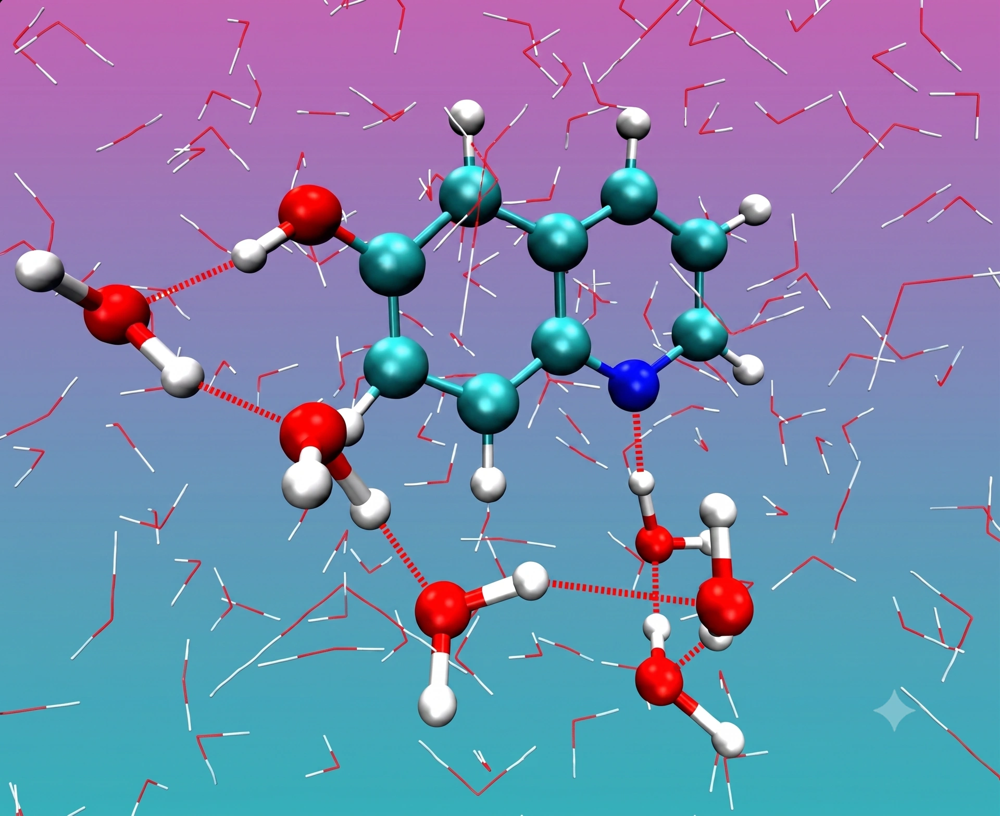

> **系列标签：** `知识文档` · `分子模拟` · `MD入门` · `MolSimulX`

上一篇 [分子模拟方法概述](K01-分子模拟方法概述.md) 画的是方法全景。本篇收窄到**经典分子动力学**（Molecular Dynamics, **MD**）：力场、牛顿积分、系综、周期盒子、轨迹与分析——本站主线从这里展开。

一篇概述只能建立**总图景和名词直觉**，细节会链到后续专题。读完应能说清「MD 在算什么、流程长什么样、结果能信到哪一步」。  

> **定调（很重要）：** 后面文章是为了让你**听得懂、选得对、写得清 Methods**，不是要你把 Ewald、Verlet、热浴推导背下来。日常科研里，这些大多对应软件里的选项与命令；**了解在干什么、有哪些坑**就够用。除非你要**开发**动力学引擎，否则不必自己手写积分器或长程静电代码。  



---

## 一、先建立一张心智图

### 1. 分子、原子，和程序里的「粒子」

经典 MD 算的是真实物质，但输入文件里一行行写的是**粒子**：每个粒子有质量、坐标，积分时还有速度。它和化学课上的词怎么对上？

| 你想模拟的对象  | 在经典 MD 盒子里通常是     | 例子                                           |
| -------- | ----------------- | -------------------------------------------- |
| 一个**原子** | **一个粒子**          | 液氩里每个 Ar；水里的 O、H 各算一个粒子                      |
| 一个**分子** | **多个粒子 + 键/角等连接** | 一个水分子 = 3 个粒子（1 O + 2 H），用键连成「分子」            |
| 粗粒化模型    | 一个粒子代表一截/一团       | 几个 CH₂ 并成一颗珠子（见 [粗粒化与加速模型](K04-粗粒化与加速模型.md)） |

后文说「粒子」，在全原子语境下几乎都可以读成「原子」；说「分子」，指这些原子按拓扑连成的整体。电子一般不单独当经典粒子推——它们的效应写在力场参数里。

### 2. MD 一句话 + 类比

MD 可以压成一句话：

> **给定原子（粒子）怎么排、它们之间怎么互相推拉，用牛顿定律一步步往前推，得到每个原子随时间怎么动；再对这段运动做统计，得到宏观性质。**

| 日常类比 | MD 里对应什么 |
|----------|----------------|
| 一群人在广场上互相推挤、吸引 | 原子在盒子里运动（若干原子还可组成分子一起动） |
| 「谁推谁、推多狠」的规则 | **力场**（势能 → 力） |
| 每隔很短时间拍一张快照 | **时间步**上的积分 |
| 整段录像 | **轨迹**（trajectory） |
| 从录像里数「平均有多挤、扩散多快」 | **后处理 / 分析** |

可以把它想成给原子拍一部「慢动作电影」：实验很难直接看见飞秒尺度上每个原子怎么动；MD 的强项，正是给出这条微观时间线。弱项也很清楚：电影有多真，取决于「推拉规则」（力场）和你拍了多久（采样）。

### 3. 多数时候：平衡态模拟

教程、论文 Methods、以及本站后面绝大部分专文，默认谈的是**平衡态 MD**（equilibrium MD）——不是「体系永远一动不动」，而是：

- **没有**为了测响应而持续施加的驱动（如施加恒定剪切、温度梯度、压力差、电场作为测量手段）；  
- 宏观量（温度、压强、密度、能量……）在**目标条件附近涨落**，长时间平均有稳得住的平台；  
- 你在采的是某个**系综**里的平衡分布（常见 NVT / NPT），好和「300 K、1 bar 下的液体」这类实验语言对齐。

换句话说：粒子一直在抖、在换构型，但统计意义上已经「安顿」在设定的热力学条件下——这才叫平衡态模拟。后面流程里的**平衡化**（equilibration）是另一件事：开跑前丢掉的那段弛豫，用来把体系送到平台附近；**生产段**才在平衡态上采样（见 [能量最小化与预平衡](K12-能量最小化与预平衡.md)、[平衡判据与收敛](K13-平衡判据与收敛.md)）。

**非平衡**则相反：故意加扰动，直接测通量或响应——例如算粘度、热导的驱动算法。地图与概念见 [输运系数谱系](K21-输运系数谱系.md)；专文见 [非平衡分子动力学概述](K22-非平衡分子动力学概述.md)。入门先把平衡态这条常见路径走通；需要驱动测输运时，再进非平衡——主线仍是经典 MD，并不等于「只做平衡」。

---

## 二、后面文章怎么排：按「开跑 → 分析」走

后面文章大致按**一次模拟的真实顺序**往下写，方便对照输入文件与日志，而不是按「数学难度」堆概念：

| 阶段 | 大致对应 | 你要带走的 |
|------|----------|------------|
| **力场** | [经典全原子力场](K03-经典全原子力场.md) → [粗粒化与加速模型](K04-粗粒化与加速模型.md) / [高精度力场与机器学习势](K05-高精度力场与机器学习势.md) → [力场怎么选](K06-力场怎么选.md) | 粒子怎么推拉；默认走全原子，再决定要不要更快/更准 |
| **搭盒子与算力** | [边界条件与初始条件](K07-边界条件与初始条件.md) → [截断长程力与近邻列表](K08-截断长程力与近邻列表.md) | PBC/墙、初态；为何截断、静电为何要长程方法 |
| **往前推时间** | [积分算法与时间步长](K09-积分算法与时间步长.md) → [键长键角约束与刚性](K10-键长键角约束与刚性.md) → [常见系综与控温控压](K11-常见系综与控温控压.md) | 步长、约束、选 NVE/NVT/NPT（热浴/压浴是实现工具） |
| **开跑前后** | [能量最小化与预平衡](K12-能量最小化与预平衡.md) → [平衡判据与收敛](K13-平衡判据与收敛.md)（按需 [增强采样与自由能](K14-增强采样与自由能.md)） | 别一上来就当生产数据；何时算「够了」 |
| **分析** | [轨迹分析与宏观性质](K16-轨迹分析与宏观性质.md) 起 | 从轨迹到 RDF、扩散、误差与尺寸效应 |
| **旁支** | [输运系数谱系](K21-输运系数谱系.md) → [非平衡分子动力学概述](K22-非平衡分子动力学概述.md)；[统计力学基础与系综](K23-统计力学基础与系综.md)；[分子动力学与蒙特卡洛](K24-分子动力学与蒙特卡洛.md)；[朗之万、布朗与溶剂介质方法](K25-朗之万布朗与溶剂介质方法.md)；[第一性原理分子动力学与核量子效应](K26-第一性原理分子动力学与核量子效应.md)；[QM-MM思想](K27-QM-MM思想.md)；[机器学习数据基础](K28-机器学习数据基础.md) / [神经网络与深度学习基础](K29-神经网络与深度学习基础.md) | 多数文从**平衡态**讲起；输运驱动、MC、AIMD、QM/MM、ML 等按需再读 |

**学习深度建议：**

- **目标是「会用」**：知道每个旋钮解决什么问题、默认值大概在哪、错了会怎样；能在 Methods 里写清力场、系综、步长、截断、平衡与生产时长。  
- **不必「会推」**：Ewald 怎么拆短程/长程、Velocity Verlet 为何辛、Nosé–Hoover 怎么推导——有图像即可，细节留给想深挖或写引擎的人。  
- **动手形态**：绝大多数时候是在 GROMACS / LAMMPS / OpenMM 等软件里**改输入、跑命令、看日志**；分析可用现成工具或短脚本。自己从零实现 MD，只有在你要**开发动力学软件 / 新算法**时才有必要。

> **Tips：** 读专题时不妨对照一句：「这对应我输入文件里的哪一行？」对上了，概念就算落地；对不上再翻软件手册，比死记公式有效。

---

## 三、经典 MD：力场驱动的牛顿运动

经典 MD **不**直接算电子：键怎么拉、电荷怎么分布，都事先写进力场的函数和参数里。默认主线是**全原子**（all-atom, **AA**）——见 [经典全原子力场](K03-经典全原子力场.md)。好处是快、体系可以大；代价是——力场没覆盖的化学（比如断键成键），它默认「不会发生」。

| 路线 | 模型 | 典型问题 | 成本 |
|------|------|----------|------|
| **经典力学**（经典力场 MD） | 原子/分子质点 + 力场 | 扩散、相变、流变、大体系平衡结构 | 相对较低 |
| **量子 / 第一性原理 MD** | 电子 + 原子核 | 反应机理、键断裂 | 高，体系小、时间短 |

需要断键、电子重排时，见 [第一性原理分子动力学与核量子效应](K26-第一性原理分子动力学与核量子效应.md)、[QM-MM思想](K27-QM-MM思想.md)；方法怎么选见 [分子模拟方法概述](K01-分子模拟方法概述.md)。

---

## 四、MD 能回答什么、不能回答什么

### 1. 擅长的问题类型

| 类型           | 例子            | 你通常从轨迹里得到什么                                            |
| ------------ | ------------- | ------------------------------------------------------ |
| **结构**       | 溶剂壳层、界面厚度、配位  | **径向分布函数**（radial distribution function, RDF）、密度剖面、配位数 |
| **热力学相关**    | 密度、能量、压强、表面张力 | 时间平均（需足够采样）                                            |
| **动力学 / 输运** | 扩散、粘度、弛豫      | **均方位移**（mean squared displacement, MSD）、相关函数等         |
| **机理线索**     | 结合路径、通道开合     | 可视化 + 序参量随时间变化                                         |

注意：自由能、稀有事件（成核、跨膜）往往**不是**随便跑几十纳秒就能采到的，需要 [增强采样与自由能](K14-增强采样与自由能.md)。

### 2. 优势（相对实验）

- **条件精确可控**：温度、压强、组分可以设得很干净，还能做「理想化」对照（例如关掉某种相互作用看影响）。  
- **直接得到轨迹**：实验很难给出同等时空分辨率的原子电影。  
- **极端条件相对容易**：高温高压、强电场等，在计算机里改参数即可尝试（仍受模型是否适用限制）。

### 3. 局限（入门就要心里有数）

- **时空尺度有限**：全原子常见是纳米–微秒量级；再长、再大就要粗粒化、增强采样或换方法。  
- **很少追求「和实验某一个数严丝合缝」**：更常见、也更有价值的是发现**趋势与机制**——换温度/组分后密度怎么变、哪类相互作用主导分层、扩散是变快还是变慢。绝对数值会受力场系统误差影响；对上实验数量级、对上变化方向，往往比抠到小数点后三位更重要。  
- **结果依赖模型**：换水模型、换力场，密度和扩散都可能变——不是程序「算错了」，是模型不同。

> **注意：** MD 给出的是「在该力场、该条件下的统计结果」，不是上帝视角的绝对真理。写论文时要把模型与设置写清楚，别人才能复现和评判。

---

## 五、核心方程：力从哪来、位置怎么更新

### 1. 牛顿第二定律

对每个粒子 $i$，牛顿第二定律写成：

$$
\mathbf{F}_i = m_i \mathbf{a}_i = -\nabla_i U(\mathbf{r}_1,\ldots,\mathbf{r}_N)
$$

也就是说：

1. 所有粒子的位置决定体系总势能 U（由力场规定）；
2. 势能对某个粒子坐标的「坡度」给出它受力 F（下坡方向）；
3. 力除以质量得到加速度，再更新速度和位置。

**势能 U 可以想成一张高低不平的地面：**

- 两个原子离得太近 → 像撞上硬墙，势能陡升，被猛地弹开；
- 离得远一点、落在「合适距离」 → 像站在浅坑底，比较稳（液体里分子就爱待在这种距离附近）；
- 再拉远 → 吸引力变弱，坑变浅。

力总是把粒子往「下坡、往坑底」推。MD 做的事，就是让成千上万个粒子同时在这张起伏地面上，按牛顿定律一小步一小步往前跑；跑出来的路径连起来，就是轨迹。

### 2. 时间步长 $\Delta t$

计算机不能连续积分，只能「一小步一小步」往前走。这一小步叫**时间步长**。

| 直觉 | 说明 |
|------|------|
| 步子太大 | 粒子一步跨过「坑」直接穿进墙里 → 能量乱飞、体系「爆炸」 |
| 步子太小 | 安全但浪费算力，同样物理时间要算更多步 |
| 全原子常见量级 | **飞秒**（femtosecond, fs）；含快速振动的键往往 0.5–2 fs |

为什么是飞秒？因为最快的运动（如 O–H 伸缩）周期就在这个量级；积分步必须能「看清」最快的运动，否则数值不稳定。用约束把键长冻住后，步长可以放大——见 [键长键角约束与刚性](K10-键长键角约束与刚性.md)、[积分算法与时间步长](K09-积分算法与时间步长.md)。

> **Tips：** 常说的**自由度**，指体系还能独立怎么动的方式有多少种（三维 $N$ 粒子约 $3N$；键长被钉死就少几种）。它既限制 $\Delta t$，也进入温度公式——详见 [键长键角约束与刚性](K10-键长键角约束与刚性.md)。

### 3. 温度从哪来？

在经典 MD 里，**温度主要和动能挂钩**：粒子平均动得越猛，温度越高。瞬时温度会上下抖，长时间平均才有意义。要把温度「按住」在设定值，需要热浴，见 [常见系综与控温控压](K11-常见系综与控温控压.md)。

> **Tips：** 日志里温度「到了 300 K」只说明动能被调到了目标附近，**不**等于结构已经平衡。结构弛豫往往更慢。

---

## 六、热力学、统计力学，和系综

### 1. 微观轨迹怎么变成宏观量？

MD 直接算出来的是每个原子的坐标、速度——这是**微观**。实验和工程关心的往往是温度、压强、密度、自由能差——这是**宏观 / 热力学**量。

中间的桥梁是**统计力学**（statistical mechanics）：在合适的条件下，对微观量做时间平均（或系综平均），就能得到可与热力学对照的宏观量。没有这层「翻译」，轨迹只是一部原子电影，对不上实验室读数。

可以粗记：

| 层次 | 谁在说话 | MD 里常见例子 |
|------|----------|----------------|
| **微观** | 牛顿方程 + 力场 | 某一帧里每个原子的位置、速度 |
| **统计力学** | 平均、涨落、分布 | 长时间平均动能 → 温度；维里 → 压强 |
| **热力学** | 宏观状态与过程 | 「300 K、1 bar 下的密度」这类实验语言 |

所以跑 MD 不只是「把方程积对」，还要问：我采的样本，是否对应我想比的那个热力学条件？细节见 [统计力学基础与系综](K23-统计力学基础与系综.md)。

### 2. 系综：你到底固定了什么

**系综**（ensemble）就是统计力学里的概念：规定哪些宏观量被固定、哪些允许涨落，从而定义「我们在采样哪一类平衡态」。实验说「在 300 K、1 bar 下测密度」——模拟也必须说清同一件事，否则微观平均对不上那个实验条件。

| 系综 | 固定什么 | 像什么 | 典型用途 |
|------|----------|--------|----------|
| **NVE** | 粒子数、体积、总能量 | 理想绝热保温杯 | 检查能量是否守恒、短时动力学 |
| **NVT** | 粒子数、体积、温度 | 恒温槽里的固定盒子 | 升温、平衡化 |
| **NPT** | 粒子数、压强、温度 | 恒温恒压（体积可伸缩） | 液体密度、体相平衡 |
| **μVT** 等 | 化学势、体积、温度 | 可与粒子库交换 | 吸附等（进阶） |

裸积分牛顿方程，天然接近 **NVE**（能量近似守恒）。要 NVT/NPT，必须额外加**热浴 / 压浴**算法——它们不是力场的一部分，而是「把统计力学规定的宏观约束，施加到牛顿积分上」。详见 [常见系综与控温控压](K11-常见系综与控温控压.md)。

**选错系综的典型后果：** 你想和实验比液体密度，却一直固定错误体积跑 NVT——密度被你钉死了，比出来没有意义。要比密度，通常用 **NPT** 让体积自己调到与压强平衡。

### 3. 平衡化 vs 生产段

真实流程很少「从零直接开始统计」：

1. **能量最小化 / 去坏接触**：避免粒子重叠导致第一步爆炸。  
2. **平衡化**（equilibration）：让温度、密度、结构弛豫到平台；这段一般**丢掉不分析**。  
3. **生产段**（production）：只在这段上算 RDF、扩散等——这里的「统计」才是连向宏观量的那一步。  

详见 [能量最小化与预平衡](K12-能量最小化与预平衡.md)、[平衡判据与收敛](K13-平衡判据与收敛.md)。

---

## 七、模拟盒子与周期边界

实验室里的一杯水有 $10^{23}$ 量级分子；计算机里通常只有几千到几百万。要用有限粒子代表「体相液体」，最常用的是**周期性边界条件**（periodic boundary conditions, PBC）：

- 粒子从盒子右边穿出，立刻从左边镜像进来；  
- 算距离时取**最近镜像**（最小镜像约定），避免「隔着盒子量远路」。

可以想成一间屋子六面都是镜子：你看到的是无限重复的拷贝，但真正在算的只有一间屋里的人。

| 概念 | 一句话 |
|------|--------|
| 正交 / 三斜盒子 | 盒子形状；晶体有时需要斜盒子 |
| 最小镜像 | 两粒子距离取最近的那一对镜像 |
| 有限尺寸 | 盒子太小，粒子会「看见自己的镜像」，性质可能偏 |

**PBC 不是万能：** 盒子太小带来的偏差叫 [有限尺寸效应](K18-有限尺寸效应.md)。

另一件入门就要有数的事：**非键相互作用**（non-bonded）——不靠化学键拓扑、只靠距离起作用的那部分力，常见是范德华（Lennard-Jones 等）和静电。全算所有粒子对是 $O(N^2)$，范德华又随距离很快变弱；静电衰减更慢，周期盒子里还要长程方法。所以实务上常对非键做**截断**（远处弱相互作用先不算）并维护**近邻列表**。此处先记住：PBC 解决「盒子太小装不下体相」，截断解决「对太多算不起」。展开见 [截断长程力与近邻列表](K08-截断长程力与近邻列表.md)；力场里怎么写进范德华/静电见 [经典全原子力场](K03-经典全原子力场.md)。

非周期体系（气相团簇、带真空的薄膜）则用墙或真空层，而不是假装无限体相。详见 [边界条件与初始条件](K07-边界条件与初始条件.md)。

---

## 八、一条完整流水线（概念版）

```
① 建结构：放什么分子、盒子多大、初始密度是否合理
② 选力场：相互作用规则 + 拓扑（谁和谁成键）
③ 设条件：系综、T、P、时间步长、总步数
④ 最小化 / 预平衡：去掉坏接触，弛豫到目标态附近
⑤ 生产运行：积分循环，写出 log + 轨迹
⑥ 分析：RDF、MSD、能量平均…… → 图与表
```

上面①–⑥是**课题流程**里的大步骤。进入⑤之后，程序还会在时间上迈成千上万个**积分小步**（每个 $\Delta t$）：每迈一小步都要算力、更新坐标。算力开销里，通常最贵的是**非键力**（范德华、静电）——全算是 $O(N^2)$，所以要用截断和近邻列表。见 [截断长程力与近邻列表](K08-截断长程力与近邻列表.md)。

| 流程步骤 | 关键问题 |
|----------|----------|
| 结构 | 有没有严重重叠？密度是否离谱？ |
| 力场 | 是否匹配体系与文献？水模型是否配套？ |
| 条件 | 系综是否对应你要比的实验条件？ |
| 平衡 | 密度/能量是否平台？相关慢变量稳了吗？ |
| 分析 | 是否只用了生产段？误差怎么估？ |

**输出两类文件（概念上）：**

- **热力学日志**：步数、温度、压强、能量、体积……适合快速看「跑得稳不稳」。  
- **轨迹**：各帧原子坐标（有时还有速度），适合算结构与动力学。  

分析概念见 [轨迹分析与宏观性质](K16-轨迹分析与宏观性质.md)；动手可用 [MDAnalysis轨迹分析入门](../02-实战案例/C02-MDAnalysis轨迹分析入门.md)。

> **Tips：** 上表①–⑥与上文「后面文章怎么排」是同一条路：力场 → 盒子与算力 → 积分/约束/热浴 → 预平衡与收敛 → 分析。软件里通常也是按这个顺序写输入；概念对上命令，比背推导管用。

---

## 九、时间尺度与空间尺度（建立数量级感）

| 尺度 | 典型量级 | 直觉 |
|------|----------|------|
| 时间步长 | 0.5–2 fs | 比化学键振动周期更短一截 |
| 一次「像样」的全原子轨迹 | 纳秒–微秒 | 够看很多局部弛豫；不够看很慢的构象变化 |
| 盒子边长 | 数纳米–数十纳米 | 远小于一滴水，但可代表局部体相 |
| 粒子数 | 10³–10⁷+ | 取决于算力和问题 |

**和日常时间的换算感：** 1 ns = 10⁻⁹ s。全原子跑 100 ns 已经不短，但相对「蛋白质折叠要微秒到更久」仍然可能只是开胃菜。

因此：

- 问局部溶剂结构、短时扩散 → 经典 MD 常够用；  
- 问跨很高势垒的稀有事件 → 要增强采样或换模型；  
- 问很大、很慢的软物质过程 → 考虑粗粒化。

---

## 十、经典 MD 默认了哪些假设？

入门时把这些当成「说明书上的免责声明」：

1. **经典核：** 粒子按牛顿定律走，默认没有核隧穿、电子激发。  
2. **力场形式固定：** 多数经典力场不能随意断键成键；反应要专门模型。  
3. **参数有适用范围：** 力场在训练/拟合域外可能失效。  
4. **采样可能不够：** 短轨迹 ≠ 平衡分布；相关帧很多，有效样本远少于帧数（见 [统计误差与块平均](K17-统计误差与块平均.md)）。

写 Methods 时至少交代：力场模型、系综与热浴/压浴、步长、平衡化与生产时长、盒子大小。审稿人常按这份清单核对。

---

## 十一、和实验怎么对上号？

MD 原始输出是微观量；实验读数往往是宏观或谱学量。中间要做**翻译**：

| 实验侧 | 模拟侧常见做法 |
|--------|----------------|
| X 射线 / 中子散射 | 由轨迹算 g(r)（即 RDF）、结构因子 |
| NMR 扩散 | MSD → 扩散系数 |
| 密度、表面张力 | NPT 平均密度；压强张量积分（见 [温度、压强与表面张力](K19-温度压强与表面张力.md)） |
| IR / Raman | 往往更难，可能需要偶极涨落或量子方法 |

对比时还要对齐：**温度、单位、同位素、力场系统误差**。差一截不一定是「MD 错了」或「实验错了」，更常见是模型与条件不完全可比。入门阶段优先问：趋势一致吗？机制说得通吗？——再谈是否值得为某一个绝对数值去换力场、加长采样。

---

## 十二、和人工智能的关系（先有数）

| 方向 | 一句话 |
|------|--------|
| **分析轨迹** | 用聚类、分类、降维读构象（[机器学习数据基础](K28-机器学习数据基础.md)） |
| **替代力场** | 神经网络势逼近量子精度，仍受训练数据限制 |
| **加速采样** | 研究前沿：用学习方法帮着探索构象 |

MD 负责**产生符合物理的时间序列数据**；AI 帮助**解读**或**改进势能模型**。入门仍建议先把经典 MD 主线走通，再进机器学习和人工智能。

---

## 十三、新手常见误解

| 误解 | 更准确的说法 |
|------|----------------|
| 「温度到了 = 平衡了」 | 温度可被热浴强行拉住；结构可能仍在慢变 |
| 「平衡化跑完 = 永远平衡」 | 平衡化是流程步骤；生产段仍要确认相关量平台（见 [平衡判据与收敛](K13-平衡判据与收敛.md)） |
| 「MD 都是非平衡的，因为粒子在动」 | 粒子在动 ≠ 非平衡态；默认多数课题是**平衡态采样**。持续驱动测响应才进 NEMD（见 [非平衡分子动力学概述](K22-非平衡分子动力学概述.md)） |
| 「帧数很多 = 统计很准」 | 相邻帧高度相关，有效样本少得多 |
| 「PBC 就是无限大」 | 仍有有限尺寸效应 |
| 「换软件结果应完全一样」 | 力场、截断、热浴、随机种子都可能带来差异 |
| 「MD 能直接给出实验自由能」 | 往往需要专门采样与分析方法 |
| 「力场越新越好」 | 关键是是否匹配你的体系与要对比的文献 |
| 「和实验数对不上 = 白做了」 | 更常看趋势与机制；绝对数值受模型限制 |

---

## 十四、小结

1. MD = **力场（怎么推拉）** + **牛顿积分（怎么动）** + **统计（怎么变成宏观量）** → 轨迹与性质。  
2. **本站主线是经典 MD**；多数情况、也从**平衡态**讲起（在设定系综下采平衡分布）。开跑前的平衡化 ≠ 平衡态本身。非平衡 / 驱动测输运见 [输运系数谱系](K21-输运系数谱系.md)、[非平衡分子动力学概述](K22-非平衡分子动力学概述.md)。  
3. **统计力学**是微观轨迹与热力学量之间的桥梁；**系综**规定你在什么宏观条件下采样。  
4. 先问清问题：要结构、密度、扩散，还是稀有事件？再选系综、时长与是否增强采样。  
5. **平衡化丢掉，生产段分析**；温度到了 ≠ 结构好了。  
6. **PBC + 有限盒子** 能代表体相，但要警惕尺寸效应；非键因 $O(N^2)$ 与远距衰减而常**截断**，静电另要长程方法（见 [截断长程力与近邻列表](K08-截断长程力与近邻列表.md)）。  
7. 结果的上限由**模型与采样**决定；入门更重**规律与趋势**，写清 Methods，才能讨论对错。  
8. 后续专题按**开跑流程**展开；目标是**了解与会用软件选项**，不是自己实现 MD 引擎（见上文「后面文章怎么排」）。

---

## 常见问题

**Q：我零基础，读完这篇下一步读什么？**  
A：若还没看过方法全景，可先扫一眼 [分子模拟方法概述](K01-分子模拟方法概述.md)；然后力场 [经典全原子力场](K03-经典全原子力场.md)（按需粗粒化 / 高精度，怎么选看 [力场怎么选](K06-力场怎么选.md)）→ [边界条件与初始条件](K07-边界条件与初始条件.md)；再搭环境 [分子模拟工作平台搭建](../01-技术文档/T01-分子模拟工作平台搭建.md)。统计力学加深见 [统计力学基础与系综](K23-统计力学基础与系综.md)。后面专题**了解即可**，多数对应软件命令，不必自己写积分代码。

**Q：这些概念要推导到什么程度？**  
A：会解释「截断 / 热浴 / 约束在干什么、错了会怎样」就够；公式有图像即可。真正动手是改输入文件、跑软件、看日志。只有开发动力学软件时，才需要自己实现这些算法。

**Q：MD 和蒙特卡洛有什么区别？**  
A：MD 有物理时间、能看动力学；普通蒙特卡洛更侧重按概率采样构型。见 [分子动力学与蒙特卡洛](K24-分子动力学与蒙特卡洛.md)；全景见 [分子模拟方法概述](K01-分子模拟方法概述.md)。

**Q：为什么我的体系总是「爆炸」？**  
A：概念上多半是：重叠太近、步长太大、或力场/单位不一致。先最小化、检查密度与步长，再开热浴。

**Q：要跑多久才够？**  
A：没有万能数字。看与结论相关的量是否平台，并用分段一致性、误差估计判断——见 [平衡判据与收敛](K13-平衡判据与收敛.md)。

---

## 学习路径

**前置阅读：** [分子模拟方法概述](K01-分子模拟方法概述.md)（建议；已熟悉方法版图可跳过）

**下一步：**

按上文「后面文章怎么排」走即可——**先建立名词与流程直觉，再在软件里对上选项**；不必追求推导级掌握。

- [经典全原子力场](K03-经典全原子力场.md) —— 全原子主线（**AA**）  
- 按需：[粗粒化与加速模型](K04-粗粒化与加速模型.md)（算得快）· [高精度力场与机器学习势](K05-高精度力场与机器学习势.md)（算得准）· [力场怎么选](K06-力场怎么选.md)（开关）  
- 模拟流程：[边界条件与初始条件](K07-边界条件与初始条件.md) → [截断长程力与近邻列表](K08-截断长程力与近邻列表.md) → [积分算法与时间步长](K09-积分算法与时间步长.md) → [键长键角约束与刚性](K10-键长键角约束与刚性.md) → [常见系综与控温控压](K11-常见系综与控温控压.md)  
- 加深：[统计力学基础与系综](K23-统计力学基础与系综.md)（可稍后）  
- 输运 / 非平衡（按需）：[输运系数谱系](K21-输运系数谱系.md) → [非平衡分子动力学概述](K22-非平衡分子动力学概述.md)  
- [分子模拟工作平台搭建](../01-技术文档/T01-分子模拟工作平台搭建.md) —— 开始动手环境  
- [机器学习数据基础](K28-机器学习数据基础.md)（若走 MD+ML）
