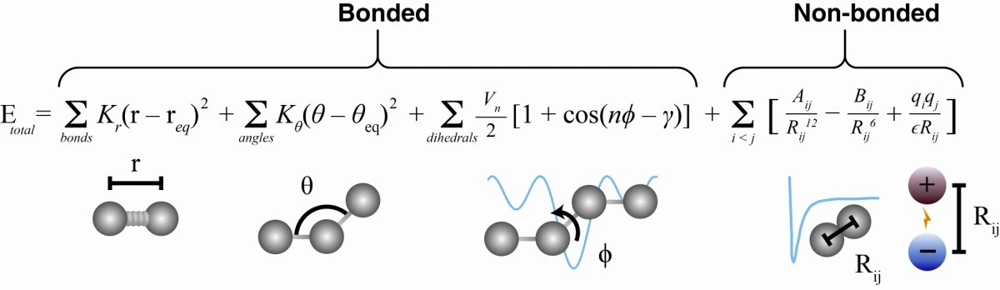
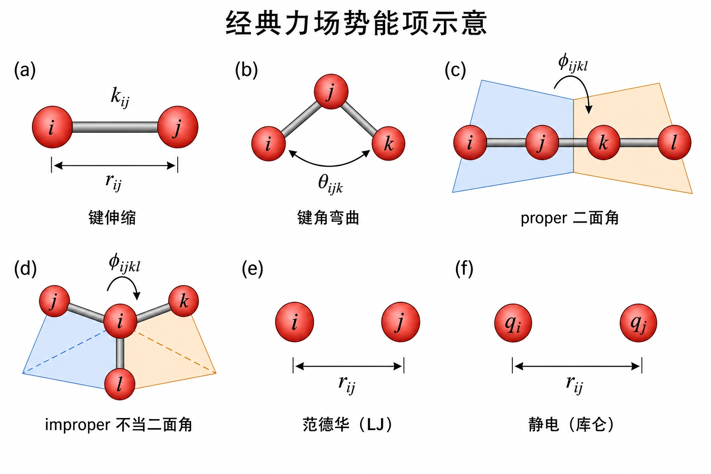

> **系列标签：** `知识文档` · `分子模拟` · `力场` · `MolSimulX`

原子之间「真实的力」来自电子与核的量子力学，极其复杂。经典 MD 却每一步都要一个能算得动的推拉力——于是出现了**力场**（force field）：用一套简化规则，给定原子坐标就给出势能 $U$，再由 $\mathbf{F}=-\nabla U$ 驱动牛顿运动方程积分。

本篇先把「从薛定谔方程一路近似到经典力场」的逻辑讲清，再展开**经典全原子**（all-atom, **AA**）主线：键、角、二面角（含**proper** 和 **improper**），以及非键里的 **Lennard-Jones（LJ）** 与**点电荷静电**。  后文与姊妹篇里说的 **AA**，就是这个意思——相对粗粒化（把多原子并成一珠）而言，**每个原子对应一个粒子**。

力场相关四篇怎么排：

| 篇                                 | 角色                       |
| --------------------------------- | ------------------------ |
| **本篇**                            | 全原子默认主线                  |
| [粗粒化与加速模型](K04-粗粒化与加速模型.md)       | 算得快                      |
| [高精度力场与机器学习势](K05-高精度力场与机器学习势.md) | 算得准                      |
| [力场怎么选](K06-力场怎么选.md)             | 问题驱动开关（先看经验，再决定要不要离开 AA） |



---

## 一、真实的力太复杂：从第一性原理往下退

### 1. 出发点：薛定谔方程

若坚持「第一性原理」、不引入经验参数，微观世界应由**薛定谔方程**（Schrödinger equation）描述：电子与原子核的波函数、能量本征值，原则上决定了结构和相互作用。

麻烦在于：多电子体系的波函数彼此**耦合**——每个电子都受其他电子与核的影响，精确求解的自由度随粒子数爆炸。除了极小体系，**无法直接、精确地解全量子多体问题**来给 MD 提供每一步的力。

### 2. 玻恩–奥本海默近似：先拆开电子与核

电子远轻于原子核，运动快得多。**玻恩–奥本海默近似**（Born–Oppenheimer approximation, BO）据此把问题拆开：

1. **核坐标暂时固定**，先解电子的薛定谔方程，得到该构型下的电子能量；  
2. 电子能量随核坐标变化，构成一张**势能面**（potential energy surface）；  
3. 原子核再在这张面上运动（经典 MD 里进一步用牛顿定律）。

这一步极大简化了问题，但仍留下：每个核构型都要做一次昂贵的电子结构计算（这就是 AIMD 的思路，见 [第一性原理分子动力学与核量子效应](K26-第一性原理分子动力学与核量子效应.md)）。大体系、长时间仍然吃不消。

### 3. 两体可加近似：用「一对一对加起来」代替完整多体势能面

即便有了 BO 势能面，真实的电子能量一般是**多体**的：三个、四个原子凑在一起的能量，并不等于把所有原子对的能量简单相加。

经典力场再往下退一步，常采用**两体可加近似**（pairwise additivity，也称对势可加 / 两体叠加）：把总势能写成许多**原子对**贡献之和（再补上键、角、二面角等「化学键拓扑」项，用来管住分子形状）。也就是说：

> **不再每步解电子方程，而是假定：有效相互作用 ≈ 预先定好的成对公式（+ 少量成键项）加总。**

多体效应、电子云随环境变形（极化）等，要么被**平均进参数**里，要么干脆丢掉——这正是经典力场快的原因，也是它在金属、强极化、反应等问题上不够用的原因（升级路线见 [高精度力场与机器学习势](K05-高精度力场与机器学习势.md)）。

### 4. 落到经典力场：经验函数 + 参数表

再假定原子核按**经典力学**运动（忽略核量子效应），就得到日常说的经典 MD 力场：

| 层次 | 在做什么 | 代价 |
|------|----------|------|
| 全量子多体 | 耦合波函数，原则上最根本 | 几乎算不动 |
| BO 近似 | 电子与核分离 → 势能面 | 每构型仍要电子结构 |
| 两体可加 + 经验形式 | LJ、点电荷、谐振子键… | 快；精度与可转移性靠参数 |
| 经典力场 MD | $U(\mathbf{r})\rightarrow\mathbf{F}\rightarrow$ 积分轨迹 | 本站主线 |

```
初始结构 + 力场（函数形式 + 参数）
        ↓  每一积分小步：算 U(r)、F = -∇U
    牛顿运动方程积分
        ↓
      轨迹 → 再统计成宏观量
```

### 5. 力场给出的力，多半是「保守力」

$\mathbf{F}=-\nabla U$ 不只是写法习惯：它意味着力来自一张只依赖**坐标**的势能面——力学里叫**保守力**（conservative force）。直观后果有两条：

1. **绕一圈做功为零**：粒子沿任意闭合路径走一圈，保守力做的净功是 0（力「有势」）。  
2. **和能量守恒对得上**：只有保守力时，动能 $K$ 与势能 $U$ 可以互换，但总和 $E=K+U$ 在理想积分下应近似不变——这正是 **NVE**（微正则）里「保温杯」图像的物理根基，见 [常见系综与控温控压](K11-常见系综与控温控压.md)。

本篇后面的键 / 角 / 二面角 / LJ / 库仑，都是先写 $U$，再取负梯度得力，因此默认都是保守力。一旦方程里再出现**摩擦力、随机力**（如朗之万热浴），它们一般**不是**某个 $U$ 的梯度——机械能不再守恒，正是为了把温度按住或代表隐式溶剂；延伸见 [朗之万、布朗与溶剂介质方法](K25-朗之万布朗与溶剂介质方法.md)。

经典全原子（**AA**）力场默认：

- 粒子是**原子**，分子 = 若干原子用键连起来；  
- **拓扑固定**：多数情况下不能随意断键成键；  
- **电子不显式出现**，其效应写进电荷、LJ、键参数等。

---

## 二、势能由哪些项组成？

经典**分子力学**力场常写成：

$$
U_{\mathrm{total}} = U_{\mathrm{bond}} + U_{\mathrm{angle}} + U_{\mathrm{dihedral}} + U_{\mathrm{improper}} + U_{\mathrm{nonbond}}
$$

其中非键再拆成范德华与静电：$U_{\mathrm{nonbond}} = U_{\mathrm{vdW}} + U_{\mathrm{elec}}$。下图把六项几何意义画在一起（成键四项 + 非键两项）：



| 图中      | 对应项                   | 在管什么                          |
| ------- | --------------------- | ----------------------------- |
| **(a)** | 键伸缩 (bond)            | 两原子距离 $r_{ij}$；刚度常记为 $k_{ij}$ |
| **(b)** | 键角弯曲 (angle)          | 三角 $\theta_{ijk}$             |
| **(c)** | proper 二面角 (dihedral) | 绕中心键的扭转角 $\phi_{ijkl}$（两平面夹角） |
| **(d)** | improper 不当二面角        | 中心原子连出三枝时的平面性 / 手性            |
| **(e)** | 范德华（LJ）               | 无化学键相连的两原子，距离 $r_{ij}$        |
| **(f)** | 静电（库仑/coul）           | 点电荷 $q_i,q_j$ 之间的作用           |

| 项 | 物理含义 | 典型形式 |
|----|----------|----------|
| **键伸缩** | 共价键长度偏离平衡值 | 谐振子（有时 Morse） |
| **键角弯曲** | 键角偏离 | 谐振子 |
| **二面角 / 扭转**（proper） | 绕单键旋转，决定构象偏好 | 余弦级数 |
| **不当二面角**（improper） | 维持平面性或手性中心构型 | 谐振子或余弦；定义方式因力场而异 |
| **非键** | 范德华 + 静电 | 通常 **LJ + 库仑**（两体可加的主战场） |

**proper 与 improper 别混：**

| | **Proper 二面角** | **Improper（不当二面角）** |
|--|-------------------|---------------------------|
| 在管什么 | 沿可旋转键的扭转（旁式/重叠式等） | 四个原子是否共面、手性是否翻错 |
| 典型例子 | 烷烃 C–C 旋转、肽键 ω 角 | 苯环/肽键平面；防止芳香碳「翘出平面」 |
| 为何单独列 | 构象采样的主自由度之一 | 拓扑上往往不是「绕一根单键转」，却仍要一项势能钉住几何 |
| 图中 | **(c)** 一条链上的两平面 | **(d)** 中心原子三向伸出 |

不同力场族对 improper 的原子顺序与函数形式规定不同（CHARMM、AMBER、OPLS 等写法有别），参数不能跨族混用。

### 1. 典型成键项（示意式）

下面写出的是**最常见的示意形式**，方便认符号；**不是**全场统一的「标准方程」。不同力场族可以换函数（键用 Morse 而非谐振子、二面角项数与相位不同、improper 定义方式不同等），系数与平衡值更是各表各的——以所用力场文档为准。非键同理：下一节的 LJ 12-6、点电荷库仑也只是经典全原子里最常见的一对，并非唯一写法。

**键伸缩（谐振子，对应图 a）：**

$$
U_{\mathrm{bond}}(r_{ij}) = \frac{1}{2} k_{ij}\,(r_{ij} - r_{ij}^{(0)})^2
$$

**键角（谐振子，对应图 b）：**

$$
U_{\mathrm{angle}}(\theta_{ijk}) = \frac{1}{2} k_{\theta}\,(\theta_{ijk} - \theta_{ijk}^{(0)})^2
$$

**Proper 二面角（余弦级数，对应图 c；具体项数因力场而异）：**

$$
U_{\mathrm{dihedral}}(\phi) = \sum_{n} \frac{V_n}{2}\bigl[1 + \cos(n\phi - \gamma)\bigr]
$$

**Improper** 常用谐振子钉在目标二面角附近（对应图 d），或也用余弦形式——仍以所用力场为准。

键、角、二面角（含 improper）管「分子形状别散架、构象怎么转、平面/手性别塌」。

### 2. Lennard-Jones（范德华，对应图 e）

非键管「分子之间、以及不相邻原子之间」怎么吸引或排斥。范德华一项最常用 **LJ 12-6**（也有 Buckingham、LJ 9-6 等变体，本篇以 12-6 为主）：

$$
U_{\mathrm{LJ}}(r) = 4\epsilon \left[ \left(\frac{\sigma}{r}\right)^{12} - \left(\frac{\sigma}{r}\right)^{6} \right]
$$

| 符号 | 直觉 |
|------|------|
| $\sigma$ | 距离尺度（「多近开始硬碰硬」） |
| $\epsilon$ | 阱深（吸引有多强） |
| $r^{-12}$ | 短程排斥 |
| $r^{-6}$ | 较长程的吸引 |

简单流体（如液氩）可以整杯都是同一种 LJ 粒子；生物/有机力场里则按**原子类型**给不同 $\sigma,\epsilon$。公式写到 $r\to\infty$，实践中几乎总会**截断**——为何截断、截多长，见下文 §4。

### 3. 静电（点电荷，对应图 f）

经典全原子力场最常见的是：每个原子带一个**固定点电荷** $q_i$，两两之间库仑相互作用（极化、高斯电荷等不在本篇主线）：

$$
U_{\mathrm{elec}}(r_{ij}) = \frac{1}{4\pi\varepsilon_0}\frac{q_i q_j}{r_{ij}}
$$

>  **Tips：** 模拟软件里常把 $1/(4\pi\varepsilon_0)$ 折进单位制；有的力场还乘相对介电常数 $\varepsilon_r$。

氢键、盐桥、极性溶剂行为，很大程度上靠这套静电撑起来。周期盒子里的长程求和与截断策略见下文 §4 与 [截断长程力与近邻列表](K08-截断长程力与近邻列表.md)。

### 4. 截断与混合规则

**为什么非键要截断？** 全算所有粒子对是 $O(N^2)$，大体系跑不动；LJ 远距又很弱。实践中只算截断半径内（再配尾部校正等）——**截断长度与平滑方式是力场配套的一部分**，乱改等于改有效势。静电更慢衰减，周期体系常要 Ewald/PPPM。概念与取舍见 [截断长程力与近邻列表](K08-截断长程力与近邻列表.md)；本篇只要记住：力场文档里的截断/混合规则必须成套遵守。

实践要点：

- 非键常设 **cutoff**（全原子常见约 1.0–1.2 nm 量级，以力场文档为准）。  
- 异种原子 LJ 参数常用 **Lorentz–Berthelot** 等**混合规则**；必须与力场文档一致。

### 5. 分子内排除与 1–4 缩放

键、角、二面角已经描述了近邻原子的相互作用。若再对同一对原子完整加上 LJ + 库仑，就会**重复计算**。因此力场规定：某些拓扑近邻之间的非键项要**排除**或**缩放**——这是力场不可分割的一部分，不是可选项。

以共价拓扑为准（不是空间距离）：

| 称呼 | 含义 | 非键通常怎么处理 |
|------|------|------------------|
| **1–2** | 直接成键 | **完全排除**非键 |
| **1–3** | 隔一个原子（键角两端） | **完全排除**非键 |
| **1–4** | 隔两个原子（二面角两端） | **部分缩放**或特殊处理（因力场而异） |
| 更远 | 非键完整计算 | LJ + 静电（再加截断/长程） |

二面角项已经在描述 1–4 原子的扭转；非键再叠加多少，由该力场在拟合时约定。不同力场族对 1–4 的 **LJ 缩放、静电缩放** 不同（有的缩放，有的用特殊 1–4 参数），因此：

- **不能**把 A 力场的电荷接到 B 力场的 LJ / 1–4 规则上「拼一套」  
- 复现文献必须写清力场版本与 1–4 约定  
- 自己改拓扑（加键、删键）会改变排除列表，等于改模型  

排除发生在**配对列表构建**阶段：被排除的对根本不进入非键求和。截断、Ewald/PPPM 只作用于「允许计算非键」的原子对（见 [截断长程力与近邻列表](K08-截断长程力与近邻列表.md)）。

> **注意：** 「看起来都是全原子」不等于可混用。排除与缩放不一致是静默错误——轨迹能跑，性质系统性偏。

截断、混合规则或排除规则与力场不配套，轻则性质偏，重则能量乱飘。

---

## 三、常见经典力场族（全原子）

这里只列**固定拓扑、LJ + 点电荷**这一档的常用名字；不展开「怎么选」（见 [力场怎么选](K06-力场怎么选.md)）。

| 力场 / 模型 | 典型体系 | 备注 |
|-------------|----------|------|
| **LJ 流体** | 氩、教学体系 | 方法验证、对比单位（见 [对比单位与无量纲化](K15-对比单位与无量纲化.md)） |
| **AMBER** 族 | 蛋白、核酸、配体 | 常与特定水模型联用；小分子有 GAFF 等 |
| **CHARMM** 族 | 生物、脂质、小分子 | CGenFF 等 |
| **OPLS-AA** | 有机液体、小分子 | 液相性质拟合传统强 |
| **COMPASS、PCFF** 等 | 聚合物、材料 | 工业材料方向常见 |
| **通用力场**（UFF、DREIDING 等） | 覆盖面广 | 方便起步，关键体系仍要验证 |

> **Tips：** 「力场族」= 函数形式 + 一整套原子类型与参数 +（往往）推荐的水模型与排除规则。换族不等于只换几个 $\epsilon$。

---

## 四、经典水模型（全原子）

水是溶液与生物模拟的默认溶剂。常见**显式全原子水模型**用少数位点 + 固定几何 + LJ/电荷参数。同一「家族」里还有不少**衍生版本**（改电荷、改 LJ、专为冰/界面拟合等），写 Methods 时要写全名字，不能只写「TIP4P」了事。

| 模型              | 位点  | 粗印象                                           |
| --------------- | --- | --------------------------------------------- |
| **TIP3P**       | 3   | 生物模拟里极常见，常与 AMBER 等配套                         |
| **SPC / SPC/E** | 3   | 密度、扩散等与 TIP3P 表现不同；SPC/E 多了自能修正               |
| **TIP4P** 族     | 4   | 负电荷放在氧外的虚位点上；有 TIP4P、TIP4P/2005、TIP4P/Ice 等分支 |
| **TIP5P**       | 5   | 两个孤对方向也放位点，几何更「像」水，计算更贵                       |

> **Tips：** 溶质力场往往在拟合时**假定**某种水模型；改水不改溶质，性质可能系统性偏差。

更粗、更快的水（如 **mW**）不属于本篇的全原子经典力场，见 [粗粒化与加速模型](K04-粗粒化与加速模型.md)。

---

## 五、参数从哪里来？

| 来源 | 说明 |
|------|------|
| 量子化学 / DFT 拟合 | 键、角、部分电荷等 |
| 实验物性 | 密度、蒸发热、晶体结构等 |
| 力场库与工具 | CGenFF、Antechamber 等（操作属技术/实战栏目） |

经典力场追求**可转移性**：同一套参数希望能用到一类分子上。离开拟合域（新官能团、极端温压、反应）就要怀疑、验证，或升级到 [高精度力场与机器学习势](K05-高精度力场与机器学习势.md) / 量子方法。

---

## 六、本篇边界（固定拓扑之外）

下列**不是**本篇主角，但入门要知道名字：

| 方向 | 一句话 | 去哪 |
|------|--------|------|
| 反应力场（如 ReaxFF） | 允许键级变化、断键成键 | 概念上偏「能力扩展」；怎么选时见 [力场怎么选](K06-力场怎么选.md) |
| 极化 / 多体 / ML 势 | 更贵、往往更准 | [高精度力场与机器学习势](K05-高精度力场与机器学习势.md) |
| 联合原子、Martini、DPD、mW | 更少粒子、更大尺度 | [粗粒化与加速模型](K04-粗粒化与加速模型.md) |

---

## 七、小结

1. 真实相互作用来自量子多体；薛定谔方程原则上根本，但波函数耦合，算不动。  
2. **玻恩–奥本海默近似**拆开电子与核，得到势能面；**两体可加近似**再把面压成成对公式之和。  
3. $\mathbf{F}=-\nabla U$ ⇒ 力场力默认是**保守力**，与 **NVE 能量守恒**同一套逻辑；摩擦 / 随机力则否（系综热浴、朗之万）。  
4. 经典全原子（**AA**）力场 = **键/角/二面角（proper + improper）** + **LJ + 点电荷**，电子效应进参数，驱动 MD 积分。  
5. 力场族、水模型、**排除与 1–4 缩放**、混合规则是一套的，不要随意拆开混用。  
6. 多体/极化/反应不够用时，升级见姊妹篇，不要假装 LJ 万能。

---

## 学习路径

**前置阅读：** [分子动力学模拟概述](K02-分子动力学模拟概述.md)

**下一步：**

- [粗粒化与加速模型](K04-粗粒化与加速模型.md) —— 算得快  
- [高精度力场与机器学习势](K05-高精度力场与机器学习势.md) —— 算得准  
- [力场怎么选](K06-力场怎么选.md) —— 按问题怎么选  
- [常见系综与控温控压](K11-常见系综与控温控压.md) —— NVE 能量守恒与热浴（接「保守力」）  
- [朗之万、布朗与溶剂介质方法](K25-朗之万布朗与溶剂介质方法.md) —— 非保守的摩擦 / 随机力  
- 然后进入模拟流程：[边界条件与初始条件](K07-边界条件与初始条件.md)  
