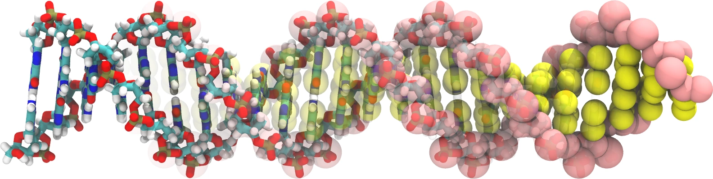

> **系列标签：** `知识文档` · `分子模拟` · `粗粒化` · `MolSimulX`

[经典全原子力场](K03-经典全原子力场.md)把每个原子都摆进盒子里，细节多，但体系一大、时间一长就贵。若你关心的是**更大尺度、更长时间**上的组装、相分离、软物质动力学——例如膜怎么成囊泡、聚合物怎么分相——往往要换「更少的粒子、更粗的相互作用」：用**分辨率换算力**。

本文是力场块里「**算得快**」的一侧：联合原子（UA）、Martini 等粗粒化、DPD，以及粗粒水 **mW** 等。动力学为何常被加速、平衡 vs 流变、无量纲数，见姊妹篇 [粗粒化动力学加速与耗散](K30-粗粒化动力学加速与耗散.md)。

往更准走见 [高精度力场与机器学习势](K05-高精度力场与机器学习势.md)；怎么选（含经验优先）见 [力场怎么选](K06-力场怎么选.md)。

---

[erphpdown]

## 一、在换什么？

| | 全原子（AA） | 加速 / 粗粒一侧 |
|--|--------------|-----------------|
| **粒子** | 每个原子一个（或几乎每个） | 多个原子并成一珠，或隐去溶剂细节 |
| **得到** | 氢键取向、局部化学细节 | 更大盒子、更长轨迹、介观行为 |
| **丢掉** | — | 部分化学特异性、短程结构细节 |
| **力场形式** | 键/角/二面角 + LJ + 电荷 | 仍可能像经典力场，也可能是专用势 / 耗散力 |

粗粒化不是「算错了」，而是**故意少算一些自由度**。代价是：你不能再问那些已被抹掉的问题（例如某个氢键的精确取向），却可以问膜怎么自组装、两相怎么分。

**为什么会快？** 不只是「粒子变少」这一条：

1. **非键对数下降**——粒子数 $N$ 一降，最贵的非键项跟着降（见 [截断长程力与近邻列表](K08-截断长程力与近邻列表.md)）。  
2. **势能面更平滑**——抹掉快振动自由度后，有效相互作用往往更「软」，有时还能用更大时间步长。  
3. **动力学常被加速**——粗粒轨迹里扩散、组装往往比真实时间尺度「跑得更快」；比相对快慢可以，**绝对速率**要谨慎解读。为何偏快、对找平衡态为何常有利、对流变等非平衡为何要加耗散、无量纲数为何要紧，见 [粗粒化动力学加速与耗散](K30-粗粒化动力学加速与耗散.md)。

> **Tips：** 写论文时把「粗粒化」说成加速可以，但 Methods 里要写清：映射规则、力场版本、时间步、是否另加耗散 / 时间标定，以及你声称的观测量在粗粒分辨率下是否仍定义良好。报扩散、粘度或剪切响应时，尤忌默认「CG 的 ns = 实验 ns」。

---

## 二、联合原子（United-Atom, UA）

| 做法        | 把非极性氢与所连碳等合并成一个**超原子**（如 CH₂、CH₃ 各为一个珠子/粒子） |
| --------- | ------------------------------------------- |
| **还保留什么** | 重原子骨架；多数键/角/二面角/非键形式仍接近经典力场                 |
| **快在哪**   | 粒子数下降（烷烃尤其明显），非键对数下降；快振动氢少了，步长有时也能略放宽       |
| **典型场景**  | 烷烃、部分脂质/聚合物；老文献与部分工业力场里很常见                  |
| **注意**    | 参数集与全原子不通用；氢键供体/受体若被并掉，极性行为会变               |

可以把 UA 想成「全原子往粗粒走的第一级台阶」：还没到 Martini 那么粗，但已经明显加速。

**力场形式可以很像经典全原子。** 合并之后，盒子里的「粒子」不再一一对应真实原子，但势能往往仍是：

$$
U \approx U_{\mathrm{bond}} + U_{\mathrm{angle}} + U_{\mathrm{dihedral}} + U_{\mathrm{LJ}} + U_{\mathrm{elec}}
$$

只是作用在**联合原子**上，参数另表（如某些 GROMOS、TraPPE-UA 等）。读输入文件时别被「看起来还是 LJ + 电荷」骗过：原子类型、排除规则、平衡键长都是 UA 自己的一套，**不能**拿全原子参数直接套——这也是「AA / UA / Martini 不要 DIY 混」的同一条道理（见[全原子与粗粒化能不能混用](K31-全原子与粗粒化能不能混用.md)）。

> **Tips：** UA 适合「化学还要认官能团，但非极性氢太贵」的中间地带。若问题已经是膜组装、大软物质，通常会再往 Martini 级走。

---

## 三、Martini 等粗粒化力场

### 1. 在做什么

| 做法     | 大约 2–4 个重原子（及所带 H）映射成一颗 **Martini 珠子**；珠–珠用专用参数 |
| ------ | ----------------------------------------------- |
| **强项** | 生物膜、囊泡、软物质、大尺度相行为；社区参数与教程多                      |
| **弱项** | 丢失原子级氢键几何；某些堆积、孔道、特异性结合要谨慎解读                    |
| **版本** | Martini 2 / 3 等规则与参数有别，复现文献要对齐版本                |

直觉上：把「几个原子的一团」当成一个有效粒子，用更少的珠去再现**有效相互作用**（亲疏水、电荷珠、部分堆积偏好），而不是再现每个氢键的指向。

### 2. 和 UA / 全原子差在哪

| | UA | Martini 级 CG |
|--|-----|----------------|
| 映射粗细 | 主要并非极性 H | 常 2–4 个重原子 → 1 珠 |
| 力场长相 | 很像经典 AA | 专用珠类型与参数；键合项也常简化 |
| 化学分辨率 | 仍接近原子级官能团 | 官能团被「涂成」珠的极性类别 |
| 典型问题 | 液体物性、中等体系动力学 | 膜形态、相分离、大组装 |

> **Tips：** 粗粒化轨迹很好看，不代表可以自动回答全原子才能回答的问题。先写清「我关心的观测量在粗粒分辨率下是否还定义良好」。

### 3. 使用时心里要有数的几件事

- **映射不是唯一的**：同一分子可有不同珠划分；换映射 ≈ 换模型。  
- **蛋白等大分子**常配合弹性网络等，防止二级结构在粗粒势下塌掉——这是模型的一部分，不是「额外美化」。  
- **从 CG 回到全原子**（backmapping）可以做，但得到的是**一种合理的原子构型猜测**，不是唯一真值；精细自由能仍要在 AA（或更准）上验证。  
- **Martini 2 与 3** 珠定义、相互作用、水模型习惯都有差别——引用与复现必须写版本。  
- **水珠**：标准设定里水也是粗粒珠、非键以有效 LJ（及电荷）为主，没有三点 O–H；另有极化等变体。细节对照见第五节。

同类思想还有其他 CG 力场族（不同映射与参数哲学）；入门先抓住「多对一映射 + 专用珠参数」即可。怎么选总表见 [力场怎么选](K06-力场怎么选.md)。

---

## 四、DPD 等介观方法

**耗散粒子动力学**（Dissipative Particle Dynamics, **DPD**）把一团原子/流体元看成软粒子，相互作用含**保守力、耗散力与随机力**，适合**介观**流动、相分离、聚合物溶液等。

| | 直觉 |
|--|------|
| **粒子** | 比 Martini 往往更「流体团」化 |
| **势** | 常用**软排斥**（粒子可一定程度重叠），没有 LJ 那种硬核 |
| **时间 / 长度** | 可到更大介观尺度 |
| **化学细节** | 更粗；参数常针对有效排斥与相容性（谁和谁混、谁分相） |

为什么要「软」？介观粒子代表的是一团分子，硬核碰撞图景不再合适；软势让时间步可以更大，也更像有效流体元之间的相互作用。耗散 + 随机项则用来维持温度、并带上一点流体力学阻尼的味道——这也是粗粒化后「把摩擦加回去」的一条常见路（见 [粗粒化动力学加速与耗散](K30-粗粒化动力学加速与耗散.md)）。

DPD 与 [朗之万、布朗与溶剂介质方法](K25-朗之万布朗与溶剂介质方法.md) 都带耗散/随机，但问题设定不同：

| | DPD | 朗之万 / 布朗 |
|--|-----|----------------|
| 常见图景 | 显式介观粒子「流体」 | 溶质 + **隐式**溶剂摩擦 |
| 溶剂 | 往往也用 DPD 粒子表示 | 溶剂自由度被抹成摩擦/噪声 |
| 适合 | 相分离、聚合物溶液、介观流 | 过度阻尼运动、隐式溶剂采样 |

怎么选见 [力场怎么选](K06-力场怎么选.md)。耗散项怎么进方程、和热浴的边界，见 [朗之万、布朗与溶剂介质方法](K25-朗之万布朗与溶剂介质方法.md)。

> **Tips：** DPD 的「软 + 耗散 + 随机」是成套设定；不要只把 Martini 珠换成软势、却丢掉耗散/随机，或反过来把 DPD 耗散当成可以随便接到任意 AA 拓扑上的插件。

---

## 五、粗粒水：以 mW 为例

全原子水（TIP3P、SPC/E…）一个分子至少 3 个粒子，溶剂往往占盒子里大半算力。若你**不需要**显式氢键几何，只需要水的部分热力学/结构物性，可用更粗的水模型。

**mW**（monoatomic water）等把一个水分子收成**更少位点**（乃至单原子样），用短程多体型相互作用再现水的部分相行为与结构（例如偏向四面体配位的有效描述），比三点全原子水**便宜得多**。

| 还适合问 | 不太适合问 |
|----------|------------|
| 密度、部分相图/冰相关、较大体系里的溶剂背景 | 依赖显式 O–H 取向、精细氢键网络的光谱与机制 |

「水」还可以更极端：LJ 溶剂、纯隐式溶剂（摩擦 + 随机力）——那是把溶剂几乎完全背景化。整条「水的梯子」（隐式 → 极简显式 → mW → TIP/SPC → 极化 → 量子）见 [力场怎么选](K06-力场怎么选.md)。

**和 Martini 水怎么对照？** Martini 标准水往往是**若干重原子当量并成的珠**，珠–珠非键以有效 LJ（及电荷珠）为主，并**不**保留三点水的 O–H 几何——直觉上更接近「显式但很粗的 LJ 型溶剂珠」，而不是 TIP3P 那种分子水。社区里还有带一点极化 / 多珠等变体，用来补标准珠水偏弱的介电或氢键味道；选哪一种，仍要跟溶质珠参数、文献版本成套。mW 则是另一条路：单位点 + 短程多体，专攻水的部分相行为，不一定接到 Martini 拓扑上。

> **Tips：** 溶质若按全原子力场参数化，却配上粗粒水（或 Martini 珠水），等于换了一套溶剂环境——除非文献或你自己验证过配套，否则别默认「能混」（边界见 [全原子与粗粒化能不能混用](K31-全原子与粗粒化能不能混用.md)）。Methods 写清：水模型名称与版本（如 Martini 标准水 / PW / mW）。

---

## 六、尺度与成本（加速侧）

| | 全原子 | UA | Martini 级 CG | DPD / 更粗 |
|--|--------|-----|---------------|------------|
| 粒子密度 | 高 | 中 | 较低 | 更低 |
| 可及时间 | ns–μs 常见 | 往往更长 | 更长 | 介观更长 |
| 化学分辨率 | 高 | 中高 | 中 | 低 |
| 力场长相 | 经典 AA | **仍很像经典 AA** | 专用珠势 | 软势 + 耗散/随机 |

经验口诀：**每粗一级，先问「我的结论还依赖被删掉的细节吗？」** 依赖就别粗；不依赖再享受速度。

常见工作流（选型与「何时该粗」见 [力场怎么选](K06-力场怎么选.md)）：

1. 用粗模型把大尺度过程**跑通、看趋势**；  
2. 对关键构型或自由能，再用全原子（或更准）模型**校准 / 验证**；  
3. 或反过来：用精细计算给粗模型**拟合有效参数**。  

这不是偷懒，而是多尺度里很常见的「粗扫 + 细校」。注意：这里是**先后**换模型，不是同一盒子里把 AA 与 CG 粒子硬拼——后者默认不行，见 [全原子与粗粒化能不能混用](K31-全原子与粗粒化能不能混用.md)。

---

## 七、常见误区

| 误区                         | 更稳妥的理解                                                                |
| -------------------------- | --------------------------------------------------------------------- |
| 「CG 轨迹好看 = 原子机制也清楚了」       | 只能回答粗粒分辨率下仍存在的问题                                                      |
| 「UA / Martini 参数可以和 AA 混搭」 | 各成套；混用等于另造力场（专文见 [全原子与粗粒化能不能混用](K31-全原子与粗粒化能不能混用.md)）                 |
| 「CG 的 ns 等于真实 ns」          | 动力学常被加速；比相对快慢，慎报绝对速率；流变还要对齐无量纲数（详见 [粗粒化动力学加速与耗散](K30-粗粒化动力学加速与耗散.md)） |
| 「DPD 就是另一种 Martini」        | 问题设定与力的形式都不同（软势 + 耗散/随机）                                              |
| 「Martini 水 = TIP 水换皮」      | 多为粗粒 LJ 型溶剂珠，无三点氢键几何；还有极化等变体，须成套选用                                    |
| 「粗完就不用写映射」                 | 映射与版本是模型定义的一部分，必须进 Methods                                            |

---

## 八、小结

1. 加速模型用**更少自由度**换更大时空尺度，不是免费午餐；还常伴随更平滑的势与被加速的动力学。  
2. **UA → Martini 类 CG → DPD** 是一条由细到粗的常见梯子；UA 的势能形式仍可很像经典力场，只是作用在超原子上。  
3. **mW**、Martini 珠水等是溶剂侧的加速代表（粗细与是否保留分子几何不同）；整杯水的梯子见 [力场怎么选](K06-力场怎么选.md)。  
4. 观测量必须在粗粒分辨率下仍有意义；写 Methods 要写清映射、力场 / 水模型版本。  
5. **粗扫 + 细校**是先后换模型；同一盒子 DIY 混 AA 与 CG 默认不行（见 [全原子与粗粒化能不能混用](K31-全原子与粗粒化能不能混用.md)）。  
6. 需要原子级静电/氢键细节时，回到 [经典全原子力场](K03-经典全原子力场.md)；需要反应或接近量子精度时，看 [高精度力场与机器学习势](K05-高精度力场与机器学习势.md)。

---

[/erphpdown]

## 学习路径

**前置阅读：** [经典全原子力场](K03-经典全原子力场.md)

**下一步：**

- [粗粒化动力学加速与耗散](K30-粗粒化动力学加速与耗散.md) —— 为何偏快、平衡 vs 流变、耗散与无量纲数  
- [全原子与粗粒化能不能混用](K31-全原子与粗粒化能不能混用.md) —— 默认别 DIY 混分辨率  
- [高精度力场与机器学习势](K05-高精度力场与机器学习势.md) —— 另一侧：算得准  
- [力场怎么选](K06-力场怎么选.md) —— 问题驱动开关（含水模型梯子）  
- [朗之万、布朗与溶剂介质方法](K25-朗之万布朗与溶剂介质方法.md) —— LD/BD、DPD 耗散与介质谱系  
- [统计力学基础与系综](K23-统计力学基础与系综.md) —— 概念加深（可稍后）  
