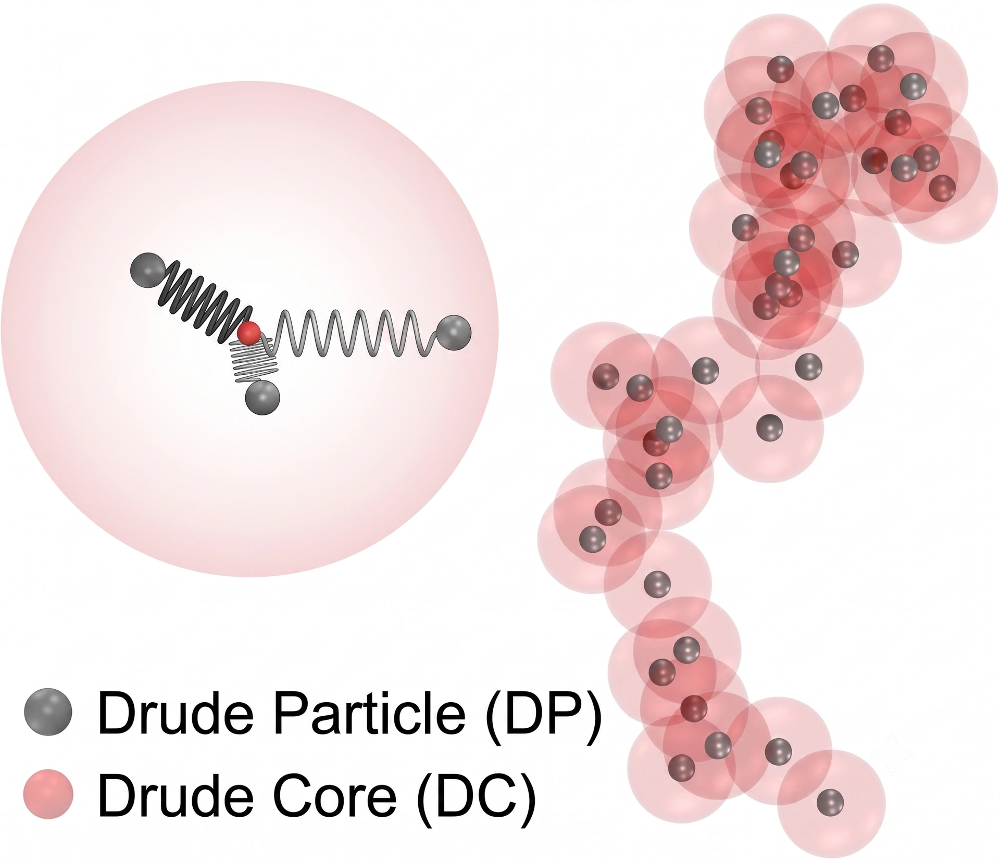

> **系列标签：** `知识文档` · `分子模拟` · `力场` · `MolSimulX`

[经典全原子力场](K03-经典全原子力场.md)（**AA** = all-atom）用**固定点电荷 + 两体 LJ + 键约束**就能跑很大的体系，但在金属、强极化环境、化学反应、接近量子精度的势能面等问题上会不够用。这时人们往**算得更准**（通常也更贵）的方向走。

本文是力场块里「**算得准**」的一侧：概览**多体力场、极化力场、机器学习势（ML 势）**，并点到反应力场与量子方法的边界。

算得快见 [粗粒化与加速模型](K04-粗粒化与加速模型.md)；怎么选见 [力场怎么选](K06-力场怎么选.md)。

---

[erphpdown]

## 一、经典全原子（AA）卡在哪里？

| 经典 AA 的默认 | 可能不够的情况 | 直觉 |
|----------------|----------------|------|
| 电荷固定、不随环境变 | 离子通道、界面、高介电响应 | 电子云本该被电场「拉歪」，固定 $q$ 做不到 |
| 非键以两体为主 | 金属、共价网络、某些多体效应显著的体系 | 第三个邻居一来，有效作用不只是两两相加 |
| 拓扑固定，难断键 | 反应、催化、燃烧、裂解 | 键表写死了，断键成键不在模型里 |
| 参数可转移但有域 | 新化学、极端条件、要追 DFT 级势能面 | 公式照样算、数也「看起来正常」，但已偏出拟合域 |

经验力场离开训练/拟合范围时，程序**不会报警**，轨迹仍光滑——错得像对的，这叫「自信地偏」。ML 势出分布外时也常是同一类坑（下文「自信地错」）。

「更准」几乎总意味着：**更慢、体系更小、轨迹更短，或要先花数据与训练成本**。先问性质是否真的吃这层精度——很多溶液与生物课题，固定电荷全原子已经够用。

相对 [粗粒化与加速模型](K04-粗粒化与加速模型.md)：那边是**故意少算自由度**换尺度；本篇是**多算物理细节**换精度。两边都不是默认皮肤，都是问题驱动。

---

## 二、多体力场

### 1. 两体 vs 多体

**两体势**：一对原子的能量只依赖它们的距离（LJ 是典型）。总能量 ≈ 所有对之和——这就是 [经典全原子力场](K03-经典全原子力场.md) 里的两体可加主战场。

**多体势**：某个原子的能量还依赖周围环境（配位数、电子密度、键角等）。第三个、第四个邻居一出现，有效作用会变——**金属里尤其明显**。

为什么金属更吃多体、两体往往不够？金属键高度**离域**：价电子不像有机分子里那样主要待在某根键上，而更像浸泡在周围原子形成的「电子海」里。于是：

- 一对原子之间的有效吸引，会随各自**配位数 / 周围电子密度**变——表面原子、体相原子、合金近邻不同，不能用同一条只看 $r_{ij}$ 的曲线概括；  
- 纯两体势（只认距离）很难同时说对内聚能、表面能、缺陷与弹性等；嵌入原子类（EAM）正是用「原子嵌在周围密度里的能量」来补这一层。

有机溶液里两体 LJ + 点电荷常够用，是因为化学键更局域、多体效应相对好被参数平均掉。

### 2. 常见思路（认名字即可）

| 代表思路                             | 在管什么                  | 典型场景                |
| -------------------------------- | --------------------- | ------------------- |
| **EAM** 等嵌入原子类                   | 原子处在周围电子密度里的「嵌入能」+ 对势 | 金属、合金               |
| **Tersoff / Stillinger–Weber** 等 | 键级或键角依赖的短程多体          | 共价半导体、某些网络结构        |
| 其他材料势族                           | 随体系定制                 | 氧化物、碳材料等（以文献与软件库为准） |

| | 说明 |
|--|------|
| **强项** | 比纯 LJ 更贴近金属/共价材料的结构与力学趋势 |
| **代价** | 比简单 LJ 重；参数与实现更「材料向」，生物溶液软件栈不一定开箱即用 |
| **注意** | 多体势也是经验/半经验的——换体系、换相区仍要验证 |

水的 **mW** 等也借用了多体思想，但目标是**加速溶剂**，放在 [粗粒化与加速模型](K04-粗粒化与加速模型.md)；本篇的多体更强调**材料精度**一侧。它是**短程多体**：mW 一类模型不用长程库仑去撑氢键网络，而是在很短的截断距离内，用三体项把局部几何往四面体方向推（Stillinger–Weber 风格）。多体只作用在近邻壳层，所以仍比显式三点水 + 长程静电便宜——「多体」不等于「长程」。

---

## 三、极化力场

### 1. 固定电荷缺什么

经典点电荷 $q_i$ 在参数化时就写死了，不随周围电场变化。真实分子在离子、界面、高极性环境旁，电子云会被**诱导极化**——固定电荷力场只能把平均效应塞进参数里，对「环境一变、响应要变」的问题往往不够。

**极化力场**让电荷分布（或诱导偶极等）能响应环境，静电更物理。

### 2. 常见实现路线

| 路线                    | 直觉                                  | 备注              |
| --------------------- | ----------------------------------- | --------------- |
| **Drude 振子** | 在重原子旁挂一个轻的带电「壳」，用弹簧连着，壳被电场拉开 → 诱导偶极 | 文首图常见示意；实现上要小心壳的质量与热浴 |
| **诱导偶极**              | 直接给原子可极化率，迭代求诱导偶极                   | 每步常有自洽迭代，更贵     |
| **多极 + 极化**（如 AMOEBA） | 不止点电荷，还有多极矩，并含极化                    | 静电更细，参数与软件支持要配套 |

| | 说明 |
|--|------|
| **强项** | 需要精细静电响应、极化的溶液、离子与部分生物场景 |
| **代价** | 明显慢于固定电荷力场（多自由度 + 常有迭代）；时间步与热浴设置更挑 |

> **Tips：** 不是「上了极化就全面碾压 TIP3P+AMBER」。许多课题固定电荷已经够用；极化是**问题驱动**的升级，不是默认皮肤。极化力场与水模型也要成套，别把极化溶质随便配固定电荷水。

---

## 四、机器学习势（ML 势 / MLIP）

### 1. 在做什么

用神经网络等去拟合**第一性原理（或更高精度）势能面**：输入原子的**局域环境**，输出能量与力，再驱动 MD。可以把它想成：

> 不手写 LJ + 电荷公式，而是用数据学一个「给定构型 → $U,\mathbf{F}$」的高效替代模型。

| | 相对经典力场 | 相对 AIMD / DFT |
|--|--------------|-----------------|
| **精度** | 常可接近训练所用的量子级别 | 通常远快于在线 DFT |
| **速度** | 往往慢于简单 LJ/AA | 比一步一 DFT 快得多 |
| **关键风险** | 离开训练分布会「自信地错」（照样输出力，却可能大错） | 仍受数据与泛化限制 |

### 2. 典型例子（认名字、知门派即可）

名字很多，入门不必背全；先分清大致门派，选择时跟文献与软件生态走：

| 例子 | 粗印象 | 常见语境 |
|------|--------|----------|
| **GAP**（高斯近似势） | 用高斯过程等拟合局域描述符 → 能量 | 材料、早期「高精度 ML 势」代表之一 |
| **SNAP** 等 | 基于矩/描述符的线性或核方法类 | LAMMPS 材料社区里常见 |
| **DeepMD / DeePMD-kit** | 深度网络 + 局域环境；工程与材料应用多 | 与 MD 引擎对接成熟 |
| **SchNet** | 早期深度势 / 连续滤波网络 | 方法论文与教学里常被引用 |
| **NequIP、Allegro** | 等变图网络，强调旋转等对称性 | 数据效率、力精度讨论多 |
| **MACE** | 高阶等变消息传递一类 | 近年材料/分子 MLIP 文献高频 |
| **ACE** 等 | 原子团簇展开，可与线性/非线性回归结合 | 描述符与可解释性一侧 |

> **Tips：** 上表不是排名。换名字不等于换物理——都是「用数据拟合 QM 势能面」；差别在描述符/网络怎么编码局域环境、训练稳不稳、和你的 MD 软件好不好接。

更细的网络术语见 [神经网络与深度学习基础](K29-神经网络与深度学习基础.md)；数据与划分见 [机器学习数据基础](K28-机器学习数据基础.md)；落地路线见 [机器学习与分子模拟导引](../01-技术文档/T30-机器学习与分子模拟导引.md)。

### 3. 和经典力场差在哪

| | 经典 AA | ML 势 |
|--|---------|--------|
| 函数形式 | 人写死的键/LJ/库仑等 | 由模型架构 + 参数（权重）决定 |
| 参数从哪来 | 拟合实验 / QM，强调可转移 | 主要拟合 QM 能量与力（及应力等） |
| 拓扑 | 常固定，难反应 | 许多 MLIP **不依赖**固定键表，可描述断键（若数据覆盖） |
| 出问题的样子 | 参数域外系统性偏差 | **外推**：没见过的局域环境上误差可突然变大 |

### 4. 使用时心里要有数

- **数据决定上限**：训练用的是 PBE 还是更贵的泛函/波函数方法，ML 势大致追的就是那个级别——不会自动「比老师更准」。  
- **局域描述**：多数现代 MLIP 假设能量可写成原子局域贡献之和；长程静电有时要另接经典长程或专用模块。  
- **主动学习 / 迭代采构型**：先跑 → 找不确定构型 → 再算 QM → 再训，是常见提质流程，不是一次拟合了事。  
- **先抓共性再选名字**：上表那些方法都是可微（或可求导）的势能替代模型；具体用哪家，看体系文献、数据格式与引擎支持。

**和经典力场的关系：** 不是互相消灭。常见流程是经典力场做大范围采样，关键化学用 ML 势或 QM/MM；或对特定材料训练专用 ML 势。

> **Tips：** 评估 ML 势时，除了能量 RMSE，更要看**力**、相关结构/相行为，以及故意拿出分布外构型做压力测试。

---

## 五、反应力场与量子边界

需要「化学键重排」时，固定拓扑的经典 AA 直接不够。常见三条路：

| 路线 | 一句话 | 代价直觉 |
|------|--------|----------|
| **ReaxFF 等反应力场** | 键级可变，允许断键成键；仍是**经验**力场 | 比 AA 重，但远便宜于 AIMD；参数与体系强相关，要验证 |
| **AIMD** | 力来自电子结构，每步（或每几步）做 QM | 贵、体系小、时间短；见 [第一性原理分子动力学与核量子效应](K26-第一性原理分子动力学与核量子效应.md) |
| **QM/MM** | 反应中心量子 + 环境经典 | 折中：热点准、环境省；见 [QM-MM思想](K27-QM-MM思想.md) |

| 若你的问题是… | 更常先想… |
|----------------|------------|
| 燃烧、催化循环、材料里大范围键重排，且有成熟 Reax 参数 | 反应力场 + 严格验证 |
| 要特定反应机理、能垒接近量子参考 | AIMD 或 QM/MM |
| 已有高质量 QM 数据、体系重复跑很多轨迹 | 也可评估 **ML 势**（数据覆盖反应路径时） |

这已超出「把 LJ 参数调准一点」——先分清是经验反应力场够用，还是必须上电子结构。

---

## 六、精度–成本梯子（更准一侧）

| 更便宜 | → | 更贵、往往更准 |
|--------|---|----------------|
| 经典 AA（固定电荷） | 极化 / 多体 | ML 势（有数据时） |
| | 反应力场 | AIMD / 高精度电子结构 |

同一课题也可以**混合**：

- 环境用经典 AA，热点用 ML 或 QM/MM；  
- 金属区域用多体势，溶液用经典力场（界面与参数衔接要小心）；  
- 先用经典或粗模型采样，再用高精度单点或短 ML/AIMD 轨迹校准关键量。

---

## 七、常见误区

| 误区 | 更稳妥的理解 |
|------|----------------|
| 「极化 / ML 默认比 AA 全面更好」 | 只在你的观测量吃那层物理时才值得 |
| 「多体势 = 生物力场升级版」 | 多体材料势与 AA 生物力场是不同工具箱 |
| 「ML 势 = 免费的 DFT」 | 速度来自拟合；精度受数据与外推限制 |
| 「ReaxFF 能断键 = 反应机理一定对」 | 仍是经验势，能垒与路径要对照实验/QM |
| 「上了高精度就不用管采样」 | 更贵往往更短轨迹；采样不足会伪装成「力场不准」 |

---

## 八、小结

1. 经典 AA 不够时，常见升级是**多体、极化、ML 势**；反应另论 ReaxFF / AIMD / QM/MM。  
2. 多体强调环境依赖的有效作用（金属/共价材料常见）；极化强调电荷分布随电场响应（Drude / 诱导偶极 / AMOEBA 等）。  
3. ML 势强依赖**训练数据与外推风险**，不是自动的「量子免费午餐」。  
4. 更准通常更慢；先确认观测量是否吃精度，再爬梯子或做混合。  
5. 怎么选的总原则与水例子见 [力场怎么选](K06-力场怎么选.md)。

---

[/erphpdown]

## 学习路径

**前置阅读：** [经典全原子力场](K03-经典全原子力场.md)

**下一步：**

- [粗粒化与加速模型](K04-粗粒化与加速模型.md) —— 另一侧：算得快  
- [力场怎么选](K06-力场怎么选.md) —— 问题驱动开关  
- [神经网络与深度学习基础](K29-神经网络与深度学习基础.md)  
- [第一性原理分子动力学与核量子效应](K26-第一性原理分子动力学与核量子效应.md)  
- [QM-MM思想](K27-QM-MM思想.md)  
