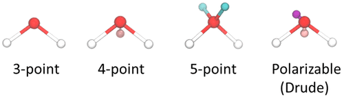

> **系列标签：** `知识文档` · `分子模拟` · `力场` · `MolSimulX`

力场相关已拆成三条线 + 一个开关：

| 篇 | 角色 |
|----|------|
| [经典全原子力场](K03-经典全原子力场.md) | 全原子（**AA**）主线——多数课题的默认起点 |
| [粗粒化与加速模型](K04-粗粒化与加速模型.md) | 算得快 |
| [高精度力场与机器学习势](K05-高精度力场与机器学习势.md) | 算得准 |
| **本篇** | 只回答一件事：**面对具体问题，往哪边走？** |

建议先读过 [分子动力学模拟概述](K02-分子动力学模拟概述.md)，并至少扫过 [经典全原子力场](K03-经典全原子力场.md)；粗粒 / 高精度两篇可按需。细节分别回三条线专文，本篇不讲参数怎么拟合、软件怎么写。

**选完力场，就可以按模拟流程往下走：** 先 [边界条件与初始条件](K07-边界条件与初始条件.md) 搭盒子，再算力、积分、控温、平衡与分析。

核心原则借用一句简单的名言：

> **用尽可能简单、但不过于简单的模型。**

「简单」省算力、少参数坑；「过于简单」会让你的科学问题在模型里根本不存在。  反过来想：你能把模型粗到哪一步、结论还在，往往就摸到了**现象真正依赖的那层物理**——怎么选不只是省时间，也是在逼自己说清本质。

> **Tips：** 不必每个体系都从零爬一遍梯子。同领域论文、导师组习惯、力场文档里的推荐组合，往往已经替你试过错——**先站在经验上**，再用本文的问题清单判断要不要改、往哪改。

---

## 一、先问三个问题

| 问题 | 若答案是「是」 | 倾向 |
|------|----------------|------|
| 结论是否依赖**氢键取向、原子级静电、特定化学基团**？ | 需要这些细节 | 经典全原子或更准 |
| 是否要看**大尺度组装、相分离、很长的软物质过程**？ | 全原子算不起或不必要 | 粗粒化 / DPD / 更粗溶剂 |
| 是否涉及**断键、电子重排、金属多体、强极化**？ | 经典固定电荷 + 固定拓扑不够 | 反应力场 / 极化 / 多体 / ML / AIMD·QM/MM |

三个问题可以同时为「是」——那时通常要**拆问题**或**混合模型**（大尺度用粗、关键化学用细），而不是找一个「全能力场」。

然后才看**文献习惯、组内经验与算力**——多数时候，这才是真正的起点：

- **复现 / 同领域工作**：优先对齐原文或社区常用的力场、水模型、截断与排除规则；不必重新发明。  
- **组里已有成熟流程**：先沿用能复现的那套，再针对你的新观测量做增量改动。  
- **探索新体系或新问题**：在梯子上从够用的一档起步，再按证据升级——这时才更需要「自己试」。  
- **算力倒逼**：盒子与时长先估一笔账，再决定 AA 是否现实。

---

## 二、一张总表

| 你的情况 | 优先考虑 | 详见 |
|----------|----------|------|
| 溶液结构、蛋白、常规有机液体，无反应 | **经典全原子** + 配套水模型 | [经典全原子力场](K03-经典全原子力场.md) |
| 膜、囊泡、大软物质、要更长更粗 | **Martini 等 CG** / UA | [粗粒化与加速模型](K04-粗粒化与加速模型.md) |
| 介观流动、相分离、聚合物溶液 | **DPD** 等 | 同上 |
| 金属、合金、显著多体 | **多体势** | [高精度力场与机器学习势](K05-高精度力场与机器学习势.md) |
| 强极化、精细静电响应 | **极化力场** | 同上 |
| 要追 DFT 级势能面、有数据 | **ML 势** | 同上 · [神经网络与深度学习基础](K29-神经网络与深度学习基础.md) |
| 要断键成键 | **ReaxFF** 或 **AIMD / QM/MM** | [第一性原理分子动力学与核量子效应](K26-第一性原理分子动力学与核量子效应.md) · [QM-MM思想](K27-QM-MM思想.md) |
| 复现某篇文献 | **与原文同一力场与水模型** | — |

**经典全原子里再怎么挑族？**（仅作入门锚点，以领域文献为准）

| 体系直觉 | 常听到的名字 |
|----------|----------------|
| 蛋白 / 核酸 / 配体 | AMBER、CHARMM 等族 |
| 有机液体、小分子物性 | OPLS-AA 等 |
| 聚合物 / 部分材料 | COMPASS、PCFF 等 |
| 教学 / 简单流体 | LJ 流体 |

族选定后，**水模型、排除与 1–4、截断、混合规则**要跟文档走成套——见下文清单与 [经典全原子力场](K03-经典全原子力场.md)。

**不要（写进论文结论时）：** 把 AMBER 的溶质参数配上「随便一个」水模型；把不同族的 LJ 与 1–4 规则混搭。

若你只是**跑通流程、学软件、查脚本有没有报错**，临时凑一套能出轨迹的设置可以；一旦要谈科学结论，仍应回到成套、可辩护的组合。

---

## 三、粗细怎么配合（很常见的工作流）

怎么选不是一次性赌对。很多可靠工作其实是**粗细接力**：

| 策略        | 在做什么                                                     | 适合              |
| --------- | -------------------------------------------------------- | --------------- |
| **先粗后细**  | 用 UA / Martini / 更粗模型把大尺度过程跑通、看趋势与候选构型，再对关键状态上全原子（或更准）精修 | 膜组装、相分离、构象空间很大时 |
| **细校准粗**  | 用全原子、极化、ML 或 QM 的短轨迹 / 单点 / 自由能，去检验或重拟合粗模型的有效参数          | 要长期用 CG，又怕有效势漂  |
| **空间混合**  | 热点用细（QM/MM、ML、极化），环境用经典或粗                                | 反应中心、局部强极化      |
| **只粗或只细** | 观测量全程都在同一分辨率下定义良好                                        | 问题本身就只需要那一档     |

> **Tips：** 「先粗跑通」省的是探索成本；**论文结论若声称原子级机理，最终证据仍要落在能支撑该机理的分辨率上**——粗轨迹可以启发，不能自动替代表细结果。

这与「简单但不过于简单」一致：粗模型帮你找到**还在的那层本质**；细模型确认你没有把关键细节抹掉。

但**不是每个课题都要走完整套粗细接力**。膜组装、巨大构象空间才常需要先粗后细；常规蛋白溶液、有机液体物性，领域里往往已有默认 AA + 水模型——直接用、写清版本即可。经验与文献告诉你「这类问题别人停在哪一档」；本文表格是决策辅助，不是强制作业。

---

## 四、以水为例：从「简单到不能再简单」往上爬

同一杯「水」，模型可以粗到几乎只剩摩擦，也可以细到极化或量子。按**问题需要**选最粗仍够用的一档：

| 梯子（由简到繁） | 模型直觉 | 还适合问什么 | 已经不太适合问什么 |
|------------------|----------|--------------|--------------------|
| **1. 隐式溶剂** | 没有水分子，只有摩擦/随机力或连续介电 | 溶质在黏滞介质里的过度阻尼运动 | 水的结构、氢键、排空、水介导的力 |
| **2. 极简显式溶剂** | 例如 LJ 粒子当「背景液体」 | 简单拥挤、部分流体力学背景 | 真实水的氢键与极性 |
| **3. 粗粒水（如 mW）** | 很少位点，专为加速 | 较大体系里水的部分物性/相行为 | 精细 O–H 取向与氢键几何 |
| **4. 经典全原子水**（TIP3P、SPC/E、TIP4P…） | 3–4 位点 + LJ + 电荷 | 溶液结构、生物溶剂、与 AA 力场配套 | 反应、强极化极限、要量子级势能面时 |
| **5. 极化水 / 更精细静电** | 电荷或偶极可响应环境 | 对介电、离子水合极敏感的问题 | 算力吃紧的超大体系 |
| **6. AIMD / 量子水** | 电子结构给力 | 反应、质子转移、力场域外化学 | 大盒子长时间（通常不现实） |

**怎么用这张梯子：**

1. 写下你的科学问题（一句话）。  
2. 从第 1 档往上看：哪一档开始，问题里的关键物理**第一次出现**？  
3. 就停在那一档（或文献已验证的那一档），不要默认爬到顶。  

例：

- 只关心胶体大粒子在黏稠介质里的扩散 → 隐式溶剂 / 布朗可能够。  
- 关心蛋白表面水层取向与氢键 → 至少经典全原子水。  
- 关心冰/水相行为且盒子很大 → 可评估 mW 等是否对你的序参量够用。  
- 关心水中质子转移机理 → 要往量子或专用反应描述走，而不是换一个 TIP 参数。

同一溶质力场往往在拟合时**假定**某种水模型；改水不改溶质，等于换溶剂环境。TIP3P / SPC/E / TIP4P（及 TIP4P/Ice 等变体）名字要写全——见 [经典全原子力场](K03-经典全原子力场.md)。

这就是「简单但不能再简单」：**再简单一级，你要的现象会从模型里消失。** 能消失在哪一级，往往就标出了本质所在的那一级。

---

## 五、实操清单（写进 Methods 前）

1. **目标性质**列出来；标出哪些依赖原子细节 / 哪些只依赖介观。  
2. **文献与经验锚点**：同领域常用哪族力场、哪个水模型？组里或近邻论文怎么配的？有无粗→细先例？**优先对齐已验证组合，而不是从零试遍梯子。**  
3. **算力预算**：盒子多大、要跑多久？倒逼能否上 CG 或必须 AA。  
4. **配套规则**：水模型、排除、1–4、截断、混合规则是否与力场文档一致？  
5. **升级触发器**：若关键量与实验趋势相反，再考虑极化 / ML / 换粒度——先查采样、平衡与有限尺寸（见 [有限尺寸效应](K18-有限尺寸效应.md)），再怪力场。  
6. **Methods 最低配置**：力场族与版本、水模型全名、系综与热/压浴、步长、截断与长程静电、盒子大小、平衡与生产时长。

---

## 六、常见误区

| 误区 | 更稳妥的理解 |
|------|----------------|
| 「最新力场 / 最贵模型一定最好」 | 最好的是**刚好支撑你问题**的那一档 |
| 「粗模型跑完 = 原子机理也清楚了」 | 粗只能回答粗分辨率下仍存在的问题 |
| 「先随便配个水，以后再换」 | 水模型常与溶质参数成套；事后换水可能系统性偏 |
| 「结果不对就先换力场」 | 先查采样、平衡、盒子、截断与设置笔误 |
| 「混合各族参数能取长补短」 | 多半是另造未经检验的力场 |
| 「AA 溶质 + CG 溶剂（或 AA+Martini 随手拼）能省钱」 | 默认不行；专文见 [全原子与粗粒化能不能混用](K31-全原子与粗粒化能不能混用.md) |
| 「每个体系都要从隐式爬到量子试一遍」 | 多数工作直接站在文献/组内经验上；梯子用于想不清或要升级时 |
| 「选题时必须一次定死粒度」 | 需要时再粗扫 → 细校；不需要就别仪式化 |

---

## 七、小结

1. 怎么选看**问题**，也看**经验**：同领域已验证的组合优先；能粗到哪一步结论还在，往往就碰到了本质。  
2. 三线分工：经典 AA 主线、粗粒加速、高精度/ML；本篇做开关。  
3. **粗细配合**在需要时很有用，但不是每篇工作的必做仪式；声称的分辨率要和证据匹配。  
4. **以水为梯**：从隐式 → 极简显式 → mW → TIP/SPC → 极化 → 量子，停在刚好够用的一档（或文献已停的那一档）。  
5. 力场族与水模型、排除规则要成套；**AA 与 CG 更不要 DIY 混分辨率**（见 [全原子与粗粒化能不能混用](K31-全原子与粗粒化能不能混用.md)）；混用只适合练手跑通，不适合当最终 Methods。

---

## 学习路径

**前置阅读：** [经典全原子力场](K03-经典全原子力场.md)（建议）；按需 [粗粒化与加速模型](K04-粗粒化与加速模型.md)、[高精度力场与机器学习势](K05-高精度力场与机器学习势.md)

**下一步：**

- [全原子与粗粒化能不能混用](K31-全原子与粗粒化能不能混用.md) —— 分辨率之间能不能拼  
- [边界条件与初始条件](K07-边界条件与初始条件.md) —— **力场定好，开始搭盒子**  
- [截断长程力与近邻列表](K08-截断长程力与近邻列表.md) —— 每步怎么算力  
- [统计力学基础与系综](K23-统计力学基础与系综.md) —— 概念加深（可稍后）  
- [分子模拟工作平台搭建](../01-技术文档/T01-分子模拟工作平台搭建.md)  
