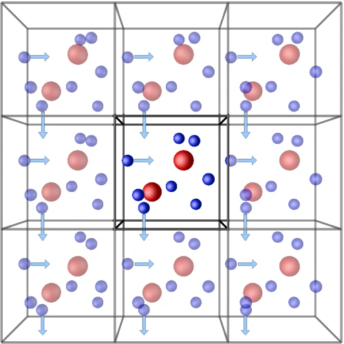
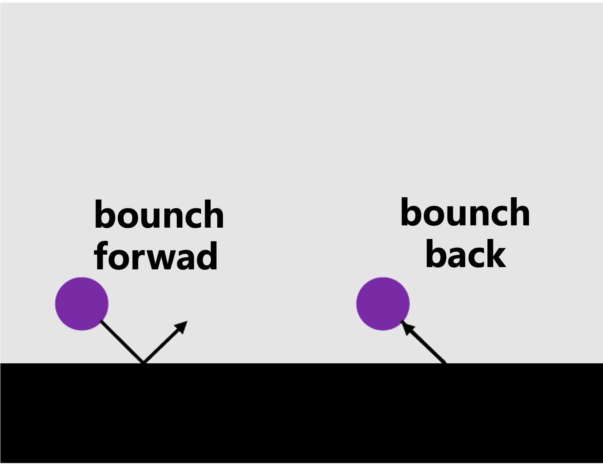

> **系列标签：** `知识文档` · `分子模拟` · `边界条件` · `MolSimulX`

力场与模型定好了（见[力场怎么选](K06-力场怎么选.md)、[经典全原子力场](K03-经典全原子力场.md)），就可以真正**开跑模拟**。流程上第一步通常是**搭盒子**：放什么分子、盒子多大、边界怎么处理、第一帧从哪来——搭错了，后面 牛顿运动方程积分再稳也难出可靠结果。

本篇讲**边界条件**（粒子碰到盒子边缘怎么办）与**初始条件**（第一帧的位置、速度从哪来）。

看完你应该能回答：什么时候该用 PBC、什么时候用墙或真空层，盒子要多大才不至于有限尺寸离谱，以及第一帧速度和温度怎么设才不至于积分一上来就炸。力场选型在 [力场怎么选](K06-力场怎么选.md) 和 [经典全原子力场](K03-经典全原子力场.md)；截断半径和静电处理见 [截断长程力与近邻列表](K08-截断长程力与近邻列表.md)；怀疑盒子偏小再翻 [有限尺寸效应](K18-有限尺寸效应.md)。

| 问题 | 姊妹篇 |
|------|--------|
| 用什么力场、参数从哪来 | [力场怎么选](K06-力场怎么选.md) |
| 截断、近邻列表、Ewald/PPPM | [截断长程力与近邻列表](K08-截断长程力与近邻列表.md) |
| 盒子太小、性质随尺寸变 | [有限尺寸效应](K18-有限尺寸效应.md) |

---

## 一、为什么需要边界条件？

实验室里一杯水有约 $10^{23}$ 个分子；计算机里通常只有几千到几百万个。盒子边长往往只有几纳米到几十纳米。

若把这些粒子关在「硬墙」盒子里、不许穿出：

- 贴墙的那一层分子会感受到**人为表面**；  
- 表面效应可能主导整盒行为——那更像薄膜或团簇，**不是**你想代表的体相液体。

要用有限粒子数去近似「无限大、没有表面的体相」，最常用的办法是**周期性边界条件**（periodic boundary conditions, **PBC**）。

> **Tips：** 不是每个课题都要用 PBC。气相团簇、真空中的纳米片、明确的狭缝孔道，往往用墙或真空层更合适——见下文「其他边界」。

---

## 二、周期性边界条件（PBC）在干什么？

### 1. 一句话图像

可以想成一间屋子六面都是镜子：你看到的是无限重复的拷贝，但真正在算的只有**一间屋里的粒子**。

- 粒子从右边穿出，立刻从左边的镜像位置进来；  
- 上下、前后同理。  

于是盒子没有「外表面」，却仍只有有限个自由度——这就是用有限 $N$ 代表体相的基本把戏。

### 2. 最小镜像约定

算两个粒子的距离时，不能量「隔着盒子绕远路」的那条，而要取**最近的一对镜像**之间的距离——叫**最小镜像约定**（minimum image convention）。

直觉：你和右侧墙外 0.2 nm 处的镜像邻居，比和盒子里远处另一个「真身」更近；相互作用应按 0.2 nm 算，而不是按盒子对角线去算。

> **Tips：** 截断半径通常要求小于半盒长，否则「最近镜像」与截断规则会打架。截断细节见 [截断长程力与近邻列表](K08-截断长程力与近邻列表.md)。

### 3. 盒子形状：正交与三斜

| 形状 | 直觉 | 常见场景 |
|------|------|----------|
| **正交** | 长方体，棱边互相垂直 | 溶液、多数液体、入门算例 |
| **三斜**（triclinic） | 棱边可以斜着交 | 某些晶体、需要匹配晶格的体系 |

入门先会正交盒子即可；晶体文献里若写 triclinic / 斜盒子，是为了让周期方向对齐晶格，不是故意刁难。

### 4. PBC 与静电

库仑作用衰减慢（$\sim 1/r$）。在周期盒子里不能只靠「截断了事」，通常要用 Ewald / PPPM 等在**周期图像**下做长程求和。概念见 [截断长程力与近邻列表](K08-截断长程力与近邻列表.md)。

### 5. PBC 的代价：有限尺寸效应

PBC 消掉了表面，但盒子**仍然只有这么大**。若体系里某种「相关」能延伸得很远（例如关联长度接近或超过半盒长），粒子会通过镜像「看见自己」，密度、扩散、界面张力等可能随盒子大小系统性变化——叫**有限尺寸效应**。

入门记住一句：**盒子太小会偏；怀疑时加大盒子或做尺寸对比。** 专篇见 [有限尺寸效应](K18-有限尺寸效应.md)。

| 要点 | 说明 |
|------|------|
| 用途 | 体相液体、晶体、均匀溶液 |
| 盒子形状 | 正交或三斜 |
| 距离 | 最小镜像 |
| 坑 | 有限尺寸；长程静电要专门处理 |

---

## 三、其他边界：墙与开放体系

不是体相时，常见两类做法：**用墙把流体关住**，或（更进阶）让盒子与粒子库交换。

### 1. 墙可以怎么实现？

「墙」不一定只有一种长相：

| 做法 | 直觉 | 典型场景 |
|------|------|----------|
| **显式原子墙** | 真的摆一层（或几层）固体原子，用力场与流体相互作用 | 固体表面、孔道内壁、石墨烯狭缝等；墙原子可固定或允许振动 |
| **隐式墙** | 不摆墙原子，用规则处理越界（撞上就反射 / 按势函数推回） | 理想狭缝、快速试探受限几何；实现简单，但「墙」的化学细节被抹掉 |
| **固体墙 + 流体 +（可选）PBC** | 某一方向用固体/真空，另几向仍可周期 | 界面、薄膜、支撑层上的吸附 |

选哪种，看你要不要墙的**化学与粗糙度**：

- 关心表面官能团、润湿、吸附位点 → 倾向**显式原子墙**（或至少真实材料的晶面）；  
- 只关心「被两块平行板夹住」的几何受限 → **隐式墙**往往够用，也更省粒子。

> **Tips：** 显式墙会占粒子数与算力；墙原子若完全冻住，还要注意温度定义、热浴作用在哪些自由度上（见 [常见系综与控温控压](K11-常见系综与控温控压.md)、[键长键角约束与刚性](K10-键长键角约束与刚性.md)）。

### 2. 墙和 PBC 可以同时开

实践里很常见：**横向（如 $x$、$y$）仍用 PBC**，法向（如 $z$）用墙或固体层把流体关住——表面、狭缝、支撑层上的液膜都是这种几何。

软件里盒子三个方向可能都勾了「周期」，但粒子**实际上跑不出盒子**：墙（或固体原子）挡住了法向逃逸；周期只是在「没墙挡住」的方向上接镜像。换句话说——

- **PBC** 管的是「穿出边界后从对面镜像进来」的规则；  
- **墙** 管的是「这个方向根本不该有体相镜像、粒子也不该穿过去」。

两者不互斥：有墙时，粒子的真实运动已被墙限制；PBC 主要服务仍开放的那几个方向（以及下面要说的静电求和）。

### 3. 这种几何下的静电

体相三维 PBC 里，库仑常用 **Ewald / PPPM** 等，默认假设**三个方向都周期重复**。一旦法向被墙夹住、只剩二维「无限大」表面，再原样用三维周期静电，等于假装 $z$ 方向还有一层层镜像板——板与板之间会通过镜像产生**虚假的长程耦合**（尤其体系有净偶极时更明显）。

入门先记住处理思路，细节见 [截断长程力与近邻列表](K08-截断长程力与近邻列表.md)：

| 做法 | 直觉 |
|------|------|
| **加厚真空 + 偶极/板校正** | 法向仍开三维 Ewald，但在墙外留足够真空，并打开 slab / dipole 一类校正，压掉虚假镜像板的影响 |
| **二维 / 准二维长程方法** | 只在周期的那两个方向做 Ewald 类求和，法向按非周期处理（实现因软件而异） |
| **短程截断静电** | 仅当体系很小、电荷很弱、且你清楚误差可接受时才考虑；带电界面一般不推荐当默认 |

> **Tips：** 「盒子开了 PBC」≠「静电该按三维体相算」。有墙 / 有真空层的界面，先问一句：法向要不要假装还有镜像？不要的话，就要真空填充或二维/校正方案，而不是照搬体相 PPPM 默认设置。

### 4. 开放 / 半开放（点到即可）

| 类型 | 图像 | 典型用途 |
|------|------|----------|
| **开放 / 半开放** | 与粒子库交换（插入/删除粒子） | 吸附等温线、巨正则等；常与 **MC** 联用 |

这已超出「搭一个固定 $N$ 的 MD 盒子」的入门默认；需要时见 [分子动力学与蒙特卡洛](K24-分子动力学与蒙特卡洛.md)。

### 5. 怎么选：PBC 还是墙？

- 要代表**体相**（没有你关心的外表面）→ 优先三维 **PBC**；  
- 要代表**受限几何 / 明确固–液或固–气界面** → **墙（或固体层）+ 横向 PBC** 很常见；粒子跑不出盒子，但静电不要按「三维无限重复」默认处理。

---

## 四、初始位置：第一帧分子放哪？

搭盒子时，每个粒子都要有一个起始坐标。实践中比任何口号都重要的是下面几条。

### 1. 几何要符合问题

狭缝中的水、膜两侧的溶剂、晶体超胞，都不能「随便扔进一个立方盒子」了事。盒子形状、分子朝向、分层方式，应反映你要问的物理场景。

### 2. 禁止严重重叠

两原子若挤得过近，排斥力（尤其 LJ 的 $r^{-12}$）会大到数值爆炸。建完结构后通常先做**能量最小化**，再开动力学——见 [能量最小化与预平衡](K12-能量最小化与预平衡.md)。

### 3. 密度 / 结构别太离谱

可参考实验密度、晶体结构，或用 Packmol、ASE 等工具堆积。初态离目标太远，后面平衡化会又慢又容易卡在坏构型。

### 4. 「初态重不重要？」——先别被「各态历经」吓到

文献里有时会说：若体系**各态历经**（ergodic），足够长的轨迹会跑遍该条件下所有该去的微观状态，因而**理论上**初始条件不重要。

入门只需建立直觉：

- **理想情况**：跑得够久、势垒不太高，坏初态有机会被「忘掉」；  
- **实际情况**：短轨迹、高势垒、慢过程（大分子构象、相分离）时，坏初态可能让你**一直困在错误阱里**——看起来在跑，采的却不是你想要的态。

因此搭盒子时仍要认真给初态；「理论初态不重要」指的是**充分平衡、充分采样之后**。  
**各态历经、时间平均与系综平均**的严格说法，放到加深篇 [统计力学基础与系综](K23-统计力学基础与系综.md)——建议走通模拟流程后再读。

> **Tips：** 写 Methods 时交代盒子尺寸、边界类型、如何生成初态（及是否最小化），和交代力场一样重要。

---

## 五、初始速度：第一帧怎么动？

位置定了，还要给每个粒子一个初始速度，否则动能从零开始，温度也对不上。

常见做法：

1. 按目标温度，从**麦克斯韦–玻尔兹曼分布**随机抽速度（热运动速度的经典统计分布）；或  
2. 先给随机速度，再整体**标度**（乘一个因子）使瞬时温度等于设定值。

随机数种子会改变「这一次」的具体速度实现，但不改变统计目标。开跑后通常还要经过 [能量最小化与预平衡](K12-能量最小化与预平衡.md)，让速度分布与结构一起弛豫到目标态附近，再进入生产段。

> **Tips：** 温度由动能决定；但「温度到了」不等于结构平衡了——热浴可以很快把动能拉到位，构象可能还在慢悠悠地松弛。见 [平衡判据与收敛](K13-平衡判据与收敛.md)。

---

## 六、搭盒子时的小清单

| 检查项 | 问自己 |
|--------|--------|
| 边界 | 体相用三维 PBC，还是墙/界面（常横向 PBC + 法向受限）？静电是否按体相默认？ |
| 尺寸 | 边长是否远大于关心的关联尺度？太小见 [有限尺寸效应](K18-有限尺寸效应.md) |
| 密度 | 是否接近实验或文献目标？ |
| 重叠 | 有没有原子对挤在一起？要不要先最小化？ |
| 速度 | 是否按目标温度初始化？ |
| 下一步 | 盒子有了 → 每步怎么算力：[截断长程力与近邻列表](K08-截断长程力与近邻列表.md) |

---

## 七、小结

1. **PBC** 用「镜像屋子」让有限盒子近似体相；距离用**最小镜像**。  
2. PBC 仍有**有限尺寸**问题；静电在周期下常要长程方法。  
3. **墙**与 **PBC** 常并存（横向周期、法向关住）；粒子跑不出盒子，但静电勿照搬三维体相默认——见上文与 [截断长程力与近邻列表](K08-截断长程力与近邻列表.md)。  
4. 初态要**合几何、不重叠、近目标密度**；速度按温度分布即可。  
5. 「各态历经 → 初态不重要」是理想极限；实践中仍要认真搭盒子，严格讨论见 [统计力学基础与系综](K23-统计力学基础与系综.md)。

---

## 学习路径

**前置阅读：** [力场怎么选](K06-力场怎么选.md)（建议）· [分子动力学模拟概述](K02-分子动力学模拟概述.md)

**下一步：**

- [截断长程力与近邻列表](K08-截断长程力与近邻列表.md) —— 盒子有了，每步怎么算力  
- [能量最小化与预平衡](K12-能量最小化与预平衡.md) —— 初态常先最小化再开跑  
- [有限尺寸效应](K18-有限尺寸效应.md) —— PBC 盒子仍有限时的坑  
- [统计力学基础与系综](K23-统计力学基础与系综.md) —— 各态历经等概念加深（可稍后）  
