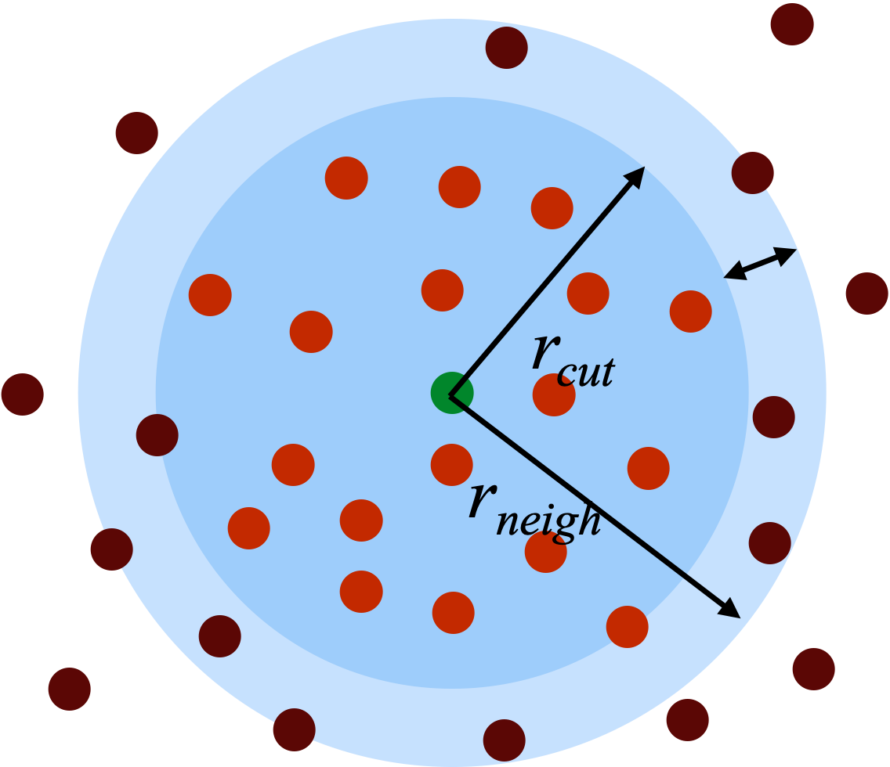
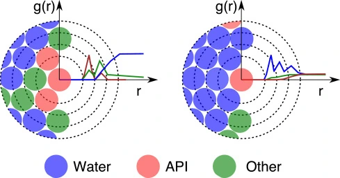

> **系列标签：** `知识文档` · `分子模拟` · `非键计算` · `MolSimulX`

盒子搭好了（见 [边界条件与初始条件](K07-边界条件与初始条件.md)），积分**每一步**都要算粒子之间的力。最贵的往往是**非键力**：若对所有原子对暴力计算，复杂度 $O(N^2)$，大体系跑不动。

本篇讲经典 MD 提速的两大支柱——**截断**与**近邻列表**；以及静电因衰减慢还需要的**长程方法**。重点建立「为什么 LJ 能截、库仑不能只靠截」的直觉（含一点尾部积分推理）。

读完能带走：`r_cut` 为啥会改有效力场、近邻列表和 skin 是干嘛的、LJ 截断加尾部校正而库仑得 Ewald/PPPM 的直觉，以及和文献对比时截断参数必须对齐。盒子与 PBC 前提见 [边界条件与初始条件](K07-边界条件与初始条件.md)；力场参数跟 [经典全原子力场](K03-经典全原子力场.md) 文档对齐。



---

## 一、为什么要截断？

非键作用随距离衰减。实践中只在 $r \lt r_{\mathrm{cut}}$ 内显式计算粒子对，可把每步代价从「全体对」压到「截断球内的对」。全原子常见截断约 **1.0–1.2 nm**，具体以力场文档为准。

截断带来三件必须心里有数的事：

1. **漏掉的尾部能量**——截断外还有没有可观贡献？能不能用平均场补回来？  
2. **势能/力在 $r_{\mathrm{cut}}$ 处可能跳变**——不处理会伤能量守恒；  
3. **改 $r_{\mathrm{cut}}$ ≈ 改有效力场**——和文献对比时必须一致。

下面先用「均匀流体的尾部积分」把第 1 点说清楚——这也是 LJ 与静电待遇不同的根源。

---

## 二、LJ 与静电：收敛性为什么不同？

### 1. 一张对照表

| 相互作用 | 远距离行为 | 尾部积分 | 实践 |
|----------|------------|----------|------|
| **LJ 吸引支** $\sim r^{-6}$ | 衰减快 | **收敛** | 可截断；常加**尾部校正**补能量/压强 |
| **库仑** $\sim r^{-1}$ | 衰减慢 | **发散**（均匀同号电荷） | **不能**只靠简单截断；用 Ewald / PPPM / PME 等 |

> **注意：** 「LJ 截断 + 静电也截断」在带电体系上往往不可接受；生物与电解质模拟几乎总要开长程静电。

### 2. 尾部积分长什么样？

先补一个量：**径向分布函数** $g(r)$。

想象站在某个粒子上往外看：距离 $r$ 附近，实际找到其他粒子的概率，相对「完全均匀乱撒」是多还是少？

- $g(r)=1$：和均匀密度一样，没有远近偏好；  
- $g(r)\gt 1$：这一圈更挤（液体里常见的近邻壳层）；  
- $g(r)\lt 1$：这一圈更稀。  

液体里 $g(r)$ 通常先鼓几个峰，**足够远之后才慢慢回到 1**——远处「看不清结构」，密度近似均匀。



估截断外漏掉的平均能量时，常先做最粗近似：远处 $g(r)\approx 1$，数密度 $\rho$ 当常数。某个粒子与**截断以外**所有粒子的相互作用，可写成一层层球壳加起来：

$$
U_{\mathrm{tail}} \;\sim\; \frac{1}{2}\,\rho \int_{r_{\mathrm{cut}}}^{\infty} u(r)\,4\pi r^{2}\,\mathrm{d}r
$$

（$\tfrac12$ 避免每对算两次；完整写法里被积函数还应乘 $g(r)$，取 $g=1$ 就是上面这式。）  

关键在 $u(r)\,r^{2}$：距离越远，壳层体积 $\propto r^{2}$ 变大，但 $u(r)$ 在变弱——**谁赢**，决定尾部能不能积出来。

### 3. LJ 吸引支：为什么收敛？

LJ 吸引支渐近 $\sim -C/r^{6}$。代入后：

$$
u(r)\,r^{2} \;\sim\; -\frac{C}{r^{4}}
$$

于是

$$
\int_{r_{\mathrm{cut}}}^{\infty} \frac{\mathrm{d}r}{r^{4}} \;\propto\; \frac{1}{r_{\mathrm{cut}}^{3}}
$$

——有限、且随 $r_{\mathrm{cut}}$ 增大迅速变小。所以：

- **可以截断**：远处贡献小；  
- **可以校正**：用上面这类积分估出漏掉的平均能量（以及相应的压强尾部），加回热力学量里。

排斥支 $\sim r^{-12}$ 衰减更快，尾部更可忽略；真正需要操心的通常是吸引支。

> **Tips：** 尾部校正默认「均匀、各向同性、无界面」，并常取远处 $g(r)\approx 1$。有界面、强分层、或 $g(r)$ 在远处仍振荡时，简单公式会偏——此时更稳妥的是**加大截断**或做尺寸/截断敏感性检查。

### 4. 库仑：为什么发散？

点电荷 $u(r)\sim q_i q_j/r$。若天真地假设「到处同号、密度均匀」：

$$
u(r)\,r^{2} \;\sim\; r \qquad\Rightarrow\qquad \int_{r_{\mathrm{cut}}}^{R} r\,\mathrm{d}r \;\propto\; R^{2}-r_{\mathrm{cut}}^{2}
$$

把上限 $R\to\infty$，积分**发散**。物理图像：壳层越来越厚，而 $1/r$ 掉得不够快，远方电荷的总贡献不收敛。

那真实电解质呢？整体电中性，而且 $g(r)$ **往往不是 1**——为什么？

因为电荷会**筛选**：正离子周围更容易聚一点负离子（$g_{+-}(r)$ 近处偏高），同号则互相躲开。远方有效相互作用被削弱，比「到处同号、密度均匀」温和得多。  但即便如此，也**不能**把库仑当成「截断一下再加个小尾巴」就完事：

- 筛选再强，长程尾巴仍比 LJ 难缠；简单截断会扭曲离子分布与静电能量；  
- 周期盒子里还要把所有**镜像电荷**加起来，直接求和收敛极慢（甚至条件收敛），必须换算法。

### 5. 长程静电在干什么？（直觉）

**Ewald 求和**（及网格加速版 **PPPM / PME**）的核心把戏是把 $1/r$ **拆成两段**：

| 部分 | 图像 | 在哪算 |
|------|------|--------|
| **短程** | 用 $\mathrm{erfc}$ 等把近处库仑「削尖」，很快衰减 | 实空间，可截断 |
| **长程** | 平滑的剩余部分 | 倒易空间（傅里叶 / 网格） |

于是：近处仍像普通对力；远处用周期结构下的快速求和，而不是对无数镜像暴力加。参数（实空间截断、网格间距、精度）控制的是**这两段怎么分摊误差**，不是「要不要算长程」。

> **Tips：** 力场文档里的 LJ 截断，和 Ewald/PPPM 的实空间截断，是两套旋钮——前者管色散/排斥，后者管静电短程段。不要混成「整个非键一个 cut」。

### 6. 界面 / 墙几何：别默认三维周期静电

Ewald / PPPM 的常见默认是**三个方向都周期**。若体系是「横向无限、法向有墙或真空」（见 [边界条件与初始条件](K07-边界条件与初始条件.md)），粒子可能根本穿不出盒子，但静电若仍按三维体相求和，等于在法向叠了一层层**镜像板**，会引入虚假耦合（净偶极时尤其明显）。

常见对策（名称因软件而异，概念一致）：

- 法向加厚**真空**，并开 **slab / dipole** 一类校正；或  
- 使用**二维 / 准二维**长程静电。

不要假设「开了 PBC + PPPM」就自动适合带墙的界面。

---

## 三、截断处的连续性问题

即便 LJ 尾部积分收敛，**硬截断**（$r\gt r_{\mathrm{cut}}$ 时 $u=0$）仍可能在 $r_{\mathrm{cut}}$ 处让势能甚至力跳变：

- 粒子进进出出截断球 → 能量阶跃 → **NVE 能量漂移**、积分不稳；  
- 维里（压力）对力敏感，截断伪影会进压强、界面张力等。

常见修补：

| 做法 | 直觉 |
|------|------|
| **Shift** | 把势能整体平移，使 $u(r_{\mathrm{cut}})=0$（力仍可能不连续） |
| **Switch / 平滑** | 在 $[r_{\mathrm{on}}, r_{\mathrm{cut}}]$ 内把势能光滑接到零，力也连续 |
| **加大 $r_{\mathrm{cut}}$** | 跳变更小，但更贵 |

> **注意：** 平滑或 shift 会微调有效相互作用；换截断方案后，密度、扩散等可能略变——对比文献时要写清。

---

## 四、近邻列表（neighbor list）

截断把「要算的对」限制在球内，但若每步对所有粒子对判断 $r\lt r_{\mathrm{cut}}$，大体系仍偏贵。**近邻列表**的思路：预先记下「截断区 + 缓冲区」内的邻居；求力时只扫列表。

```
无近邻列表：对所有 I,J 判断 r < rcut
有近邻列表：对 I，只遍历 nn_list[I]
```

| 概念 | 含义 |
|------|------|
| $r_{\mathrm{cut}}$ | 真正计算相互作用的截断 |
| 缓冲区（skin） | 比截断略大一圈，减少更新频率 |
| 更新策略 | 粒子累计位移超过阈值，或每隔固定步数重建列表 |

缓冲区太薄 → 列表过时、漏算力（静默的严重 bug）；太厚 → 列表过长、白算。工程上在稳定性与速度之间折中。

> **Tips：** NVE 能量突然变差、或压力乱跳，除了积分步长，也值得怀疑近邻列表过期（skin 太小 / 更新太稀）。

与力场里的 **1–2 / 1–3 / 1–4 排除**衔接：排除发生在配对列表构建阶段——被排除的对根本不进非键求和；截断与 Ewald 只作用于「允许算非键」的对。见 [经典全原子力场](K03-经典全原子力场.md)。

---

## 五、和积分、系综的关系

截断与近邻列表属于**力计算加速**，不改变系综定义，但会影响：

- 能量守恒质量（NVE 检验时尤其敏感）  
- 压力、表面张力等依赖维里的量（尾部校正、截断平滑都会进来）  
- 与文献对比时的可复现性（$r_{\mathrm{cut}}$、是否 tail correction、静电算法）

时间步长与积分器见 [积分算法与时间步长](K09-积分算法与时间步长.md)；压力与界面相关量见 [温度、压强与表面张力](K19-温度压强与表面张力.md)。

---

## 六、小结

1. 截断把 $O(N^2)$ 压到可承受范围；性质依赖 $r_{\mathrm{cut}}$。  
2. 尾部积分 $\int u(r)\,r^{2}\,\mathrm{d}r$：LJ $\sim r^{-6}$ **收敛**，可截断并做尾部校正；库仑 $\sim r^{-1}$ **发散**，必须长程算法。  
3. Ewald/PPPM 把 $1/r$ 拆成短程（可截）+ 长程（倒易空间）；界面/墙几何勿照搬三维体相默认。  
4. 硬截断要 shift/平滑，否则易伤能量守恒与压力。  
5. 近邻列表用「截断 + 缓冲」避免每步全对扫描；skin 过薄会漏力。

---

## 学习路径

**前置阅读：** [边界条件与初始条件](K07-边界条件与初始条件.md) · [经典全原子力场](K03-经典全原子力场.md)

**下一步：**

- [积分算法与时间步长](K09-积分算法与时间步长.md) —— 力算完了，怎么往前推时间  
- [对比单位与无量纲化](K15-对比单位与无量纲化.md) —— 若跑 LJ 教学体系  
- [温度、压强与表面张力](K19-温度压强与表面张力.md) —— 截断与尾部如何进压力  
