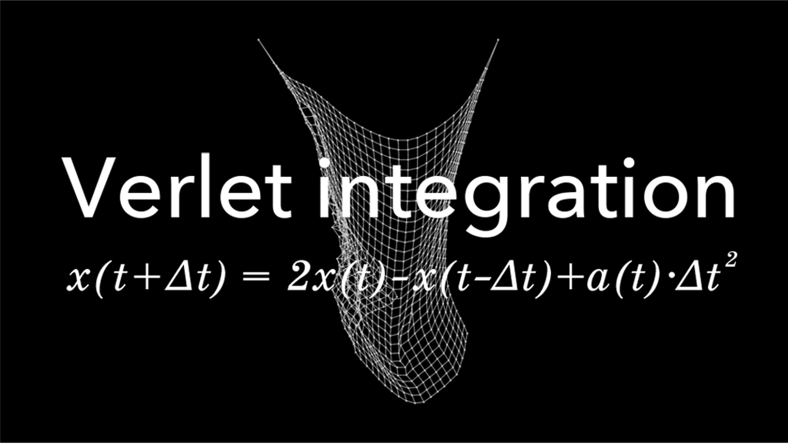

> **系列标签：** `知识文档` · `分子模拟` · `积分算法` · `MolSimulX`

力能算了（见 [截断长程力与近邻列表](K08-截断长程力与近邻列表.md)），还要把牛顿方程**往前推时间**：力场给出 $\mathbf{F}=m\mathbf{a}$，**积分器**根据位置、速度、力，把体系推进一个时间步 $\Delta t$。选错步长或算法，轻则能量漂移，重则体系「爆炸」。

本篇讲 Verlet 族积分器在干什么（正文以 MD 常用的 **Velocity Verlet** / Leap-frog 为主；与经典位置 Verlet 的对照见第三节）、$\Delta t$ 怎么估量级，以及为什么要先做 **NVE 能量检验**。

---

## 一、在算什么？

每个粒子服从牛顿第二定律：

$$
\mathbf{F}_i(t) = m_i \mathbf{a}_i(t) = -\nabla_i U(\mathbf{r})
$$

力场给出势能 $U$（从而给出力），积分器负责：已知 $t$ 时刻的 $\mathbf{r}$、$\mathbf{v}$（以及力），求出 $t+\Delta t$ 的新位置与速度。计算机不能连续积分，只能**一小步一小步**往前走——这一小步就是 $\Delta t$。

> **Tips：** 力场管「怎么推拉」；积分器管「怎么往前挪」。两者分开：换积分器一般不改物理模型，但会改数值稳定性与能量行为。

---

## 二、为什么不能随便离散？

最天真的做法是**欧拉法**：$\mathbf{v}\leftarrow\mathbf{v}+\mathbf{a}\Delta t$，再 $\mathbf{r}\leftarrow\mathbf{r}+\mathbf{v}\Delta t$。对 MD 几乎不可用——误差会系统性往一个方向堆，总能量很快漂掉，轨迹不可信。

MD 需要的积分器通常具备这些「好脾气」（入门记住名字即可）：

| 性质 | 直觉 |
|------|------|
| **辛（symplectic）** | 在**相空间**里不太「乱挤体积」，长期能量误差往往有界振荡，而不是单调狂漂 |
| **时间可逆** | 把速度反号、倒着积，理想情况下能走回去（与微观可逆性一致） |
| **每步力的次数少** | 力最贵；Velocity Verlet 一类通常每步主要算一次力 |

这里的**相空间**：把所有粒子的位置和动量（或速度）凑在一起，看成体系状态的一张「总账本」；轨迹就是账本上的一条路径。入门有这句图像即可，严格说法见加深篇 [统计力学基础与系综](K23-统计力学基础与系综.md)。

因此实践里几乎总是 **Verlet 族**（Velocity Verlet、Leap-frog 等），而不是常微分方程课里常见的**高阶 Runge–Kutta** 当默认。

> **Tips：** 「高阶」指局部截断误差随 $\Delta t$ 掉得更快（例如四阶方法误差 $\sim(\Delta t)^5$），短时间看可以很准。但经典 RK 往往**不辛**、且一步要算**多次力**——MD 要跑千万步、力又极贵，更看重长期能量行为与每步成本，所以默认仍是 Verlet 族。

---

## 三、Verlet 族：MD 的默认口音

封面图写的是**经典 Verlet**（又称 Störmer–Verlet、位置 Verlet）：下一步位置只靠「现在、上一步」的位置和当前加速度，**公式里不显式出现速度**：

$$
\mathbf{r}(t+\Delta t)
= 2\mathbf{r}(t) - \mathbf{r}(t-\Delta t) + \mathbf{a}(t)\,(\Delta t)^{2}
$$

（图里用标量 $x$；MD 里对每个粒子的三个分量同样写。）它辛、可逆、每步主要算一次力，是 Verlet 族的「祖式」写法。缺点是：速度不在公式正面，瞬时温度、动量要另算或另存，写轨迹时不如「位置 + 速度」直观。

### 1. Velocity Verlet：软件里更常见

实践里多数 MD 引擎默认的是 **Velocity Verlet**：把速度显式写进更新，位置与速度都落在同一套整数时间步上。位置更新正是泰勒展开到二阶的那一步：

$$
\begin{aligned}
\mathbf{r}(t+\Delta t)
&= \mathbf{r}(t) + \mathbf{v}(t)\,\Delta t + \tfrac12\mathbf{a}(t)\,(\Delta t)^{2} \\
\mathbf{v}(t+\Delta t)
&= \mathbf{v}(t) + \tfrac12\bigl[\mathbf{a}(t)+\mathbf{a}(t+\Delta t)\bigr]\Delta t
\end{aligned}
$$

读作：

1. 用当前速度与加速度，把位置推到下一步；  
2. 在**新位置**上算新力 / 新加速度 $\mathbf{a}(t+\Delta t)$；  
3. 用「旧加速度 + 新加速度」的平均，把速度更新到位。

和封面那条经典式**不是两套物理**，而是同一家族的不同记账方式：经典式用 $\mathbf{r}(t)$ 与 $\mathbf{r}(t-\Delta t)$ 隐含速度信息；Velocity Verlet 把 $\mathbf{v}$ 写开，并在半步意义上用新旧加速度平均更新速度。软件实现细节略有差别，能量行为同类。

> **Tips：** 看见图上的 $2x(t)-x(t-\Delta t)+a\Delta t^{2}$，不要和正文的 $\mathbf{r}+\mathbf{v}\Delta t+\tfrac12\mathbf{a}(\Delta t)^{2}$ 打架——前者是经典 Verlet，后者是 Velocity Verlet 的位置半步；MD 口语里常统称「Verlet」。

### 2. Leap-frog：半步错开

**Leap-frog** 把速度存在半整数步（$t+\tfrac12\Delta t$），位置在整数步，像青蛙跳一样交错前进。与 Velocity Verlet **在数学上密切相关**（常可互相改写），能量行为同类。你在文献或软件里看到 leap-frog / velocity-Verlet，多半仍是 Verlet 族的不同记账方式。

### 3. 其他名字（点到即可）

| 算法 | 何时会遇到 |
|------|------------|
| **经典 Verlet**（封面公式） | 教材推导、部分老代码；速度需另处理 |
| **Beeman** | 某些教材/老代码里的变体 |
| **RESPA**（多时间步） | 快力（键振动）小步积、慢力（长程非键）少算几次——进阶加速，参数要小心 |

入门先把 **Velocity Verlet + 合适 $\Delta t$** 跑稳，再考虑 RESPA。

---

## 四、时间步长 $\Delta t$：谁说了算？

### 1. 由最快运动决定

数值积分要能「看清」体系里**最快**的周期运动。粗经验：一个振动周期里至少要有大约 **10** 个时间步（量级说法，不是定理）。含氢全原子里，O–H / C–H 等**键伸缩**周期约十几飞秒，于是：

| 体系 | 典型量级 | 说明 |
|------|----------|------|
| 全原子（含 H 振动，柔性键） | **0.5–1 fs** | 最快振动限制步长 |
| 约束键长（SHAKE / LINCS 等） | **2 fs** 常见 | 去掉最快自由度后可加大；见 [键长键角约束与刚性](K10-键长键角约束与刚性.md) |
| 粗粒化 / 无氢快模 | 可更大 | 仍由剩余最快运动决定 |
| LJ 对比单位教学体系 | $0.005\,\tau$ 量级 | 见 [对比单位与无量纲化](K15-对比单位与无量纲化.md) |

**过大：** 能量不守恒、温度飞升、原子重叠、盒子「炸」。  
**过小：** 浪费算力——同样 10 ns 物理时间要多走很多步。

### 2. 先认一下「自由度」

后文和 [键长键角约束与刚性](K10-键长键角约束与刚性.md) 会反复说**自由度**（degrees of freedom）：体系还能**独立怎么动**的方式有多少种。

粗图像：三维里 $N$ 个互不约束的粒子，每个有 3 个独立方向可动，一共约 $3N$ 个自由度。若把某根键长钉死，就少掉一种独立运动——自由度减少，最快的那种振动往往也被拿掉，于是 $\Delta t$ 才放得大。  
温度公式里的「除以多少」也按自由度来数，约束后必须改——详见 [键长键角约束与刚性](K10-键长键角约束与刚性.md)。

### 3. 约束为什么能放大步长？

把键长钉死，等于从动力学里拿掉最快振动自由度，剩余运动更慢，$\Delta t$ 才能加大。这是**效率与模型简化**的权衡：约束后键长分布本身无意义，但对多数慢过程通常可接受。细节与温度自由度计数见 [键长键角约束与刚性](K10-键长键角约束与刚性.md)。

### 4. 和力计算的关系

$\Delta t$ 再合适，若截断不连续、近邻列表过期，能量照样漂——那些是力算错了，不是积分器单独的锅。见 [截断长程力与近邻列表](K08-截断长程力与近邻列表.md)。

---

## 五、先做 NVE 能量检验

纯积分（不加热浴/压浴）→ 近似 **NVE**：粒子数、体积固定，总能量 $E=K+U$ 应近似守恒。  
（要恒温/恒压时再叠加热浴、压浴，见 [常见系综与控温控压](K11-常见系综与控温控压.md)；系综图像见 [统计力学基础与系综](K23-统计力学基础与系综.md)。）

新体系上线前，用较短轨迹看：

| 看什么 | 正常大致长什么样 |
|--------|------------------|
| 总能量 $E(t)$ | 在均值附近小幅波动，无单调狂漂 |
| 动能 / 势能 | 彼此交换，和有起伏 |
| 温度 | 有涨落，但不应指数飞升 |

若 $E$ 明显漂移：优先查 $\Delta t$ 是否过大、约束是否收敛、截断/近邻列表、有无坏接触（先最小化，见 [能量最小化与预平衡](K12-能量最小化与预平衡.md)）。

> **Tips：** [常见系综与控温控压](K11-常见系综与控温控压.md) 里的热浴会往体系里泵/抽能量，**会掩盖**积分不稳。所以习惯是：先 NVE 确认「步子走得稳」，再开 NVT/NPT 做生产。

---

## 六、和控温控压的关系

积分器负责「怎么走一步」；要恒温/恒压，在积分循环中加入热浴、压浴（见 [常见系综与控温控压](K11-常见系综与控温控压.md)、[统计力学基础与系综](K23-统计力学基础与系综.md)）。它们改的是宏观约束如何施加，不是换一套牛顿定律。

加强抽样改变的是**采样方式**（偏置、加速跨越势垒），底层往往仍是同类积分，见 [增强采样与自由能](K14-增强采样与自由能.md)。

---

## 七、搭积分时的小清单

| 检查项 | 问自己 |
|--------|--------|
| 算法 | 默认 Velocity Verlet / Leap-frog 即可？ |
| $\Delta t$ | 是否匹配最快自由度？要不要上约束换 2 fs？ |
| NVE | 短跑能量是否守恒？ |
| 力 | 截断、近邻列表、静电是否已稳？见 [截断长程力与近邻列表](K08-截断长程力与近邻列表.md) |
| 下一步 | 要 NVT/NPT → [常见系综与控温控压](K11-常见系综与控温控压.md) |

---

## 八、小结

1. 积分器数值求解牛顿方程；MD 默认 **Verlet 族**（经典式见封面；软件常用 **Velocity Verlet / Leap-frog**——辛、可逆、每步力次数少）。  
2. $\Delta t$ 由**最快运动**决定；含氢柔性键常 0.5–1 fs，约束键长后常 2 fs。  
3. **先 NVE 检验能量**，再叠加热浴/压浴——热浴会掩盖积分问题。  
4. 能量漂移不一定是积分器：也查截断、近邻列表与初态重叠。  
5. 约束与步长配套见 [键长键角约束与刚性](K10-键长键角约束与刚性.md)。

---

## 学习路径

**前置阅读：** [截断长程力与近邻列表](K08-截断长程力与近邻列表.md) · [分子动力学模拟概述](K02-分子动力学模拟概述.md)

**下一步：**

- [键长键角约束与刚性](K10-键长键角约束与刚性.md) —— 常与步长配套：冻住快振动  
- [常见系综与控温控压](K11-常见系综与控温控压.md) —— 要 NVT/NPT 时选系综与热/压浴  
- [能量最小化与预平衡](K12-能量最小化与预平衡.md) —— 积分前先消坏接触  
- [统计力学基础与系综](K23-统计力学基础与系综.md) —— 相空间、系综（可稍后）  
