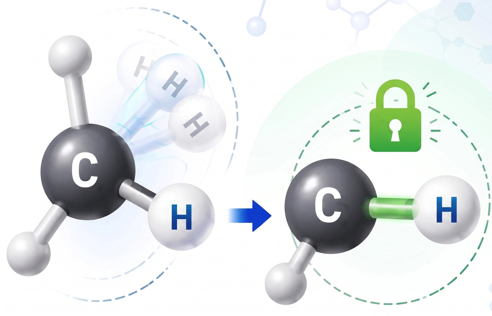

> **系列标签：** `知识文档` · `分子模拟` · `键长键角约束` · `MolSimulX`

积分器选好了（见 [积分算法与时间步长](K09-积分算法与时间步长.md)），全原子里含氢的键伸缩往往仍太快，把 $\Delta t$ 压到 **0.5–1 fs**。实践中常用**约束算法**把**键长**（有时**键角**）钉在平衡值，去掉最快自由度，步长常可提到 **2 fs** 量级——这是效率与模型简化之间的权衡。

本篇讲**键长 / 键角约束与刚性分子**在概念上做什么、和「力场里的键/角项」有何不同、对温度与动力学有何影响。**了解在干什么、自由度怎么数**即可，不必自己实现约束迭代——除非你要开发动力学引擎。

---

## 一、约束解决什么问题？

**含氢的共价键**（O–H、C–H 等）伸缩振动周期大约十几飞秒（波数约 3000 $\mathrm{cm}^{-1}$ 量级时，$T$ ~ 10 fs）。积分要「看清」最快运动，柔性键下 $\Delta t$ 常被压到 **0.5–1 fs**。若你真正关心的是溶剂结构、扩散、构象等**慢过程**，这些高频伸缩多半是累赘：吃步长、吃算力，对目标量贡献却有限。

注意：这里说的是分子内 **X–H 键伸缩**，不是分子间**氢键**（hydrogen bond）——后者更软、更慢，一般不是卡 $\Delta t$ 的那根弦。

| 不做约束 | 做键长约束 |
|----------|------------|
| 必须分辨最快振动 | 最快振动被「冻住」 |
| $\Delta t$ 更小，同样物理时间更多步 | $\Delta t$ 可加大（全原子常见 **2 fs**） |
| 键长在平衡值附近振荡 | 键长严格（或近似）固定在设定值 |

一句话：**用「钉死键长」换更大时间步**——模型略简化，效率明显提高。

> **Tips：** 约束不是「把力场里的键项删掉」那么简单。力场仍可保留键势能；约束是在每步积分后**（或同时）强制**几何满足 $|r_{ij}|=d_0$。软件里通常一开约束选项就自动处理，你要做的是选对约束哪些键、以及 $\Delta t$ 是否匹配。

---

## 二、和「力场里的键」有何不同？

| | **力场键项**（谐振子等） | **几何约束**（SHAKE 等） |
|--|--------------------------|---------------------------|
| 在干什么 | 键长偏离 $d_0$ 时产生恢复力，允许振动 | 每步把键长**钉回** $d_0$（或保持刚体几何） |
| 自由度 | 键伸缩仍是自由度 | 该伸缩自由度被拿掉 |
| 对 $\Delta t$ | 仍受振动频率限制 | 去掉最快模后可加大步长 |
| 键长分布 | 有宽度（温度相关） | 基本是一条线（钉死） |

两者可以同时存在于「模型描述」里，但开了硬约束后，键长分布本身不再有物理意义——你分析的应是角、二面角、径向分布等**未被钉死**的量。

数学上，这类「把某些内坐标钉死」的约束常称为**完整约束**（holonomic）：约束只依赖坐标（例如 $|r_i-r_j|-d_0=0$），不显式依赖速度。入门记住图像即可：在剩余自由度上继续做牛顿积分。

---

## 三、常见做法

### 1. 算法名字在软件里常看到

| 名称族 | 直观理解 | 何时会遇到 |
|--------|----------|------------|
| **SHAKE** | 积分后迭代修正**坐标**，直到约束满足 | 经典、普及；许多引擎的默认之一 |
| **RATTLE** | 在 SHAKE 思路上同时照顾**速度**，使速度也与约束相容 | 常与 Velocity Verlet 搭配 |
| **LINCS 等** | 另一类高效约束算法（矩阵/展开，细节因实现而异） | GROMACS 等里很常见 |
| **刚性分子 / 刚性水** | 整个分子当刚体，或键+角都固定 | TIP3P/SPC 等「刚性水」模型 |

不必纠结迭代公式：它们都在做同一件事——**每步结束后，被约束的几何重新成立**。失败时（迭代不收敛）日志常会报 constraint failure，多半是步长过大、结构重叠或坏接触。

### 2. 通常约束什么？

| 常见选择 | 说明 |
|----------|------|
| **只约束连氢的键** | 全原子最常见；去掉最快模，又尽量少动重原子骨架 |
| **约束所有键长** | 步长/稳定性上更激进；构象空间被多削掉一些 |
| **键长 + 某些角**（如水的 H–O–H） | 「刚性水」：分子内部几乎不再振动 |
| **冻住一组原子**（位置固定） | 另一类「约束」：墙、晶格、蛋白骨架预平衡等——见 [能量最小化与预平衡](K12-能量最小化与预平衡.md) |

> **注意：** 「刚性水」比「只约束 O–H 键长」更强：振动自由度更少，动力学、介电常数等可能与柔性水不同。和文献对比时，**水模型 + 是否刚性**必须一致。

### 3. 和步长怎么配套？

粗经验（全原子）：

- 柔性 X–H、无约束 → **0.5–1 fs**  
- 约束 X–H（或全部键长）→ **2 fs** 很常见  

步长放大的前提是：**剩下最快的运动仍能被 $\Delta t$ 分辨**。约束没开够却硬上 2 fs，或约束失败却继续跑，都会出问题。详见 [积分算法与时间步长](K09-积分算法与时间步长.md)。

---

## 四、对温度定义的影响

**自由度**回顾：体系还能**独立怎么动**的方式有多少种。三维里 $N$ 个互不约束的粒子，约 $3N$ 个平动自由度；动能温度按这些自由度均分能量。

无约束时常用：

$$
\frac{1}{2}\sum_i m_i v_i^2 = \frac{3N}{2} k_B T
$$

有 $N_c$ 个**独立**约束后，分母变为 $3N - N_c$（再视是否去掉质心平动/转动等做修正）：

$$
\frac{1}{2}\sum_i m_i v_i^2 = \frac{3N - N_c}{2} k_B T
$$

**热浴若按错误自由度标度温度，平均 $T$ 会系统性偏差**——日志里「温度到了」，实际动能可能一直偏一截。好消息是：主流软件在开启 SHAKE/LINCS 时通常会**自动**扣自由度；你要做的是别手动改错、并在 Methods 写清约束与步长。

> **Tips：** Methods 里建议写明：哪些键/角被约束、时间步长、热浴类型——审稿人常查这三项是否自洽。热浴细节见 [常见系综与控温控压](K11-常见系综与控温控压.md)。

---

## 五、对动力学与采样的影响

约束改的是高频振动，对多数「慢」问题通常可接受，但心里要有数：

| 影响 | 说明 |
|------|------|
| **键长分布** | 被钉死，分析它没有意义 |
| **慢过程**（扩散、多数构象） | 通常影响较小，这正是约束的使用场景 |
| **振动光谱 / 某些介电与动力学细节** | 可能与柔性模型不同；要比实验光谱时需谨慎 |
| **过约束** | 把不该冻的角、二面角相关几何也冻住，可能改变构象平衡 |

实践原则：

- 约束与 $\Delta t$、热浴**一起**选，不要只改其中一个；  
- 和文献比性质时，对齐「约束了什么 + 步长 + 水模型」；  
- 预平衡阶段有时先约束重原子/骨架，再逐步放开——那是流程技巧，见 [能量最小化与预平衡](K12-能量最小化与预平衡.md)。

---

## 六、实践中的小清单

| 检查项 | 问自己 |
|--------|--------|
| 要不要约束 | 含氢全原子、想用 ~2 fs？→ 通常要 |
| 约束范围 | 只连氢的键，还是全键 / 刚性水？与文献一致吗？ |
| $\Delta t$ | 是否与约束配套？未约束却用 2 fs？ |
| 温度 | 软件是否按约束后自由度算 $T$？ |
| 日志 | 有无 constraint failure / 迭代不收敛？ |
| 下一步 | 约束与步长稳了 → [常见系综与控温控压](K11-常见系综与控温控压.md) |

---

## 七、小结

1. 约束去掉最快振动（常为含氢的 X–H 伸缩），用模型简化换更大 $\Delta t$（全原子常见 2 fs）。  
2. 几何约束 ≠ 力场键项：前者钉死键长，后者允许振动。  
3. SHAKE / RATTLE / LINCS 等是实现手段；你在软件里选项即可，不必手写迭代。  
4. 自由度减少 → 温度公式分母要改；主流软件通常自动处理。  
5. 刚性程度影响可对比性；与文献保持「约束 + 步长 + 水模型」一致。

---

## 学习路径

**前置阅读：** [积分算法与时间步长](K09-积分算法与时间步长.md)

**下一步：**

- [常见系综与控温控压](K11-常见系综与控温控压.md) —— NVE/NVT/NPT 怎么选；热浴与自由度衔接  
- [能量最小化与预平衡](K12-能量最小化与预平衡.md) —— 开跑前的流水线；常与位置约束联用  
- [经典全原子力场](K03-经典全原子力场.md) —— 键/角项与约束分别管什么  
