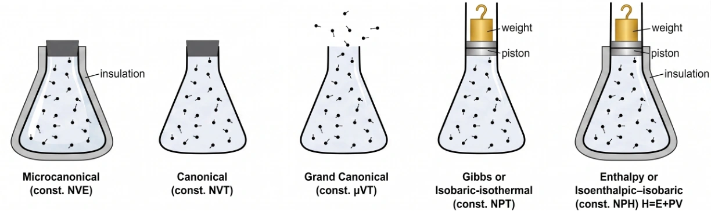

> **系列标签：** `知识文档` · `分子模拟` · `系综` · `MolSimulX`

积分与约束解决的是「怎么往前走」（见 [积分算法与时间步长](K09-积分算法与时间步长.md)、[键长键角约束与刚性](K10-键长键角约束与刚性.md)）；开跑前还要定一件事：**你在什么宏观条件下采样？**  

实验室说「300 K、1 bar 下的液体密度」——模拟也必须说清固定了什么、允许什么涨落。统计力学把这类「宏观条件」叫作**系综（ensemble）**。

本篇讲几种常见系综：**各像什么、什么时候用、软件里靠什么实现**。热浴 / 压浴只是实现 NVT、NPT 的工具，不是另一套力场。  

系综、时间平均与系综平均的严格说法，放到加深篇 [统计力学基础与系综](K23-统计力学基础与系综.md) ——流程跑通后再读更有感觉，**了解选哪个、错了会怎样**即可。

---

## 一、先看懂封面：五种「烧瓶」

可以把体系想成一只烧瓶里的粒子。瓶口、保温层、活塞，分别管住不同的宏观量：

| 封面标签 | 固定什么 | 图像 | 入门何时用 |
|----------|----------|------|------------|
| **NVE**（微正则） | 粒子数 $N$、体积 $V$、能量 $E$ | 塞紧 + **保温**，与外界不换热 | 检查能量守恒、短时动力学 |
| **NVT**（正则） | $N$、$V$、温度 $T$ | 塞紧，但与**热浴**接触以恒温 | 升温、平衡化、固定盒子时的结构 |
| **μVT**（巨正则） | 化学势 $\mu$、$V$、$T$ | **开口**，粒子可进出 | 吸附等温线等（常与 MC 联用） |
| **NPT**（等温等压） | $N$、压强 $P$、$T$ | **活塞 + 砝码**，体积可伸缩 | 液体密度、体相平衡（最常用之一） |
| **NPH**（等焓等压） | $N$、$P$、焓 $H=E+PV$ | 活塞 + **保温** | 较少见；知道有这号即可 |

> **Tips：** 字母记不住时看图像：保温 ≈ 能量（或焓）不与外界交换；活塞 ≈ 压强固定、体积可变；开口 ≈ 粒子数可变。严格定义与「为什么时间平均能当系综平均」见 [统计力学基础与系综](K23-统计力学基础与系综.md)。

下面按入门最常碰到的 **NVE → NVT → NPT** 展开；μVT、NPH 点到为止。

---

## 二、NVE：理想「保温杯」

**图像：** 瓶口塞死、外面裹保温层——粒子数、盒子大小、总能量都近似不变。

裸积分牛顿方程（不加控温控压），天然接近 **NVE**：动能与势能可以互换，但总和 $E=K+U$ 应近似守恒。

这里能量守恒，靠的是力来自势能梯度 $\mathbf{F}=-\nabla U$ ——即[经典全原子力场](K03-经典全原子力场.md) 里说的**保守力**。键、LJ、库仑都是先写 $U$ 再取力；理想情况下（积分也够准）机械能不漂。一旦打开热浴，方程里往往多出**非保守**的泵能 / 抽能项，$E=K+U$ **故意不再守恒**——那是为了把温度按在设定值，不是积分坏了。

| 适合 | 不适合 |
|------|--------|
| 检验积分是否稳、能量漂不漂 | 直接和「恒温恒压实验」比密度 |
| 看短时动力学、少人为扰动 | 长时间生产段（温度会自己晃，且难对齐实验 $T$） |

> **Tips：** 新体系习惯先短跑 **NVE** 看能量，再开 NVT/NPT——热浴会往体系里泵/抽能量，**掩盖**积分不稳。见 [积分算法与时间步长](K09-积分算法与时间步长.md)。

---

## 三、NVT：恒温槽里的固定盒子

**图像：** 瓶子还是那么大（$V$ 固定），但不再完全保温——和一只大「热浴」接触，把平均温度按在设定值 $T_0$。

### 1. 什么时候用？

- 升温、预平衡；  
- 盒子体积已经对（或你故意固定体积）；  
- 关心结构、能量，且暂时不需要体积自己调。

**想和实验比液体密度时，NVT 往往不够：** 密度被你用盒子钉死了，比出来没有意义——这时该用下面的 NPT。

### 2. 热浴在干什么？（工具，不是系综本身）

热浴（thermostat）= 软件里用来实现「平均温度 ≈ $T_0$」的算法。常见门派：

| 类型                      | 含义                   | 优点             | 注意                                 |
| ----------------------- | -------------------- | -------------- | ---------------------------------- |
| **速度标度**（含简单 Berendsen） | 隔一会儿把速度整体乘个因子，拉回目标温度 | 简单、升温快         | 温度涨落被压扁；耦合太强会扭曲动力学                 |
| **Nosé–Hoover（链）**      | 多几个「虚拟」自由度，和体系一起演化   | 合适条件下更接近正确正则分布 | 弛豫时间要设合理；有的体系要用「链」                 |
| **Langevin / 随机热浴**     | 摩擦 + 随机踢，边耗散边补能      | 稳健、好控温         | 摩擦太大 → 扩散变慢、动力学失真；机械能**不守恒**（非保守力） |

没有一种热浴处处最优——**看你生产段要报什么**：

| 你更关心                             | 热浴宜怎样                  | 为什么                                    |
| -------------------------------- | ---------------------- | -------------------------------------- |
| **结构 / 热力学**（径向分布、密度、平均能量、比热量级）  | 耦合可稍强，控温稳一点通常够用        | 这些量主要看构型与能量统计，对速度涨落细节不那么敏感             |
| **动力学 / 光谱**（扩散系数、速度自相关、振动/红外光谱） | 宜**弱耦合**，或已验证热浴对目标量影响小 | 热浴直接改速度（标度、摩擦、随机力），耦合太强会**人为压慢扩散、扭曲谱** |

> **Tips：** 平衡化可用较强耦合快速到位；**生产段若要报扩散系数等输运系数**，宜较弱耦合或已验证影响小的设置，并在 Methods 写清。Langevin 里「力场保守力 + 摩擦/随机」的分工见[朗之万、布朗与溶剂介质方法](K25-朗之万布朗与溶剂介质方法.md)；保守力从哪来见[经典全原子力场](K03-经典全原子力场.md)。

### 3. 温度怎么数？

瞬时温度通常由动能定义。若开了键长/键角约束，自由度要扣掉约束数，否则 $T$ 会系统性偏——主流软件一般会自动处理。见 [键长键角约束与刚性](K10-键长键角约束与刚性.md)；温度、压强与表面张力的定义与报告约定见 [温度、压强与表面张力](K19-温度压强与表面张力.md)。

---

## 四、NPT：恒温恒压（体积会动）

**图像：** 瓶口上有活塞和砝码——压强由砝码「压住」，体积可以胀缩；同时仍与热浴接触以恒温。这就是实验里最常见的「某温度、某大气压下」的液体条件。

### 1. 什么时候用？

- 要比**密度**、体相平衡；  
- 想让盒子自己找到与 $P_0$、$T_0$ 相容的体积；  
- 多数溶液、液体体相的生产段默认选项之一。

体积变化会带动密度、结构、扩散一起变——这是 NPT 的目的，不是 bug。

### 2. 压浴在干什么？

压浴（barostat）= 让平均压强 ≈ $P_0$、允许体积（或盒子形状）变化的算法。

| 概念 | 含义 |
|------|------|
| **各向同性** | 盒子三个方向一起缩放 → 普通液体体相 |
| **半各向同性 / 各向异性** | 不同方向独立调 → 膜、界面、某些晶体 |
| **耦合强弱** | 太强 → 体积狂抖；太弱 → 压强长期偏着回不来 |

NPT 里通常**热浴 + 压浴一起开**。名字因软件而异（Berendsen、Parrinello–Rahman、Monte Carlo barostat 等），入门先分清「我要各向同性还是膜几何」。

---

## 五、μVT 与 NPH：知道有这号

### 1. μVT（巨正则）

**图像：** 烧瓶**开口**，粒子可以飞进飞出；固定的是化学势 $\mu$、体积、温度。

典型用途：吸附、孔道里的粒子数由化学势决定。经典 MD 里不如 NVT/NPT 常见，常与**蒙特卡洛**联用。需要时见 [分子动力学与蒙特卡洛](K24-分子动力学与蒙特卡洛.md)；概念加深仍归 [统计力学基础与系综](K23-统计力学基础与系综.md)。

### 2. NPH

**图像：** 有活塞（恒压），同时又保温；固定 $N$、$P$ 与焓 $H=E+PV$。

入门很少作为默认生产系综；封面有它，是为了和 NPT、NVE 对照完整。遇到文献再查即可。

---

## 六、怎么选？一张决策表

| 你的目标 | 更常选 | 原因 |
|----------|--------|------|
| 检查积分 / 能量漂不漂 | **NVE** | 少人为泵能，问题暴露得快 |
| 升温、结构弛豫，盒子已定 | **NVT** | 恒温，体积固定 |
| 和实验比液体**密度**、体相 | **NPT** | 体积可变，压强对齐实验 |
| 膜 / 界面，法向压强或面积另有要求 | **NPT** 变体（半各向同性等） | 不同方向自由度不同 |
| 吸附、粒子数由化学势定 | **μVT**（常 + MC） | 开口体系 |

**选错的典型后果：** 想比密度却钉死体积跑 NVT——密度是你设的，不是算出来的。

---

## 七、实践小清单

| 检查项 | 问自己 |
|--------|--------|
| 系综 | 要比什么？密度 → 优先 NPT；先检验积分 → NVE |
| 热浴 | 平衡化可否强一点？生产段是否要弱耦合（尤其报扩散时） |
| 压浴 | 各向同性还是膜/界面？耦合会不会太猛 |
| 约束 | 自由度与温度是否自洽？见 [键长键角约束与刚性](K10-键长键角约束与刚性.md) |
| Methods | 是否写清：系综、热浴/压浴类型、目标 $T$/$P$、耦合参数 |
| 下一步 | 设置齐了 → [能量最小化与预平衡](K12-能量最小化与预平衡.md) |

---

## 八、小结

1. **系综**规定固定哪些宏观量；封面五种烧瓶是入门地图，严格说法见 [统计力学基础与系综](K23-统计力学基础与系综.md)。  
2. **NVE** ≈ 保温杯：适合检验能量；裸积分 + **保守力**（力场）天然接近它。  
3. **NVT** ≈ 恒温固定盒子：靠**热浴**实现（常引入非保守项）；不适合「钉死体积却要比密度」。  
4. **NPT** ≈ 活塞恒温恒压：靠热浴 + **压浴**；液体密度与体相最常用。  
5. **μVT / NPH** 知道图像即可；吸附等多看巨正则与 MC。  
6. 热浴/压浴是**实现工具**，不是力场；生产段参数要服务你的目标量（要结构/热力学，还是要扩散/光谱）。

---

## 学习路径

**前置阅读：** [积分算法与时间步长](K09-积分算法与时间步长.md) · [键长键角约束与刚性](K10-键长键角约束与刚性.md)

**下一步：**

- [能量最小化与预平衡](K12-能量最小化与预平衡.md) —— 设置齐了，按流程开跑  
- [平衡判据与收敛](K13-平衡判据与收敛.md) —— 温度到了 ≠ 平衡了  
- [统计力学基础与系综](K23-统计力学基础与系综.md) —— 系综与平均的严格说法（可稍后）  
- [朗之万、布朗与溶剂介质方法](K25-朗之万布朗与溶剂介质方法.md) —— 随机热浴的近亲  
