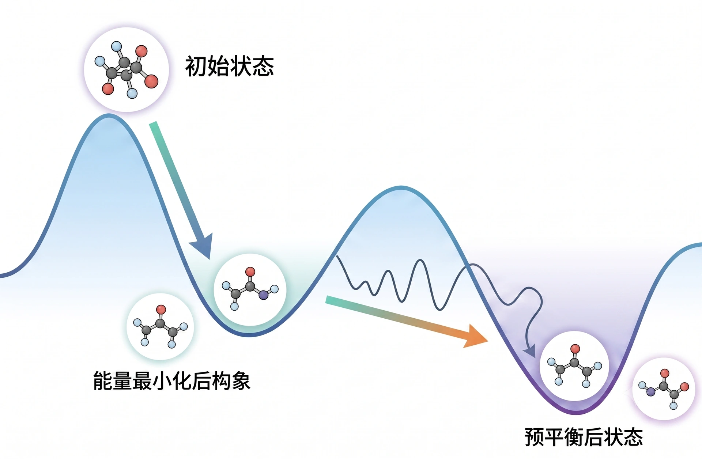

> **系列标签：** `知识文档` · `分子模拟` · 能量最小化 · `预平衡` · `MolSimulX`

盒子、力、积分、系综都齐了（见 [边界条件与初始条件](K07-边界条件与初始条件.md)、[常见系综与控温控压](K11-常见系综与控温控压.md)），还不能直接当「生产数据」用。从「刚搭好的盒子」到「可分析的生产轨迹」，中间通常有一段**标准化流水线**：消除坏接触 → 升温/加压到位 → 丢掉未平衡段 → 再采集。跳过这一段，后面算出的 RDF、扩散往往在描述「还在松弛的体系」。

本篇讲各阶段在概念上**干什么、为什么、常见怎么排**。具体「算不算平衡」的判据见下一篇[平衡判据与收敛](K13-平衡判据与收敛.md)，**了解流程与目的**即可，不必自己写优化器。



---

## 一、为什么不能直接开跑生产？

刚搭好的结构（Packmol、晶体超胞、从 PDB 溶剂化……）常见坑：

| 问题 | 会怎样 |
|------|--------|
| 原子重叠或过近 | LJ 排斥爆炸 → 第一步就「炸盒子」 |
| 密度 / 盒子离目标很远 | 后面长时间只是在找平衡，不像在采样 |
| 速度与结构未匹配 $T$、$P$ | 温度、压强乱晃，结构还在猛变 |
| 高能局部应力（扭歪的环、挤坏的侧链） | 动力学早期被应力主导，不像目标态 |

所以习惯上先做两件事：

1. **能量最小化**：只动坐标、沿势能往下走，去掉最狠的坏接触；  
2. **预平衡 / 平衡化**：再开动力学，把 $T$、$P$、密度、结构弛豫到目标附近——这段一般**丢掉不分析**。

> **Tips：** 「预平衡」有时泛指最小化之后、生产之前的整段；有时特指已经到目标 $T$/$P$ 后、还在等平台的那一段。本文两者都覆盖；Methods 里写清各段时长即可。

---

## 二、能量最小化：先把「刺」拔掉

### 1. 在干什么？

**能量最小化**（energy minimization / geometry optimization）= 暂时不做牛顿积分，只根据力（$-\nabla U$）调整原子坐标，让势能 $U$ 降下来。

图像：粒子挤在势能的陡坡上，先让它们滑到附近的「坑底」或缓坡，再开始热运动。它**不**保证找到全局最优构象，只求去掉最危险的重叠与应力。

### 2. 常见算法

| 名字 | 含义 | 何时常见 |
|------|------|----------|
| **最陡下降**（steepest descent） | 顺着当前力的方向走 | 开头粗暴去重叠，稳 |
| **共轭梯度**（conjugate gradient） | 用更聪明的搜索方向 | 重叠不太狠之后细化 |
| **L-BFGS 等** | 准牛顿类，往往收敛更快 | 视软件支持 |

入门不必纠结公式：软件里选 minimize，设最大步数 / 力收敛阈值即可。力降不下去或步数用尽仍很大 → 多半还有重叠或盒子/拓扑有问题，应回查结构，而不是硬开 MD。

### 3. 最小化之后呢？

最小化只处理坐标，**通常不给物理温度下的速度分布**。下一步仍要：赋初速（或由热浴拉起来）→ 进入动力学平衡化。见 [边界条件与初始条件](K07-边界条件与初始条件.md) 的初速一节。

---

## 三、典型概念流程

```
初始结构（建模 / 堆积 / 溶剂化）
    → 能量最小化（去坏接触）
    → （可选）位置约束下短时弛豫：先冻重原子/骨架，松溶剂
    → 升温到目标 T（常 NVT）
    → 加压 / 调密度到目标（常 NPT）
    → 平衡化：监控密度、能量、序参量… 直到平台
    → 生产段：只保留此段做分析
```

| 阶段       | 目的           | 分析时            |
| -------- | ------------ | -------------- |
| 最小化      | 稳定结构，避免第一步爆炸 | 一般不计入统计        |
| 约束弛豫（可选） | 先稳溶剂/侧链，再放溶质 | 丢弃             |
| 升温 / 加压  | 到达目标宏观条件     | 丢弃             |
| 平衡化      | 宏观量与慢变量弛豫到平台 | 丢弃             |
| 生产       | 在目标态采样       | **用于** RDF、扩散等 |

生物体系里「先约束蛋白重原子、松溶剂 → 再放侧链 → 再全放开」很常见；简单液体往往最小化后直接 NVT→NPT 即可。原则都是：**先稳容易炸的部分，再逐步放开自由度**。

---

## 四、平衡化阶段：在等什么？

平衡化（equilibration）= 已经在目标系综附近跑动力学，但体系还在「找地方待着」。你要等的是：

- 温度、压强、密度、能量在目标附近**平台振荡**（不是单向漂移）；  
- NPT 下体积不再系统性胀缩；  
- 与问题相关的**慢量**也稳了：界面位置、盒形状、大分子回转半径、吸附量等。

「跑了 1 ns」本身**不是**判据——有的体系 100 ps 就平台，有的构象要几十 ns 仍在变。怎么画曲线、怎么切生产段，见 [平衡判据与收敛](K13-平衡判据与收敛.md)。

> **注意：** 热浴可以很快把**温度**拉到 300 K；结构、密度、界面可能还在慢悠悠松弛。只看温度「到了」就进生产，是新手最常见的坑之一。

### 有时先「热一点」再回到目标温度

结构松弛（消应力、重排溶剂壳、软物质构象挪动）往往比温度平衡慢得多。同一目标态下，**适当抬高温度做一段平衡化**，粒子动能更大、越过浅势垒更容易，有时能**更快**把密度、界面、局部堆叠赶到平台附近；再**降温（anneal）回目标 $T$**，短跑稳住后，才进生产段。

常见排法示意：

```
最小化 → 升温到偏高 T（如目标 300 K 时用 350–400 K 一类，视体系）
    → 在高温下 NVT / NPT 松弛一段时间
    → 降至目标 T，再平衡一小段
    → 生产（只在目标条件下采样）
```

| 要点 | 说明 |
|------|------|
| **为什么有效** | 稍高温度加快结构探索；纯粹在目标 $T$ 干等，可能长时间卡在初态附近 |
| **必须降温** | 生产与文献对比必须在**目标温度**；高温轨迹不能直接拿来报密度、扩散、RDF（除非课题本身就是该高温） |
| **别太狠** | 过高会破坏应保持的结构（如晶体有序、特定相）、诱发不想要的相变，或让弱约束体系「散架」；幅度与时长看体系，没有万能数字 |
| **写进 Methods** | 最高温度、各段时长、如何降温；读者才能判断松弛是否合理 |

液体、混合物、界面溶剂重排等软体系里，这种「先热后冷」较常见；有明确相稳定性顾虑时，优先加长目标温度下的平衡，而不是盲目加温。是否已经松到位，仍看平台判据——见 [平衡判据与收敛](K13-平衡判据与收敛.md)。

### 非平衡模拟也先平衡

上面流水线看起来像为「平衡态生产」写的，但做**非平衡**（剪切、热流、电场等驱动测响应）时，一般也**先走完最小化 + 平衡化**，再在已经平台的体系上**打开外场 / 驱动**。

原因很简单：若盒子还在松弛密度、消应力，你测到的通量里会混进「还没安顿好」的瞬态，和外场引起的响应缠在一起，线性区外推、粘度/热导都会难看清。常见排法是：

```
最小化 → 平衡化到平台（无驱动）
    → 施加剪切 / 热流 / 电场等
    → （可选）再等一段驱动下的稳态
    → 再采通量、应力等非平衡观测量
```

驱动算法与线性区见 [非平衡分子动力学概述](K22-非平衡分子动力学概述.md)；本篇只要记住：**外场通常加在「已经平衡过的初态」上，而不是刚搭好的毛坯盒子上。**

> **Tips：** Methods 里写清：无驱动平衡了多久、何时打开驱动、驱动下是否又丢弃了一段瞬态。只写「跑了 NEMD」不够复现。

---

## 五、常见策略（原则）

1. **先稳结构，再放自由度**——先约束重原子 / 晶格 / 溶质，松溶剂；再逐步取消约束。  
2. **先 NVT 再 NPT**——温度大致到位后，再让体积调节，减少早期「体积狂奔」。系综选择见 [常见系综与控温控压](K11-常见系综与控温控压.md)。  
3. **多段短跑优于一段瞎跑**——每段看日志（能量、密度、约束是否失败）；异常早停、回查。  
4. **生产段单独存轨迹 / 单独标记**——分析时不要把升温段、体积还在漂的段算进去。  
5. **耦合可前紧后松**——平衡化热浴/压浴可稍强，生产段若要报扩散则宜弱（见 [常见系综与控温控压](K11-常见系综与控温控压.md)）。  
6. **结构难松时可先偏高 $T$ 再降回目标**——加快消应力 / 堆叠重排；生产必须在目标条件下；幅度与相稳定性要心里有数（见上文）。  
7. **写进 Methods**——最小化方法、各段系综与时长（含是否高温松弛）、丢弃多长、生产多长；别人才能复现。

---

## 六、实践小清单

| 检查项 | 问自己 |
|--------|--------|
| 最小化 | 力/能量是否降到合理？还有没有明显重叠？ |
| 分段 | 是否 NVT→NPT（或你的问题需要的顺序）？ |
| 约束 | 预平衡用的位置约束是否已按计划放开？ |
| 日志 | 密度/能量/体积是平台还是单向漂？ |
| 慢变量 | 与结论相关的量看了没有？（不只看 $T$） |
| 文件 | 生产段轨迹是否与平衡化分开？ |
| 非平衡 | 若要加剪切/热流/电场：是否先无驱动平衡到平台再打开？ |
| 下一步 | 判据与「够不够长」→ [平衡判据与收敛](K13-平衡判据与收敛.md) |

---

## 七、小结

1. **最小化**解决坏接触与高应力，避免动力学第一步爆炸；不代替平衡化。  
2. **预平衡 / 平衡化**把体系送到目标 $T$、$P$、结构附近；这段**丢掉不分析**。  
3. 只有**生产段**应进入正式统计（RDF、扩散等）。  
4. 常见排法：最小化 →（可选约束弛豫）→ NVT 升温 → NPT 调密度 → 等平台 → 生产；结构难松弛时可穿插**偏高温度松弛再降回目标 $T$**。  
5. **非平衡**一般也先无驱动平衡到平台，再施加外场；驱动下的瞬态同样常丢弃一段（见 [非平衡分子动力学概述](K22-非平衡分子动力学概述.md)）。  
6. 「温度到了」≠ 平衡了；高温松弛段也不能直接当生产数据。收敛判据见 [平衡判据与收敛](K13-平衡判据与收敛.md)，误差见 [统计误差与块平均](K17-统计误差与块平均.md)。

---

## 学习路径

**前置阅读：** [常见系综与控温控压](K11-常见系综与控温控压.md) · [边界条件与初始条件](K07-边界条件与初始条件.md)

**下一步：**

- [平衡判据与收敛](K13-平衡判据与收敛.md) —— 怎么判断可以进生产段  
- [轨迹分析与宏观性质](K16-轨迹分析与宏观性质.md) —— 生产段之后怎么读结果  
- [非平衡分子动力学概述](K22-非平衡分子动力学概述.md) —— 平衡好之后如何加驱动测响应  
- [增强采样与自由能](K14-增强采样与自由能.md) —— 普通平衡化采不到的稀有事件  
