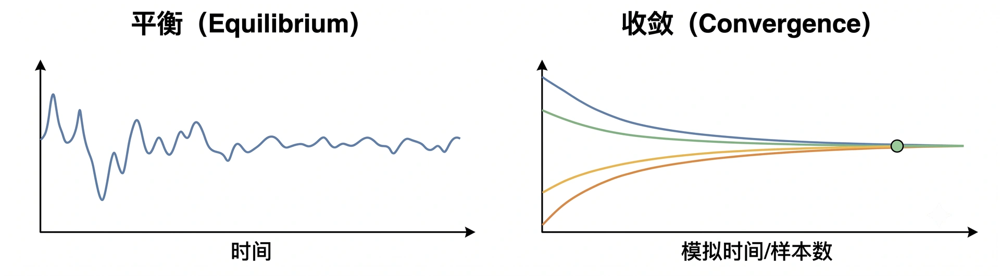

> **系列标签：** `知识文档` · `分子模拟` · 平衡 · `收敛` · `MolSimulX`

预平衡跑完了（见 [能量最小化与预平衡](K12-能量最小化与预平衡.md)），还要回答两件事：

1. **平衡了没有？**——宏观量是否已在目标态附近稳定波动，可以开始「正式采样」；  
2. **采够了没有？**——生产段是否长到能撑住你要报的平均值（及误差）。

这两件事在口语里都叫「收敛」，但**判据不同**。「跑完了 / 日志没报错」不等于「平衡了」，更不等于「平均值已经可信」。

非平衡（剪切、热流、电场等）多一层：无驱动先平衡 → 打开驱动 → 再等**驱动下的稳态**，才谈通量平均。流程衔接见 [能量最小化与预平衡](K12-能量最小化与预平衡.md)；算法与线性区见 [非平衡分子动力学概述](K22-非平衡分子动力学概述.md)。

本篇把平衡 / 非平衡两侧的「收敛」分开讲清，并给可操作的检查清单。误差条怎么算见 [统计误差与块平均](K17-统计误差与块平均.md)；日常是看曲线、切分段、写 Methods——不必自己推导统计公式。

---

## 一、先把「收敛」两个意思拆开

| 说法 | 在问什么 | 大致判据 | 不过关时怎么办 |
|------|----------|----------|----------------|
| **平衡化收敛** | 体系是否已到目标态附近、可以开始统计 | 关键量从**单向漂移**变成**绕平台振荡** | 加长平衡化，或检查系综/初态/慢变量 |
| **生产段收敛**（采样充足） | 这段轨迹算出的平均值是否稳得住 | 前后分段均值一致；再延长也不乱飘；误差合理 | 加长生产、加独立重复，或回头怀疑还没平衡 |
| **非平衡定态**（若做 NEMD） | 驱动下通量/剖面是否可平均 | 瞬态已过；应力/热流等绕平台；线性区另检 | 加长驱动下弛豫、减弱驱动，或检查热浴与盒子 |

可以记：

> **平衡** = 「待的地方对了」；**采够** = 「在这个地方待得够久、逛得够开」。

两者都过关，报出来的密度、RDF、扩散才像「目标条件下的结果」，而不是「还在松弛时的快照平均」。

> **Tips：** 有人把「能量曲线变平」叫收敛，有人把「误差条不再随时间缩短」叫收敛——对话时先问清指哪一种，避免各说各话。

---

## 二、平衡化：从漂移到平台

### 1. 眼睛看什么？

把关键量对时间画出来（不要只看最终一个平均数）：

| 观察 | 未平衡（还在漂） | 大致平衡（可考虑进生产） |
|------|------------------|--------------------------|
| 密度 / 体积（NPT） | 单向胀或缩 | 绕均值上下抖 |
| 势能、总能量 | 持续降或爬 | 平台 + 涨落 |
| 温度、压强 | 均值系统性偏离设定 | 均值接近设定（仍有涨落） |
| 问题相关慢量 | 仍在演化 | 稳定或进入稳态循环 |

「平台」不是一条死直线——有涨落才正常。你要警惕的是**有方向的慢漂移**：例如密度每个 ns 都往上拱一截，那还在找平衡。

### 2. 只看温度不够

热浴可以很快把**瞬时温度**拉到 300 K；结构、密度、界面、大分子构象可能还在慢悠悠变。  
所以：**温度到了 ≠ 平衡了。** 至少再看能量/密度；课题相关的慢量更要看。

### 3. 慢过程要用「对的量」

能量已经平台，不代表相分离、吸附、蛋白结构域运动也结束了——那些时间尺度可以长得多。要用**与结论相关的序参量**当判据（界面位置、晶核大小、回转半径、某二面角分布等）。见 [序参量与相变](K20-序参量与相变.md)。

> **Tips：** 平衡化段默认**丢掉不分析**；Methods 写明丢弃多长。进生产的起点，应是你认为「已经平台」之后，而不是文件的第 0 帧。

---

## 三、生产段：平均是否稳得住？

假设你已经切出一段「生产轨迹」，要报 $\langle A\rangle$（密度、某能量、某序参量……）。最少做这几步：

### 1. 前后分段比一比

把生产段切成前半 / 后半（或更多块）：

- 两段均值是否在合理误差内一致？  
- 若差很多：可能**还没平衡**（漂移被你当成生产），或**采得太短**（慢涨落没平均掉）。

不是「再对整段求一次平均」就能救——整段若仍含漂移，平均只是把偏差洗得更像一个数。

### 2. 再跑长一点试探

把生产再延长一倍（或从中点再开一段）：

- 中心值几乎不动 → 采样对这个量大概够用（仍要配误差条）；  
- 中心值还在明显挪 → 加长，或回头检查平衡化。

### 3. 和「误差估计」的关系

「均值稳不稳」和「误差条多大」是一家的：帧与帧相关，有效样本远少于帧数。生产时长 ideally ≫ 该量的自相关时间；具体怎么分块、怎么报 $\pm$，见 [统计误差与块平均](K17-统计误差与块平均.md)。

本篇先记住：**没有误差意识的「已经收敛」往往是错觉。**

### 4. 独立重复更狠、也更有用

不同初速或不同初构的**独立重复**，比单条超长轨迹更能暴露：

- 是否困在不同亚稳态；  
- 你的误差是否被自相关骗小了。  

入门课题至少心里要有「一条轨迹讲故事有风险」；正式结论尽量重复。

---

## 四、两种「假收敛」（常见误解）

| 误解 | 更准确的说法 |
|------|----------------|
| 「跑了 10 ns = 平衡了」 | 时长只是成本；看曲线是否平台 |
| 「温度到了 = 可以分析了」 | 热浴强行拉 $T$；结构可能仍在变 |
| 「帧数很多 = 统计很准」 | 相邻帧高度相关；要看有效样本 / 块平均 |
| 「能量平了 = 什么都平了」 | 慢序参量可能还在爬 |
| 「前后半段差不多 = 绝对正确」 | 可能一起偏在错误阱里；独立重复能打脸 |
| 「普通 MD 采不到就再跑长一点」 | 稀有事件可能指数罕见，该考虑 [增强采样与自由能](K14-增强采样与自由能.md) |
| 「一开剪切就能报粘度」 | 驱动瞬态未过、未进稳态，或未检验线性区（见第五节） |

---

## 五、非平衡：多出来的两段「收敛」

[能量最小化与预平衡](K12-能量最小化与预平衡.md) 已说过：非平衡一般也**从一个已平衡的体系**再加外场。判据上，至少要分清四段：

| 阶段 | 在问什么 | 大致看什么 |
|------|----------|------------|
| **① 无驱动平衡化** | 初态是否已到目标 $T$、$P$、结构平台 | 与第二节相同：密度/能量/慢量平台 |
| **② 驱动开启后的瞬态** | 通量、应力、温度剖面是否还在建立 | 应力/热流/电流等**单向爬升或过冲** → 通常**丢掉** |
| **③ 驱动下稳态** | 是否进入可平均的非平衡定态 | 通量绕平台振荡；剖面形状稳定 |
| **④ 采样是否够** | 稳态段平均是否稳得住、可否外推 | 前后分段一致；多驱动强度扫线性区 |

可以记：

> 平衡 MD：**到平台 → 再采平均**。  
> 非平衡 MD：**到平台 → 加驱动 → 再等驱动下平台 → 再采通量**。

### 1. 驱动瞬态不要混进平均

打开剪切或热流后，应力、热流往往要过一段建立时间（有时还有过冲）。把这段算进 $\langle J\rangle$，等于把「还在响应」当成「已经稳了」。Methods 里应写：驱动从何时打开、丢弃了多长瞬态、稳态段多长。

### 2. 稳态看「通量 / 剖面」，不只看温度

热浴仍可能把整体温度钉住，但：

- 剪切下要看应力（或压力张量相关分量）是否平台；  
- 热导要看热流与温度梯度是否稳定；  
- 电场要看电流 / 漂移是否平台。  

温度「到了」同样**不等于**非平衡响应已经收敛。

### 3. 线性区是另一层「够不够」

许多输运系数要在**弱驱动、线性响应**下外推到零驱动（见 [输运系数谱系](K21-输运系数谱系.md)、[非平衡分子动力学概述](K22-非平衡分子动力学概述.md)）。因此除了单条轨迹的稳态平均，还要问：

- 若干个驱动强度下，响应是否近似正比于驱动？  
- 过大驱动进入非线性时，别把那个点当线性系数。  

粗粒化体系还要小心时间尺度与无量纲数（如 $\mathrm{Wi}$）是否落在目标窗口——见 [粗粒化动力学加速与耗散](K30-粗粒化动力学加速与耗散.md)。

### 4. 和平衡判据的对照

| | 平衡态生产 | 非平衡生产（NEMD） |
|--|------------|---------------------|
| 进生产前 | 无驱动平台 | 无驱动平台 **+** 驱动下稳态 |
| 主观测量 | 结构、热力学平均 | 通量、梯度、有效输运系数 |
| 假收敛 | 只看 $T$、只看能量 | 只看 $T$、瞬态未丢、未扫线性区 |
| 加长试探 | 延长生产看均值 | 延长稳态段；必要时改驱动强度重跑 |

> **Tips：** 非平衡的「平衡」一词容易混淆——无驱动段仍是平衡化；驱动后谈的是**定态（steady state）**，不是回到无驱动平衡分布。写论文时用「equilibration / steady state under drive」分开说更清楚。

---

## 六、实用检查清单

1. **画曲线**：密度/能量/体积 + 与结论相关的慢量（不只看最终平均数）。  
2. **切分段**：明确丢弃的平衡化时长；生产段单独标记或单独存。  
3. **平台判断**：漂移 → 继续平衡化；平台振荡 → 可进生产。  
4. **分段一致性**：生产段前半 vs 后半；差太多先别报数。  
5. **时长 vs 相关**：生产长度是否远大于目标量的相关时间（概念见 [统计误差与块平均](K17-统计误差与块平均.md)）。  
6. **误差条**：用 [统计误差与块平均](K17-统计误差与块平均.md) 给不确定度。  
7. **重复**：重要结论尽量独立重复。  
8. **Methods**：写清平衡化/生产时长、丢弃判据、热浴/系综。  
9. **若做 NEMD**：无驱动是否已平台？驱动瞬态是否丢弃？通量/剖面是否稳态？线性区是否检验？

---

## 七、小结

1. **收敛有两层**：平衡化（到没到目标态）≠ 生产采样（平均值稳不稳）。  
2. **平衡看平台**（绕均值振荡），不看「跑了多久」；温度到了 ≠ 结构好了。  
3. 用**与结论相关的慢变量 / 序参量**做判据，能量平台只是必要条件之一。  
4. 生产段做**前后分段**与（必要时）加长试探；配上误差估计才谈得上「采够了」。  
5. **非平衡**多两步判据：驱动瞬态丢弃 + 驱动下稳态；报输运系数还要顾线性区（见 [非平衡分子动力学概述](K22-非平衡分子动力学概述.md)）。  
6. 普通平衡 MD 够不着的稀有事件，加长往往不够——见 [增强采样与自由能](K14-增强采样与自由能.md)。

---

## 学习路径

**前置阅读：** [能量最小化与预平衡](K12-能量最小化与预平衡.md)

**下一步：**

- [轨迹分析与宏观性质](K16-轨迹分析与宏观性质.md) —— 平衡后读结构/热力学/动力学  
- [统计误差与块平均](K17-统计误差与块平均.md) —— 报平均值时怎么给误差  
- [输运系数谱系](K21-输运系数谱系.md) → [非平衡分子动力学概述](K22-非平衡分子动力学概述.md) —— NEMD 稳态与线性区  
- 按需：[增强采样与自由能](K14-增强采样与自由能.md) —— 普通采样采不到时  
- 按需：[序参量与相变](K20-序参量与相变.md) —— 慢过程用什么量监控  
