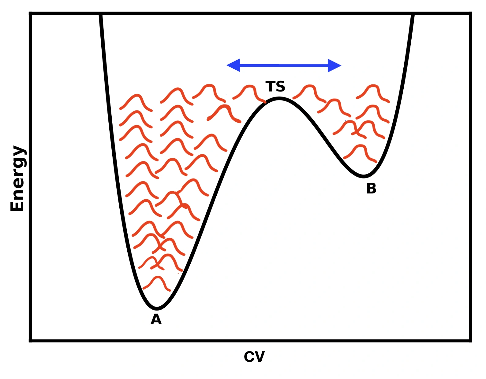

> **系列标签：** `知识文档` · `分子模拟` · `增强采样` · `MolSimulX`

常规流程（搭盒子 → 积分 → 平衡 → 生产）在很多课题上够用；但普通 MD 的时间尺度有限：体系容易困在自由能阱里，**稀有事件**（成核、跨膜、构象翻转）在可承受的轨迹长度内可能一次都采不到。这时要在「怎么采样」上加手段——**增强采样**通过偏置、加热或路径采样，更高效地探索构象空间、重建自由能面。

本篇建立**概念地图**：什么时候需要、集体变量是什么、常见方法族、有哪些坑。具体窗参数、插件命令与案例分析留给后续专题；自由能与系综的严格说法见加深篇 [统计力学基础与系综](K23-统计力学基础与系综.md)，**了解在干什么、集体变量怎么选**即可，不必自己从零实现这些算法。

---

[erphpdown]

## 一、问题从哪来？

把体系想成在一张高低不平的**自由能面**上走路（图像见 [统计力学基础与系综](K23-统计力学基础与系综.md)）：

- 阱底：常待的构象（结合态、某相、某折叠态……）；  
- 势垒：中间要翻过的坎。  

势垒远高于 $k_B T$ 时，靠热涨落干等跨越，时间可能是微秒、毫秒甚至更长——远超常规全原子轨迹。于是你看到的是：

|            | 常规模拟             | 增强采样              |
| ---------- | ---------------- | ----------------- |
| 轨迹像什么      | 在阱底附近抖，偶尔想翻墙又滑回来 | 被「推」过墙，或并行多路探路    |
| 稀有事件       | 整条轨迹可能一次都没有      | 有意采到跨越 / 多阱       |
| 自由能 $F(s)$ | 高垒区统计极差或空白       | 目标之一就是把 $F(s)$ 补全 |

> **Tips：** 先确认普通平衡 MD 真的「采不到」，而不是还没平衡、监控的坐标没选对。加长轨迹对**指数罕见**的事件往往不够——见 [平衡判据与收敛](K13-平衡判据与收敛.md)。

---

## 二、自由能差在说什么？（入门一句）

实验和论文里常报的「结合自由能」「折叠自由能差」，粗图像是：两个稳态（或沿某路径）之间，哪个更「受欢迎」、差多少。

这里会用到一个坐标 $s$ ——下文叫**集体变量**（collective variable, **CV**）：把慢过程压成少数个数可以描述的，第三节细讲。沿某个 CV，常写：

$$
F(s) = -k_B T \ln P(s) + \mathrm{const}
$$

$P(s)$ 是体系落在 $s$ 附近的概率。$P$ 大 → $F$ 低（更稳）；势垒处 $P$ 极小 → $F$ 高。  
普通 MD 在高垒处几乎不去，$P(s)$ 估不准，所以要增强采样——有时还要**去掉偏置再重加权**，才能还原 unbiased 的 $F(s)$。

严格的系综定义、时间平均与自由能关系，放到 [统计力学基础与系综](K23-统计力学基础与系综.md)。

---

## 三、集体变量（CV）：把慢过程压成少数个数

多数增强采样围着**集体变量**（collective variable, CV）转：用一两个（或少数）数描述你关心的慢过程，例如：

| 类型 | 例子 |
|------|------|
| 距离 | 两分子质心距、配体到口袋的距离 |
| 角度 / 二面角 | 某旋转异构、肽键 $\phi/\psi$ |
| 计数 / 尺寸 | 晶核原子数、氢键数、配位数 |
| 界面 / 位置 | 沿法向的质心、膜厚度相关量 |

CV 选得好：垒大致对应真实动力学瓶颈，采完的 $F(s)$ 才有解释力。  
CV 选错：漏掉真正的慢自由度——曲线可以很漂亮，物理却是错的。

> **Tips：** CV 和 [序参量与相变](K20-序参量与相变.md) 里的序参量常常是**同一个 $s$**：相变/成核时用来**监控**叫序参量；拿到本篇里沿它**偏置、分窗**就叫 CV。详细对照与「先体检再升级」工作流见该文第三节。

好 CV 的直觉：

- 能区分你关心的几个态；  
- 跨越时变化平滑，不要抖得毫无规律；  
- 尽量少：维数一高，采样需求爆炸。

### 一维不够时：多维 CV

真实瓶颈有时不是「一个距离」能说清的——例如解离既要拉开距离，又要破坏某组氢键。这时会用**二维（或更高维）** 自由能面 $F(s_1,s_2)$，伞形/元动力学也可以沿两个 CV 一起做。

入门先记住代价：

| | 一维 $F(s)$ | 二维 $F(s_1,s_2)$ |
|--|-------------|-------------------|
| 图像 | 一条曲线，垒是峰 | 一张等高图，垒是山脊/鞍点 |
| 采样 | 相对省 | 格子点数大致按维数指数涨，贵很多 |
| 何时值得 | 一个坐标已能分开态 | 一维明显「拧巴」、文献表明需两维 |

实践上：能一维说清就别上二维；上了二维更要盯收敛与误差。三维以上对经典增强采样通常极贵，更多靠降维、更好的 CV，或下面要提的学习型集体变量——而不是无脑加维数。

---

## 四、常见方法族

名称与变体极多；入门先分三大类。

### 1. 沿 CV 偏置

| 方法                          | 直观图像                                  | 你得到什么                                       |
| --------------------------- | ------------------------------------- | ------------------------------------------- |
| **伞形抽样**（umbrella sampling） | 沿 $s$ 摆一串「弹簧窗」，每窗把体系拴在一段 $s$ 上分别采，再拼接 | 经典、好讲；要设计窗中心与强度，用 WHAM / MBAR 等重加权          |
| **元动力学**（metadynamics）      | 在已走过的 CV 区域不断堆小土堆（高斯），把旧阱填满，逼体系去新地方   | 自动「填坑」；要关心高斯高度/宽度、是否收敛、有无 well-tempered 等变体 |
| **加速 / 高斯加速 MD 等**          | 整体或按势抬高低能区，让翻越更容易                     | 少显式 CV 或 CV 较弱时也会见到                         |

### 2. 并行加热 / 交换

| 方法 | 直观图像 |
|------|----------|
| **副本交换**（REMD / 并行回火） | 多个温度（或多种哈密顿）副本一起跑，隔一段时间尝试交换；高温副本帮低温翻势垒 |
| **溶质回火等变体** | 只加热一部分自由度，少扰动溶剂 |

优点：不一定要事先想好完美 CV。代价：副本多、算力贵；交换率与温度阶梯要调。

### 3. 路径与过渡态（进阶）

向前通量、过渡路径抽样（TPS）等：不追求整张 $F(s)$，而聚焦**反应路径与速率**。入门知道「还有专门打过渡态的一派」即可。

> **Tips：** 选方法时常问：我有没有靠谱的 CV？有 → 伞形 / 元动力学很常见；没有、又想广撒网 → 先想 REMD 或改进 CV。

### 4. 和机器学习 / 人工智能（点到即可）

近年很多工作把「选 CV、加速采样、估自由能」和机器学习拧在一起，入门知道方向即可，细节见 [机器学习数据基础](K28-机器学习数据基础.md)、[神经网络与深度学习基础](K29-神经网络与深度学习基础.md)：

| 方向 | 含义 |
|------|------|
| **学习集体变量** | 用自编码器、分类器等从轨迹里找「更能分开态」的坐标，减轻手搓 CV |
| **学习偏置 / 自适应采样** | 用模型决定往哪采、怎么加偏置（与元动力学等结合的变体很多） |
| **生成模型辅助** | 用生成式模型提出候选构象，再交回 MD / 增强采样精修 |
| **替代昂贵重加权或力场** | 与 [高精度力场与机器学习势](K05-高精度力场与机器学习势.md) 衔接：采样仍要物理可靠，ML 不能凭空变出正确自由能 |

> **注意：** ML 增强采样同样怕 **CV/标签选错、训练分布偏、收敛假象**；先把经典伞形/metadynamics/REMD 的逻辑走通，再读论文里的网络结构，不容易被名词带着跑。

---

## 五、什么时候该上增强采样？

| 更像需要 | 更像还不需要 |
|----------|----------------|
| 关心自由能差、势垒、结合/解离路径 | 只要平衡结构、密度、短时扩散 |
| 普通轨迹里事件零次或极少 | 事件已多次出现，统计还过得去 |
| 已知有高垒、多稳态 | 单阱、弛豫已在 ns 内完成 |
| 文献同类问题都用伞形/MetaD | 连普通平衡化都还没跑稳 |

原则：**先把普通平衡模拟跑可靠**（见 [能量最小化与预平衡](K12-能量最小化与预平衡.md)、[平衡判据与收敛](K13-平衡判据与收敛.md)），再上增强采样。增强采样不能补力场选错、盒子太小、没平衡的锅。

---

## 六、使用时的现实约束

1. **CV 选错** → $F(s)$ 可以收敛得很漂亮，却答错问题。  
2. **只改善采样，不取消力场误差**——自由能差仍受模型限制。  
3. **要做收敛与误差**——多条独立 run、看 $F(s)$ 是否还在变、垒高是否稳定；不能只贴一张最终曲线。概念上与 [平衡判据与收敛](K13-平衡判据与收敛.md)、[统计误差与块平均](K17-统计误差与块平均.md) 同一精神。  
4. **偏置要会还原**——伞形/MetaD 等采的是偏置分布，报物理自由能前要重加权或按方法公式重建。  
5. **参数与算力**——窗宽、高斯高度、交换频率、副本数都要文献对照与试探；Methods 写清。  
6. **有限尺寸**——成核、界面自由能等对盒子敏感，见 [有限尺寸效应](K18-有限尺寸效应.md)。

---

## 七、实践小清单

| 检查项 | 问自己 |
|--------|--------|
| 必要性 | 普通 MD 是否真采不到？加长是否已试过？ |
| CV | 能否区分态？文献常用什么？要不要二维 CV？ |
| 方法 | 偏置 CV / 副本交换 / 路径——哪类匹配问题？ |
| 基线 | 普通平衡与力场是否已可靠？ |
| 收敛 | $F(s)$ 是否随时间稳定？有无独立重复？ |
| 报告 | 是否写清 CV 定义、偏置参数、重加权方法、误差？ |
| 下一步 | 分析轨迹与宏观量 → [轨迹分析与宏观性质](K16-轨迹分析与宏观性质.md) |

---

## 八、小结

1. 普通 MD 常困在阱底；**增强采样**针对稀有事件与自由能面。  
2. $F(s)=-\,k_B T\ln P(s)$：要估准高垒区的 $P(s)$，往往必须偏置或换采样策略。  
3. **集体变量**（CV）是多数方法的核心；一维优先，多维很贵；选错 CV 比选错窗参数更致命。  
4. 常见做法包括：伞形抽样、元动力学、副本交换；另有路径采样与 ML 辅助方向。  
5. 先保证普通平衡可靠，再上增强采样；采样改善 ≠ 力场变准。  
6. 严格统计力学图像见 [统计力学基础与系综](K23-统计力学基础与系综.md)。

---

[/erphpdown]

## 学习路径

**前置阅读：** [平衡判据与收敛](K13-平衡判据与收敛.md) · [分子动力学模拟概述](K02-分子动力学模拟概述.md)

**下一步：**

- [轨迹分析与宏观性质](K16-轨迹分析与宏观性质.md) —— 常规分析主线  
- [统计力学基础与系综](K23-统计力学基础与系综.md) —— 自由能与系综图像加深（可稍后）  
- [序参量与相变](K20-序参量与相变.md) —— 与 CV 密切相关的监控量  
- [有限尺寸效应](K18-有限尺寸效应.md) —— 成核/界面类自由能常踩的坑  
- [神经网络与深度学习基础](K29-神经网络与深度学习基础.md) —— 若关心学习型 CV / ML 采样（可稍后）  
