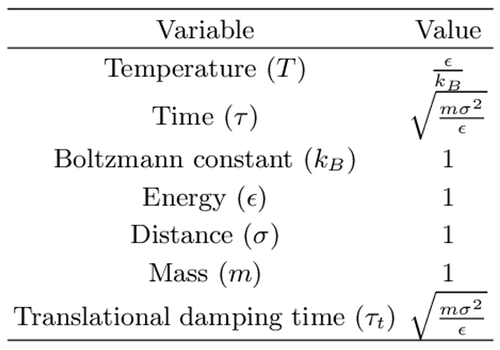

> **系列标签：** `知识文档` · `分子模拟` · `对比单位` · `MolSimulX`

主线流程里这一步是**可选支线**：教学与简单流体（尤其 Lennard-Jones）常把能量、长度、质量设为 1，用**对比单位**（reduced units）跑模拟。数字变「干净」了，但换算回真实物理量时容易晕。

本篇把**为什么用、基本单位怎么定、常见量怎么换、读文献时盯什么**一次说清。跑生物 / 材料全原子主线（Å、kcal·mol⁻¹、fs）时可先跳过；做 LJ 氩、方法验证、或看到 Lammps `units lj` 时再回看。不必背公式——会查表、会对齐 $\rho^*$、$T^*$ 即可。

---

[erphpdown]

## 一、为什么用对比单位？

经典 LJ 对势：

$$
U(r) = 4\epsilon\left[\left(\frac{\sigma}{r}\right)^{12}-\left(\frac{\sigma}{r}\right)^{6}\right]
$$

$\epsilon$ 管「能量有多深」，$\sigma$ 管「粒子有多大」。若再取粒子质量为 $m$，就可以用这三个量当尺子，把所有物理量写成**无量纲数**（常加星号 $^*$）：

- 取 $\epsilon=\sigma=m=1$ 时，许多公式里的系数消失，输入文件里温度、密度、截断都是「几个 1 附近的小数」；  
- 不同物质（不同真实 $\epsilon,\sigma$）可以先在同一张「无量纲相图」上比，再乘回真实参数。

Lammps 的 `units lj`、许多教材里的液氩 LJ 算例，就是这类设定。

> **Tips：** 对比单位不是另一种物理，只是**换了一套尺子**。力场形式、积分、系综逻辑与主线相同；变的是数字怎么写、怎么和实验对表。

---

## 二、基本单位怎么定？

以 LJ 参数与粒子质量为基准（单组分、同种粒子时最干净）：

| 物理量 | 对比单位（用 $\epsilon,\sigma,m$ 表示） | 无量纲写法（例子） |
|--------|------------------------------------------|-------------------|
| 能量 | $\epsilon$ | $U^*=U/\epsilon$ |
| 距离 | $\sigma$ | $r^*=r/\sigma$ |
| 质量 | $m$ | — |
| 时间 | $\tau=\sigma\sqrt{m/\epsilon}$ | $t^*=t/\tau$ |
| 速度 | $\sigma/\tau$ | $v^*=v\tau/\sigma$ |
| 密度（数密度） | $1/\sigma^3$ | $\rho^*=N\sigma^3/V$ |
| 压力 | $\epsilon/\sigma^3$ | $P^*=P\sigma^3/\epsilon$ |
| 温度 | $\epsilon/k_B$ | $T^*=k_B T/\epsilon$ |
| 电荷（有静电时） | $\sqrt{4\pi\varepsilon_0\sigma\epsilon}$ | $q^*=q/\sqrt{4\pi\varepsilon_0\sigma\epsilon}$ |

玻尔兹曼常数 $k_B$ 在对比单位下常取 **1**，于是输入里写「温度 1.4」表示 $k_B T = 1.4\,\epsilon$，而不是 1.4 K。

### 带点电荷时呢？

纯 LJ 教学流体常常**没有电荷**。一旦有点电荷（离子、极性 Stockmayer 粒子、粗粒化带电珠等），还要用同一套 $\epsilon,\sigma$ 把电荷也无量纲化，否则库仑项和 LJ 项不在同一把尺子上。

库仑能量在 SI 里是 $q_i q_j/(4\pi\varepsilon_0 r)$。对比单位下常定义无量纲电荷：

$$
q^* = \frac{q}{\sqrt{4\pi\varepsilon_0\,\sigma\,\epsilon}}
$$

使得

$$
U_{\mathrm{Coul}}^* = \frac{q_i^* q_j^*}{r^*}
$$

（能量仍以 $\epsilon$ 为单位，$r^*=r/\sigma$。）  
有偶极时，还会见到约化偶极矩 $\mu^*\sim \mu/\sqrt{\epsilon\sigma^3}$ 一类写法——以你用的模型/软件文档为准。

| 要点 | 说明 |
|------|------|
| 和 LJ 同一套尺子 | $q^*$ 由 $\epsilon,\sigma$ 定，不要另起炉灶 |
| 长程静电 | 对比单位下仍要用 Ewald/PPPM 等，不能只靠截断——见 [截断长程力与近邻列表](K08-截断长程力与近邻列表.md) |
| 软件 | `units lj` 里电荷怎么输入、库仑预因子是否已吃进 $q^*$，以手册为准；抄参数时对齐「约化定义」 |

> **Tips：** 文献若只给真实库仑（e 电荷）却在 `lj` 单位下跑，必须先换成 $q^*$。漏掉 $4\pi\varepsilon_0$ 或 $\sigma,\epsilon$ 的一次方根，静电会错一个数量级以上。

### 时间步长长什么样？

积分步长也用 $\tau$ 量：LJ 教学体系常见 $\Delta t^*\sim 0.005$（即 $0.005\,\tau$ 量级）。换回真实时间要乘 $\tau$（由该物质的 $\sigma,m,\epsilon$ 算）。见 [积分算法与时间步长](K09-积分算法与时间步长.md)。

### 截断呢？

截断半径常写成 $r_{\mathrm{cut}}^*=r_{\mathrm{cut}}/\sigma$，例如 $2.5$ 表示 $2.5\,\sigma$。和主线一样：改截断 ≈ 改有效力场；文献对比要对齐 $r_{\mathrm{cut}}^*$。见 [截断长程力与近邻列表](K08-截断长程力与近邻列表.md)。

---

## 三、换算直觉（不必死记，会查表）

把「对比单位下的数」变回 SI / 常用单位，就是乘回基准：

| 你有 | 想要真实量 | 做法 |
|------|------------|------|
| $T^*$ | 开尔文温度 | $T = T^*\,\epsilon/k_B$ |
| $\rho^*$ | 数密度或质量密度 | 先 $N/V=\rho^*/\sigma^3$，再乘摩尔质量等 |
| $t^*$ 或步数 $\times\Delta t^*$ | 秒 / ps | 乘 $\tau=\sigma\sqrt{m/\epsilon}$ |
| $P^*$ | Pa 或 bar | 乘 $\epsilon/\sigma^3$ |
| $q^*$ | 库仑（C）或 e | 反解 $q=q^*\sqrt{4\pi\varepsilon_0\sigma\epsilon}$（与上文定义一致时） |

氩的 LJ 参数在教材里常有现成表（$\epsilon/k_B$ 多少 K、$\sigma$ 多少 Å）。**复现算例时**：优先对齐别人的 $\rho^*$、$T^*$、$r_{\mathrm{cut}}^*$、$\Delta t^*$，而不是先纠结自己换算的 SI 是否和某篇实验小数点后三位一致。

> **Tips：** 多组分、异种 LJ（不同 $\epsilon_{ij},\sigma_{ij}$）时，「用哪套 $\epsilon,\sigma$ 当 1」要在 Methods 写清；混用两套尺子是经典翻车点。

---

## 四、和「真实单位」怎么选？

| 场景 | 更常见 |
|------|--------|
| LJ 流体、液氩教学、算法验证、相图用 $T^*$–$\rho^*$ 讨论 | **对比单位** |
| 生物大分子、显式水、有机力场、金属势（eV、Å） | **真实单位**（`real` / `metal` / SI 等） |
| 粗粒化 | 有时也用约化单位，但基准未必是 LJ 的 $\epsilon,\sigma$——以模型文档为准 |

软件里单位制名字因引擎而异（如 Lammps：`lj`、`real`、`metal`）。**同一输入里不可混用**；从教程复制片段时先看 `units` 那一行。

---

## 五、读文献与脚本时盯什么？

1. **写明单位制**——对比还是真实；能量用 $\epsilon$ 还是 kcal/mol。  
2. **无量纲状态点**——$\rho^*$、$T^*$（有时还有 $P^*$）是否与要复现的图一致。  
3. **截断与尾部校正**——$r_{\mathrm{cut}}^*$、是否 shift / tail correction。  
4. **步长**——$\Delta t^*$ 是否合理；约束/热浴参数是否也按对比单位写。  
5. **和实验比之前**——必须换回真实单位，并交代用的 $\epsilon,\sigma,m$。  

> **Tips：** 看到「$T=1.0$」不要自动当成 1 K；在 `units lj` 下它几乎总是 $T^*$。

---

## 六、实践小清单

| 检查项 | 问自己 |
|--------|--------|
| 要不要用 | 教学 LJ / 验证？→ 可以；蛋白质水盒子？→ 通常真实单位 |
| 基准 | $\epsilon,\sigma,m$ 取自哪篇？多组分用哪套？有电荷时 $q^*$ 定义是否一致？ |
| 状态点 | $\rho^*$、$T^*$ 与文献图是否一致？ |
| 步长 / 截断 | $\Delta t^*$、$r_{\mathrm{cut}}^*$ 写清了吗？ |
| 软件 | `units`（或等价关键字）是否全程一致？ |
| 对实验 | 是否已乘回真实单位并注明参数来源？ |

---

## 七、小结

1. 对比单位用 $\epsilon,\sigma,m$ 当尺子，把 LJ 模拟写成无量纲数；本质是换单位，不是换物理。  
2. 时间 $\tau=\sigma\sqrt{m/\epsilon}$，温度 $T^*=k_B T/\epsilon$，密度 $\rho^*=N\sigma^3/V$；有电荷时还有 $q^*=q/\sqrt{4\pi\varepsilon_0\sigma\epsilon}$。  
3. 教学与方法验证常用；生物/复杂力场几乎总用真实单位。  
4. 复现优先对齐 $\rho^*$、$T^*$、截断与步长；和实验比前必须换回真实量。  
5. 力场形式见 [经典全原子力场](K03-经典全原子力场.md)；步长见 [积分算法与时间步长](K09-积分算法与时间步长.md)；静电长程见 [截断长程力与近邻列表](K08-截断长程力与近邻列表.md)。

---

[/erphpdown]

## 学习路径

**前置阅读：** [经典全原子力场](K03-经典全原子力场.md) · [积分算法与时间步长](K09-积分算法与时间步长.md)

**下一步：**

- [轨迹分析与宏观性质](K16-轨迹分析与宏观性质.md) —— 回到主线：生产段怎么分析  
- [粗粒化动力学加速与耗散](K30-粗粒化动力学加速与耗散.md) —— 非平衡里无量纲数（Wi、Pe 等）管谁强谁弱  
- [截断长程力与近邻列表](K08-截断长程力与近邻列表.md) —— LJ 截断与尾部校正  
- [分子模拟工作平台搭建](../01-技术文档/T01-分子模拟工作平台搭建.md) —— 动手环境  
