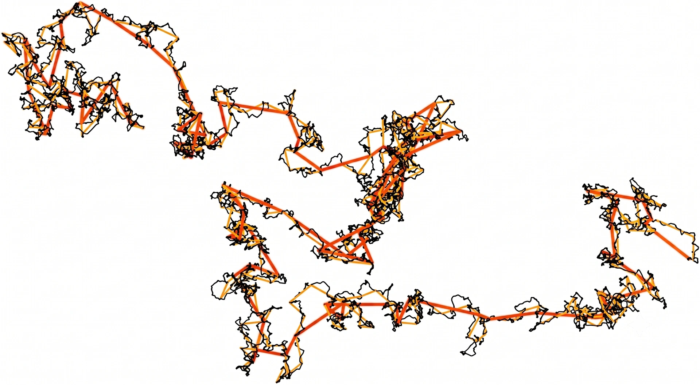

> **系列标签：** `知识文档` · `分子模拟` · `轨迹分析` · `MolSimulX`

生产段跑完了（见 [平衡判据与收敛](K13-平衡判据与收敛.md)），MD 的原始产物是**位置、速度随时间的序列**。论文里的密度、RDF、扩散系数、表面张力，都是对轨迹（或热力学日志）做**统计后处理**得到的。不会分析，等于只拍了电影却读不出剧情。

本篇按「结构 / 热力学 / 动力学」梳理常见观测量，并说明**用什么工具算、什么时候值得手写脚本**。概念为主；Python 动手见 [MDAnalysis轨迹分析入门](../02-实战案例/C02-MDAnalysis轨迹分析入门.md)。报平均值时记得配误差——见 [统计误差与块平均](K17-统计误差与块平均.md)。

---

## 一、数据从哪来？

| 来源 | 典型内容 | 常用来算什么 |
|------|----------|--------------|
| **热力学日志** | 步数、温度、压强、能量、体积… | 平衡监控、平均密度/能量、粗看压强 |
| **轨迹文件** | 各帧坐标（可选速度、力） | RDF、MSD、密度剖面、可视化 |
| **额外输出** | 自定义 compute、集体变量、重启文件 | 增强采样的 CV、专项监控量 |

分析前先确认：

- 用的是**生产段**，不是含升温/体积还在漂的平衡化；  
- 系综、单位（真实 / 对比单位）与 Methods 一致；  
- PBC 下算距离是否用了**最小镜像**（多数分析库默认会处理）。

---

## 二、用什么工具？（软件 + 必要手搓）

不必从零写积分器，但分析层常要在「现成命令 / 库 / 自己写几行」之间选。

| 工具                     | 擅长                  | 典型场景                                                                              |
| ---------------------- | ------------------- | --------------------------------------------------------------------------------- |
| **模拟软件自带**             | 与引擎绑定的快速统计          | GROMACS：`gmx rdf` / `gmx msd`；LAMMPS：`compute rdf`、`fix ave` 等——跑的时候顺带出，或对轨迹重放    |
| **MDAnalysis**（Python） | 读多种轨迹格式、选原子组、写分析流水线 | 可复现的脚本化分析、和 NumPy/作图一体；入门见 [MDAnalysis轨迹分析入门](../02-实战案例/C02-MDAnalysis轨迹分析入门.md) |
| **OVITO**              | 可视化 + 交互式修饰/统计      | 看缺陷、晶粒、密度场、快速出图；适合「先看见再定量」                                                        |
| **VMD / PyMOL 等**      | 可视化、部分分析插件          | 看构象、做演示图；复杂统计常导出后再用脚本                                                             |
| **Freud、其他库**          | 高效邻域、序参量、点模式        | 晶体/胶体/二维体系等（按需）                                                                   |

**什么时候值得手搓？**

| 更该用手写脚本 / 笔记本 | 更该用现成工具 |
|--------------------------|----------------|
| 文献没有的自定义序参量、奇怪的原子选择 | 标准 RDF、MSD、密度平均 |
| 要把多段轨迹、多体系批量出表 | 只看一眼结构是否合理 |
| 需要完全可控的复现（Git 里一行命令出图） | 交互式调视角、截图 |

手搓时通常也是：**用 MDAnalysis / ase 读轨迹 → NumPy 算 → Matplotlib 画**，而不是自己解析二进制格式。

> **Tips：** 同一量用软件自带和 MDAnalysis 算，数值应大致一致；差很多时先查：是否同一生产段、是否 unwrap 坐标、是否同一套 PBC/选原子。

---

## 三、结构类

| 量                      | 含义                             | 备注                              |
| ---------------------- | ------------------------------ | ------------------------------- |
| **径向分布函数 $g(r)$**（RDF） | 距参考粒子 $r$ 处找到另一粒子的相对概率（相对均匀气体） | 液体结构「指纹」；峰位≈壳层距离                |
| **配位数**                | 对 $g(r)$ 第一峰积分                 | 溶剂化壳、近邻数                        |
| **结构因子 $S(k)$**        | $g(r)$ 的傅里叶空间对应                | 可与 X 射线 / 中子散射对比                |
| **密度剖面**               | 沿某轴的密度 $\rho(z)$ 等             | 界面、膜、狭缝                         |
| **气泡/液滴形状、界面厚度**       | 等值面、厚度等                        | 多相与界面                           |
| **晶体序参量**              | 是否有序、晶粒取向                      | 相变、成核；见 [序参量与相变](K20-序参量与相变.md) |

$g(r)$ 的一种写法：

$$
g(r) = \frac{V}{N^2}\left\langle\sum_{i}\sum_{j\neq i}\delta(r-r_{ij})\right\rangle
$$

直观上：数「距离落在 $r$ 附近的粒子对」，再和「完全均匀时该有多少对」比。$g\to 1$ 表示远处无结构；第一峰高矮反映近程有序强弱。

> **Tips：** 盒子太小或截断不当会扭曲 $g(r)$ 尾部；怀疑时见 [有限尺寸效应](K18-有限尺寸效应.md)、[截断长程力与近邻列表](K08-截断长程力与近邻列表.md)。

---

## 四、热力学类

| 量 | 概念要点 |
|----|----------|
| **瞬时温度** | 由动能：$T = 2E_{\mathrm{kin}}/(f k_B)$，$f$ 为自由度（有约束要扣）；细节见 [温度、压强与表面张力](K19-温度压强与表面张力.md)、[键长键角约束与刚性](K10-键长键角约束与刚性.md) |
| **压强** | 理想气体项 + 维里（力与距离）项；细节见 [温度、压强与表面张力](K19-温度压强与表面张力.md) |
| **表面张力** | 法向与切向压强分量之差沿法向积分；见 [温度、压强与表面张力](K19-温度压强与表面张力.md) |
| **势能 / 总能量** | 监控平衡与漂移；报告用时间平均 |
| **自由能** | 常需增强采样或专门方法，见 [增强采样与自由能](K14-增强采样与自由能.md) |

瞬时值涨落大是正常的；论文里写的是**时间平均 ± 不确定度**（分块平均、自相关时间等）——见 [统计误差与块平均](K17-统计误差与块平均.md)。

密度在 NPT 下由体积平均得到；NVT 下密度是你设的，不要当成「算出来的预测」去和实验比（见 [常见系综与控温控压](K11-常见系综与控温控压.md)）。

---

## 五、动力学类：平动扩散、转动与传热

### 1. 平动自扩散（最常见）

| 量 | 含义 |
|----|------|
| **均方位移（MSD）** | $\langle\Delta\mathbf{r}^2(t)\rangle$：质心（或原子）间隔 $t$ 内位移平方的平均 |
| **扩散系数 $D$** | Einstein 关系：三维下长时线性区 $D=\langle\Delta\mathbf{r}^2\rangle/(6t)$ |
| **速度自相关（VACF）** | $C(t)=\langle\mathbf{v}(0)\cdot\mathbf{v}(t)\rangle$；Green–Kubo：$D=\int_0^\infty C(t)\,dt$ |

实践注意：

- MSD 要在**已 unwrap**（解开 PBC 跳跃）的轨迹上算，否则扩散会被盒子「折回来」算小；  
- 拟合 $D$ 用长时**线性区**，不要拿弹道区（极短 $t$）硬套；  
- 热浴过强会扭曲动力学——生产段若要报 $D$，耦合宜克制（见 [常见系综与控温控压](K11-常见系综与控温控压.md)）。

### 2. 旋转扩散（分子还会「转」）

分子（尤其水、棒状溶质、液晶基元）除了质心平移，还有**取向**怎么随机化。常用：

| 量 | 含义 |
|----|------|
| **取向相关** | 如 $\langle\mathbf{u}(0)\cdot\mathbf{u}(t)\rangle$（$\mathbf{u}$ 为分子轴或偶极方向）随时间衰减 |
| **旋转扩散系数 $D_r$** | 描述取向「忘掉初始方向」有多快；可由取向相关的衰减时间估计（具体预因子因定义/对称性而异） |
| **角均方位移** | 与平动 MSD 类似，用转过的角度构造，长时斜率连到 $D_r$ |

何时要报：$D$ 只反映「跑多开」，解释介电弛豫、NMR 取向相关、各向异性粒子时，往往还要 $D_r$。各向异性分子可能有不止一个旋转扩散分量（绕不同轴）。谱系位置、与平动/粘度的对照见 [输运系数谱系](K21-输运系数谱系.md)。

> **Tips：** 算取向相关前先定义清楚「分子轴」；柔性分子要用相对刚性的局部标架，否则轴本身在扭，衰减会被污染。

### 3. 传热方向（热导率，点到即可）

「传热」在平衡 MD 里通常指**热导率** $\kappa$：温度梯度下能量怎么传（或反过来：热流涨落有多大）。

| 路线 | 图像 |
|------|------|
| **平衡 + Green–Kubo** | 不算外加温差，用**热流自相关**积分得到 $\kappa$ |
| **非平衡** | 人为加温度梯度 / 热流，测响应，再外推到线性区 |

和自扩散相比：热流相关噪声大、收敛慢，对轨迹长度与有限尺寸更敏感。入门知道「传热 ≠ 再算一个 MSD」即可；谱系与坑见 [输运系数谱系](K21-输运系数谱系.md)，非平衡设定见 [非平衡分子动力学概述](K22-非平衡分子动力学概述.md)。

粘度、离子电导率等同属输运系数，也归在 [输运系数谱系](K21-输运系数谱系.md)；多由应力/电流相关函数或非平衡驱动得到。

---

## 六、和实验怎么对？

| 实验 | 模拟侧 |
|------|--------|
| X 射线 / 中子散射 | $g(r)$、$S(k)$ |
| NMR 扩散 | MSD → 平动 $D$；取向相关 → 旋转弛豫 / $D_r$ |
| 密度、表面张力 | NPT 平均密度；压强剖面 → $\gamma$ |
| 热导 / 粘度（进阶） | 热流或应力相关；或 NEMD——见 [输运系数谱系](K21-输运系数谱系.md) |

单位、温度、同位素、力场系统误差都要写进讨论。MD **很少**「一个数直接等于实验一个数」而不加说明——更常比趋势与机制（见 [分子动力学模拟概述](K02-分子动力学模拟概述.md)）。

---

## 七、实践小清单

| 检查项 | 问自己 |
|--------|--------|
| 数据段 | 是否只用生产段？ |
| 工具 | 标准量用自带/MDAnalysis？自定义量是否脚本化可复现？ |
| 结构 | $g(r)$ / 剖面是否与可视化观感一致？ |
| 扩散 | 平动是否 unwrap、拟合线性区？要不要报旋转扩散 / 热导？ |
| 误差 | 是否有块平均 / 重复？见 [统计误差与块平均](K17-统计误差与块平均.md) |
| 尺寸 | 盒子是否可能偏了扩散或界面量？见 [有限尺寸效应](K18-有限尺寸效应.md) |
| Methods | 轨迹间隔、分析软件/脚本、选原子规则是否写清？ |

---

## 八、小结

1. 轨迹 + 日志 → **结构、热力学、动力学**三类性质。  
2. 工具：软件自带统计、**MDAnalysis**、OVITO/VMD；标准量少重复造轮子，自定义序参量再手搓脚本。  
3. RDF / $S(k)$ 连结散射；平动 MSD / VACF → $D$，取向相关 → 旋转扩散；热导率等见 [输运系数谱系](K21-输运系数谱系.md)；压强与表面张力见 [温度、压强与表面张力](K19-温度压强与表面张力.md)。  
4. 用生产段、做误差估计；自由能常需增强采样。  
5. 概念在本文，操作在 [MDAnalysis轨迹分析入门](../02-实战案例/C02-MDAnalysis轨迹分析入门.md)。

---

## 学习路径

**前置阅读：** [平衡判据与收敛](K13-平衡判据与收敛.md) · [分子动力学模拟概述](K02-分子动力学模拟概述.md)

**下一步：**

- [统计误差与块平均](K17-统计误差与块平均.md) —— 报数时怎么给不确定度  
- [MDAnalysis轨迹分析入门](../02-实战案例/C02-MDAnalysis轨迹分析入门.md) —— 动手  
- 按需：[有限尺寸效应](K18-有限尺寸效应.md) · [温度、压强与表面张力](K19-温度压强与表面张力.md) · [输运系数谱系](K21-输运系数谱系.md) · [非平衡分子动力学概述](K22-非平衡分子动力学概述.md) · [序参量与相变](K20-序参量与相变.md)  
