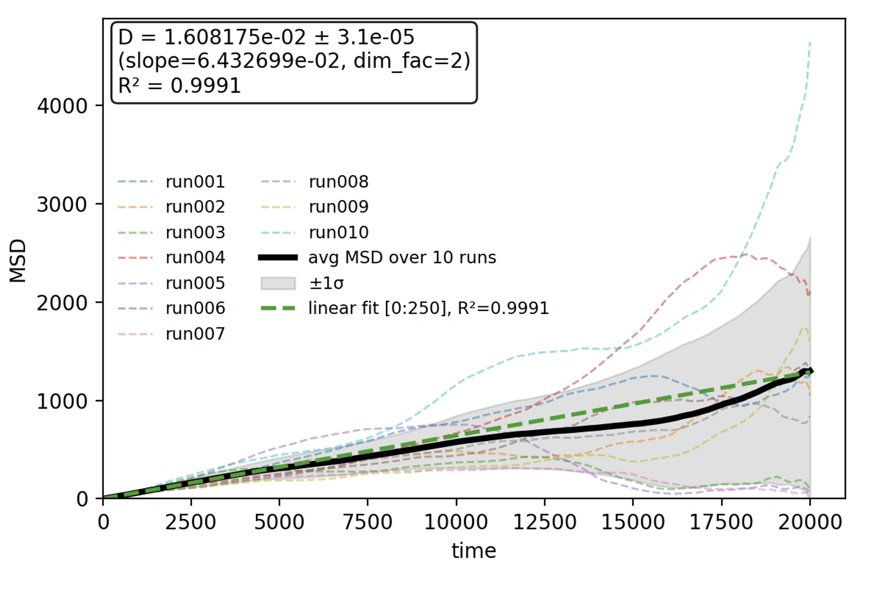

> **系列标签：** `知识文档` · `分子模拟` · `误差估计` · `MolSimulX`

轨迹跑完、平均值也算出来了——写论文还差一样东西：**这个数大概准到什么程度？**  麻烦在于：MD 相邻几帧几乎是同一副面孔。若把一千万帧都当成一千万个独立样本，误差条会小得离谱，那是**假准**。

正经做法只有两条路（常一起用）：心里有个**自相关时间** $\tau_A$，或更省事——做**块平均（block averaging）**。  

本篇尽量讲清：帧数为什么不能当样本数、$\tau_A$ 怎么估个大概、块平均在干什么、以及「平均完再平均」会不会更糟。不必推随机过程；会画图、会切块、Methods 里写清估法就够。  

先确认该不该开始统计，见 [平衡判据与收敛](K13-平衡判据与收敛.md)；常见观测量见 [轨迹分析与宏观性质](K16-轨迹分析与宏观性质.md)。



---

[erphpdown]

## 一、帧很多，不等于样本很多

想象你要估「这个班平均身高」，却在同一秒连拍了 1000 张——那不是 1000 个同学，是**同几个人被拍了一千遍**。MD 也一样：隔 1 fs 存一帧，多半是重复点名，不是新信息。

任意观测量 $A(t)$（密度、势能、某个序参量…）都有「记性」：要过一阵子，涨落才大致忘掉上一刻。这段记性叫**自相关时间** $\tau_A$（autocorrelation time）。

- 记性短 → 忘得快 → 同样跑长里，有效样本多；  
- 记性长 → 忘得慢 → 帧看着很多，独立样本其实很少。

生产跑了时长 $t_{\mathrm{prod}}$，有效独立样本大概只有：

$$
N_{\mathrm{eff}} \sim \frac{t_{\mathrm{prod}}}{2\tau_A}
$$

系数怎么定义会差一截，**数量级**对了就行：是几百还是几万，比纠结 3.2 还是 3.5 重要。

若硬拿总帧数去算标准误，误差会被假缩小大约 $\sqrt{N_{\mathrm{frames}}/N_{\mathrm{eff}}}$ 倍——小数点后一长串，看着专业，其实是自欺。

更气人的是：**同一条轨迹，不同量的记性不一样。**

| 量 | 记性往往 |
|----|----------|
| 温度（热浴拧得紧） | 较短——老被拉回设定值 |
| 势能、密度 | 中等 |
| 慢序参量、界面位置、和扩散绑在一起的量 | 可以很长 |

所以「温度已经很准」推不出「扩散也很准」。

> **Tips：** 把输出间隔改得很密，主要方便看动画；**不会**自动让平均值更准。想更准，靠更长的有效独立时间，或多跑几条独立重复。

### $\tau_A$ 怎么估个大概？

能估，入门要的是**大概多久**，不是小数点后三位。

| 做法              | 含义                                                                                            |
| --------------- | --------------------------------------------------------------------------------------------- |
| **看曲线**         | 画出 $A(t)$，起伏「鼓一包」大概多宽？像 10 ps 一晃，就先当十皮秒量级                                                     |
| **相关掉到约 $1/e$** | 算 $C(t)=\langle\delta A(0)\delta A(t)\rangle/\langle\delta A^2\rangle$，看掉到 $\approx 0.37$ 要多久 |
| **积分一把**        | $\tau_{\mathrm{int}}\approx\int_0^{t_{\max}} C(t)\,\mathrm{d}t$，积到 $C$ 差不多到 0 为止（别把后面噪声也硬积进去） |
| **块平均反推**       | 扫块长，误差出现平台时，块长大约是几个 $\tau_A$——不一定先算 $C(t)$                                                    |

建议顺序：先看图 → 要写 Methods 再用 $C(t)$ 或块平台给个数 → **每个量单独估**。

> **Tips：** 估错 20% 没事；估错 10 倍（把很慢的量当成很快）才会让误差条假小。$C(t)$ 尾巴噪声大，接近 0 就停，别积到天荒地老。

---

## 二、块平均：不先算 $\tau_A$ 也能给误差条

懒得先精确算 $\tau_A$没问题。入门默认用**块平均**：把长轨迹切成几段，看「段与段的平均」彼此差多少——差得大，说明你的总平均没那么稳。

### 1. 怎么做？

1. 只用**生产段**（平衡化那段丢掉）。  
2. 切成 $n_b$ 块，每块尽量比你怀疑的 $\tau_A$ 长一截。  
3. 每块算一个平均 $\bar{A}_i$。  
4. 用这些 $\bar{A}_i$ 的分散，估计总平均的不确定度。常见写法：

$$
\sigma_{\langle A\rangle} \approx \frac{s_{\mathrm{block}}}{\sqrt{n_b}}
$$

$s_{\mathrm{block}}$ 是各块均值的标准差。有人更保守，直接报 $s_{\mathrm{block}}$——都可以，**Methods 里写清**就行。

### 2. 块多长合适？

| 切太碎 | 切太粗 |
|--------|--------|
| 块里还在「记着」上一块 → 误差**偏小**（假准） | 块太少 → 误差条自己乱晃 |
| 加长块，估出的误差往往会先变大 | 再加长也稳不住 |

实用招：从小块扫到大块，看误差是否走到**平台**。到了平台，说明块里大致已独立，那个 $\pm$ 才信得过。

```
块越来越长 → 误差往往先变大 → 再变平
              （相关被吃进块里）   （可以停手了）
```

### 3. 「先平均、再平均」会不会更差？

常有人问：切成块 → 每块一个平均 → 再对块平均做平均；和「所有点直接加总平均」比，谁更好？会不会多层平均反而糟？

**先问你自己：你在找「中心那个数」，还是在找「± 多大」？**

- **中心值 $\langle A\rangle$**：块一样长的时候，块平均再平均，和全体点直接平均**完全是同一个数**——不会更准，也不会更差。  
- **误差条 $\pm$**：这才是块平均的用武之地。相关帧不能当独立样本硬除，否则假准。

等长块时就是一道小学算术：

$$
\frac{1}{n_b}\sum_i \bar{A}_i = \text{全体点的直接平均}
$$

所以：块平均**不是**为了把均值「再精炼一层」，而是借用「块与块差多少」来写误差条。

真正会踩坑的，多半是**权重**：

| 做法 | 结果 |
|------|------|
| 块有长有短，却对每个块均值**一视同仁**再平均 | 短块和长块权重一样 → **不等于**全体点的平均，等于乱加权 |
| 按块长**（点数）加权**再平均 | 中心值回到与直接平均一致 |
| 同一批数据莫名其妙平均很多层，权重说不清 | 中心值可能偏，$\pm$ 也不知在说什么 |

记两句就够：

> **均值：点直接平均最干净**（等长块时，等价于块均值的平均；不等长请按长度加权）。  
> **误差：用块（或 $\tau_A$）对付「帧相关」；多折两层平均，换不来更多独立信息。**

想让中心值更准，靠更大的 $N_{\mathrm{eff}}$——跑长一点，或多开几条独立模拟——不是把同一段相关数据反复揉。

### 4. 和「前后半段比一比」有啥不同？

[平衡判据与收敛](K13-平衡判据与收敛.md) 里切两半比均值：问的是**还在不在漂**（该不该开始当生产段）。  
块平均：已经认为平衡了，问的是**涨落让你的平均抖多大**。  

还在漂就做块平均，得到的是「歪着的均值 ± 一个漂亮数」——物理上仍不可靠。

---

## 三、独立重复：另一条腿

块平均吃的是**一条**轨迹里的时间涨落。若体系可能困在不同坑里，一条超长轨迹会**一起偏**，块误差再小也发现不了。

| 做法 | 在回答 |
|------|--------|
| 块平均 / $\tau_A$ | 这条路上，均值抖多大 |
| **独立重复**（换初速、换初构） | 换条路走，结论还一样吗 |

重要结论两者最好都有。重复之间差很多时，往往比单条轨迹的块误差更打脸。报数可以写：「$n$ 次独立模拟的平均 ± 标准差」，并注明每次内部是否还做了块平均。

---

## 四、论文里怎么写才像话？

| 比较让人放心 | 比较让人皱眉 |
|--------------|--------------|
| $1.23\pm 0.04$，并写清：块平均 / 几次重复 / 是否用了 $\tau_A$ | 只丢一个光秃秃的 1.23 |
| 生产多长、平衡化丢掉多长 | 「平衡后取样」一笔带过 |
| 块数或重复次数 | 「帧很多，所以很准」 |
| 图上带误差条或浅色带 | 光滑曲线假装没有不确定度 |

和实验对不上时，先分清两种「不准」（名字在教材里偶尔换着叫，别被绕晕）：

| 你可能听到的叫法 | 在 MD 里通常指什么 | 怎么办 |
|------------------|--------------------|--------|
| **统计误差** / **随机误差** | 轨迹有限、帧相关、涨落带来的不确定度——**就是本篇在算的东西** | 跑长一点、块平均 / $\tau_A$、多做独立重复，有望缩小 |
| **系统误差** / **偏差** | 力场、截断、盒子太小、系综选错等——换设置均值会**系统性**挪 | 换模型、换尺寸、改方法；不是「再平均一下」能消掉的 |

实验室课里常说「随机误差 + 系统误差」；模拟论文里更常写 **statistical uncertainty**（统计不确定度）和 force-field / finite-size 一类 **systematic** 来源。  
**随机误差 ≈ 本篇的统计误差**，不是在统计误差之外又多出第三种。独立重复换随机种子，也是在摸清这类「随机/统计」分散有多大。

统计误差已经很小，仍可能和实验差一截——那多半是系统误差在作怪，见 [有限尺寸效应](K18-有限尺寸效应.md) 等。

---

## 五、三件事别搅在一块

| 你在问 | 去哪看 |
|--------|--------|
| 该不该开始统计？还在漂吗？ | [平衡判据与收敛](K13-平衡判据与收敛.md) |
| 这条（这些）轨迹上，均值的统计涨落多大？ | **本篇** |
| 换个盒子，均值会不会系统性变？ | [有限尺寸效应](K18-有限尺寸效应.md) |

三关都过，结论才站得住。粘度、热导这类相关函数更吵、更慢收敛，误差更要老实报——见 [输运系数谱系](K21-输运系数谱系.md)。

---

## 六、常见误解（对照表）

| 常听人说 | 更靠谱的说法 |
|----------|----------------|
| 帧数 ×10，误差就该 ÷√10 | 帧差不多独立时才成立；相关时看 $N_{\mathrm{eff}}$ |
| 误差条很小 = 和实验一致 | 小的只是统计/随机涨落；力场等系统偏差是另一回事 |
| 所有量共用一个误差 | 每个量有自己的 $\tau_A$ |
| 块平均得到的 σ，再除以总帧数 | 不要；已经按块数处理过了 |
| 先平均再平均，一定更准 | 等长时均值根本不变；块平均主攻误差条 |
| 自由能曲线不用误差 | 一样要收敛和不确定度，见 [增强采样与自由能](K14-增强采样与自由能.md) |

---

## 七、实践小清单

| 检查项 | 问一句 |
|--------|--------|
| 数据 | 是不是只用了生产段？ |
| 记性 | 这个量的 $\tau_A$ 大概多久？（看图 / $C(t)$ / 块平台） |
| 块平均 | 扫过块长了吗？误差到平台了吗？块不等长有没有按长度加权？ |
| 重复 | 重要结论有没有独立再跑？ |
| 报告 | $\pm$ 旁边写了估法和时长吗？ |
| 对实验 | 差一截，有多少可能是力场/尺寸，而不只是统计？ |

---

## 八、小结

1. 帧相关 → **有效样本远少于帧数**；别用总帧数假装高精度。$\tau_A$ 看图、$C(t)$ 或块平台都能粗估。  
2. **块平均**主要给**误差条**：等长时「块均值的平均」= 直接平均；不等长请按块长加权。  
3. 不同量记性不同；慢量要更长轨迹或更多重复。  
4. **独立重复**防你困在同一个错坑里。  
5. **统计误差（也叫随机误差）≠ 系统误差**；和 [平衡判据与收敛](K13-平衡判据与收敛.md)、[有限尺寸效应](K18-有限尺寸效应.md) 一起看。

---

[/erphpdown]

## 学习路径

**前置阅读：** [平衡判据与收敛](K13-平衡判据与收敛.md) · [轨迹分析与宏观性质](K16-轨迹分析与宏观性质.md)

**下一步：**

- [有限尺寸效应](K18-有限尺寸效应.md) —— 换盒子，均值会不会变  
- [输运系数谱系](K21-输运系数谱系.md) —— 相关函数更难收敛时  
- [增强采样与自由能](K14-增强采样与自由能.md) —— 自由能曲线同样要报不确定度  
