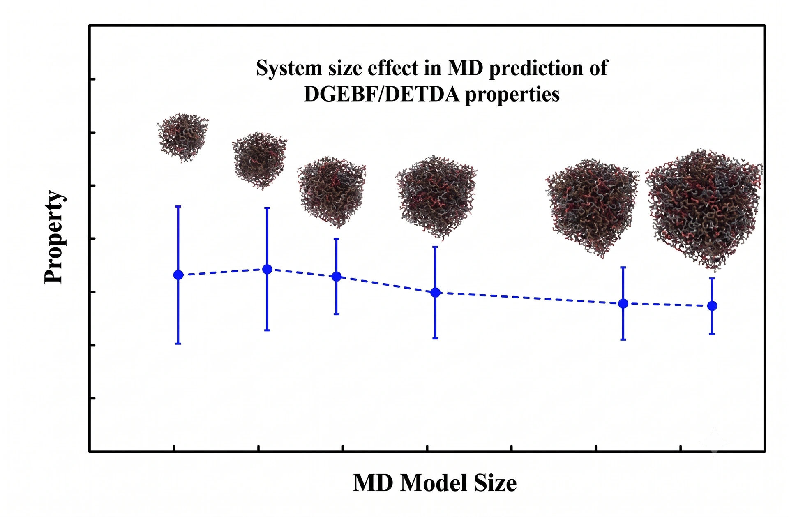

> **系列标签：** `知识文档` · `分子模拟` · `有限尺寸` · `MolSimulX`

分析性质时，别忘了**盒子本身仍是模型的一部分**。周期边界消掉了「外表面」，但边长往往只有几纳米到几十纳米：当物理上的**关联长度**接近或超过半盒长时，粒子会通过镜像「看见自己」，性质随盒子大小**系统性**变化——这就是**有限尺寸效应（finite-size effects）**。

它和 [统计误差与块平均](K17-统计误差与块平均.md) 里的「±」不是一回事：统计误差靠跑长、多重复往往能缩小；有限尺寸是换盒子均值会挪——属于**系统偏差**一类。PBC 基础见 [边界条件与初始条件](K07-边界条件与初始条件.md)。

本篇讲：什么时候该担心、哪些量最敏感、概念上怎么检验与处理。不必背修正公式；会做尺寸对比、Methods 写清盒长即可。

---

[erphpdown]

## 一、一句话图像

PBC 像六面镜子的小屋：屋里人有限，却假装外面还有无穷拷贝。 镜子消掉了墙，但**小屋还是那么大**——屋里的「波浪」「相关」不能比屋子更长，否则会撞上自己的镜像，行为就和真正无限体相不一样。

核心判据很朴素：

> **你关心的物理尺度（关联长度、分子尺寸、界面起伏波长…）是否已经逼近半盒长？**  
> 逼近了 → 要担心有限尺寸；远小于 → 通常先睡个安稳觉（仍建议关键结论做一次尺寸抽查）。

### 关联长度是啥？

**关联长度**（correlation length）可以想成：体系里「谁跟谁还一起晃、一起挤」能传多远。

站在某个分子上看：近处邻居的排布、密度涨落往往和它有关；越走越远，这种牵连越弱。弱到差不多可以当「没关系」的那个距离，就是关联长度的粗图像——常记作 $\xi$。

| 图像 | 说明 |
|------|------|
| 普通液体、远离临界 | $\xi$ 往往只有几个分子直径，$g(r)$ 抖几下就回到 1 |
| 靠近临界点、大尺度相分离 | $\xi$ 可以变得很长，甚至「要多长有多长」 |
| 聚合物 / 蛋白质 | 整条链的回转半径也是一种「有多大」的尺度，和 $\xi$ 同类地拿来跟盒长比 |
| 界面毛细波 | 关心的是起伏波长能有多长，同样不能超过盒子 |

和有限尺寸的关系就一句话：

> **$\xi$（或你关心的那个「有多大」）若已经摸到半盒长，镜像会掺和进来，性质就可能随盒子变。**

入门不必先精确算出 $\xi$：看 $g(r)$ 多远才变平、分子/晶核有多大、界面浪有多长，和 $L/2$ 比一比；吃不准就**换大盒子试一次**。

「加大盒子再算一遍」是最直接、也最好向审稿人交代的检验。

---

## 二、PBC 的代价具体是什么？

[边界条件与初始条件](K07-边界条件与初始条件.md) 说明了 PBC 如何近似体相。盒子有限意味着：

| 现象 | 含义 |
|------|------|
| **模式被截断** | 流体力学 / 毛细波等长波，波长不能超过盒子允许的范围 |
| **长程关联被拧巴** | 相关本该慢慢衰减，却在半盒长附近被周期「折」回来 |
| **自己看见自己** | 大分子、晶核、离子氛伸展到镜像区，等于多了一份假相互作用 |
| **静电与盒长绑在一起** | Ewald/PPPM 在周期像下求和，介电、带电界面等对 $L$ 敏感 |

特别敏感的场景：临界点附近（关联发散）、强电解质、回转半径接近盒长的聚合物、大面积界面上的毛细波。

> **Tips：** 有限尺寸**不是**「程序算错了」，而是「你选的模型盒子」的一部分。关键结论应证明对盒长不敏感，或给出外推 / 文献修正。

---

## 三、哪些量常中招？

| 量 | 典型表现 |
|----|----------|
| **自扩散 $D$** | 小盒子上常**偏小**；流体力学理论有与盒长相关的修正（如 Yeh–Hummer 一类，选用时看适用条件） |
| **粘度、热导** | 同样受长波流体力学模式限制；见 [输运系数谱系](K21-输运系数谱系.md) |
| **介电 / 离子氛** | 静电周期求和与盒长耦合 |
| **界面张力、毛细波** | 界面长波起伏被盒子截断 → $\gamma$ 或界面宽度随面积变；见 [温度、压强与表面张力](K19-温度压强与表面张力.md) |
| **相变、临界涨落** | 关联一发散，有限尺寸极显著；见 [序参量与相变](K20-序参量与相变.md) |
| **大分子构象** | 链与自身镜像「拉扯」，回转半径、端距分布会偏 |

相对更稳的：短程结构，如 $g(r)$ 的**第一峰**、局部配位数——往往对盒长不那么过敏。  
更要警惕的：**长程尾、$D$、粘度、介电、界面、临界、大分子整体尺寸**。

> **Tips：** $g(r)$ 在 $r$ 接近半盒长处本就会因统计与 PBC 变怪，别把那儿的振荡当成新物理；怀疑时见 [轨迹分析与宏观性质](K16-轨迹分析与宏观性质.md)。

---

## 四、概念上怎么处理？

### 1. 尺寸扫描（入门默认）

至少用 **2～3 个**边长（或粒子数），看目标量是否走到平台：

- 几乎不变 → 对当前精度，尺寸够用；  
- 仍随 $L$ 明显变 → 再加大，或做外推 / 理论修正。

比「我用了很大的盒子」一句话，**一张尺寸对比图**更有说服力。

### 2. 理论修正（知道有这号）

对体相扩散等，文献有基于流体力学的有限尺寸修正（把有限 $L$ 上的 $D(L)$ 外推到 $L\to\infty$）。  
入门记住：公式有适用条件（体系、边界、粘度输入等），抄之前对齐文献设定；修正不能代替「盒子小到离谱」时的常识。

### 3. 问题驱动：不是所有题都要巨型盒子

| 你主要关心 | 尺寸压力 |
|------------|----------|
| 局部配位、第一溶剂壳、$g(r)$ 近峰 | 相对宽松 |
| 体相 $D$、粘度、介电 | 要紧 |
| 界面张力、成核、临界 | 很紧 |
| 聚合物 / 蛋白质整体构象 | 盒长 ≫ 回转半径（经验上常要大一截） |

### 4. Methods 写清

边长（或密度 + $N$）、是否做了尺寸扫描、若用了修正写明公式与文献。别人才能判断你的数能不能和实验 / 其他模拟比。

---

## 五、和统计误差别搞混

| | **统计误差**（见 [统计误差与块平均](K17-统计误差与块平均.md)） | **有限尺寸**（本篇） |
|--|---------------------|----------------------|
| 图像 | 同一盒子，均值抖不抖 | 换盒子，均值挪不挪 |
| 变好的办法 | 跑长、块平均、独立重复 | 加大盒子、多尺寸、外推/修正 |
| 误差条很小却和实验差一截 | 可能还有力场 / **尺寸**系统偏差 | — |

先平衡、再谈统计；统计稳了，仍要用尺寸检验挡一道系统坑。

---

## 六、实践小清单

| 检查项 | 问自己 |
|--------|--------|
| 判据 | 关联长度 / 分子尺寸 / 界面波长 vs 半盒长？ |
| 目标量 | 是短程结构，还是 $D$ / 界面 / 临界？ |
| 扫描 | 至少换过一个更大的盒子吗？ |
| 报告 | Methods 写了 $L$（或 $N$、密度）吗？ |
| 修正 | 若用了 $D(L)$ 公式，条件对齐了吗？ |
| 静电 | 带电 / 界面是否还要考虑 slab 与盒高？见 [边界条件与初始条件](K07-边界条件与初始条件.md)、[截断长程力与近邻列表](K08-截断长程力与近邻列表.md) |

---

## 七、小结

1. PBC ≠ 无限大；**关联长度 vs 半盒长**是核心判据。  
2. 输运、静电、界面、临界、大分子整体尺寸最敏感；短程 $g(r)$ 峰相对稳。  
3. 入门靠**多尺寸检验**；扩散等可辅以文献中的流体力学修正（注意适用条件）。  
4. 有限尺寸是系统偏差，不是再跑长一点就能消掉的统计误差。  
5. 分析入口见 [轨迹分析与宏观性质](K16-轨迹分析与宏观性质.md)；输运见 [输运系数谱系](K21-输运系数谱系.md)。

---

[/erphpdown]

## 学习路径

**前置阅读：** [边界条件与初始条件](K07-边界条件与初始条件.md) · [截断长程力与近邻列表](K08-截断长程力与近邻列表.md) · [统计误差与块平均](K17-统计误差与块平均.md)

**下一步：**

- [温度、压强与表面张力](K19-温度压强与表面张力.md) —— 界面量如何对尺寸敏感  
- [输运系数谱系](K21-输运系数谱系.md) —— $D$、粘度与盒长  
- [序参量与相变](K20-序参量与相变.md) —— 临界与成核时的尺寸坑  
