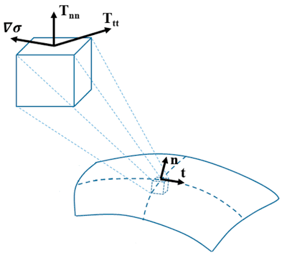

> **系列标签：** `知识文档` · `分子模拟` · `热力学量` · `MolSimulX`

日志里天天刷温度、压强；界面论文还要报表面张力。这三者都不是「仪表盘上的真实读数」，而是从动能、力与几何**构造出来的统计量**——定义一岔、平均不够、盒子太小，报出来的数就会和实验或别人的模拟对不上。

本篇把 温度 $T$、压强（标量与张量）、表面张力 $\gamma$ 放在一起讲：各从哪来、软件在控什么、界面算例在积什么。  

**不讲**热浴 / 压浴算法怎么选（见 [常见系综与控温控压](K11-常见系综与控温控压.md)），也不讲怎么从轨迹批量抽数（见 [轨迹分析与宏观性质](K16-轨迹分析与宏观性质.md)）；瞬时涨落怎么变成「±」，见 [统计误差与块平均](K17-统计误差与块平均.md)。

---

[erphpdown]

## 一、为什么要单独讲？

| 场景 | 你真正在问 |
|------|------------|
| NPT 液体要对实验密度 | 压浴控的是哪个 $P$？体积平均稳了吗？ |
| 日志里 $T$、$P$ 抖得吓人 | 瞬时值本来就该抖；论文报的是**时间平均** |
| 液–气 / 液–液界面报 $\gamma$ | 用法向–切向压强差积分；几何与预因子要对齐文献 |
| 换截断、换约束、换盒子，$\gamma$ 或 $P$ 变了 | 维里项与尺寸效应进了定义，不一定是「算错了」 |

搞清定义，才知道：**系综在约束什么宏观量**，以及 **Methods 里该写清哪些约定**。

> **Tips：** 温度、压强、张力都是**慢收敛、高噪声**量里的常客。看曲线平台 + 块误差，比盯着某一步的瞬时值有用得多。

---

## 二、温度：动能怎么变成 $T$

### 1. 瞬时温度

经典 MD 里，瞬时温度通常由动能定义：

$$
T = \frac{2 E_{\mathrm{kin}}}{f\, k_B}
$$

其中 $E_{\mathrm{kin}}=\sum_i \tfrac{1}{2}m_i v_i^2$，$f$ 是计入动能的**自由度**。

| 要点 | 说明 |
|------|------|
| **自由度 $f$** | 无约束时约 $3N$（再扣掉整体平移等，视软件约定）；开了键长/键角约束要扣掉约束数，否则 $T$ 会系统性偏。见 [键长键角约束与刚性](K10-键长键角约束与刚性.md) |
| **热浴设定值 $T_0$** | 算法努力让 $\langle T\rangle\approx T_0$；某一步的瞬时 $T$ 仍会上下晃 |
| **结构已平衡 ≠ $T$「到了」就够** | 温度可被热浴强行拉住，慢序参量还在漂。见 [平衡判据与收敛](K13-平衡判据与收敛.md) |

### 2. 和「实验温度」比什么？

报给读者的通常是生产段的 **$\langle T\rangle$**（± 不确定度），并写明：有无约束、热浴类型与耦合参数。  
若生产段要报扩散等动力学量，热浴过强会扭曲动力学——见 [常见系综与控温控压](K11-常见系综与控温控压.md)。

---

## 三、压强：理想气体项 + 维里项

### 1. 各向同性标量压强

对体积 $V$ 的各向同性压强，示意形式为：

$$
P = \frac{N k_B T}{V} + \frac{1}{3V}\left\langle\sum_{i \lt j} \mathbf{r}_{ij}\cdot\mathbf{F}_{ij}\right\rangle
$$

| 项 | 含义 |
|----|------|
| **理想气体项** | 动能 / 温度贡献（粒子「乱撞」） |
| **维里（virial）项** | 粒子间力与相对位置的贡献；吸引常压低 $P$，短程排斥常抬高 $P$ |

截断、长程静电、约束力都会进维里的具体实现；**换截断 ≈ 改有效压强**。尾部校正、平滑函数是否开，也要在 Methods 写清。见 [截断长程力与近邻列表](K08-截断长程力与近邻列表.md)。

### 2. NPT 在控什么？

压浴耦合的通常是**（某种约定下的）标量压强**——常见是压强张量对角元的平均。  
膜 / 界面常用**半各向同性**：例如 $xy$ 面积与 $z$ 方向分开调，让法向压强或表面张力相关约束更贴问题。细节仍归 [常见系综与控温控压](K11-常见系综与控温控压.md)。

> **Tips：** 瞬时 $P$ 比瞬时 $T$ 往往更「疯」。看 NPT 是否压住了，看**体积/密度是否平台**，不要只看某一步压强是否碰巧等于 1 bar。

---

## 四、压强张量：界面时不能只看一个数

更一般地，压强是**张量** $P_{\alpha\beta}$（$\alpha,\beta = x,y,z$）。

| 情况 | 关注什么 |
|------|----------|
| 各向同性液体 | 三个对角元平均 ≈ 标量 $P$；剪切分量应≈0 |
| 平面界面（法向取 $z$） | $P_N = P_{zz}$ 与 $P_T = (P_{xx}+P_{yy})/2$ 不同 |
| 晶体 / 剪切 / 流变 | 偏应力、非对角剪切分量 |

### 压力张量的定义并不唯一

「压强张量」在教科书和软件里**没有全世界统一的唯一公式**。差在哪、你要不要慌：

| 分歧点 | 你会碰到什么 |
|--------|----------------|
| **原子维里 vs 分子维里** | 力与力臂按原子对还是按分子质心归并；刚体 / 约束体系尤其敏感 |
| **局域压强剖面的约定** | 沿 $z$ 的 $P_N(z)$、$P_T(z)$ 有 Irving–Kirkwood、Harasima 等分解；局域曲线形状可不同，**积分出的 $\gamma$ 在合适条件下常更接近** |
| **长程静电与约束** | Ewald/PPPM、SHAKE 等如何计入维里，软件默认可能不同 |
| **尾部校正** | 截断 LJ 是否加解析尾部，会系统移动 $P$ 与 $\gamma$ |

实践含义：

1. **同力场、同软件、同设置**下比趋势，比跨软件「绝对对表」更稳妥；  
2. Methods 写清：软件版本、截断、静电、约束、是否尾部校正、界面几何（几块界面）；  
3. 换一种局域分解去「修曲线形状」，若积分 $\gamma$ 几乎不变，通常不必恐慌。

---

## 五、表面张力：法向减切向再积分

对平面界面，常用机械定义是法向与切向压强差沿法向积分：

$$
\gamma = \int_{-\infty}^{\infty} \big( P_N(z) - P_T(z) \big)\, dz
$$

（有的写法把预因子写成 $\tfrac{1}{2}$ 等——取决于盒子里是**一块还是两块**界面。分析脚本与文献几何必须对齐。）

| 要点 | 说明 |
|------|------|
| **几何** | 液板夹两气相 → 通常有两个界面，积分时要除以 2（或等价处理） |
| **噪声** | 瞬时 $\gamma$ 极吵，必须长平均 + [统计误差与块平均](K17-统计误差与块平均.md) |
| **面积与毛细波** | 界面起伏的长波被盒子截断 → $\gamma$ 或界面宽度可随横向面积变；见 [有限尺寸效应](K18-有限尺寸效应.md) |
| **力场与截断** | 数值绝对值常偏离实验；同力场比趋势、比相对变化更有意义 |
| **其他路线** | 还有毛细波谱、热力学积分等；入门先把机械（压强张量）路线搞熟 |

液–固、弯曲界面、带电界面等，张量积分仍可用，但边界条件、静电处理（如 slab）更绕——先对齐 [边界条件与初始条件](K07-边界条件与初始条件.md)、[截断长程力与近邻列表](K08-截断长程力与近邻列表.md)。

---

## 六、三者对照（备忘）

| 量 | 微观入口 | 系综里常扮演的角色 | 报告时别忘 |
|----|----------|---------------------|------------|
| **温度 $T$** | 动能 / 自由度 | 热浴目标；NVT/NPT 的 $T$ | 约束是否扣自由度；$\langle T\rangle$±误差 |
| **压强 $P$** | 动能项 + 维里 | 压浴目标；NPT 的 $P$ | 截断/静电/尾部；看密度平台 |
| **表面张力 $\gamma$** | $P_N-P_T$ 积分 | 界面问题的目标量（有时还反控面积） | 几块界面、面积扫描、误差条 |

---

## 七、实践小清单

| 检查项 | 问自己 |
|--------|--------|
| 温度 | $f$ 与约束一致吗？$\langle T\rangle$ 是否贴近设定？ |
| 压强监控 | 盯的是瞬时 $P$ 还是体积/密度平台？ |
| 维里设置 | 截断、静电、尾部校正、约束与文献/上次算例一致吗？ |
| 张量 | 体相看对角平均；界面看法向/切向 |
| 张力几何 | 几块界面？积分预因子对了吗？ |
| 尺寸 | 横向面积换过吗？见 [有限尺寸效应](K18-有限尺寸效应.md) |
| 统计 | 生产够长、块误差或独立重复有吗？见 [统计误差与块平均](K17-统计误差与块平均.md) |
| Methods | 软件、系综、热浴/压浴、截断、静电、约束、几何写清了吗？ |

---

## 八、常见问题

**Q：为什么设定 1 bar，日志里压强经常是几百 bar 量级乱跳？**  
A：瞬时维里涨落大是常态。看时间平均和体积是否稳；不要用单步 $P$ 判断「压浴坏了」。

**Q：同一轨迹，两个分析脚本的 $\gamma$ 差一截？**  
A：先核对：界面个数与预因子、单位、是否含尾部校正、压强剖面约定。定义不唯一时，差在约定，不一定差在轨迹。

**Q：温度均值对了，密度却和实验差很多？**  
A：温度只说明动能对上了；密度在 NPT 下主要由力场 + 压强定义（维里）决定。先查力场与截断，再查是否真平衡。

---

## 九、小结

1. **$T$、$P$、$\gamma$ 都是统计构造量**；论文报平均 ± 不确定度，不报某一步的瞬时值。  
2. **温度**来自动能与自由度；约束要扣 $f$，热浴拉住 $T$ ≠ 结构已平衡。  
3. **压强** = 理想气体项 + 维里项；截断、静电、约束、尾部都进维里。  
4. **压强张量**在界面上比标量 $P$ 重要；**定义并不唯一**，Methods 写清约定。  
5. **表面张力**常用 $P_N-P_T$ 沿法向积分；注意界面个数、面积尺寸与误差。  
6. 控温控压算法见 [常见系综与控温控压](K11-常见系综与控温控压.md)；分析入口见 [轨迹分析与宏观性质](K16-轨迹分析与宏观性质.md)。

---

[/erphpdown]

## 学习路径

**前置阅读：** [常见系综与控温控压](K11-常见系综与控温控压.md) · [轨迹分析与宏观性质](K16-轨迹分析与宏观性质.md) · [截断长程力与近邻列表](K08-截断长程力与近邻列表.md)

**下一步：**

- [统计误差与块平均](K17-统计误差与块平均.md) —— $T$/$P$/$\gamma$ 的 ± 怎么估  
- [有限尺寸效应](K18-有限尺寸效应.md) —— 界面面积与毛细波  
- [键长键角约束与刚性](K10-键长键角约束与刚性.md) —— 自由度与温度  
- [输运系数谱系](K21-输运系数谱系.md) —— 应力涨落与粘度等（相关但另一条线）
