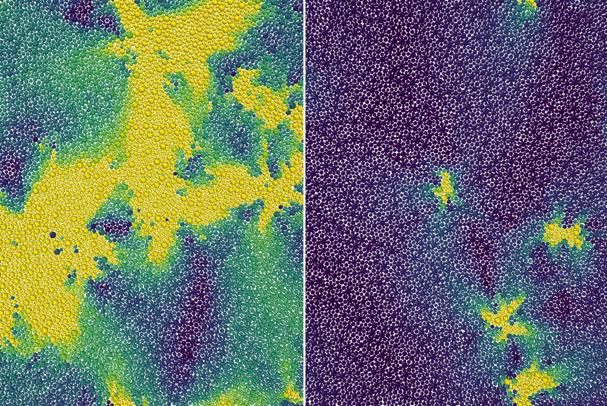

> **系列标签：** `知识文档` · `分子模拟` · `相变` · `MolSimulX`

日志里的温度、能量、密度，多半能告诉你「跑稳了没有」，却常常说不清更刺眼的事：**现在是气还是液？是液体还是晶体？刚冒出的小核是 FCC 还是 BCC？**  

要回答这类问题，得另选一个（或几个）数，专门盯「相」——这就是**序参量（order parameter）**。

本篇用两个例子把仪表装起来：

1. **气–液**：近邻原子数（配位数）够不够用；  
2. **液–晶**：为什么光数邻居不够，还要认出 **FCC / BCC / HCP** 这类局部结构。

**晶格名先扫一眼**（细节第四节再展开；入门只需「邻居个数与排法不同」）：

| 缩写 | 全称（直觉） | 粗记 |
|------|--------------|------|
| **FCC** | face-centered cubic，面心立方 | 立方密堆积的一种；理想第一壳 **12** 近邻 |
| **HCP** | hexagonal close-packed，六方密堆积 | 也是 **12** 近邻密堆积，但层堆法与 FCC 不同 |
| **BCC** | body-centered cubic，体心立方 | 理想第一壳常记 **8**（更远还有次近邻一圈） |

液体也可以「很挤」，所以只数邻居分不清液 / FCC / HCP——必须再看方位与堆垛。

最后再和 [增强采样与自由能](K14-增强采样与自由能.md) 里的**集体变量**（CV）对上号。「能量平了 ≠ 慢过程结束」见 [平衡判据与收敛](K13-平衡判据与收敛.md)；$g(r)$ 等结构入口见 [轨迹分析与宏观性质](K16-轨迹分析与宏观性质.md)。



---

[erphpdown]

## 一、相变在说什么？

**相（phase）**：在给定条件下，物质按同一套规矩过日子——气稀、液密、晶有周期性，是三套不同的规矩。  
**相变（phase transition）**：条件一变，规矩换了——冷凝、蒸发、凝固、熔化，或晶体结构之间互变。

| 类型 | 眼睛（和序参量）常看到什么 |
|------|---------------------------|
| **一级相变** | 可两相**共存**；序参量可**跳**；升温/降温可能**滞后** |
| **靠近临界** | 两相越来越像，涨落很大；对 [有限尺寸效应](K18-有限尺寸效应.md)（盒子大小）极敏感 |

> **Tips：** 小盒子里界面「贵」、转变点会被挪、峰会被抹圆——先别急着和实验熔点/沸点死对表，见 [有限尺寸效应](K18-有限尺寸效应.md)。

只看总能量或整盒平均密度，经常不够：平均可以卡在「两相之间」，你却分不清是均匀糊状，还是已经分相、只是平均被掺在一起。这时就需要序参量。

---

## 二、序参量：给「相」装一块仪表盘

原子坐标有 $3N$ 维。**序参量** $s$ 把构型压成少数个数，让你能问：

1. **现在是哪一相？**  
2. **变到哪一步了？**（小核刚冒头，还是已经长很大）  
3. **平衡了没有？**（$s(t)$ 还在单向爬，还是已在目标盆地里晃）  
4. **（进阶）垒有多高？**——这时同一个 $s$ 往往就是增强采样里的 **CV**

好仪表的共性：不同相取值分得开、转变时说得通、定义写进 Methods 能复现。下面两个例子，一个教「数邻居」，一个教「认晶格」。

---

## 三、例子 A：气–液 —— 近邻原子数

气和液最直观的差别之一是：**身边挤不挤。**

对每个粒子 $i$，数「在截断距离 $r_c$ 内有几个别的粒子」，记作配位数 / 近邻数 $n_i$。再取平均：

$$
s = \langle n \rangle = \frac{1}{N}\sum_i n_i
$$

| 状态   | $s=\langle n\rangle$ 的粗感觉      |
| ---- | ------------------------------ |
| 稀气体  | 很小（经常接近 0～1）                   |
| 密液体  | 明显更大（取决于 $r_c$ 和密度）            |
| 气液共存 | 整盒平均可能居中；**局部** $n_i$ 则一边高、一边低 |

$r_c$ 常取 [轨迹分析与宏观性质](K16-轨迹分析与宏观性质.md) 里径向分布函数 $g(r)$ 第一峰后的第一个谷。Methods 写清 $r_c$。

| 现象 | 近邻数视角 |
|------|------------|
| 冷凝 / 蒸发 | $\langle n\rangle$ 挪到另一平台 |
| 两相共存 | 局部 $n_i$ 呈双峰 |
| 成核（冒滴 / 冒泡） | 先出现一小片高（或低）$n_i$，再长大 |

> **Tips：** 看**成核**时，盯最大高配位团簇往往比全局 $\langle n\rangle$ 管用——全局一平均，小液滴会被稀释成「还是气体」。

近邻数定义清楚、直觉好，是气液问题的好起点；但它**分不清「同样挤、但是不是晶体」**——这就要第二个例子。

---

## 四、例子 B：液–晶 —— 认出 FCC / BCC / HCP

液体和许多晶体都可以「很挤」。例如：

| 结构 | 理想近邻数（粗记） | 邻居怎么排 |
|------|-------------------|------------|
| **液体** | 也常到 10～12 量级（随定义变） | **乱**，没有长期的角度规矩 |
| **FCC**（面心立方） | 12 | 密堆积的一种立方排法；金属、惰性固体里很常见 |
| **HCP**（六方密堆积） | 12 | 也是 12 个近邻，但 ABAB… 层堆与 FCC 的 ABCABC… 不同 |
| **BCC**（体心立方） | 8（再远一圈还有 6 个次近邻） | 体心一个原子、顶角共享；第一壳比 FCC/HCP 疏 |

> **Tips：** 不必背晶体学推导。模拟里把它们当成三种「局部邻居排法的模板」即可：分析软件（PTM、CNA 等）拿模板去贴每个原子的标签。FCC 与 HCP 最容易互相误判，Methods 必须写清判据。

所以：**只数 $n_i$，液体、FCC、HCP 经常糊在一起**——都「挺挤」。要认晶体，还得看**邻居的方位、夹角、堆垛**，而不能只看个数。

### 常用办法（先分清种类，不推公式）

| 思路 | 在干什么 | 你得到什么 |
|------|----------|------------|
| **键取向序**（如 Steinhardt $Q_4$、$Q_6$ 等） | 看每个原子周围键的「角度花样」 | 液低、晶高；有时可辅助区分结构类型 |
| **公共近邻 / 模板匹配**（CNA、PTM 等） | 把局部环境跟 FCC、BCC、HCP… 的模板比对 | 直接给原子贴标签：FCC / BCC / HCP / 其他 |
| **最大晶粒尺寸** | 把「被判成晶」的原子连成团，看最大团多大 | 成核与生长的进度条 |

封面那种上色，背后往往就是：**每个原子一个局部序参量（或结构标签）**——亮 = 更像某类晶体环境，暗 = 更像液体。左图大片亮区 ≈ 晶粒已长大；右图零星亮点 ≈ 刚成核或涨落。

### 为什么要分清 FCC / BCC / HCP？

| 你关心的问题 | 为什么结构类型重要 |
|--------------|-------------------|
| 凝固产物是哪种晶 | 力学、衍射、后续相变路径都不同 |
| 成核早期是什么局部结构 | 可能先出现亚稳相（例如某条件先 BCC 样，再转 FCC） |
| 和实验/文献比 | 别人报的是「FCC 分数」还是「$Q_6$ 平均」，要对齐定义 |

> **Tips：** FCC 与 HCP 都是 12 近邻密堆积，**最容易分错**；分析时写清用的是 PTM、CNA 还是哪套 $Q_\ell$ 阈值，换阈值标签可能对不上。

### 结晶在轨迹里长什么样？

| 现象 | 你可能看到 |
|------|------------|
| **整体凝固 / 熔化** | 晶体原子分数或 $\langle Q_6\rangle$ 挪到另一平台 |
| **成核生长** | 先冒出一小簇 FCC/BCC/HCP 标签原子，再扩大（封面右 → 左） |
| **多态竞争** | 同时出现不止一种标签；有的核长大、有的消失 |
| **只看能量** | 可能早已平台，晶粒却还在长大或重组 |

成核同样常是稀有事件；要系统估垒，把「晶体原子数 / 最大晶粒尺寸」升级成 CV 即可——下一节。

---

## 五、和前面的 CV 怎么对上号？

[增强采样与自由能](K14-增强采样与自由能.md) 里，**集体变量**（CV）也是把慢过程压成少数个数，再沿它偏置、分窗，去估

$$
F(s) = -k_B T \ln P(s) + \mathrm{const}
$$

| | **序参量**（本篇） | **CV**（增强采样文） |
|--|-------------------|----------------------|
| **气液例子** | $\langle n\rangle$、最大液滴尺寸 | 经常就是同一个 $s$ |
| **晶体例子** | 晶体原子分数、最大晶粒尺寸、$Q_6$… | 同上，拿去偏置采成核垒 |
| **你在问** | 「是哪一相？核长多大了？是不是 FCC？」 | 「垒有多高？哪条路径更便宜？」 |
| **好坏** | 能分开态就合格（监控） | 还得让垒大致对准真实瓶颈 |

### 推荐工作流

```text
短跑 / 观察
    → 气液：选 r_c，看 ⟨n⟩ / 团簇是否分得开
    → 结晶：选 Q6 或 PTM/CNA，看液/晶（及 FCC/BCC/HCP）是否分得开
    → 分得开：用来监控进度（序参量）
    → 几乎看不到转变、想要垒高：把同一个 s 当作 CV → F(s)
```

> **Tips：** **好序参量是好 CV 的必要条件，不是充分条件。** 全局 $\langle Q_6\rangle$ 能分开液晶，不等于沿它偏置就采到了真实成核路径——成核更常盯**最大晶粒**或局部标签团簇。

---

## 六、别处还会用哪些？

| 类型 | 例子 | 典型用途 |
|------|------|----------|
| **邻居 / 密度** | 近邻数、局部密度 | 气液、分层（例子 A） |
| **结构 / 取向序** | $Q_\ell$、CNA、PTM | 液晶、FCC/BCC/HCP（例子 B） |
| **几何 / 尺寸** | 回转半径、团簇大小 | 聚合物、聚集 |
| **界面** | 界面高度、接触角相关量 | 润湿、薄膜 |
| **反应坐标** | 键长、氢键数、质心距离 | 成键、结合–解离 |

没有全世界唯一正确的 $s$。气液常「近邻 + 密度」互核；结晶常「取向序 / 模板标签 + 晶粒尺寸」互核。

---

## 七、实践上怎么做？

### 1. 怎么选：三问

1. 我要分的是气/液，还是液/晶，还是 FCC vs BCC vs HCP？  
2. 只数邻居够不够？结晶的话要不要上 $Q_\ell$ 或 PTM/CNA？  
3. 全局平均够不够，要不要最大滴 / 最大晶粒？

### 2. 监控与自由能

- 画 $s(t)$，不要只报最终一个数。见 [平衡判据与收敛](K13-平衡判据与收敛.md)。  
- 报平均值或等待时间，记得 [统计误差与块平均](K17-统计误差与块平均.md)。  
- 需要垒高时，先体检再交给 [增强采样与自由能](K14-增强采样与自由能.md) 当 CV。

### 3. Methods 建议写清

近邻：$r_c$；晶体：$Q_\ell$ 参数或 PTM/CNA 版本与阈值、如何计「晶体原子」；是否局部/团簇；盒长与尺寸扫描；若当 CV，偏置与重加权。

---

## 八、实践小清单

| 检查项 | 问自己 |
|--------|--------|
| 问题 | 气液，还是凝固/熔化/晶型？ |
| 仪表 | 近邻数，还是 $Q_\ell$ / PTM / CNA？ |
| 晶型 | 需要区分 FCC / BCC / HCP 吗？阈值写清了吗？ |
| 全局 vs 局部 | 小核会不会被平均稀释？ |
| 区分度 | 直方图 / 上色图上两相分得开吗？（对照封面那种图） |
| 与 CV | 只要监控，还是要采 $F(s)$？ |
| 尺寸 / 误差 | 见 [有限尺寸效应](K18-有限尺寸效应.md)、[统计误差与块平均](K17-统计误差与块平均.md) |

---

## 九、常见问题

**Q：FCC、BCC、HCP 必须会画晶胞吗？**  
A：不必。本篇当「三种常见局部堆法的名字」用即可：FCC/HCP 都密（约 12 近邻）、排法不同；BCC 第一壳更疏（常记 8）。真要出图或对衍射，再回晶体学教材补晶胞。

**Q：平均密度不是已经能区分气液了吗？**  
A：体相均匀时可以。两相共存时，整盒密度只是掺和；局部近邻或团簇尺寸更能说明「分相了没有、滴有多大」。

**Q：液体和 FCC 近邻数差不多，怎么办？**  
A：换例子 B 的仪表——键取向序或 PTM/CNA 一类结构识别；不要只靠 $n_i$。

**Q：封面图上的黄和紫一定是 FCC 和液体吗？**  
A：不一定。颜色只表示**你选的局部序参量高低**（或某类标签）。Methods / 图注要写清判据；换阈值，同一轨迹上色可以不同。

**Q：序参量和 CV 是不是一回事？**  
A：可以是同一个定义。**用法不同**：监控叫序参量；沿它偏置采 $F(s)$ 叫 CV。

**Q：能量平台了，还要盯序参量吗？**  
A：要——若你关心相。温度可被热浴拉住，晶粒或液滴却还在长。非平衡驱动下亦然：先无驱动平台，再看驱动下序参量 / 通量是否进入定态（见 [平衡判据与收敛](K13-平衡判据与收敛.md)）。

---

## 十、小结

1. **序参量**是给「相」用的仪表：区分态、跟踪成核、必要时当 CV。  
2. **气–液**：近邻原子数是好起点；成核看局部/团簇。  
3. **液–晶**：只数邻居不够；用键取向序或 PTM/CNA 等认出 **FCC / BCC / HCP**，并用最大晶粒跟踪生长（封面左大右小）。  
4. 与 [增强采样与自由能](K14-增强采样与自由能.md)：**先体检分开态，再升级为 CV**。  
5. 小盒子与近临界要警惕 [有限尺寸效应](K18-有限尺寸效应.md)；慢变量报 ± 见 [统计误差与块平均](K17-统计误差与块平均.md)。

---

[/erphpdown]

## 学习路径

**前置阅读：** [轨迹分析与宏观性质](K16-轨迹分析与宏观性质.md) · [平衡判据与收敛](K13-平衡判据与收敛.md) · [增强采样与自由能](K14-增强采样与自由能.md)（集体变量一节）

**下一步：**

- 回看 [增强采样与自由能](K14-增强采样与自由能.md) —— 液滴尺寸 / 晶粒尺寸升级为 CV  
- [有限尺寸效应](K18-有限尺寸效应.md) —— 共存与成核时的盒子坑  
- [统计误差与块平均](K17-统计误差与块平均.md) —— 慢序参量的 ±  
- [温度、压强与表面张力](K19-温度压强与表面张力.md) —— 有界面时的 $\gamma$  
