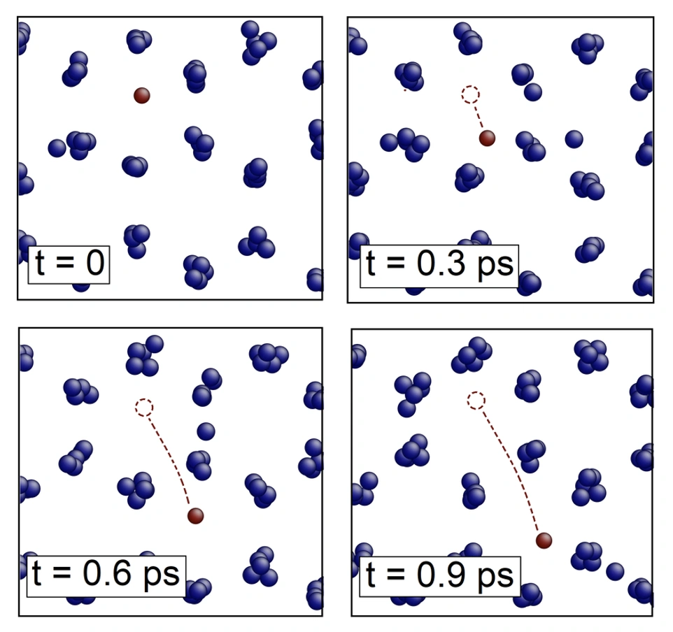

> **系列标签：** `知识文档` · `分子模拟` · `输运` · `MolSimulX`

密度、能量、RDF 回答「平衡在哪、结构像什么」；**输运系数**回答另一类问题：体系被轻轻推一下（或自己涨落）之后，**粒子、取向、动量、能量、电荷**怎么传开。液体有多稠、热导好不好、离子在电解液里跑多快——都落在这张谱系上。

### 哪些量算「输运系数」？

入门先认这几位（名字可能随领域略变，物理图像不变）：

| 输运系数 | 传的是什么 | 日常语感 |
|----------|------------|----------|
| **自扩散系数 $D$** | 示踪粒子怎么平移散开 | 「分子/离子自己乱逛有多快」 |
| **旋转扩散系数 $D_r$** | 取向忘掉初始方向有多快 | 「转得多快才不记得刚才朝哪」 |
| **剪切粘度 $\eta$** | 动量怎么横传 | 「液体有多稠、抗剪切有多强」 |
| **热导率 $\kappa$** | 能量（热）怎么横传 | 「导热好不好」 |
| **电导率**（含离子电导） | 电荷在电场下怎么走 | 「导电好不好、内阻大概怎样」 |
| **互扩散 / 多组分扩散**等 | 不同组分相对怎么运 | 「盐、溶剂谁拖着谁走」 |

它们有共同点：都是**线性响应**里「扰动 → 通量」的比例系数；MD 里既可用平衡涨落算，也可用非平衡驱动测（见下表）。

### 和什么应用对得上号？

不必只会背公式——先想「你论文 / 产品里哪句话其实在谈输运」：

| 场景 | 常盯的输运量 | 为什么在乎 |
|------|--------------|------------|
| **电池 / 电解质 / 离子液体** | 离子扩散 $D$、离子电导率、有时粘度 | 内阻、倍率、低温性能；电解液「稀不稀、离子跑不跑」 |
| **热管理 / 导热界面 / 冷却液** | 热导率 $\kappa$、有时粘度 | 散热路径、局部热点 |
| **流变 / 润滑 / 软物质加工** | 剪切粘度 $\eta$（及非线性流变） | 泵送、成膜、剪切稀化 |
| **膜、多孔介质、分离** | 扩散、渗透相关量 | 透过快慢、选择性 |
| **溶液化学 / 药物递送（入门级）** | 溶质扩散 $D$ | 混合、释放时间尺度 |

[轨迹分析与宏观性质](K16-轨迹分析与宏观性质.md) 已把**自扩散**（MSD / VACF）讲顺。本篇把整张谱系摊开，并分清两条算法大道：

| 大道              | 一句话                                | 细节落在哪                                           |
| --------------- | ---------------------------------- | --------------------------------------------- |
| **平衡方法（EMD）**   | 不加外场，用平衡涨落的相关函数（或 Einstein 型位移）算响应 | **本篇讲清**                                        |
| **非平衡方法（NEMD）** | 外加剪切 / 温差 / 电场等，测稳态通量，再外推到线性区      | 本篇给地图与怎么选；设定与陷阱见 [非平衡分子动力学概述](K22-非平衡分子动力学概述.md) |

> **Tips：** 报电池相关结论时，写清是**体相**扩散/电导，还是含界面、多孔电极的有效量；后者通常超出单段体相 MD 的默认射程。平衡化与 NEMD 定态判据见 [平衡判据与收敛](K13-平衡判据与收敛.md)。



---

[erphpdown]

## 一、输运系数在说什么？

前言里的表已经点名「是谁」；这里补**为什么能用同一套语言谈**。封面上示踪粒子随时间走开，就是**自扩散**最直观的图像；粘度、热导、电导是同一类「线性响应」换了传的对象（动量、能量、电荷），不一定总用位移来画。

把体系想成对小扰动的**线性响应**：

| 你轻轻施加… | 体系出现… | 比例系数（示意） |
|-------------|-----------|------------------|
| 浓度 / 密度差 | 粒子流 | 平动扩散系数 $D$ |
| 取向「记得」初始方向 | 取向相关衰减 | 旋转扩散系数 $D_r$ |
| 速度梯度（剪切） | 动量横传（应力） | 剪切粘度 $\eta$ |
| 温度梯度 | 能量横传（热流） | 热导率 $\kappa$ |
| 电场 | 电流 | 电导率 |

系数越大，同样扰动下通量越大。MD 里两条路殊途同归（在**线性区**）：

1. **平衡**：不真的去推，只看涨落里「自己跟自己」的时间相关，再积分（Green–Kubo）或看长时位移平方（Einstein）。  
2. **非平衡**：真的推一下，直接测通量 / 梯度比，再把推的力度外推到零。

> **Tips：** 「线性」很关键——推太猛，结构被扯坏、温度失控，报出来的就不是教科书上的那个输运系数。非平衡路线尤其要会外推，见后文与 [非平衡分子动力学概述](K22-非平衡分子动力学概述.md)。

---

## 二、谱系：常见成员

| 系数 | 物理图像 | 平衡法入口（示意） | 非平衡法入口（示意） |
|------|----------|-------------------|---------------------|
| **自扩散 $D$** | 示踪粒子**平移**随机走（封面） | MSD；速度自相关 VACF | 外力拖曳、浓度梯度等（较少作入门首选） |
| **旋转扩散 $D_r$** | 分子**取向**忘掉初始方向 | 取向相关衰减；角均方位移 | —（一般仍用平衡相关） |
| **剪切粘度 $\eta$** | 动量**横传**，液体「有多稠」 | 应力（压强张量非对角）时间相关；或应力 Einstein 型 | 施加剪切 / 应变率，测应力 |
| **热导率 $\kappa$** | 能量**横传** | 热流自相关 | 温度梯度或热流驱动，测热流 / 梯度 |
| **离子电导率** | 电荷在电场下怎么走 | 电流自相关；或电荷位移 Einstein 型 | 加电场，测电流 / 迁移 |
| **互扩散等** | 多组分相对输运 | 更绕的通量相关 | 浓度梯度、双极扩散等设定 |

入门优先：**平动 $D$ → 旋转 $D_r$（按需）→ $\eta$ → $\kappa$**；做电解质再加电导。  
平动扩散的分析坑（unwrap、拟合窗口）见 [轨迹分析与宏观性质](K16-轨迹分析与宏观性质.md)；**旋转扩散的谱系位置与做法见下文第三节**。

**Einstein 型**与 **Green–Kubo（GK）积分**在合适极限下常等价：一条看「走了多远的平方」，一条看「相关函数曲线下面积」。实践中看哪条曲线更稳、更好估误差。

> **Tips：** 「横传」= **横跨流动方向传递**。剪切时速度沿 $x$、随 $y$ 变化，动量却要在 $y$ 方向一层层传开，才把慢层拖快、快层拖慢——粘度量的就是这种「旁边传动量」的本事。热导同理：温度沿一个方向有梯度，能量往垂直于等温面的方向传。和自扩散「粒子自己乱跑」不是同一幅画。

---

## 三、平衡方法：不加场，从涨落里抠响应

### 1. 总图像

```text
平衡生产段轨迹（热浴宜克制）
    → 构造通量或速度：v、应力 P_αβ、热流 J、电流…
    → 算时间相关 C(t)=⟨A(0)A(t)⟩
    → 积分 ∫C(t)dt  → 输运系数（GK）
  或
    → 构造位移型量（位置、「应力积分」等）
    → 长时 MSD 斜率 → 同一系数（Einstein）
```

不需要改力场去「制造梯度」；代价是：**信号就是平衡涨落，往往很吵、要很长的轨迹。**

### 2. 自扩散（你可能已经会）

三维 Einstein 关系（长时线性区）：

$$
D = \lim_{t\to\infty}\frac{1}{6t}\langle |\Delta\mathbf{r}(t)|^2\rangle
$$

Green–Kubo：

$$
D = \frac{1}{3}\int_0^\infty \langle \mathbf{v}(0)\cdot\mathbf{v}(t)\rangle\,dt
$$

细节（unwrap、拟合窗口、热浴）见 [轨迹分析与宏观性质](K16-轨迹分析与宏观性质.md)。封面红粒子的位移平方，平均起来就是 MSD 路线。

### 3. 旋转扩散

平动 $D$ 问的是质心**跑多开**；分子（水、棒状溶质、液晶基元、蛋白质结构域）还会**转**——取向忘掉初始方向有多快，对应**旋转扩散系数 $D_r$**。它和 $D$ 同属扩散家族，只是「马上到」的不是位置，而是方向。

| 量 | 含义 |
|----|------|
| **取向相关** | 如 $\langle\mathbf{u}(0)\cdot\mathbf{u}(t)\rangle$（$\mathbf{u}$ 为分子轴或偶极方向）随时间衰减 |
| **旋转扩散 $D_r$** | 由取向相关的衰减时间估计（预因子因定义、分子对称性而异） |
| **角均方位移** | 类比平动 MSD：用转过的角度构造，长时斜率连到 $D_r$ |

和平动对照：

| | 平动 $D$ | 旋转 $D_r$ |
|--|---------|-----------|
| 图像 | 示踪粒子走开（封面） | 分子轴「转忘」初始指向 |
| 平衡入口 | MSD / VACF | 取向相关 / 角 MSD |
| 非平衡 | 较少作入门首选 | 一般仍用平衡相关 |
| 何时要报 | 几乎总要 | 介电弛豫、NMR 取向、各向异性粒子、液晶等 |

实践注意：

- 先定义清楚「分子轴」；柔性分子用相对刚性的局部标架，否则轴本身在扭，衰减会被污染。  
- 各向异性分子可能有不止一个旋转分量（绕不同轴）。  
- 热浴过强同样会扭曲取向动力学；报 $D_r$ 时生产段耦合宜克制。

轨迹怎么抽取向、和实验怎么对，见 [轨迹分析与宏观性质](K16-轨迹分析与宏观性质.md)；本篇强调：它在谱系里和 $D$、$\eta$、$\kappa$ 并列，不是「分析文里的附录名词」。

### 4. 剪切粘度（平衡）

剪切粘度连着**动量怎么横传**——不是粒子顺着流跑多远，而是**相邻流层之间**把动量递过去的快慢。

想象两层液体：$x$ 方向流速不同（有剪切）。快层要拖慢层、慢层要拖快层，靠的是层与层之间的动量交换；交换得越凶，宏观上越「稠」，$\eta$ 越大。这就是「横传」：传递方向与宏观流速方向**不平行**，而是横跨速度梯度方向。

平衡路线常用压强张量的非对角元（如 $P_{xy}$）做应力自相关，再 GK 积分；也有 Einstein 型写法（对应力时间积分的「均方」取斜率）。

要点：

- 应力来自动能项 + 维里项，和 [温度、压强与表面张力](K19-温度压强与表面张力.md) 是同一套张量语言。  
- 相关函数常有**长时尾**，积分上限难选；截早了偏小，截晚了噪声主导。  
- 比 $D$ 更吃轨迹长度与块误差估计。

### 5. 热导率（平衡）

热导率连着**能量怎么横传**：一边热、一边冷时，能量沿温度梯度方向传开的本事——同样是「跨过等温面传递」，不是某个原子 MSD。

平衡路线构造微观**热流** $\mathbf{J}$（定义与软件约定有关），做 $\langle\mathbf{J}(0)\cdot\mathbf{J}(t)\rangle$ 的 GK 积分。

要点：

- 热流定义比速度更绕（尤其多原子分子、约束、长程静电）；Methods 写清软件与公式约定。  
- 噪声通常比粘度还凶；收敛慢、对尺寸敏感。  
- 「传热 ≠ 再算一个 MSD」——别指望用粒子位移直接代替热流相关。

### 6. 离子电导（平衡）

电解质里，可用电流自相关的 GK，或离子电荷加权位移的 Einstein 型关系。注意：

- 自扩散加起来**不等于**电导（离子相关、异号拖曳会进来）。  
- 强静电 + 周期边界时，尺寸与静电处理方法会影响数值。

### 7. 平衡法实践清单

| 检查项 | 问自己 |
|--------|--------|
| 生产段 | 已平衡？热浴是否过强扭动力学？见 [常见系综与控温控压](K11-常见系综与控温控压.md) |
| 相关函数 | $C(t)$ 是否衰减到噪声平台？积分上限怎么选？ |
| Einstein | 是否落在长时**线性区**（不是弹道区）？ |
| 旋转 | 若报 $D_r$：分子轴定义清楚了吗？柔性标架污染了吗？ |
| 误差 | 块平均 / 多段 / 独立重复？见 [统计误差与块平均](K17-统计误差与块平均.md) |
| 尺寸 | $D$、$\eta$、$\kappa$ 是否做了盒长对比或修正？见 [有限尺寸效应](K18-有限尺寸效应.md) |
| 报告 | 公式约定、截断、静电、轨迹长度、拟合窗口写清了吗？ |

> **Tips：** 平衡法「设定简单、收敛折磨人」。粘度 / 热导算不准时，先拉长轨迹与老实报误差，再考虑换非平衡路线——不是一上来就加场。

---

## 四、非平衡方法：加扰动，直接测通量

### 1. 总图像

```text
外加可控扰动（剪切、温度梯度、电场…）
    → 进入稳态后测量通量（应力、热流、电流…）
    → 输运系数 ≈ 通量 / 梯度（或应变率）
    → 换几组扰动强度，外推到「扰动 → 0」的线性区
```

信号往往比 GK 积分**更强、更快出数**；代价是：你引入了驱动、边界、生热，多了一堆要证明「还在线性、没把体系弄坏」的功课。

### 2. 和平衡法怎么分工？

| | **平衡（EMD + GK / Einstein）** | **非平衡（NEMD）** |
|--|--------------------------------|---------------------|
| 设定 | 标准平衡生产段 | 要设计驱动与热浴/边界 |
| 信号 | 弱，靠长轨迹 | 相对强 |
| 主要风险 | 积分上限、长时尾、噪声 | 非线性、过热、驱动伪迹 |
| 尺寸 | 流体力学有限尺寸仍在 | 驱动方向与盒长强耦合 |
| 适合 | 已有很长平衡轨迹；要与涨落理论对照 | 平衡收敛绝望时；要扫驱动看响应 |

**两者应在线性区给出一致趋势。** 差很多时，优先查：是否线性、热浴、有限尺寸、是否真平衡、通量定义是否一致——而不是只信某一个软件默认值。

### 3. 本篇只画到门口：细节去哪读？

非平衡的**驱动类型、生热、线性外推、边界陷阱与 Onsager 交叉效应**，专文展开 → [非平衡分子动力学概述](K22-非平衡分子动力学概述.md)。  
本篇只需记住：粘度 / 热导 / 电导在非平衡侧分别对应「什么通量 ÷ 什么梯度」，再决定要不要离开平衡路线。

> **Tips：** 读完本篇谱系与平衡法后，若决定走 NEMD，再打开专文——避免还没搞清「粘度对应什么通量」就埋进驱动关键字。

---

## 五、为什么比平均能量难算得多？

| 难点 | 含义 | 怎么办（概念） |
|------|------|----------------|
| **长时尾** | 相关函数慢慢拖尾，积分贡献不可忽略 | 足够长的 $t$；对照 Einstein 斜率；文献中的尾部模型（选用时对齐条件） |
| **噪声大** | 单次 $C(t)$ 很毛 | 长轨迹、多块平均、独立重复；老实报 ± |
| **有限尺寸** | 长波流体力学模式被盒子截断；$D$、$\eta$、$\kappa$ 常随 $L$ 变 | 多尺寸；扩散等可辅以流体力学修正（见 [有限尺寸效应](K18-有限尺寸效应.md)） |
| **热浴污染动力学** | 摩擦太强，相关衰减被人为加快 | 生产段耦合宜弱；或对照 NVE 段（若稳定） |
| **定义与约定** | 热流、应力、约束、尾部校正因软件而异 | Methods 写清；同力场、同设置比趋势 |

输运是「动力学量」：结构已经平衡，不代表相关函数已经采够。见 [平衡判据与收敛](K13-平衡判据与收敛.md)。

---

## 六、怎么选路线？（决策表）

| 情况 | 更稳妥的起点 |
|------|----------------|
| 只要平动自扩散 | 平衡 MSD / VACF，见 [轨迹分析与宏观性质](K16-轨迹分析与宏观性质.md) |
| 还要旋转扩散 | 取向相关 / 角 MSD → $D_r$（见上文第三节） |
| 有很长平衡轨迹，想顺手报粘度/热导 | 先试平衡 GK；看 $C(t)$ 是否救得回来 |
| 平衡 GK 积分怎么截都晃 | 转 [非平衡分子动力学概述](K22-非平衡分子动力学概述.md)，多组驱动外推 |
| 审稿人要交叉验证 | 至少在一个状态点 **EMD ↔ NEMD** 对一下趋势 |
| 强剪切流变、明显非线性 | 本身就是非平衡课题；线性输运系数只是零剪切极限 |

---

## 七、实践小清单（总表）

| 检查项 | 问自己 |
|--------|--------|
| 要哪个系数 | 平动 $D$ / 旋转 $D_r$ / $\eta$ / $\kappa$ / 电导？定义与实验量一致吗？ |
| 路线 | 平衡 GK/Einstein，还是 NEMD？为什么？ |
| 平衡侧 | 相关衰减、积分上限或 MSD 线性区过关了吗？ |
| 非平衡侧 | 多组驱动？线性外推？生热可控？→ 见 [非平衡分子动力学概述](K22-非平衡分子动力学概述.md) |
| 热浴 | 是否扭曲了要报的动力学？ |
| 尺寸 | 换过盒子吗？ |
| 误差 | ± 怎么来的？见 [统计误差与块平均](K17-统计误差与块平均.md) |
| 互证 | 重要结论有没有第二条路线或文献趋势对照？ |

---

## 八、常见问题

**Q：扩散已经会了，粘度是不是把 MSD 换成别的粒子就行？**  
A：不是。粘度看的是**应力涨落的时间相关**（或非平衡下的应力/应变率）——动量**横传**，不是某个原子走多远。

**Q：「横传」和自扩散有什么不一样？**  
A：自扩散是粒子（或取向）自己的随机运动；粘度 / 热导是**动量 / 能量在相邻区域之间传递**。有剪切或温差时，通量方向往往横跨宏观梯度方向。

**Q：旋转扩散为什么也要进谱系？**  
A：它和平动 $D$ 一样是线性响应里的扩散成员，只是「忘记的是方向」。介电、NMR、液晶课题里，$D_r$ 常常和 $D$ 同等重要。

**Q：Green–Kubo 和 Einstein 哪个「更正确」？**  
A：理想极限下应一致。实践看收敛与误差：有人 MSD 斜率稳，有人积分相关稳；对不上先查拟合窗口、积分上限与采样是否够。

**Q：为什么我的 $\eta$、$\kappa$ 和实验差很远？**  
A：力场、截断、尺寸、热浴、是否线性（NEMD）都会进系统偏差。先同力场比趋势与机制，再谈绝对值；并排除「积分截早了 / 驱动太大了」。

**Q：必须先会 NEMD 吗？**  
A：不必。先把谱系与平衡法搞清；平衡实在吃不消，再读 [非平衡分子动力学概述](K22-非平衡分子动力学概述.md)。

**Q：NVE 是不是算输运一定最好？**  
A：NVE 少热浴干扰，但对长跑稳定性、温度漂移不友好。常见是弱耦合恒温下的长生产段，或分段对照；没有唯一教条。

---

## 九、小结

1. **输运系数**描述线性响应：平动/旋转扩散、粘度、热导、电导是同一谱系的不同成员。  
2. **平衡法**：Einstein（位移型）与 Green–Kubo（相关积分）——本篇主线；设定简单，收敛靠长轨迹与误差估计。  
3. **旋转扩散 $D_r$** 与平动 $D$ 并列：取向相关 / 角 MSD；不是「再报一个平移 $D$」。  
4. **粘度 / 热导**量的是动量、能量的**横传**，不是粒子 MSD。  
5. **非平衡法**：加扰动测通量并外推线性区——信号强；思想与陷阱见 [非平衡分子动力学概述](K22-非平衡分子动力学概述.md)。  
6. 长时尾、噪声、有限尺寸、热浴是四大现实难点；重要结论尽量 **EMD 与 NEMD（或文献）交叉验证**。

---

[/erphpdown]

## 学习路径

**前置阅读：** [轨迹分析与宏观性质](K16-轨迹分析与宏观性质.md) · [温度、压强与表面张力](K19-温度压强与表面张力.md) · [常见系综与控温控压](K11-常见系综与控温控压.md)

**下一步：**

- [非平衡分子动力学概述](K22-非平衡分子动力学概述.md) —— **NEMD 驱动、线性外推、生热与边界**（本篇非平衡的延伸）  
- [统计误差与块平均](K17-统计误差与块平均.md) —— 相关函数的 ±  
- [有限尺寸效应](K18-有限尺寸效应.md) —— $D$、$\eta$、$\kappa$ 与盒长  
- [平衡判据与收敛](K13-平衡判据与收敛.md) —— 结构平衡 ≠ 输运采够  
