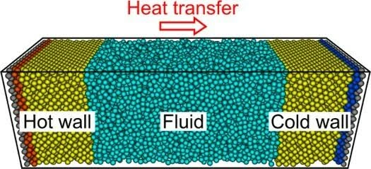

> **系列标签：** `知识文档` · `分子模拟` · `非平衡` · `MolSimulX`

[输运系数谱系](K21-输运系数谱系.md) 已把地图摊开：平衡用涨落（Einstein / Green–Kubo），非平衡用**外加扰动**直接测通量。本篇专讲后一条——**非平衡分子动力学（NEMD）**：怎么推、测什么、如何回到线性区，以及背后的 **Onsager 线性不可逆热力学**在说什么。

**不重复**「粘度对应哪条相关函数」——那张谱系仍在 [输运系数谱系](K21-输运系数谱系.md)。本篇也不推完整不可逆过程热力学教材；抓住 **力–通量–唯象系数** 与模拟怎么对上号即可。文末**略延伸**强驱动下的非线性区，以及它和「耗散 / 不可逆热力学」怎么沾边（点到为止）。热浴策略见 [常见系综与控温控压](K11-常见系综与控温控压.md)；盒子坑见 [有限尺寸效应](K18-有限尺寸效应.md)。  



---

[erphpdown]

## 一、基本思想

封面那种冷热分区（或定向热流），就是 NEMD 里常见的**非平衡传热**设定：能量沿梯度输运，稳态下通量 ÷ 梯度 → 热导一类系数。剪切、电场同理，只是「力」与「通量」换了物理量。

```text
加可控扰动（剪切、温度梯度、电场…）          ← 热力学「力」X
    → 进入稳态后测量通量（应力、热流、电流…）  ← 热力学「通量」J
    → 比值（或线性拟合）→ 输运系数             ← 唯象系数 L
    → 换几组扰动强度，外推到「扰动 → 0」
```

| 扰动太小 | 扰动太大 |
|----------|----------|
| 信号淹在噪声里 | 进入非线性；过热；结构被扯坏 |
| 看起来像「没响应」 | 报出来的不是教科书线性输运系数 |

> **Tips：** NEMD 的结论成立，前提几乎总是：**你还在线性响应区**。多组驱动强度画一张「响应 vs 驱动」图，比只跑一个「看起来合理」的梯度更有说服力。

---

## 二、Onsager 框架：力、通量与交叉效应

### 1. 线性不可逆热力学在说什么？

先钉死「不可逆」在这里指什么。平衡态附近若一切已松弛到位、没有持续宏观通量，系统可视为**可逆意义上的热静力学对象**（宏观点不再净输运）。一旦你**持续加扰**——温度梯度、剪切、电场——能量/动量/电荷就会定向流动，同时伴生摩擦生热、焦耳热等耗散：宏观上**回不去「未加扰前那个平衡」**，这就是**不可逆过程**。第一章封面式的冷热分区、以及第一节的「加 $X$ → 测 $J$ → 得系数」，做的正是把不可逆输运**开起来、稳住、量化**。

靠近平衡、驱动又不太狠时，这类不可逆过程常可写成：**通量由热力学力线性驱动**——这就是 Onsager 的线性不可逆热力学，也是本篇 NEMD 主线要落进的公式语言：

$$
J_i = \sum_j L_{ij}\, X_j
$$

读作：第一节流程图里的「力 → 通量 → 唯象系数」三件套；后面讲倒易、交叉效应、与 GK 对照，以及何时走出线性区，都以这张线性表为锚。

| 符号 | 含义 | 模拟里常对应 |
|------|------|--------------|
| $X_j$ | **热力学力**（梯度、场） | 温度梯度、速度梯度、电场、化学势梯度… |
| $J_i$ | **通量** | 热流、动量流通量（应力）、电流、粒子流… |
| $L_{ij}$ | **唯象系数**（输运系数矩阵） | 热导、粘度、电导，以及交叉系数 |

[输运系数谱系](K21-输运系数谱系.md) 里的 $\kappa$、$\eta$、电导等，正是某些 $L_{ij}$（或它们的组合）；**对角元** $L_{ii}$ 是「自己的力驱动自己的流」，**非对角元** $L_{ij}$（$i\neq j$）是**交叉效应**。

### 2. Onsager 倒易关系

在合适条件（近平衡、微观可逆等）下，Onsager 给出：

$$
L_{ij} = L_{ji}
$$

含义：交叉系数不是任意的——例如「温度梯度引起的物质流」与「浓度梯度引起的热流」之间存在对称约束（具体哪一对力/通量，要按同一套约定选取）。

入门记住三句话：

1. 输运不只是「一个梯度对应一个系数」；力可以**耦合**，通量可以**交叉**。  
2. 矩阵 $L_{ij}$ 有对称性（倒易），乱设交叉项会违反近平衡热力学。  
3. 平衡 Green–Kubo 算的相关积分，与这些 $L_{ij}$ 是同一套线性响应语言；NEMD 则是**直接施加 $X$、读取 $J$**。

### 3. 交叉效应举例

| 现象（名字可后记） | 粗图像 |
|--------------------|--------|
| **热扩散 / Soret** | 有温度梯度时，组分也会分离（物质流通量被热力驱动） |
| **Dufour** | 有浓度梯度时，也会出现热流（与上对称的一对） |
| **热电 / Seebeck 等** | 温差与电压、电流耦合（电子/离子体系） |
| **剪切–热耦合等** | 某些设定下动量输运与能量输运纠缠（进阶） |

做单组分剪切粘度或单组分热导时，常常近似成「一个主导的 $L_{ii}$」；做混合物、电解质、热电材料时，**交叉项**就不能装看不见。

> **Tips：** 论文里若同时报好几个输运系数，问一句：它们是不是同一组 Onsager 力/通量约定下的 $L_{ij}$？单位、符号、是否满足倒易，审稿人有时会盯。

### 4. 和平衡 GK、NEMD 怎么对齐？

| 路线 | 在 Onsager 语言里干什么 |
|------|-------------------------|
| **平衡 + Green–Kubo** | 不加宏观 $X$，用平衡涨落的时间相关积分得到 $L_{ij}$ |
| **NEMD** | 施加可控 $X$，测稳态 $J$，拟合 $J \approx L X$（可含多力多流） |
| **线性外推** | 保证落在 $J=\sum L X$ 成立的邻域；太大则公式本身失效 |

因此：[输运系数谱系](K21-输运系数谱系.md) 里的「两条大道」不是两套物理，而是算同一类 $L$ 的两种数值策略。

---

## 三、常见驱动类型（概念）

| 你施加的 $X$（概念） | 常测的 $J$ | 常得到的系数       |
| ------------ | ------- | ------------ |
| 剪切速度场 / 应变率  | 剪切应力    | 剪切粘度 $\eta$  |
| 温度梯度 / 对向热流  | 热流      | 热导率 $\kappa$ |
| 电场           | 电流、离子漂移 | 电导、电泳迁移率     |
| 压力 / 密度差     | 质量流、渗透流 | 流动阻力、渗透系数    |
| 浓度 / 化学势梯度   | 物质流     | 互扩散；可与热扩散耦合  |

「电场下带电颗粒怎么走」就是典型的非平衡驱动观察——不必先算电流自相关，但若要对标线性电导，仍需确认场强落在线性区。

封面那种冷热分区，对应传热 NEMD：读热流与 $\nabla T$ 的比值（或等价协议），再外推到小梯度。

---

## 四、必须盯住的问题

### 1. 是否线性？

多组 $|X|$，画 $J$–$X$（或系数随 $|X|$ 的变化）。  
出现平台或线性段 → 取外推到 $X\to 0$；明显弯曲 → 减小驱动或承认你在测非线性流变/非线性传热。

### 2. 散热与热浴

持续做功会生热。热浴太弱 → 温度爬升；太强 → 可能扭曲你要的动力学剖面。  
策略因驱动而异（全局弱耦合、分区控温、只给某自由度散热等）——概念上记住：**生热必须有去处，且不能把要测的通量「洗掉」**。见 [常见系综与控温控压](K11-常见系综与控温控压.md)。

### 3. 边界与有限尺寸

驱动方向与盒长强耦合：剪切盒、热端–冷端距离、电场与 PBC 图像电荷等，都会进系统偏差。见 [有限尺寸效应](K18-有限尺寸效应.md)。换盒子、换驱动几何，比「只报一个数」更稳。

### 4. 稳态是否真到了？

加场后要等通量、剖面稳定，再采样。未稳态的平均会把瞬态当成输运系数。

### 5. 与平衡法交叉验证

至少在一个状态点，与 [输运系数谱系](K21-输运系数谱系.md) 的 GK / Einstein 趋势对照。差很多时，优先查：线性、热浴、尺寸、通量定义——而不是只信某一种默认实现。

### 6. 交叉系数时

若课题涉及混合物热扩散等：确认力与通量的热力学共轭选对了，并意识到可能需要**多个驱动、多个测量**才能解出 $L_{ij}$ 矩阵；倒易关系可作一致性检查。

---

## 五、延伸：走出线性区（非线性非平衡）

前面默认你在 **Onsager 线性邻域**：$J \approx L X$，外推到 $X\to 0$ 才叫教科书上的输运系数。驱动一大，关系会弯——这不是「模拟坏了」，而是物理进了**非线性非平衡**。

### 1. 模拟里你会看见什么？

| 线性区（本篇主线） | 非线性区（延伸） |
|--------------------|------------------|
| $J$ 大致正比于 $X$；$L$ 近似常数 | $J$–$X$ 弯曲；表观系数依赖驱动强度 |
| 报零剪切粘度、小梯度热导、弱场电导 | 报**表观**粘度 / 有效热导随剪切率、梯度变化的曲线 |
| Onsager / GK 与弱驱动 NEMD 应对得上 | 一般**不再**指望用同一组常数 $L_{ij}$ 描述全程 |
| 结构近似仍「像平衡附近」 | 可能出现强烈取向、层化、局部过热、剪切带等 |

流变学里的剪切稀化 / 增稠、强电场下的非线性电导、过大温差下剖面畸变，都是非线性响应的日常例子。这时 NEMD 仍然有用——你在测**真实驱动下的响应曲线**——只是 Methods 里不要把它写成「线性输运系数 $\eta_0$」。

定态与瞬态怎么切，见 [平衡判据与收敛](K13-平衡判据与收敛.md)；粗粒化后无量纲数（如 $\mathrm{Wi}$）一变，线性/非线性窗口也会跟着挪，见 [粗粒化动力学加速与耗散](K30-粗粒化动力学加速与耗散.md)。

### 2. 和「耗散」「不可逆热力学」有关吗？

**有关，但要分清三层意思**，免得和不同教材撞名：

| 说法 | 大致在说什么 | 和本篇 NEMD |
|------|--------------|-------------|
| **不可逆过程 / 熵产生** | 有限梯度下有耗散（粘性生热、焦耳热、摩擦），熵持续产生 | 强相关：你一边驱动、一边用热浴把热带走，正是在维持有熵产生的定态 |
| **线性不可逆热力学（Onsager）** | 近平衡，$J=\sum L X$，倒易关系 | **本篇主线**；线性区成立 |
| **远离平衡的耗散结构等** | 持续输入下可出现斑图、振荡、自组织等（常与 Prigogine 一派「耗散结构」联系） | **同一片不可逆天空下的更远一角**；经典 MD/NEMD 偶可观察到类比现象，但完整理论不是本站入门范围 |

所以：

- 问「非线性非平衡是不是和热力学的耗散体系有关？」——**是，同属不可逆 / 开放驱动体系**；驱动维持通量，耗散（生热、摩擦）必须被排走，否则温度狂飙。  
- 但口语里的「耗散」在分子模拟里还常单指**摩擦项 / 热浴带走的热**（见 [朗之万、布朗与溶剂介质方法](K25-朗之万布朗与溶剂介质方法.md)、[粗粒化动力学加速与耗散](K30-粗粒化动力学加速与耗散.md)），不等于一上来就讲「耗散结构」那种斑图自组织。  
- 线性 Onsager 是近平衡的一阶展开；驱动变强 → 需要更高阶响应或直接测曲线，而不是硬套常数 $L$。

入门策略建议：

1. **先把线性区跑通、外推清楚**（报 $\eta$、$\kappa$、电导时）；  
2. 若课题本身就是流变曲线、强场响应，再明确写「非线性 NEMD / 表观量」，并多扫驱动强度；  
3. 理论兴趣再往「非线性不可逆热力学 / 耗散结构」教材走——本篇只负责把门开一条缝。

> **Tips：** 审稿时最稳的说法是：「下列驱动强度下响应近似线性，外推得……；更大驱动下进入非线性，表观粘度随 $\dot\gamma$ 变化见图……」。把线性系数与非线性曲线分开报，比混成一个数更干净。

---

## 六、实践小清单

| 检查项 | 问自己 |
|--------|--------|
| 物理 | 我施加的 $X$、测量的 $J$，对应谱系里哪个 $L$？有没有交叉项？ |
| 线性 | 是否多组驱动并外推到零？曲线弯了是否已改口「表观 / 非线性」？ |
| 热 | 生热如何排走？平均温度是否失控？（非线性区更易过热） |
| 几何 | 驱动方向、盒长、边界条件写清了吗？ |
| 稳态 | 采样是否在通量平台之后？ |
| 互证 | 与平衡 GK（或文献）对过趋势吗？（仅线性区可强求） |
| 误差 | 块平均 / 重复？见 [统计误差与块平均](K17-统计误差与块平均.md) |
| Methods | 驱动协议、热浴、盒子、$L$ 的定义与单位；是否声明线性/非线性 |

---

## 七、常见问题

**Q：有了 Onsager，还要分 EMD / NEMD 吗？**  
A：要。Onsager 给的是**近平衡线性关系的语言**；EMD 与 NEMD 是算 $L_{ij}$ 的两条数值路。

**Q：倒易关系 $L_{ij}=L_{ji}$ 在模拟里一定自动满足吗？**  
A：在正确的共轭力/通量、足够采样、仍处线性区时，应近似成立，可当检查。定义选错、噪声大、已非线性时，会对不上。

**Q：剪切很强的「表观粘度」算输运系数吗？**  
A：那是非线性流变响应；线性 $\eta$ 是零剪切极限。Onsager 线性式管的是后者。两者都可以用 NEMD 测，但名字与外推方式不同（见第五节）。

**Q：非线性非平衡是不是就是「耗散结构」？**  
A：不完全是。非线性响应（$J$–$X$ 弯曲）几乎处处可见；**耗散结构**多指远离平衡、靠持续耗散维持的自组织斑图/振荡，理论更重，本篇不展开。日常 NEMD 先把「生热要排走、线性/非线性分开报」做好即可。

**Q：封面冷热两边，温度分布不线性怎么办？**  
A：先检查是否已稳态、热浴/界面是否合理、梯度是否过大；剖面畸变时，简单用「两端温差 / 盒长」当 $|\nabla T|$ 会偏。过大梯度本身也可能已离开线性传热。

**Q：和朗之万动力学是一回事吗？**  
A：不是。朗之万 / 布朗是另一类方程与溶剂模型，见 [朗之万、布朗与溶剂介质方法](K25-朗之万布朗与溶剂介质方法.md)；NEMD 通常仍在牛顿（或带热浴的）MD 上加宏观驱动。方程里的摩擦耗散与本节「不可逆生热」有亲缘，但问题设定不同。

---

## 八、小结

1. **NEMD**：施加热力学力 $X$，测通量 $J$，在线性区得到输运系数。  
2. **Onsager**：$J_i=\sum_j L_{ij} X_j$，且常有 $L_{ij}=L_{ji}$；交叉效应有名有姓。  
3. 平衡 GK 与 NEMD 算的是同一类 $L$，不是两套物理。  
4. **线性外推、生热、边界/尺寸、稳态、互证**是五大实务关卡。  
5. **非线性区**仍可测表观响应曲线，但勿再叫零驱动输运系数；与不可逆/耗散热力学同属一片天空，线性 Onsager 只是近平衡一角。  
6. 谱系与平衡细节见 [输运系数谱系](K21-输运系数谱系.md)。

---

[/erphpdown]

## 学习路径

**前置阅读：** [输运系数谱系](K21-输运系数谱系.md) · [常见系综与控温控压](K11-常见系综与控温控压.md) · [温度、压强与表面张力](K19-温度压强与表面张力.md)

**下一步：**

- [有限尺寸效应](K18-有限尺寸效应.md) —— 驱动几何与盒长  
- [统计误差与块平均](K17-统计误差与块平均.md) —— 通量与外推的 ±  
- [平衡判据与收敛](K13-平衡判据与收敛.md) —— 驱动下定态与瞬态  
- [统计力学基础与系综](K23-统计力学基础与系综.md) —— 平衡系综与涨落的加深（与 GK 侧对照）  
- [朗之万、布朗与溶剂介质方法](K25-朗之万布朗与溶剂介质方法.md) —— 摩擦耗散方程（勿与 NEMD 混淆）  
- [粗粒化动力学加速与耗散](K30-粗粒化动力学加速与耗散.md) —— CG 流变、无量纲数与线性窗口  
