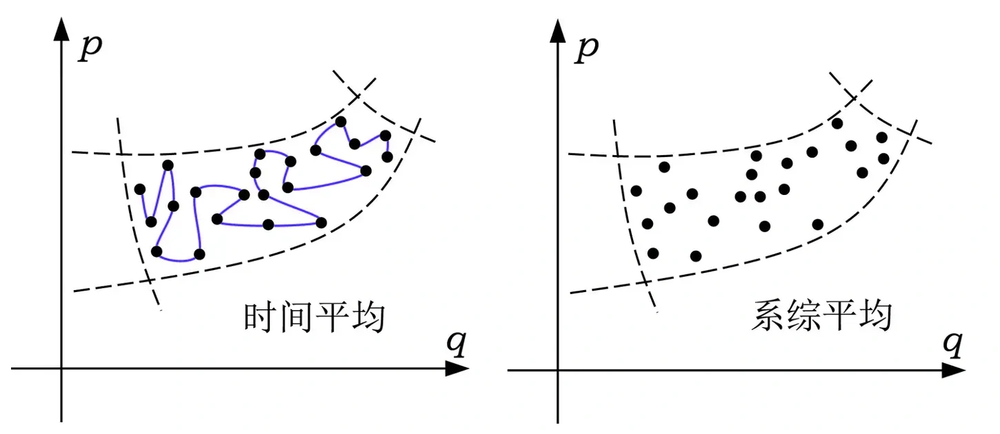

> **系列标签：** `知识文档` · `分子模拟` · `统计力学` · `MolSimulX`

前面按流程走完了：力场 → 盒子 → 积分与控温 → 平衡 → 分析。日常够用；但总会追问：

- 轨迹上算出的平均温度、压强，凭什么能代表「热力学上的」那个数？  
- 软件里勾 NVT / NPT，到底固定了什么、又允许什么乱晃？  
- 「再跑长一点就采全了」——什么时候灵、什么时候不灵？  

这些问题的后台语言，就是 **统计力学**：把「每个原子怎么动」翻译成「宏观上看到什么」。

本篇用 MD 能对上的图像，讲清几块：**哈密顿量（总能量怎么记账）、相空间、系综、两种平均、各态历经（遍历）**。  

控温控压怎么点选项，见 [常见系综与控温控压](K11-常见系综与控温控压.md)；本篇不推厚教材。建议流程跑通后再读。



---

[erphpdown]

## 一、先把「哈密顿量」说清楚

一听到 Hamiltonian，容易觉得很玄。在经典 MD 里，你可以先把它想成：

> **整盒粒子的总能量账本：H = 动能 $+$ 势能。**

写成符号：

$$
H(\mathbf{q},\mathbf{p}) = K(\mathbf{p}) + U(\mathbf{q})
$$

| 符号 | 叫什么 | 在 MD 里指什么 |
|------|--------|----------------|
| $\mathbf{q}$ | 坐标（位置） | 每个原子在哪 |
| $\mathbf{p}$ | 动量 | 每个原子冲得多猛（和速度成正比：$\mathbf{p}=m\mathbf{v}$） |
| $K(\mathbf{p})$ | **动能** | 「跑得有多欢」——速度平方加起来 |
| $U(\mathbf{q})$ | **势能** | 「站得方不方便」——由**力场**规定：键拉太长、原子挤太近、电荷相吸相斥… |
| $H$ | **哈密顿量** | 把上面两本账加总；NVE 里你盯着守恒的那条「总能量」，基本就是它 |

### 为什么统计力学 / MD 要拿哈密顿量说话？

你可以只记「有动能有势能」——但教材和论文为什么非要把它们捆成一个 $H(\mathbf{q},\mathbf{p})$？因为它是**微观动力学与宏观统计共用的一本书**：

| 它办成什么事 | 不引入 $H$ 会怎样 |
|--------------|-------------------|
| **规定怎么动** | 经典力学里，位置/动量的演化由哈密顿方程给出；在常见情形下等价于牛顿定律 $\mathbf{F}=-\nabla U$。积分器「往前推一步」，背后就是在积这套式子 |
| **定义相空间上的「总能量」** | 下一节的相空间用 $(\mathbf{q},\mathbf{p})$ 标状态；给每个状态贴能量标签，标的就是 $H$。没有这一定义，「能量壳层」「允许的状态」不好写 |
| **写出状态出现的概率** | 正则系综权重里的 $e^{-H/(k_B T)}$，贵的是**整本总能量**（不只是势能）。后面谈系综平均、自由能，公式都挂在 $H$ 上 |
| **核对模拟有没有「算飞」** | NVE 下 $H$ 应近似守恒；日志里 Total 乱飘，往往是步长/力场/单位出了问题。热浴开着时 $H$ 本就不守恒——那是换了系综，不是同一把尺子 |

一句话：**力场主要写清势能 $U$，统计力学却要在整个相空间上谈概率——需要一个同时含坐标和动量的总能量函数，这就是哈密顿量。**  

经典 MD 里你日常看见的 `Potential` / `Kinetic` / `Total`，以及 Methods 里「什么力场、什么系综」，都是在围着这本账转。

### 和你每天接触的东西怎么对？

| 你在软件里做的事 | 在哈密顿语言里 |
|------------------|----------------|
| 选 TIP3P / CHARMM / … | 主要是在选 **$U$**（势能长什么样） |
| 日志里的 `Kinetic` / `Potential` / `Total` | 大致就是 $K$、$U$、$H$ |
| 算力 $\mathbf{F}=-\nabla U$ | 势能「下坡」的方向；粒子被推着走 |
| 积分器往前推一步 | 按牛顿定律（也就是哈密顿方程）更新 $\mathbf{q},\mathbf{p}$ |

所以：**哈密顿量不是另挂一件神秘法宝**，而是「位置 + 动量 → 总能量」的那个函数；经典 MD 的运动，就是在这个能量规定下往前走。

> **Tips：** 「换力场」≈ 换势能 $U$，因而换了整本 $H$。  
> 「加热浴 / 压浴」一般**不是**改力场里的 $U$，而是改「你在哪种宏观条件下采样」（系综）——见第二节与 [常见系综与控温控压](K11-常见系综与控温控压.md)。

---

## 二、相空间：把「整个状态」画在一张大图上

一个原子要 3 个坐标 + 3 个动量才能说清「在哪、往哪冲」。$N$ 个原子就要大约 $6N$ 个数。把这 $6N$ 个数当成一个超大坐标系里的一个点——这个超大空间叫**相空间（phase space）**。

封面把相空间画成二维示意：横轴 $q$（位置一类），纵轴 $p$（动量一类）。真实 MD 维数极高，但图像一样用：

| 图像 | 含义 |
|------|------|
| 相空间里的**一个点** | 某一瞬间：所有原子的位置和速度都定了 |
| **蓝线（轨迹）** | MD 随时间走出的路径——你磁盘上的轨迹文件，就是这条线的采样 |
| **虚线围住的区域** | 当前宏观条件下「允许出现」的状态范围（例如能量差不多的一壳层） |

瞬时温度、瞬时压强，都是**某一个点**上算出来的；论文里写的宏观量，多半是沿蓝线走很久之后再平均——或按右边那种「许多点」平均。细节见 [温度、压强与表面张力](K19-温度压强与表面张力.md)。

**热力学**只谈 $T$、$P$、自由能，不跟踪每个原子；**统计力学**说：这些宏观量，是相空间里一大堆微观状态按规则平均的结果。MD 的本事，就是用一条（或几条）轨迹去**估**这个平均。

---

## 三、系综：你规定了哪几条「实验室规矩」？

**系综**（ensemble）可以想成：

> 在同一套宏观规矩下，所有「还说得通」的微观状态组成的俱乐部，每个状态有个出现概率。

实验室说「300 K、1 bar 的水」——等于点名进了某个俱乐部（常见是等温等压）。模拟也必须说清：**哪些量钉死、哪些量允许晃**。

| 系综 | 钉死什么 | 允许晃什么 | MD 里常靠什么 |
|------|----------|------------|---------------|
| **NVE** | 粒子数、体积、总能量 | 温度、压强自己晃 | 不加控温控压的裸积分 |
| **NVT** | 粒子数、体积、温度 | 能量会涨落 | **热浴** |
| **NPT** | 粒子数、压强、温度 | 体积、能量会涨落 | 热浴 + **压浴** |
| **μVT** | 化学势、体积、温度 | 粒子数可变 | 常和蒙特卡洛一起做 |

怎么选、烧瓶图像、热浴压浴常见名字，见 [常见系综与控温控压](K11-常见系综与控温控压.md)。本篇只钉三句：

1. **先定系综，再谈算法**——你要和实验比密度，却死死固定错了的盒子体积，后面再精细也是系统偏差。  
2. 热浴 / 压浴是**让轨迹落进目标俱乐部**的工具，不是换一套力场。  
3. 不同系综里，同一观测量的涨落可以不一样——比平均值时，先对齐系综。

---

## 四、两种平均：封面左右在算什么？

### 1. 系综平均（封面右图）

想象同一宏观条件下，有无数份「平行宇宙」复制品，每份处于一个允许的微观状态。对观测量 $A$（能量、密度、某序参量…）按出现概率加权，得到 $\langle A\rangle$。

正则系综里，能量高的状态更「不受欢迎」，权重里会出现 $e^{-H/(k_B T)}$ 这种因子——能量越贵，越少光顾。

### 2. 时间平均（封面左图）

MD 通常只有**一份**体系。我们让它在相空间里走很久（蓝线），把沿途的 $A$ 加起来再除以时间：

$$
\bar{A} = \frac{1}{\tau}\int_0^{\tau} A(t)\,dt
$$

这就是日志 / 分析脚本里最常见的「生产段平均」。

| | 系综平均 | 时间平均 |
|--|----------|----------|
| 图像 | 右图：许多点，同一时刻 | 左图：一条线，走很久 |
| 谁在用 | 理论公式、部分 MC | **几乎所有 MD 论文** |
| 何时相等 | 理想的**各态历经**成立时 | |

> **Tips：** 某一步跳出来的瞬时温度，不是你要报的 $\langle T\rangle$。报生产段平均，并带上不确定度——见 [统计误差与块平均](K17-统计误差与块平均.md)。

### 3. 配分函数、自由能（有个印象即可）

**配分函数** $Z$ 可以想成：把俱乐部里每个状态的「受欢迎程度」加总。自由能常与 $\ln Z$ 相关——哪边状态集合权重大，哪边自由能更低。

MD 很少直接算出完整 $Z$；日常是：

- 密度、能量、压强 → 时间平均；  
- 两边稳态差多少 → [增强采样与自由能](K14-增强采样与自由能.md)。

短轨迹若一直困在一个坑里，等于只看见俱乐部的一个角落。

---

## 五、各态历经（遍历）：左右两图凭什么能对上？

**各态历经（ergodicity）**，口语里也叫**遍历**，粗说就是：

> 若跑得足够久，左图那条蓝线会按正确比例把右图那些该去的地方都逛到，于是时间平均 ≈ 系综平均。

这是一条**假说 / 理想极限**，不是每条模拟自动保修的质保单。

| 理想说法 | MD 里常碰到的现实 |
|----------|-------------------|
| 初态不重要，跑长就行 | 高势垒、慢相变、大分子构象 → **有效不遍历** |
| 一条超长轨迹 = 整个系综 | 可能卡在亚稳态；要换初态、多副本、或增强采样 |
| 凡能量允许的都能去 | 界面、成核、拓扑约束会挡住去路 |

实践清单：

1. 理论靠各态历经，把「轨迹平均」和「热力学平均」接上。  
2. 工程上仍要：像样的初态、足够平衡化、盯与结论有关的慢变量、必要时增强采样。见 [平衡判据与收敛](K13-平衡判据与收敛.md)、[序参量与相变](K20-序参量与相变.md)。  
3. 原子叠在一起起步会爆炸——理论可以说「初态无关」，程序非常在乎初态。见 [边界条件与初始条件](K07-边界条件与初始条件.md)。

---

## 六、和你写论文的句子对一下号

```text
选力场（定 U，也就定了 H）
    → 选系综（NVT / NPT …）+ 热浴/压浴
    → 积分：在相空间里走蓝线
    → 丢掉未平衡段
    → 生产段做时间平均 ≈ 系综平均（假定大致遍历）
    → 报平均值 ± 误差；慢过程另想办法
```

| 论文 Methods 里常写 | 统计力学在说 |
|--------------------|--------------|
| 力场 XX | 选定势能 $U$，从而选定哈密顿量 $H$ |
| NPT，300 K，1 bar | 等温等压系综 |
| 生产 100 ns，块平均 | 有限时间的时间平均 + 误差估计 |
| 伞形 / MetaD 得 PMF | 在集体变量上估自由能，缓解不遍历 |

若还要粘度、热导，那是时间相关 / 响应，不止「平均一个数」——见 [输运系数谱系](K21-输运系数谱系.md)、[非平衡分子动力学概述](K22-非平衡分子动力学概述.md)。

---

## 七、几个容易绕晕的说法

| 说法 | 更稳的理解 |
|------|------------|
| 「哈密顿量好高深」 | 经典 MD 里先把它当成 **$K+U$ 总能量函数** |
| 「NVE 最纯所以最好」 | 少人为干预，但对齐实验恒温恒压往往不方便 |
| 「温度到了就是平衡了」 | 热浴可以强行拉住动能；结构可能还在慢慢变 |
| 「帧很多所以采样够」 | 相邻帧很相关，有效样本没那么多 |
| 「哈密顿量 = 力场文件」 | 力场主要定 $U$；动能也在 $H$ 里；热浴还可能改有效动力学 |

---

## 八、实践小清单

| 检查项 | 问自己 |
|--------|--------|
| 哈密顿 / 力场 | 我换力场时，改的是势能账本吗？约束有没有另算？ |
| 系综 | 和实验比的是恒温恒压，还是固定盒子？ |
| 平均 | 报的是生产段平均，还是某一步瞬时值？ |
| 遍历 | 慢变量是不是还困在一个坑里？ |
| 误差 | ± 考虑自相关了吗？见 [统计误差与块平均](K17-统计误差与块平均.md) |
| 分工 | 怎么点热浴 → [常见系综与控温控压](K11-常见系综与控温控压.md)；自由能 → [增强采样与自由能](K14-增强采样与自由能.md) |

---

## 九、常见问题

**Q：和 [常见系综与控温控压](K11-常见系综与控温控压.md) 重复吗？**  
A：那篇讲「选哪个、软件怎么实现」；本篇讲「哈密顿量是什么、两种平均如何对齐、遍历何时失效」。先会跑，再回来钉概念。

**Q：不遍历了，MD 是不是就没意义？**  
A：仍有意义——你采的是**当前能到达的那片区域**的统计。不要假装那等于整个系综；写清时间尺度，或换增强采样 / 多初态。

**Q：配分函数能在日志里读出来吗？**  
A：一般不能。直接量靠平均；自由能差靠专用方法。

**Q：量子呢？**  
A：本篇是经典 $H(\mathbf{q},\mathbf{p})$。电子结构、核量子见 [第一性原理分子动力学与核量子效应](K26-第一性原理分子动力学与核量子效应.md)、[QM-MM思想](K27-QM-MM思想.md)。

---

## 十、小结

1. **哈密顿量**在经典 MD 里 ≈ **动能 + 势能**；力场主要定势能，轨迹在相空间里按它往前走。之所以单独讲 $H$，是因为它同时管**怎么动**、**状态概率怎么算**（如 $e^{-H/k_B T}$）、以及 NVE 下**守恒检查**。  
2. **相空间**把「所有原子的位置和动量」收成一个点；MD 轨迹是这个点走出的线（封面左图）。
3. **系综**规定宏观规矩；热浴/压浴是实现工具，不是换力场。  
4. **系综平均**（右图）是理论目标；**时间平均**（左图）是 MD 算法；靠**各态历经**（遍历）在理想情况下对齐。  
5. 高势垒会导致**有效不遍历**——要用判据、重复和增强采样补洞。  
6. 控温实务见 [常见系综与控温控压](K11-常见系综与控温控压.md)；自由能见 [增强采样与自由能](K14-增强采样与自由能.md)。

---

[/erphpdown]

## 学习路径

**前置阅读：** [分子动力学模拟概述](K02-分子动力学模拟概述.md) · [常见系综与控温控压](K11-常见系综与控温控压.md) · [平衡判据与收敛](K13-平衡判据与收敛.md)

**下一步：**

- [增强采样与自由能](K14-增强采样与自由能.md) —— 逛不出去时怎么估自由能  
- [分子动力学与蒙特卡洛](K24-分子动力学与蒙特卡洛.md) —— 另一条采系综的路  
- [输运系数谱系](K21-输运系数谱系.md) · [非平衡分子动力学概述](K22-非平衡分子动力学概述.md) —— 从「平均」到「时间相关」  
- [统计误差与块平均](K17-统计误差与块平均.md) —— 有限时间平均的 ±  
