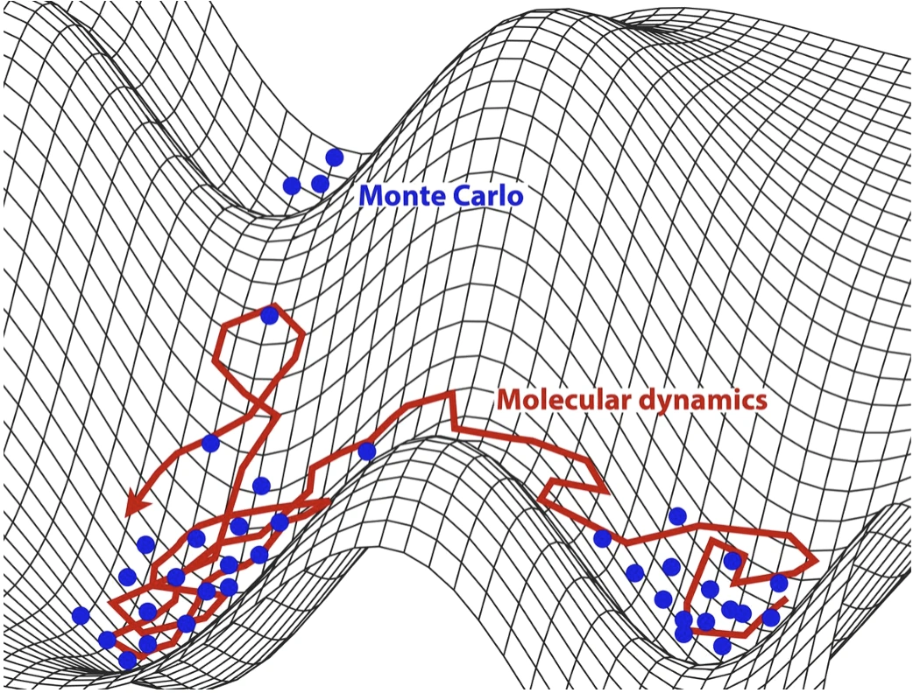

> **系列标签：** `知识文档` · `分子模拟` · `蒙特卡洛` · `MolSimulX`

经典 MD 主线走完后，常会碰到：要不要换一种**采样**方式？势能面上坑很多、势垒很高时，只靠牛顿方程往前蹭，可能一辈子困在一个坑里。

[统计力学基础与系综](K23-统计力学基础与系综.md) 已说清：目标往往是**系综平均**；MD 用一条长轨迹的**时间平均**去估它（假定大致遍历）。还有一条路不跟物理时间走，而是按概率在构型之间跳——**蒙特卡洛（Monte Carlo, MC）**。再往「慢过程、稀有事件」走，还有带物理时间的 **动力学蒙特卡洛（kinetic Monte Carlo, kMC）**，并常常和 MD **耦合**使用。

本篇对照 **MD / 平衡 MC / kMC**，并讲常见耦合思路。全谱地图见 [分子模拟方法概述](K01-分子模拟方法概述.md)。



---

[erphpdown]

## 一、先接上统计力学那块砖

| 概念（见 [统计力学基础与系综](K23-统计力学基础与系综.md)） | MD | 平衡 MC |
|----------------|----|---------|
| **目标** | 估系综平均 $\langle A\rangle$ | 同一目标 |
| **怎么估** | 相空间里走轨迹 → **时间平均** | 直接按目标分布抽构型 → 逼近**系综平均** |
| **哈密顿量 $H$** | 用 $U$ 算力，积分 $K+U$ 动力学 | 接受/拒绝时主要看 **$U$（或有效能量）**；不必推进动量 |
| **各态历经** | 要轨迹能逛够 | 要提议移动能混匀；设计不好也会「假收敛」 |

一句话：两边都在服务系综；MD 多一条**物理时间轴**（因而能谈扩散、谱、输运），**平衡 MC**（有时也叫普通 MC）通常**没有**物理时间——它按目标分布抽构型，不沿牛顿轨迹走。带物理时间的事件层是下面的 **kMC**。

---

## 二、MD 与平衡 MC：一句话对比

| | **分子动力学（MD）** | **平衡蒙特卡洛（MC）** |
|--|----------------------|------------------------|
| 基本动作 | 积分运动方程 | 随机提议新构型 + 按规则接受/拒绝 |
| 自然产物 | 轨迹、动力学、时间相关 | 构型统计、部分热力学量 |
| 时间 | 有物理时间 | 通常**无**物理时间 |
| 典型强项 | 扩散、谱、非平衡响应 | 相平衡、吸附、某些高势垒构型重排 |
| 封面图像 | 红线：连续逛势能面 | 蓝点：按权重撒在允许区域 |

封面红线是 MD（在坑底抖很久才可能翻山）；蓝点像平衡 MC（按概率抽构型，不必沿物理路径连成线）。**kMC** 则更像认准几个稳态，按速率表在坑与坑之间跳，把坑内震动省略掉。

### 平衡 MC 在干什么？（Metropolis 图像）

最常见的实现套路叫 **Metropolis**（及同族接受准则）：从当前构型出发，随机提议一步；能量降了多半接受，升高了则按 $e^{-\Delta U/kT}$ 碰运气——长期跑下来，样本会按目标温度下的玻尔兹曼权重堆积。

常见流程：

```text
当前构型 i（能量 U_i）
    → 随机提议构型 j（平移分子、转动、插入/删除…）
    → 算 ΔU = U_j − U_i
    → 按 Metropolis 等准则：能量降了多半接受；升了按 e^{-ΔU/kT} 碰运气
    → 接受则走到 j，否则留在 i
    → 重复 → 样本按目标系综分布堆积
```

要点：

- 瞄准的是**分布**，不是牛顿轨迹。  
- 「好提议」很难：步子太小 → 混得慢；太大 → 老被拒绝。  
- 巨正则等开放系综里，还可提议**插入/删除粒子**——这是吸附、孔道填充里 GCMC 的常见套路。

### 关键：微观细致平衡（为什么接受规则长这样）

Metropolis 那套「降能多半接、升能按 $e^{-\Delta U/kT}$ 赌」不是拍脑袋，背后要满足**微观细致平衡**（microscopic detailed balance，也常简称细致平衡）：

> 稳态下，对任意一对构型 $i$、$j$：**从 $i$ 走到 $j$ 的概率流 = 从 $j$ 走回 $i$ 的概率流。**

写成示意：

$$
\pi_i\, P(i\to j) = \pi_j\, P(j\to i)
$$

| 符号 | 含义 |
|------|------|
| $\pi_i$ | 目标系综里构型 $i$ 该出现的概率（如正则系综 $\propto e^{-U_i/k_B T}$） |
| $P(i\to j)$ | 一步转移概率：含「提议」×「接受」 |

它管什么：

1. **保证正采到目标分布**——长期样本应按 $\pi$（玻尔兹曼等）堆积，而不是某个「看着挺随机」的别的分布。  
2. **接受准则从哪里来**——给定对称（或已知偏置）的提议后，由细致平衡反解出接受概率；Metropolis 正是常见解之一。  
3. **自定义移动必须守规**——GCMC 的插删、扭转大步、体积涨落等，都要选对接受因子；破坏细致平衡，混得再欢也可能**静悄悄偏系综**。  
4. **和 MD 的联系**——牛顿积分在相空间里有微观可逆性；平衡 MC 把同样的精神写在离散跳步的接受规则上。两边都在服务同一目标 $\pi$，只是一条走轨迹、一条走马尔可夫链。

> **Tips：** 调接受率、改提议，是为了混得快；**能不能对上 $\pi$**，先问细致平衡有没有守住。Methods 里若自写移动规则，应能说明接受因子如何满足它。

---

## 三、何时偏 MD？何时偏 MC？

| 你的问题 | 更常选 |
|----------|--------|
| 扩散、粘度、时间关联、NEMD | **MD**（见 [输运系数谱系](K21-输运系数谱系.md)） |
| 固定 $\mu,V,T$ 的吸附等温线 | **GCMC** 等巨正则 MC |
| 复杂相平衡、密度交换、某些晶格模型 | 各类平衡 MC / 混合方法 |
| 既要平衡结构，又要事后看动力学 | MC（或增强采样）做平衡 → 再 **MD** 看动态 |
| 坑内振动不重要，只关心「多久跳到另一稳态」 | **kMC**（下一节） |

MD 的 NVT/NPT 靠热浴压浴维持系综感；平衡 MC 可直接按目标权重采样，但**提议的设计**本身就是方法的核心——且必须以**微观细致平衡**把样本钉在目标 $\pi$ 上。

> **Tips：** 增强采样（伞形、副本交换、MetaD…）和「用 MD 还是 MC 走步」是正交的——两边都能加。见 [增强采样与自由能](K14-增强采样与自由能.md)。

---

## 四、动力学蒙特卡洛（kMC）：把「稀有跳跃」当成事件

平衡 MC 回答「稳态下构型概率」；很多材料 / 表面 / 催化问题还要问：

> **从稳态 A 跳到稳态 B，要多久？下一次事件是什么？**

普通 MD 会在坑底抖无数步才翻一次山（封面红线在谷底绕圈）——时间跨度到微秒、秒、小时就吃不消。**动力学蒙特卡洛（kinetic Monte Carlo, kMC）**（也常写作 KMC）换一种记账：

### 1. 基本图像

```text
列出当前可能发生的事件（扩散一跳、吸附、脱附、反应…）
    → 每个事件有速率 k_i（单位：单位时间发生次数）
    → 按速率抽「下一个发生哪个」
    → 时钟向前跳 Δt（与总速率有关）
    → 更新状态，刷新事件表
    → 重复
```

| 与平衡 MC | 与 MD |
|-----------|-------|
| 也是随机接受「下一步」 | **有物理时间**（时钟按速率推进） |
| 不在连续势能面上积分振动 | **不解析**坑内每一抖，只保留态与态之间的跳跃 |
| 要一张「事件 + 速率」目录 | 速率常来自 MD、过渡态理论、实验或经验 |

### 2. 速率从哪来？

常见来源：

- 谐波过渡态理论 / 能垒：$k \sim \nu e^{-\Delta E^\ddagger / k_B T}$  
- 直接用 MD 或增强采样估跨越频率  
- 文献或拟合的经验速率  

**输入错了，kMC 只会漂亮地错很远**——目录不全（漏事件）和能垒不准，是两大坑。

### 3. 适合什么、不适合什么？

| 较合适 | 不太合适（或要很小心） |
|--------|------------------------|
| 表面扩散、晶格 Occupancy、催化循环、薄膜生长等「事件清晰」 | 事件说不清、集体慢模、溶剂化细节主导 |
| 时间跨度远超 MD 振动周期 | 需要连续轨迹、谱密度、流体输运细节 |
| 态可用离散标签（位点、覆盖度、缺陷类型） | 必须保留全原子连续构型的每一个细节 |

> **Tips：** kMC 的「时间」是物理时间，但轨迹是**事件序列**，不是原子坐标的连续电影。和 MD 轨迹不要混着解读。

---

## 五、和 MD 怎么耦合？

现实里很少「只选一个、永远不用另一个」。常见耦合如下。

### 1. 分工流水线（最常见）

| 阶段 | 方法 | 干什么 |
|------|------|--------|
| 找稳态、能垒、速率 | MD / 增强采样 / 过渡态搜索 | 给 kMC 提供事件目录与 $k_i$ |
| 长时演化 | **kMC** | 在离散态上跑出秒～小时尺度统计 |
| 验证某一跳 | 再短跑 MD | 抽查速率或观察局部机理 |

封面寓意：红线（MD）负责「看清怎么翻山」；翻山规则汇总后，用 kMC 连跳很多座山。

### 2. 平衡：MC 采样 + MD 动力学

- 用平衡 MC（或 GCMC）快速混匀、得到平衡构型；  
- 再从样本上启动 MD，看扩散、谱、短时响应。  

适合「平衡好采、动力学仍要物理时间」的题目。

### 3. 杂交移动（Hybrid MD/MC）

同一次模拟里交替：

- 若干 MD 步（局部松弛、短时动力学）；  
- 若干 MC 提议（大尺度重排、插入删除、体积变化等）。  

目的：MD 负责「物理上顺眼的局部」，MC 负责「MD 很难自然发生的跳跃」。实现细节因软件而异，入门知道有这号即可。

### 4. 自适应 / 在线的 MD–kMC

有的工作流让 MD 在当前盆地探索、发现新的鞍点与速率，再扩展 kMC 事件表——边跑边补目录，减轻「事先漏事件」。代价是工程复杂，仍依赖 MD 能看见相关势垒。

### 5. 怎么选速查

| 局面 | 思路 |
|------|------|
| 只要平衡分布 | MD 或平衡 MC；开放体系偏 GCMC |
| 要输运 / 谱 | MD（± NEMD） |
| 稀有跳跃主导、态可离散 | MD/理论出速率 → **kMC** |
| 又要机理又要长时统计 | **MD（能垒）+ kMC（长时）** |
| 构型难混又要一点动力学 | Hybrid MD/MC 或增强采样 + MD |

---

## 六、实践小清单

| 检查项 | 问自己 |
|--------|--------|
| 目标量 | 要分布、要时间关联，还是要事件等待时间？ |
| 有没有物理时间 | 要 → MD 或 kMC；只要构型统计 → 平衡 MC 也行 |
| 系综 | NVT/NPT/μVT？与 [统计力学基础与系综](K23-统计力学基础与系综.md) 对齐 |
| kMC 目录 | 事件是否列全？速率来源是否写清？ |
| 耦合 | 能垒谁算、长谁跑、如何交叉验证？ |
| 遍历 / 混匀 | MD 是否困坑？MC 接受率是否病态？自定义移动是否满足细致平衡？ |
| 报告 | Methods 写清：方法族、系综、接受准则 /（kMC）事件表与速率约定 |

---

## 七、常见问题

**Q：MC 是不是比 MD「不准」？**  
A：不在一条准绳上。平衡量可以对得很齐；MD 多出来的是**动力学与时间**。选错工具才会「不准」。

**Q：kMC 和平衡 MC 是一回事吗？**  
A：都姓 Monte Carlo，但目标不同：一个采分布，一个按速率推进**物理时间**上的事件。

**Q：能垒都用 MD 扫一遍，还要 kMC 吗？**  
A：要——若你关心的是「许多次跳跃之后的统计」（覆盖度演化、催化周转、粗化），kMC 把振动尺度省掉，才能接到实验时间。

**Q：耦合是不是等于两套软件拼一下就行？**  
A：接口上可以拼；科学上要保证：事件定义一致、速率条件（温度、覆盖度）匹配、漏事件有检查。否则只是把误差放大到更长的时间轴上。

**Q：接受率调到 50% 就万事大吉了吗？**  
A：接受率主要反映混匀效率；样本是否属于目标系综，要靠**微观细致平衡**（及正确的目标权重）。接受率「好看」但接受公式写错，仍可能系统偏差。

**Q：和朗之万动力学什么关系？**  
A：朗之万 / 布朗仍是连续轨迹上的随机力，见 [朗之万、布朗与溶剂介质方法](K25-朗之万布朗与溶剂介质方法.md)；kMC 是离散事件层，两者都可与 MD 联用，但层级不同。

---

## 八、小结

1. **MD** 用时间平均估系综（见 [统计力学基础与系综](K23-统计力学基础与系综.md)）；有物理时间，能谈动力学与输运。  
2. **平衡 MC** 按概率抽构型，直接逼近系综分布；通常无物理时间；GCMC 擅长开放体系。Metropolis 等接受准则靠**微观细致平衡**把链钉在目标 $\pi$ 上——混匀快慢是一回事，分布对不对是另一回事。  
3. **kMC** 在离散稳态之间按速率跳跃，**有物理时间**，适合稀有事件主导的长时演化。  
4. 封面图像：MD 在坑里连抖带翻；kMC 把抖省略，只保留翻山事件。  
5. **耦合**常见：MD 出能垒/速率 → kMC 跑长时；或 MC 平衡 + MD 动力学；或 Hybrid MD/MC。  
6. 增强采样与「MD 还是 MC」正交，见 [增强采样与自由能](K14-增强采样与自由能.md)。

---

[/erphpdown]

## 学习路径

**前置阅读：** [统计力学基础与系综](K23-统计力学基础与系综.md) · [分子动力学模拟概述](K02-分子动力学模拟概述.md) · [分子模拟方法概述](K01-分子模拟方法概述.md)

**下一步：**

- [增强采样与自由能](K14-增强采样与自由能.md) —— 势垒高时的自由能与采样  
- [朗之万、布朗与溶剂介质方法](K25-朗之万布朗与溶剂介质方法.md) —— 连续随机动力学另一条线  
- [序参量与相变](K20-序参量与相变.md) —— 稳态 / 事件常用什么量标识  
- [输运系数谱系](K21-输运系数谱系.md) —— 仍需要连续动力学输运时  
