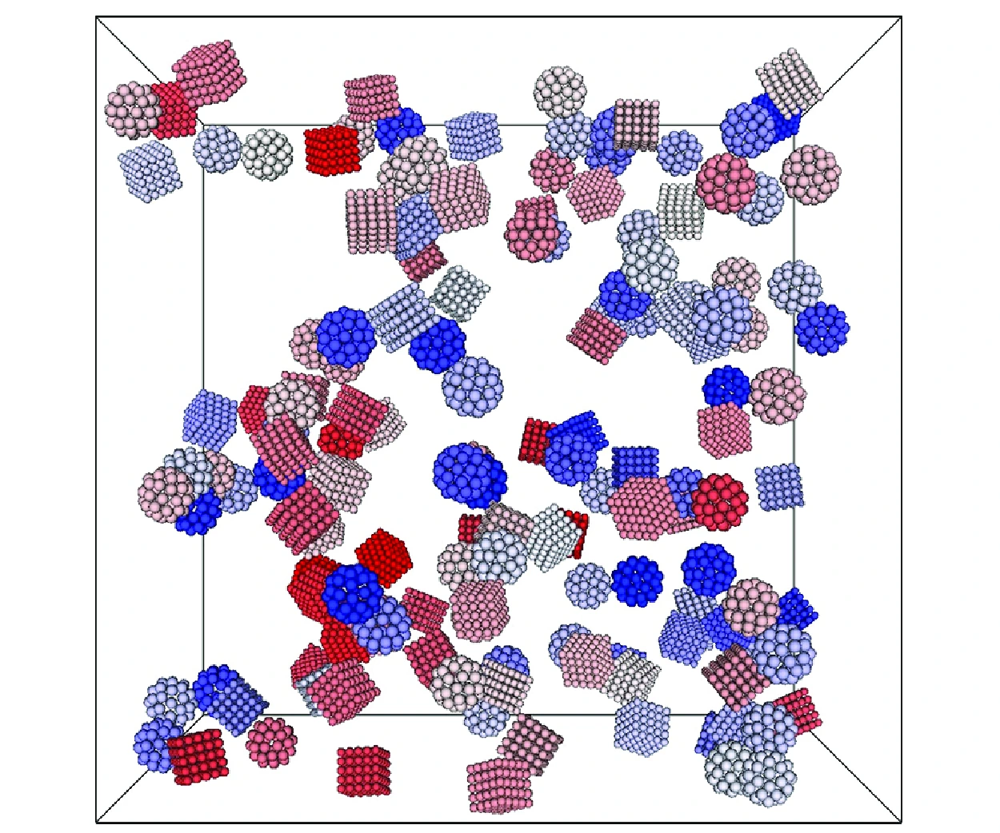

> **系列标签：** `知识文档` · `分子模拟` · `介观动力学` · `MolSimulX`

经典 **分子动力学（molecular dynamics, MD）** 流程默认：**溶剂分子一颗颗显式放上**，再积牛顿方程。胶体、乳液、聚合物溶液里，你真正关心的往往是微米级颗粒 / 大分子，水的每一个振动模式既贵又不一定回答你的问题。

于是出现一整条「**溶剂与介质怎么处理**」的梯子：从隐式摩擦（**朗之万动力学** Langevin dynamics, LD；**布朗动力学** Brownian dynamics, BD），到介观粒子流体（**耗散粒子动力学** dissipative particle dynamics, DPD；**光滑粒子流体动力学** smoothed particle hydrodynamics, SPH），再到**格子玻尔兹曼**（lattice Boltzmann, LB / lattice Boltzmann method, LBM）与**计算流体力学**（computational fluid dynamics, CFD），以及专盯**流体力学相互作用**（hydrodynamic interactions, HI）的 **Stokesian Dynamics（斯托克斯动力学，常缩写 SD / SDS）**。它们和 [粗粒化与加速模型](K04-粗粒化与加速模型.md) 里的珠子粗粒化是亲戚，但侧重点是：**背景介质的动量、粘滞与流动怎么进方程**。

本篇先讲清 **LD** 与 **BD**，再把胶体领域常用的介质手段放进一张谱系。控温用途见 [常见系综与控温控压](K11-常见系综与控温控压.md)；怎么选见 [力场怎么选](K06-力场怎么选.md)。



---

[erphpdown]

## 一、问题从哪来：显式溶剂何时太贵？

| 你关心的                 | 显式全原子水    | 往往更划算的方向        |
| -------------------- | --------- | --------------- |
| 氢键网络、第一溶剂壳结构         | 合适        | —               |
| 胶体颗粒在粘稠介质里怎么扩散、沉降、聚集 | 盒子里水分子数爆炸 | 隐式 / 介观 / 连续介质  |
| 微流控、多孔介质里的流动与运移      | 原子 MD 够不着 | LB、SPH、CFD ± 粒子 |
| 只要恒温采样、不太在乎短时水动力学    | 可显式 + 弱热浴 | 或朗之万热浴          |

核心权衡：**HI、介电、排空、热涨落**——你丢掉哪一层，就不能再问依赖那一层的问题。

封面那种粗粒胶体盒子（珠子拼成的立方 / 球形聚集体、**看不到显式水**）正是这类场景：溶剂常被抹成摩擦、噪声或介观流体，而不是一颗颗水分子。

---

## 二、朗之万动力学（Langevin dynamics, LD）

在牛顿方程上加**摩擦**和**随机力**，让溶剂的粘滞与热噪声进粒子方程，而不必（或不只）靠显式水分子：

$$
m\dot{\mathbf{v}} = \mathbf{F}_{\mathrm{cons}} - \gamma\mathbf{v} + \mathbf{R}(t)
$$

| 项 | 含义 |
|----|------|
| $\mathbf{F}_{\mathrm{cons}}$ | **保守力**：来自力场 / 有效势，$=\!-\nabla U$（见 [经典全原子力场](K03-经典全原子力场.md)） |
| $-\gamma\mathbf{v}$ | 摩擦（耗散），把动能拖走——**不是**某个 $U$ 的梯度 |
| $\mathbf{R}(t)$ | 随机力；与 $\gamma$、$T$ 满足**涨落–耗散关系**（fluctuation–dissipation relation），才能采到正确温度 |

只保留 $\mathbf{F}_{\mathrm{cons}}$ 时，接近 NVE 图像，$K+U$ 可近似守恒。加上摩擦与随机力后，机械能**故意不守恒**：一边耗散、一边从「热噪声」补能，才能把温度钉在设定值（作热浴），或代表隐式溶剂。这和「力场写坏了导致能量乱飘」不是一回事——后者应先在 **NVE** 里排查（见 [常见系综与控温控压](K11-常见系综与控温控压.md)）。

### 两种用法（别混）

| 用法 | 溶剂还在吗？ | 朗之万在干什么 |
|------|--------------|----------------|
| **热浴** | 往往还在（显式水） | 帮你维持温度；$\gamma$ 宜弱，以免扭动力学 |
| **隐式溶剂动力学** | 水分子不建 | 摩擦 + 噪声 **代表**溶剂；溶质走 LD/BD |

正确实现时，可采样正则分布。$\gamma$ 过大 → 扩散被压、动力学变慢；报扩散、谱时要交代 $\gamma$。

---

## 三、布朗动力学（Brownian dynamics, BD）

当摩擦很大、惯性来不及表现（过度阻尼，overdamped），可丢掉 $m\dot{\mathbf{v}}$，运动由「保守力 + 随机力」即时平衡——这就是 BD。

| | 朗之万 LD | 布朗 BD |
|--|-----------|---------|
| 惯性 $m\dot{v}$ | 保留 | **忽略** |
| 图像 | 还有「滑一下」的短时弹道 | 立刻被粘滞钉在力与噪声的平衡上 |
| 胶体里 | 颗粒不太大、还想留一点惯性 | 高粘、大颗粒、关心长时扩散/聚集 |

BD 时间步与可及尺度往往更大，但**丢失短时惯性动力学**；流体力学若只做成标量摩擦 $\gamma$，也**没有**多体力的长程流动耦合（那要 SD / LB / 显式介观流体）。

---

## 四、胶体常用的「溶剂 / 介质」手段谱系

下面按「介质有多连续、流体力学有多认真」排列。缩写首次见导语；表里用常用简称即可。**SDS** 在胶体文献里多指 **Stokesian Dynamics**（勿与十二烷基硫酸钠 sodium dodecyl sulfate 混淆）。

### 1. 总表

| 方法 | 介质怎么出现 | 胶体里常问什么 | 注意 |
|------|--------------|----------------|------|
| **显式溶剂 MD** | 水/溶剂分子全在 | 溶剂结构 + 颗粒动力学 | 最贵；HI 自然有，但尺度有限 |
| **LD** | 摩擦 + 噪声（± 显式溶剂当热浴） | 恒温；或隐式溶剂采样 | $\gamma$ 扭曲动力学 |
| **BD** | 过度阻尼的 LD | 大颗粒扩散、聚集初步 | 默认 HI 很简陋 |
| **SD / SDS** | 颗粒在粘性流体中，**多体 HI** 进迁移率矩阵 | 沉降、剪切下结构、HI 主导的胶体 | 计算重；常低雷诺数（low Reynolds number）假设 |
| **DPD** | 软粒子流体：保守 + 耗散 + 随机 | 相分离、聚合物溶液、介观流 | 与 LD 都有耗散/随机，但是**粒子流体** |
| **SPH** | 用粒子离散连续流体方程 | 自由液面、多相流、复杂边界 | 更偏连续介质粒子法 |
| **LB / LBM** | 分布函数在格子上演化 → 流体 | 多孔介质、复杂几何流动 + 颗粒 | 常与颗粒/胶体双向耦合 |
| **CFD** | 连续 **Navier–Stokes** 方程（有限体积/元等） | 宏观流场、反应器、微流控 | 不解析分子；可与离散颗粒耦合（CFD–**DEM** 等） |

### 2. DPD（dissipative particle dynamics，耗散粒子动力学）

[粗粒化与加速模型](K04-粗粒化与加速模型.md) 已介绍：DPD 粒子之间有软保守力，再加上成对的耗散力与随机力，整体像「带动量守恒的介观流体」。

| | DPD | 朗之万 / 布朗 |
|--|-----|----------------|
| 溶剂 | 常常也用 DPD 粒子表示 | 溶剂被抹成 $\gamma$ 与噪声 |
| 动量 | 相互作用满足动量守恒，利于流动 | 单粒子摩擦可不守恒（简单 LD） |
| 适合 | 相分离、聚合物溶液、介观流变 | 隐式溶剂下的溶质过度阻尼运动 |

### 3. Stokesian Dynamics（SD / SDS，斯托克斯动力学）

胶体在**低雷诺数**粘性流体里，一个颗粒的运动会通过流场拖着别的颗粒——这就是导语里的 **HI**。  
**Stokesian Dynamics** 把溶剂当成连续粘性流体，把 HI 写进颗粒的迁移率 / 阻力矩阵，再与布朗力等结合。

| 适合 | 不适合当唯一工具 |
|------|------------------|
| 沉降、剪切诱导结构、HI 改变有效扩散 | 要化学细节、氢键；或惯性 / 湍流主导 |

和「只给每个粒子一个标量 $\gamma$」的 BD 相比：SD 贵得多，但 **HI 的物理更认真**。

### 4. SPH（smoothed particle hydrodynamics，光滑粒子流体动力学）

把连续流体离散成携带密度、速度的**插值粒子**，用核函数光滑化，近似求解连续介质方程。胶体/软物质里用于自由表面、液滴、复杂边界多相流等；颗粒可作为边界或另一相耦合。

相对 DPD：SPH 更贴「我在解流体方程」；DPD 更贴「我在跑带耗散的介观粒子系综」。

### 5. LB / LBM（lattice Boltzmann / lattice Boltzmann method，格子玻尔兹曼）

在离散格子上演化粒子速度分布函数，宏观上恢复密度与速度（近 Navier–Stokes）。擅长复杂几何、多孔介质；胶体颗粒可通过边界条件或**浸没边界**（immersed boundary）与流场**双向耦合**。

文献里若写 LB、LBM、格子 Boltzmann，一般指这一族；与分子 MD 不是同一层，但是胶体介观模拟的常用介质引擎。

### 6. CFD（computational fluid dynamics，计算流体力学）

直接数值解连续介质流体方程（有限体积、有限元、有限差分等）。尺度最大、工业与微流控最常见；**不**解析分子热涨落（除非另加模型）。

与离散颗粒耦合时常见：

- **CFD–DEM**（DEM = discrete element method，离散元）：流场用 CFD，颗粒用牛顿/朗之万；也有更简的颗粒轨道模型；  
- 胶体若还需热涨落与 HI，要在耦合里显式加入——否则只是「大颗粒在宏观流里被冲走」。

---

## 五、一张怎么选的梯子（胶体视角）

```text
只要分子细节、氢键
    → 显式溶剂 MD

只要恒温、尺度尚可
    → 显式 MD ± 弱朗之万热浴

溶质大、溶剂结构不关心、HI 可极简
    → 隐式溶剂 + LD / BD

HI 很重要、低雷诺数胶体
    → Stokesian Dynamics（± 布朗）

介观相分离 / 软流体、粒子流体语言
    → DPD（或 SPH）

复杂几何流动 ± 颗粒
    → LB / LBM 或 CFD（± 颗粒耦合）
```

> **Tips：** 「隐式溶剂」不是一种方程，而是一类**建模决策**：把溶剂自由度挪进有效势、摩擦、噪声或连续场。挪之前先写清：我还能否谈扩散系数的绝对值、聚集动力学、流变？

---

## 六、和热浴、粗粒化、MD/MC 的边界

| 你读到的名字 | 更靠近哪篇 |
|--------------|------------|
| 朗之万当 **NVT 热浴** | [常见系综与控温控压](K11-常见系综与控温控压.md) + 本篇第二节 |
| Martini 珠子、UA、mW | [粗粒化与加速模型](K04-粗粒化与加速模型.md) |
| CG 偏快、流变要加摩擦 | [粗粒化动力学加速与耗散](K30-粗粒化动力学加速与耗散.md) |
| DPD 软粒子流体 | [粗粒化与加速模型](K04-粗粒化与加速模型.md) 与本篇第四节（介质视角） |
| 事件层长时演化 | [分子动力学与蒙特卡洛](K24-分子动力学与蒙特卡洛.md) 的 kMC |
| 连续流场工业仿真 | 本篇 CFD；通常离开「分子模拟主线」 |

统计力学上，LD/BD 在涨落–耗散用对时，仍可对应正则采样；DPD/LB/CFD 各有自己的守恒与系综约定——Methods 写清温度如何定义、是否满足涨落–耗散。

---

## 七、实践小清单

| 检查项 | 问自己 |
|--------|--------|
| 观测量 | 要溶剂结构，还是只要颗粒扩散/聚集/流变？ |
| HI | 标量摩擦够不够，要不要 SD / 显式介观流体？ |
| 惯性 | LD 还是过度阻尼 BD？ |
| 尺度 | 分子 / 介观粒子 / 格子 / 连续 CFD？ |
| 热涨落 | CFD 默认没有分子噪声；胶体布朗是否要补上？ |
| $\gamma$ / 粘度 | 参数是否扭曲了你要报的动力学量？ |
| 报告 | 方法全名、溶剂处理、HI 近似、温度控制写清了吗？ |

---

## 八、常见问题

**Q：朗之万和 DPD 不都是摩擦加随机力吗？**  
A：形式亲戚，层级不同。简单 LD 常是「单粒子对介质」；DPD 是粒子间成对耗散/随机，并常作**动量守恒的介观流体**。

**Q：BD 和 Stokesian Dynamics 怎么选？**  
A：BD 默认 HI 很粗；沉降、剪切下结构、HI 改变径向分布时，优先考虑 SD 或带 HI 的介观流体。

**Q：SPH、LB、CFD 还算分子模拟吗？**  
A：更偏**介观 / 连续介质**。胶体课题里它们经常和分子/粗粒方法耦合；地图上要放对层，避免用 CFD 流速直接当分子扩散。

**Q：文献里的 SDS 是 Stokesian Dynamics 还是表面活性剂？**  
A：看上下文。胶体水动力学论文里 **SDS / SD** 常指 Stokesian Dynamics；化学/界面语境里 **SDS** 更常是 sodium dodecyl sulfate。本篇取前者。

**Q：报扩散系数时用了很大的 $\gamma$，能和实验比吗？**  
A：要非常小心。大摩擦会压动力学；至少做 $\gamma$ 敏感性，或改用更合适的 HI / 显式溶剂短跑标定。

---

## 九、小结

1. **朗之万** = **保守力**（力场）+ 摩擦 + 随机力；可作热浴，也可作隐式溶剂动力学。机械能不守恒是设计如此。  
2. **布朗** = 过度阻尼极限，适合高粘胶体的长时运动，但短时惯性与 HI 默认很简。  
3. 胶体溶剂介质是一条梯子：**LD/BD → SD(SDS) → DPD/SPH → LB → CFD**，越往右越连续、越宏观。  
4. **DPD** 是介观粒子流体；**SD** 认真对待低雷诺数 HI；**SPH/LB/CFD** 解/近似流体方程。  
5. 丢掉的物理（氢键、HI、热涨落）决定你还能问什么问题。  
6. 珠子粗粒化见 [粗粒化与加速模型](K04-粗粒化与加速模型.md)；CG 动力学偏快与加耗散见 [粗粒化动力学加速与耗散](K30-粗粒化动力学加速与耗散.md)；热浴实现见 [常见系综与控温控压](K11-常见系综与控温控压.md)。

---

[/erphpdown]

## 学习路径

**前置阅读：** [粗粒化与加速模型](K04-粗粒化与加速模型.md) · [常见系综与控温控压](K11-常见系综与控温控压.md) · [力场怎么选](K06-力场怎么选.md)

**下一步：**

- [粗粒化动力学加速与耗散](K30-粗粒化动力学加速与耗散.md) —— 何时用摩擦把 CG 动力学拉慢  
- [输运系数谱系](K21-输运系数谱系.md) —— 扩散等量在不同介质近似下如何解释  
- [分子动力学与蒙特卡洛](K24-分子动力学与蒙特卡洛.md) —— 长时事件层（kMC）与随机采样  
- [统计力学基础与系综](K23-统计力学基础与系综.md) —— 采样与平均的后台语言  
- [非平衡分子动力学概述](K22-非平衡分子动力学概述.md) —— 驱动下的流动与响应  
