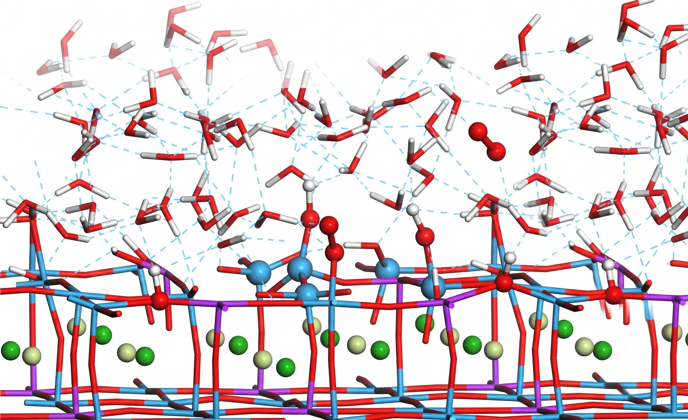

> **系列标签：** `知识文档` · `分子模拟` · `AIMD` · `MolSimulX`

经典 **分子动力学（molecular dynamics, MD）** 主线用经验或半经验**力场**给出势能 $U(\mathbf{R})$，再积分原子核运动。键断裂、电子重排、力场域外化学一出现，固定拓扑 + 固定函数形式往往不够——这时力要改从**电子结构计算**来。这就是**第一性原理分子动力学**（ab initio molecular dynamics / first-principles MD，常统称 **AIMD**）。

另一条正交扩展：经典 MD 默认**经典原子核**。对氢、质子转移、低温振动，核的**零点能、隧穿**等**核量子效应**（nuclear quantum effects, NQE）可能重要，常用**路径积分分子动力学**（path-integral molecular dynamics, **PIMD**）等处理。

本篇建概念边界与怎么判断的直觉，不讲具体电子结构软件命令。方法版图见 [分子模拟方法概述](K01-分子模拟方法概述.md)；经典力场主线见 [经典全原子力场](K03-经典全原子力场.md)。篇末接到当前前沿：**基于机器学习力场（MLFF）的 MD**。



---

[erphpdown]

## 一、AIMD 在算什么？

每一步（或每若干步）大致是：

1. 对当前核坐标做电子结构计算（最常见是 **密度泛函理论** density functional theory, **DFT**）→ 能量与核受力  
2. 用该力积分核运动（仍常是牛顿或带热浴的经典核动力学）  
3. 重复  

| 相对经典力场 MD | 相对「静态」量子化学 |
|------------------|----------------------|
| 可断键、可反应、可响应环境（取决于电子方法） | 有有限温度、涨落、短时动力学 |
| 极慢；体系小、轨迹短 | 比单点优化 / 反应路径扫描贵得多 |

封面那种固–液界面（晶格、表面羟基、氢键网络）是典型「力场域外化学」现场：吸附、质子转移、局域成键时，AIMD（以及后文的 MLFF-MD）常比固定拓扑经典势更对口。

一句话：AIMD = **电子结构给力** + **核在力下运动**。你买到的是「能反应的、有温度的量子势能面采样」；付出的是每步一次（或多次）昂贵的电子结构。

### Born–Oppenheimer 图像（入门够用）

多数现代 AIMD 走 **Born–Oppenheimer MD（BOMD）**：假定电子始终处于当前核构型对应的电子基态（或你指定的电子态），力 = 该势能面对核坐标的负梯度。

历史上还有 **Car–Parrinello MD（CPMD）** 等：把电子自由度也带进扩展拉格朗日量一起「虚动力学」演化，曾是早期大规模 AIMD 的重要路线。入门只需记住：

> 力来自电子结构；BOMD 是「每步（准）收敛电子问题再推核」的直观图景。

---

## 二、电子结构这一侧在选什么？

AIMD 的精度与成本，大半由**每步用什么电子结构方法**决定，而不是由 Verlet 公式决定。

| 常见选择 | 直觉 | 注意 |
|----------|------|------|
| **DFT**（GGA / hybrid 等） | AIMD 默认主力 | 泛函、基组/赝势、色散校正都会进轨迹 |
| 半经验 / 紧束缚类 | 比全 DFT 便宜，仍可反应 | 参数域与误差要单独验证 |
| 更高阶波函数方法 | 更准（特定问题） | 几乎只适合极小体系、极短轨迹或作基准 |

> **Tips：** AIMD 轨迹追的是你选的那套电子结构的势能面。换成另一个泛函，结构、能垒、甚至相行为都可能变——Methods 要写清泛函、基组/平面波截断、赝势与色散。

---

## 三、何时值得上 AIMD？

| 更倾向 AIMD | 更倾向经典力场 / 其他折中 |
|-------------|---------------------------|
| 反应机理、键断裂生成、质子/电子耦合重排 | 大体系、长时扩散、相平衡、构象采样 |
| 力场明显失效的化学环境 | 已有可靠力场且问题不依赖断键 |
| 小体系基准：标定势、产训练数据 | 生产级材料筛选、生物大分子常规动力学 |
| 需要与实验同位素/反应细节对齐的短时过程 | 只要热力学量且经验势已验证 |

常见折中（本篇不展开实现）：

| 折中 | 一句话 | 去哪读 |
|------|--------|--------|
| **QM/MM** | 反应中心量子 + 环境力场 | [QM-MM思想](K27-QM-MM思想.md) |
| **反应力场**（如 ReaxFF） | 经验但允许断键 | [高精度力场与机器学习势](K05-高精度力场与机器学习势.md) |
| **MLFF / MLIP 驱动的 MD** | 用数据学量子势能面，再近经典成本跑 MD | 本篇第六节 + [高精度力场与机器学习势](K05-高精度力场与机器学习势.md) |

---

## 四、核量子效应与 PIMD（极简但要用对）

经典 MD / 多数 AIMD 里，核仍按**经典点粒子**运动。对许多重原子、室温体相问题，这常常够用。但对下列情况要警惕 NQE：

| 信号 | 例子 |
|------|------|
| 轻核、氢键网络 | 水、质子导线、氢键晶体 |
| 质子转移、氢同位素效应 | 反应速率、平衡同位素分馏 |
| 低温 / 零点能主导 | 振动零点、部分隧道过程 |

**路径积分分子动力学（PIMD）** 的直观图像：把每个量子核映射成一串用弹簧连接的**珠子（beads）**，用扩大后的经典系统去近似量子统计。珠子数越多，对量子统计的近似通常越好，成本大致按珠子数放大。

| 你要什么 | 常见路线直觉 |
|----------|----------------|
| 量子统计（结构、自由能修正） | PIMD / 路径积分采样 |
| 动力学里的隧穿、时间关联 | 往往需要更专门的量子动力学近似（入门先知道「比 PIMD 更难」） |

> **Tips：** 「做了 AIMD」≠「核是量子的」。AIMD 解决的是**电子如何给出力**；NQE 解决的是**核要不要当量子粒子**。两者可以叠：例如路径积分 + 第一性原理力（成本极高），或路径积分 + MLFF（见第六节）。

---

## 五、实践上常踩的坑

| 坑 | 问自己 |
|----|--------|
| 轨迹太短就下结论 | 你的慢过程（反应、扩散、重构）是否根本采不够？ |
| 体系太小 + PBC | 有限尺寸是否扭曲缺陷、界面、长程静电？ |
| 电子未收敛 / 设置太糙 | 力噪声是否大到污染动力学？ |
| 热浴与时间步 | 金属、空隙、软模是否需要更小心的控温与 $\Delta t$？ |
| 把 AIMD 当「万能更准」 | 泛函偏差会原样写进轨迹；准的是「相对所选 QM」，不是绝对真理 |
| 忽略核量子 | 问题若绑在氢上，经典核可能系统偏 |

### 实践小清单

| 检查项 | 建议 |
|--------|------|
| 科学问题 | 真的需要断键/电子重排，还是经典力场 + 增强采样就够？ |
| 电子方法 | 泛函、色散、基组/截断写进 Methods 了吗？ |
| 尺度 | 原子数 × 时长是否现实？要不要 QM/MM 或 MLFF？ |
| 观测量 | 结构/能垒/谱/反应坐标——哪一个决定你必须上 AIMD？ |
| NQE | 轻核关键步骤是否要 PIMD 或至少讨论经典核近似？ |
| 下游 | 若只是为了产数据训势，采样策略是否覆盖关键构型？ |

---

## 六、当前前沿：从 AIMD 走到基于 MLFF 的 MD

AIMD 准（在所选电子结构意义下）但贵。过去十年把版图改写的，是把「昂贵势能面」**蒸馏**成可微的替代模型，再用它驱动 MD——文献里常叫：

- **机器学习力场**（machine learning force field, **MLFF**）  
- 或 **机器学习原子间势 / 机器学习势**（machine learning interatomic potential, **MLIP**）

三者在口语里常混用；本站力场专篇多用「ML 势 / MLIP」，与 **MLFF** 指同一类东西：**用数据拟合 $U(\mathbf{R})$（及力），再当力场跑 MD**。

### 1. 逻辑链条

```text
DFT / 更高精度 QM（可含短 AIMD 轨迹）
        ↓ 能量、力、（应力）标签
   训练 MLFF / MLIP
        ↓
   近经典成本的 MD / 增强采样 /（可选）PIMD
        ↓
   更大体系、更长轨迹；关键点再回 QM 校验
```

相对「每步在线 DFT」的 AIMD：MLFF-MD 把电子结构成本挪到**离线训练**；相对经典力场：它往往**不依赖固定键表**，只要训练数据覆盖反应与极端构型，就能描述断键与复杂多体。

### 2. 相对 AIMD 解决了什么？还剩什么？

| AIMD 的痛 | MLFF-MD 常见答法 |
|-----------|------------------|
| 步步 DFT，纳秒级几乎奢侈 | 训练后力评估接近经典势量级（仍看模型） |
| 体系只能很小 | 可扩到更大体系、更多条轨迹（视模型与硬件） |
| 重复算相似化学环境浪费 | 同一势可跑热力学扫描与生产段 |

数据上限、分布外「自信地错」、长程静电等风险与门派细节，见 [高精度力场与机器学习势](K05-高精度力场与机器学习势.md)——本篇只钉住：**AIMD/DFT 产数与校验 → MLFF 跑长 MD** 这条当代主航道。

### 3. 和本站其他篇怎么分工？

| 你想深入… | 去读 |
|-----------|------|
| 多体 / 极化 / ML 势门派与怎么选 | [高精度力场与机器学习势](K05-高精度力场与机器学习势.md) |
| 特征、标签、划分与泄漏 | [机器学习数据基础](K28-机器学习数据基础.md) |
| 网络、等变性、MLIP 在模拟里的角色 | [神经网络与深度学习基础](K29-神经网络与深度学习基础.md) |
| 环境怎么搭、路线怎么走 | [机器学习与分子模拟导引](../01-技术文档/T30-机器学习与分子模拟导引.md) |
| 只反应中心要量子 | [QM-MM思想](K27-QM-MM思想.md) |

> **Tips：** 当前许多「接近量子精度的长 MD」论文，实际跑的是 **MLFF-MD**，背后用 AIMD/DFT **造数据与校验**。读论文时先分清：线上每步是 DFT，还是已经换成机器学习力场。

### 4. 一张精度–成本速记

```text
经典力场 MD
    → 反应力场 / 极化 / 多体
        → MLFF-MD（有覆盖良好的 QM 数据时）← 当前最热的「准且够长」折中
            → QM/MM（局域热点）
                → 全体系 AIMD（小、短、基准与产数）
                    → AIMD + PIMD（更贵一截）
```

---

## 七、常见问题

**Q：AIMD 是不是一定比经典力场准？**  
A：对断键、电子重排，方向上通常更合适；但对「所选泛函本身就偏」的量，AIMD 会忠实再现偏差。准不准要相对参考实验或更高阶 QM，不是相对「有没有 DFT」四个字母。

**Q：BOMD 和 CPMD 我该记哪个？**  
A：读现代文献多数是 BOMD 图像（步步电子问题 + 推核）。CPMD 是重要历史与仍可见的实现路线；概念上先抓住「力来自电子结构」即可。

**Q：做了 DFT 优化算不算 AIMD？**  
A：不算。优化是找极小；AIMD 是有限温度下沿力积分出轨迹。可以用 AIMD 采样，再对帧做更高精度单点——那是后处理，不是把优化改名。

**Q：MLFF-MD 能完全替代 AIMD 吗？**  
A：在数据覆盖的化学空间里，常常可以替代「生产段长轨迹」；基准、主动学习补点、争议构型校验，仍要回到 AIMD/DFT。无数据就训势，等于无米之炊。

**Q：PIMD 和 AIMD 必须一起上吗？**  
A：不必。许多 AIMD 仍用经典核；许多 PIMD 用力场或 MLFF。只有「电子要准 + 核要量子」同时成立时，才考虑最贵的组合。

---

## 八、小结

1. **AIMD**：电子结构给 $U$ 与力，核在有限温度下运动；可反应，但体系小、轨迹短。  
2. 精度与成本首先取决于 **DFT/电子方法**，其次才是积分与热浴细节。  
3. **NQE / PIMD** 是核侧的量子扩展，与「力从哪来」正交；轻核问题要单独判断。  
4. **QM/MM、反应力场、MLFF** 是三把常用折中钥匙；全体系步步 DFT 不是唯一答案。  
5. **当前前沿主航道**：用 AIMD/DFT 产高质量数据 → 训练 **MLFF/MLIP** → 跑长时、大体系 MD（必要时再加 PIMD 或回 QM 校验）。  
6. ML 势细节见 [高精度力场与机器学习势](K05-高精度力场与机器学习势.md)；局部反应见 [QM-MM思想](K27-QM-MM思想.md)。

---

[/erphpdown]

## 学习路径

**前置阅读：** [分子动力学模拟概述](K02-分子动力学模拟概述.md) · [经典全原子力场](K03-经典全原子力场.md) · [分子模拟方法概述](K01-分子模拟方法概述.md)

**下一步：**

- [QM-MM思想](K27-QM-MM思想.md) —— 反应中心量子 + 环境力场  
- [高精度力场与机器学习势](K05-高精度力场与机器学习势.md) —— MLFF / MLIP 专篇（本篇前沿的落点）  
- [神经网络与深度学习基础](K29-神经网络与深度学习基础.md) —— 势模型背后的网络语言  
- [机器学习数据基础](K28-机器学习数据基础.md) —— 训练数据怎么划分才不自欺  
- [机器学习与分子模拟导引](../01-技术文档/T30-机器学习与分子模拟导引.md) —— 环境与学习路线  
