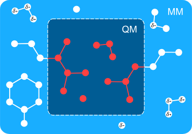

> **系列标签：** `知识文档` · `分子模拟` · `QM-MM` · `MolSimulX`

全体系 **第一性原理分子动力学**（ab initio MD / **AIMD**）太贵；全体系经典**分子力学**（molecular mechanics, **MM**）力场又往往描不准反应中心——键断了、电荷重排了、过渡金属变价了，固定拓扑的经验势默认「不会发生」或干脆失真。

常用折中是 **QM/MM**（quantum mechanics / molecular mechanics）：把体系分成**量子力学区**（电子结构，QM）与**分子力学区**（力场，MM），再把两边**耦合**起来。酶活性位点、溶液里局部反应、缺陷/掺杂附近的局域化学，都是典型战场。

本篇讲分区、边界与耦合的概念难点，以及和 AIMD、反应力场、**机器学习力场（MLFF）** 怎么分工；不涉及具体软件接口。AIMD 背景见 [第一性原理分子动力学与核量子效应](K26-第一性原理分子动力学与核量子效应.md)；经典力场见 [经典全原子力场](K03-经典全原子力场.md)。



---

[erphpdown]

## 一、基本图像

封面示意与下图同一套分区：**虚线框内是 QM 区**（电子结构），框外是 **MM 区**（力场）；跨边界的键与 MM 侧的偏电荷，对应后文的切断与静电嵌入。

```text
┌─────────────────────────────────┐
│  MM 区：溶剂、蛋白远端、晶格远处… │
│     ┌─────────────────┐         │
│     │  QM 区：         │         │
│     │  反应中心 / 热点  │         │
│     └─────────────────┘         │
└─────────────────────────────────┘
```

示意能量分解：

$$
E = E_{\mathrm{QM}} + E_{\mathrm{MM}} + E_{\mathrm{QM\text{-}MM}}
$$

| 项 | 大致装什么 |
|----|------------|
| $E_{\mathrm{QM}}$ | QM 区内原子的电子结构能量（及区内核间相互作用，视实现而定） |
| $E_{\mathrm{MM}}$ | MM 区力场能量（键、角、LJ、库仑…） |
| $E_{\mathrm{QM\text{-}MM}}$ | **跨区耦合**：静电、范德华，以及**切断的共价键**怎么补 |

误差与争议几乎都挤在第三项，以及「QM 区画多大」。QM/MM 不是「QM 公式 + MM 公式简单相加」——**边界物理**才是文章要交待清楚的部分。

---

## 二、何时值得上 QM/MM？

| 更倾向 QM/MM | 更倾向别的路 |
|--------------|--------------|
| 化学变化**高度局域**（一个活性位点、一个缺陷） | 「整盒分子都在反应 / 到处成键断键」 |
| 环境大（蛋白、显式溶剂、晶格）必须保留 | 体系小到全 AIMD 扛得住 |
| 要反应机理 / 能垒，又要环境极化、氢键、位阻 | 只要体相扩散、相平衡且经典力场已够 |
| 需要沿反应坐标做自由能，全 AIMD 采不起 | 已有覆盖良好的 MLFF，热点也在训练分布内 |

| 路线 | 一句话 | 去哪读 |
|------|--------|--------|
| 纯 MM / 经典 MD | 大、长；难反应 | [经典全原子力场](K03-经典全原子力场.md) |
| 全体系 AIMD | 处处可量子；小、短 | [第一性原理分子动力学与核量子效应](K26-第一性原理分子动力学与核量子效应.md) |
| **QM/MM** | 热点量子 + 环境力场 | 本篇 |
| 反应力场（如 ReaxFF） | 经验但允许断键，无电子结构 | [高精度力场与机器学习势](K05-高精度力场与机器学习势.md) |
| MLFF-MD | 数据拟合量子面，再长跑 | [高精度力场与机器学习势](K05-高精度力场与机器学习势.md) · [第一性原理分子动力学与核量子效应](K26-第一性原理分子动力学与核量子效应.md) 第六节 |

> **Tips：** QM/MM 的「省」省在环境；QM 区本身仍按你选的 DFT/半经验方法计费。QM 区画成半个蛋白，就回到「贵 AIMD + 还要伺候边界」。

---

## 三、必须面对的三个问题

### 1. 如何划界（QM 区选多大？）

| QM 区太小 | QM 区太大 |
|-----------|-----------|
| 边界穿过关键电荷转移 / 共轭 / 氢键网络 → 伪影 | 失去加速意义，接近全 QM |
| 反应坐标涉及的原子没进 QM | 每步电子结构仍爆炸 |

实务上的收敛检验：**放大 QM 区（多圈残基、多溶剂壳、多晶格壳）**，看能垒、电荷、关键距离是否还变。变很多 → 区还不够；不怎么变 → 可以停。

没有「唯一正确」分区。好分区 = **化学直觉**（谁在换键、谁在极化反应中心）+ **收敛证据**。

### 2. 共价键如何切开？

蛋白侧链、配体–残基、共价连接的材料片……边界常会砍断一根真实化学键。常见处理：

| 思路 | 直觉 | 注意 |
|------|------|------|
| **连接原子 / 链接原子**（link atom） | 在切断处补一个（常是 H）填满 QM 区价键 | 位置、力如何回馈 MM 要定义清楚；可能引入虚假振动 |
| 冻结键 / 约束边界 | 限制边界键长或用特殊势 | 灵活度差，不适合边界附近大重构 |
| 更精细的边界方案 | 投影、局域轨道、自定义封端等 | 软件与文献相关；入门先懂「切断必须补价」 |

原则：尽量让边界落在 **C–C 单键** 一类「化学不敏感」处，避开共轭、肽键平面中央、金属–配体键等。

### 3. 静电（与范德华）如何耦合？

跨区除了切断的键，还有非键相互作用。嵌入层级大致是：

| 层级 | 图像 | 代价 / 收益 |
|------|------|-------------|
| **力学嵌入**（mechanical embedding） | QM 算孤立 QM 区；与 MM 主要靠范德华等「机械」耦合，静电很弱或没有 | 最便宜；环境极化反应中心很差 |
| **静电嵌入**（electrostatic embedding） | MM 点电荷作为外势进入 QM 哈密顿 → 环境极化 QM 电子密度 | 酶/溶液反应的常见默认；较贵一点 |
| **极化嵌入**（polarizable embedding）等 | MM 区也可被 QM 极化（或双向） | 更物理，实现与参数更重 |

多数入门与生产文献里，**静电嵌入**是要先吃透的那一档。范德华通常仍用 MM 参数处理跨区 LJ 等——参数是否与 QM 区「匹配」要心里有数。

---

## 四、动力学、自由能与采样

QM/MM 可以：

| 用法 | 在干什么 |
|------|----------|
| **QM/MM 优化 / 过渡态搜索** | 找极小、鞍点；还不是有限温度轨迹 |
| **QM/MM MD** | 核在耦合力下积分；QM 区每步（或每几步）做电子结构 |
| **QM/MM + 增强采样** | 沿反应坐标做伞形、元动力学等，要自由能时几乎刚需 |

全 AIMD 做自由能往往采不起；QM/MM 把贵的部分缩到热点，才让「有环境的反应自由能」变得现实。增强采样概念见 [增强采样与自由能](K14-增强采样与自由能.md)。

> **Tips：** 报能垒时写清：是 **0 K 势能面**上的 $\Delta E^\ddagger$，还是有限温度 **自由能** $\Delta G^\ddagger$。后者需要采样；前者优化就够，但和溶液/酶实验常不是同一个量。

---

## 五、和 AIMD、MLFF、反应力场怎么选？

完整精度–成本梯子见 [第一性原理分子动力学与核量子效应](K26-第一性原理分子动力学与核量子效应.md) 与 [高精度力场与机器学习势](K05-高精度力场与机器学习势.md)。本篇只钉三条**别混**：

| 别混的一点 | 说明 |
|------------|------|
| QM/MM ≠「比 AIMD 更准」 | 准的是热点电子结构；边界与 MM 参数会引入另一类误差 |
| QM/MM ≠ MLFF | 一个是**空间分区**的多尺度；一个是**数据拟合**的势能替代 |
| 可以组合 | 例如用 QM/MM 产局域反应数据训 MLFF |

何时优先 QM/MM：反应**高度局域**且环境必须显式保留（蛋白、溶剂、晶格）。到处都在断键、或已有覆盖良好的 MLFF，就不必硬上分区。

---

## 六、实践小清单

| 检查项 | 问自己 |
|--------|--------|
| 局域性 | 反应/电子重排是否真能圈进一个不太大的 QM 区？ |
| 划界 | 扩大 QM 区后，结论还变吗？ |
| 切断位置 | 边界是否避开共轭、金属键、关键氢键？ |
| 嵌入层级 | 力学嵌入是否太粗？静电嵌入写进 Methods 了吗？ |
| QM 方法 | 泛函/半经验、基组，与纯 QM 基准是否交叉验证过？ |
| MM 力场 | 环境力场与溶剂模型是否与课题匹配？ |
| 观测量 | 优化能垒够不够，还是必须自由能 + 增强采样？ |
| 对照 | 有没有小模型全 QM、或更大 QM 区的收敛证据？ |

---

## 七、常见问题

**Q：QM 区是不是越大越好？**  
A：在收敛之前越大越好；收敛之后再大只是烧机时。用「扩大一圈看差值」当停手标准，比拍脑袋固定「两圈残基」更稳。

**Q：连接原子会不会污染结果？**  
A：可能。所以边界要放在钝感键上，并做 QM 区大小收敛；有的工作会报告去掉/移动 link 后的敏感性。

**Q：酶反应必须 QM/MM 吗？**  
A：不是唯一路。小模型团簇全 QM、反应力场、MLFF 都有人用。QM/MM 强在**显式环境 + 局域量子**；若环境不重要，团簇模型可能更干净。

**Q：和「底物用 DFT、蛋白用 MD」两步走有什么不同？**  
A：两步走常是：MD 采样构型 → 取出快照做 QM。QM/MM 是**同一哈密顿/同一力**下让两边同时在场。构型是否在反应路径上、环境是否极化过渡态，两者回答问题的力度不同。

**Q：MLFF 普及后 QM/MM 还有必要吗？**  
A：有。无数据、强局域、要标准电子结构方法直接进哈密顿时，QM/MM 仍是主力；MLFF 则擅长「数据够了之后的长采样」。二者是工具箱邻居，不是互相取代。

---

## 八、小结

1. **QM/MM** = 反应中心（等热点）用量子力学，环境用分子力学，再耦合。  
2. 误差主战场：**划界、共价切断、静电嵌入**；要用放大 QM 区做收敛。  
3. 适合**局域化学变化**；不适合「到处都在反应」。  
4. 常与**增强采样**联用，才能把势能面能垒推进到有环境的自由能。  
5. 与全 **AIMD**、**反应力场**、**MLFF-MD** 按局域性、尺度、数据是否齐全来选，不是精度排行榜。  
6. 经典主线仍以力场 MD 为主；本文是方法边界上的多尺度折中。

---

[/erphpdown]

## 学习路径

**前置阅读：** [第一性原理分子动力学与核量子效应](K26-第一性原理分子动力学与核量子效应.md) · [经典全原子力场](K03-经典全原子力场.md)

**下一步：**

- [增强采样与自由能](K14-增强采样与自由能.md) —— QM/MM 反应自由能常要的采样层  
- [高精度力场与机器学习势](K05-高精度力场与机器学习势.md) —— 反应力场与 MLFF 邻居  
- [力场怎么选](K06-力场怎么选.md) —— 总开关里的「要不要上量子」  
- [分子模拟方法概述](K01-分子模拟方法概述.md) —— 把 QM/MM 放回整张方法地图  
