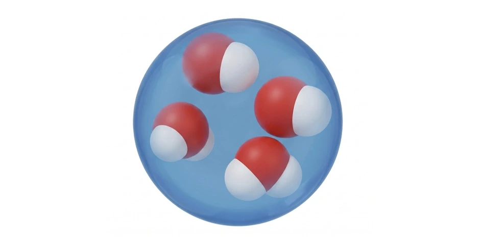

> **系列标签：** `知识文档` · `分子模拟` · `DPD` · `粗粒化` · `对比单位`

跑 DPD（耗散粒子动力学）时，输入文件里到处是 $r_c^*=1$、$k_BT^*=1$、$\rho^*=3$——数字很干净，但写 Methods、和实验对比、或要把扩散 / 粘度换成 m²·s⁻¹ 时，就得把**约化单位换回真实物理量**。尺子选错、时间标定跟错宏观量，整篇数字都会差一个数量级。

本文是 DPD **单位与参数标定**笔记：先把 DPD 珠子与三种力写清，再说常用参数怎么定，然后给出 $r_c$、$m$、$k_BT$、$\tau$ 与真实单位的对应，最后用「对水、$N_m=4$」的算例把质量、长度、能量、时间算一遍。概念地图见 [粗粒化与加速模型](K04-粗粒化与加速模型.md)；一般 LJ 对比单位见 [对比单位与无量纲化](K15-对比单位与无量纲化.md)；介质谱系里的 DPD 定位见 [朗之万、布朗与溶剂介质方法](K25-朗之万布朗与溶剂介质方法.md)。

| 你要什么 | 读哪篇 |
|----------|--------|
| DPD 是什么、和 Martini / 朗之万差在哪 | [粗粒化与加速模型](K04-粗粒化与加速模型.md)、[朗之万、布朗与溶剂介质方法](K25-朗之万布朗与溶剂介质方法.md) |
| LJ `units lj` 一般对比单位 | [对比单位与无量纲化](K15-对比单位与无量纲化.md) |
| 本机装 Lammps、开 DPD 相关 package | [Lammps安装简明教程](../01-技术文档/T20-Lammps安装简明教程.md) |
| **DPD 约化 ↔ 真实单位怎么换** | 本文 |

---

[erphpdown]

## 一、DPD 模型在算什么

在经典 DPD 模型中，一颗 DPD 珠子代表 $N_m$ 个流体分子（如水）；$N_m$ 也叫**粗粒化度**（coarse-graining degree）。珠子 $i$ 与 $j$ 之间同时有三种力（$r\ge r_c$ 时全为零）：

$$
\begin{aligned}
\mathbf{F}_{ij}^{C}
&= A\bigl(1-r_{ij}/r_c\bigr)\,\mathbf{e}_{ij},\\[0.4em]
\mathbf{F}_{ij}^{D}
&= -\gamma\bigl(1-r_{ij}/r_c\bigr)^{2}
\bigl(\mathbf{e}_{ij}\cdot\mathbf{v}_{ij}\bigr)\,\mathbf{e}_{ij},\\[0.4em]
\mathbf{F}_{ij}^{R}
&= \xi\bigl(1-r_{ij}/r_c\bigr)\,
\theta_{ij}\,(\Delta t)^{-1/2}\,\mathbf{e}_{ij}.
\end{aligned}
$$

| 符号 | 含义 |
|------|------|
| $r_{ij}=\lvert\mathbf{r}_{ij}\rvert$ | 珠心距 |
| $\mathbf{e}_{ij}=\mathbf{r}_{ij}/r_{ij}$ | 单位方向向量 |
| $\mathbf{v}_{ij}$ | 相对速度 |
| $A$ | 保守排斥系数 |
| $\gamma$ | 耗散系数 |
| $\xi$ | 噪声强度；涨落–耗散要求 $\xi=\sqrt{2k_BT\gamma}$ |
| $\theta_{ij}$ | 高斯白噪声 |
| $\Delta t$ | 时间步长 |
| $r_c$ | 截断距离，也可看成珠子的特征尺寸（直径尺度） |

> **Tips：** 保守力给「软排斥」、耗散 + 随机给温度与动量守恒的介观阻尼。三者是成套设定，不要只抄软势、丢掉耗散/随机。

经典表述见 [Groot & Warren, *J. Chem. Phys.* 1997](https://doi.org/10.1063/1.474784)。

---

## 二、约化单位与常用参数

### 1. 基本尺子

模拟里常用约化单位：以长度 $r_c$、质量 $m$（珠质量）、能量 $k_BT$、时间 $\tau$ 为基本单位，于是

$$
r_c^*=m^*=(k_BT)^*=\tau^*=1.
$$

上标 $^*$ 表示约化量。其余量的单位由这四个导出，例如：

| 物理量 | 约化单位（用 $r_c,m,k_BT,\tau$） |
|--------|----------------------------------|
| 质量密度 | $m/r_c^{3}$ |
| 数密度 | $1/r_c^{3}$（常见写法 $\rho^*=N r_c^{3}/V$） |
| 扩散系数 | $r_c^{2}/\tau$ |
| 运动粘度 | $r_c^{2}/\tau$ |

这和 [对比单位与无量纲化](K15-对比单位与无量纲化.md) 里「换尺子」是同一思路；只是 DPD 的长度基准常取 $r_c$，能量基准常取 $k_BT$，而不是 LJ 的 $\sigma,\epsilon$。

### 2. 数密度 $\rho^*$ 与压强标度

DPD 常在 **NVT** 下跑，珠子数常由 $\rho^*=3$ 定。[Groot & Warren, *J. Chem. Phys.* 1997](https://doi.org/10.1063/1.474784) 发现：当约化数密度 $\rho^*>2$ 时，DPD 流体的状态方程可用二次型很好拟合——压强对密度几乎是**二次**的：

$$
p^* \approx \rho^* (k_BT)^* + \alpha\, A^* (\rho^*)^2,
\quad \alpha \approx 0.101
\quad (\rho^*>2,\ r_c^*=1).
$$

第二项是**过剩压强**（相对理想气体），与 $A^*\rho^{*2}$ 成正比。有了这条标度，就可以把「软排斥有多硬」直接和宏观**等温压缩率**挂钩，从而反推 $A$（见下一小节），而不必每次都从全原子重拟合状态方程。

为什么要盯着这条关系选密度？

| 动机 | 说明 |
|------|------|
| **参数化方便** | $\rho^*>2$ 时二次拟合成立，压缩率 → $A$ 的公式才好用 |
| **算力** | 密度越低，近邻越少、力计算越便宜；因此常取**标度仍成立的最低密度附近** |
| **常用折中** | $\rho^*=3$ 略高于 2，既落在拟合区内，又不过分密 |

原则上 $\rho^*$ 仍是自由参数；落到 $\rho^*\le 2$ 时，上述二次标度变差，压缩率标定也要另做。

### 3. 排斥系数 $A$ 与粗粒化度 $N_m$

**压缩率不是必须对齐的硬指标。** 你关心组装、界面、带电结构时，常优先对齐密度、特征长度与相互作用相对强弱；严格复现水的等温压缩率只是可选目标之一。

若**刻意**让 DPD 流体的无量纲压缩率接近目标液体的 $\Psi$，可由上节状态方程得到（[Groot & Warren, 1997](https://doi.org/10.1063/1.474784)）

$$
A \approx \frac{\Psi N_m - 1}{0.2\,\rho^*}\,(k_BT)^*,
$$

其中 $0.2$ 来自 $2\alpha\approx 0.2$。对水 $\Psi\approx 16$，在 $\rho^*=3$、$(k_BT)^*=1$ 时：

| 策略 | $N_m$ | $A^*$ | 在做什么 |
|------|-------|-------|----------|
| **压缩率成套** | 1 | $\approx 25$ | 一珠一分子水；1997 文标定水压缩率的原文选择 |
| **压缩率成套** | 4 | $\approx 104$ | 珠更粗时按公式加硬排斥，尽量保住同一 $\Psi$ |
| **固定软势配方** | 常仍写 $\sim 3$–$4$ 的质量映射 | **保持 $25$** | 沿用「$A^*=25$、$\rho^*=3$」这套常用 DPD 水参数，只把 $m$、$r_c$ 按密度换到真实单位 |

文献里**两种都常见**，不必强求 $A$ 与 $N_m$ 一一对应：

- **成套缩放 $A\propto N_m$：** 更贴 Groot–Warren 的压缩率推导；粗粒化后溶剂「软硬」跟目标液体更一致，但 $A$ 变大后往往要更小心时间步与稳定性。  
- **固定 $A^*=25$：** 把「标准 DPD 水」当溶剂配方，质量 / 截断仍可按多分子珠去映射。例如带电组装类工作里常见 $A^*=25$、$\rho^*=3$，同时 $m\sim 1.2\times 10^{-25}\,\mathrm{kg}$（约四分子水的质量）、$r_c\sim 0.71\,\mathrm{nm}$，并写明近似再现体相水的密度等性质。此时**并未**按上式把 $A$ 提到 $\sim 104$，无量纲压缩率与「$N_m=1$ 标定」并不严格等价——作者通常接受这一折中，把算力与参数习惯放在更前。

> **Tips：** Methods 里写清你走的是哪条路即可：「$A$ 随 $N_m$ 按压缩率公式缩放」或「沿用 $A^*=25$、$\rho^*=3$，长度/质量另行映射」。读者要的是可复现，不是唯一真理。

后文算例走**压缩率成套**（$N_m=4$、$A=104$），便于对照公式；若改用 $A^*=25$ 而质量仍按 $N_m=4$ 映射，单位换算步骤不变，只是溶剂软硬与压缩率解释不同。

### 4. 耗散系数 $\gamma$ 与时间步 $\Delta t$

常见折中是 $\Delta t^*=0.04$、$\gamma^*=4.5$（[Groot & Warren, 1997](https://doi.org/10.1063/1.474784)）：温控够快、步长不太小、体系仍稳定。但这组参数给出的 **Schmidt 数**往往很小（$\mathrm{Sc}\sim 1$），而真实水约为 $\mathrm{Sc}\sim 10^{3}$。

Schmidt 数定义为运动粘度与自扩散系数之比：

$$
\mathrm{Sc} = \frac{\nu}{D}.
$$

它衡量**动量扩散**相对**质量扩散**有多快：水里动量传得远比分子扩散快（$\mathrm{Sc}$ 上千），而默认 DPD 参数常让两者差不多快（$\mathrm{Sc}\sim 1$），流体「更像气体」。若你关心的是粘性主导的流动、剪切或高 Sc 输运，可增大 $\gamma$ 抬高粘度 / 压低扩散，同时**减小** $\Delta t$ 以保住温控。

### 5. 没有唯一「正确」参数表

给定物理问题与特征长度后，你可以放入一定数量的 DPD 珠，再去**匹配若干宏观量**（压缩率、粘度、扩散等）。参数组合不唯一——写 Methods 时要写清你匹配了什么、用哪套时间标定。

---

## 三、约化单位 ↔ 真实单位

记模拟侧为 $\mathrm{sim}$、真实侧为 $\mathrm{real}$。四个基本量可这样定：

### 1. 质量 $m$

一颗珠代表 $N_m$ 个分子：

$$
m = \frac{N_m\,M_{\mathrm{real}}}{N_A},
$$

其中 $M_{\mathrm{real}}$ 为流体摩尔质量（如水），$N_A$ 为阿伏伽德罗常数。

### 2. 长度 $r_c$

用珠质量与数密度，对齐真实质量密度 $\rho_{\mathrm{real}}$：

$$
r_c = \Bigl(\frac{m\,\rho_{\mathrm{sim}}}{\rho_{\mathrm{real}}}\Bigr)^{1/3}.
$$

这里 $\rho_{\mathrm{sim}}$ 即约化数密度 $\rho^*$（在 $r_c^*=1$ 时，数密度的数值与 $\rho^*$ 相同）。

### 3. 能量 $k_BT$

$$
k_BT = k_B\cdot T,
$$

其中 $k_B\approx 1.38064853\times 10^{-23}\,\mathrm{J\cdot K^{-1}}$，$T$ 为体系温度（K）。

### 4. 时间 $\tau$（可有多种标定）

时间单位**没有唯一标准**，取决于你要对齐哪类宏观动力学：

| 标定思路 | 公式 | 适合何时 |
|----------|------|----------|
| 自扩散 | $\tau = N_m\,r_c^{2}\,D_{\mathrm{sim}}/D_{\mathrm{real}}$ | 关心扩散、布朗运动；有时也反过来用来定 $N_m$ |
| 粘性过程 | $\tau = r_c^{2}\,\nu_{\mathrm{sim}}/\nu_{\mathrm{real}}$ | 流动、剪切、粘度主导 |
| 参考速度 | $\tau = r_c/U_{\mathrm{ref}}$ | $U_{\mathrm{ref}}$ 可取热速度 $(k_BT/m)^{1/2}$，或真实流动的特征速度 |

> **Tips：** 用热速度 $\tau=r_c\sqrt{m/k_BT}$ 时，扩散 / 粘度**不会自动**等于实验值——第四节算例就是这样：长度、质量对齐了水，运动粘度仍可差几倍。要对齐输运，改用扩散或粘度标定，或调 $\gamma$ 后再标定。

---

## 四、算例：对水、$N_m=4$

设在 Lammps 中跑 NVT，立方盒子内 $1000$ 颗 DPD 珠，参数为：

| 参数 | 取值 |
|------|------|
| $\rho^*$ | $3$ |
| $N_m$ | $4$（故 $A=104$） |
| $\gamma$ | $100$ |
| $\Delta t^*$ | $0.005$ |
| 对照流体 | 水，$T=298\,\mathrm{K}$ |

与 $298\,\mathrm{K}$ 的水对照后，四个基本单位为：

| 基本单位 | 真实值 | 所用关系 |
|----------|--------|----------|
| 质量 $m$ | $1.1969\times 10^{-25}\,\mathrm{kg}$ | $m=N_m M_{\mathrm{real}}/N_A$ |
| 长度 $r_c$ | $7.1125\times 10^{-10}\,\mathrm{m}$ | $r_c=(m\rho_{\mathrm{sim}}/\rho_{\mathrm{real}})^{1/3}$ |
| 能量 $k_BT$ | $4.1143\times 10^{-21}\,\mathrm{J}$ | $k_BT=k_B T$ |
| 时间 $\tau$ | $3.8363\times 10^{-12}\,\mathrm{s}$ | $\tau=r_c\sqrt{m/k_BT}$（热速度标定） |

在该参数下，若模拟得到运动粘度 $\nu^*=1.569$（即 $\nu=1.569\,r_c^{2}/\tau$），则用热速度 $\tau$ 换回真实单位后：

$$
\nu = 2.069\times 10^{-7}\,\mathrm{m^{2}/s},
$$

而同温下水的实验值约为 $8.935\times 10^{-7}\,\mathrm{m^{2}/s}$——大约偏小 **4.3 倍**，数量级接近但**未精确对齐**。

### 若要粘度严格对齐，其他量怎么变？

$m$、$r_c$、$k_BT$ 已由质量密度与温度钉死，一般不动。要对齐 $\nu$，通常只动**时间尺子**或**耗散强度**（二者选一，或组合）：

**路线 A：只改时间标定（输入文件里的 $\gamma^*$、$\Delta t^*$ 不变）**

用粘性标定

$$
\tau_{\nu} = \frac{\nu^*\,r_c^{2}}{\nu_{\mathrm{water}}}
= \frac{1.569\times (7.1125\times 10^{-10})^{2}}{8.935\times 10^{-7}}
\approx 8.88\times 10^{-13}\,\mathrm{s}
$$

（约 $0.89\,\mathrm{ps}$），约为热速度 $\tau$ 的 $1/4.3$。此时：

| 量 | 热速度标定 | 粘性标定后 |
|----|------------|------------|
| $m$、$r_c$、$k_BT$ | 如上表 | **不变** |
| $\tau$ | $3.84\times 10^{-12}\,\mathrm{s}$ | $8.88\times 10^{-13}\,\mathrm{s}$ |
| $\Delta t=\Delta t^*\tau$（$\Delta t^*=0.005$） | $\approx 1.92\times 10^{-14}\,\mathrm{s}$ | $\approx 4.44\times 10^{-15}\,\mathrm{s}$ |
| $\nu=\nu^* r_c^{2}/\tau$ | $2.07\times 10^{-7}$ | **等于** $8.94\times 10^{-7}$（对齐水） |
| $D=D^* r_c^{2}/\tau$ | — | 同样缩小约 4.3 倍（$\tau$ 变短 → 真实扩散变快） |
| $\mathrm{Sc}=\nu/D$ | $=\nu^*/D^*$ | **不变**（分子分母同比例缩放） |

也就是说：单靠重定义 $\tau$，可以把粘度「换算对齐」，但 Schmidt 数仍是模拟里那一套（往往远小于水）；真实时间轴整体被压缩。

**路线 B：保持热速度 $\tau$，增大 $\gamma$ 直到 $\nu^*$ 够大**

仍用 $\tau=r_c\sqrt{m/k_BT}$，则要对齐水需要

$$
\nu^*_{\mathrm{need}} = \frac{\nu_{\mathrm{water}}\,\tau}{r_c^{2}} \approx 6.78
$$

（约为当前 $1.569$ 的 4.3 倍）。须提高 $\gamma^*$（并常减小 $\Delta t^*$ 保稳），让模拟直接产出更大的 $\nu^*$。这条路会**改变**约化动力学与 $\mathrm{Sc}$，而不只是事后换尺子。

> **Tips：** Methods 写「粘度与实验一致」时，要写明是 **A（重定 $\tau$）** 还是 **B（调 $\gamma$）**。只报对齐后的 $\nu$，却不说 $\tau$ 怎么定，读者无法复现时间轴。

---
## 五、动手换算检查清单

写输入或改 Methods 前，按顺序过一遍：

1. **定 $N_m$ 与 $\rho^*$**，再定 $A$（压缩率）与 $\gamma$、$\Delta t$（温控与 Sc）。  
2. **算 $m$、$r_c$、$k_BT$**（质量密度与温度对齐实验）。  
3. **明确 $\tau$ 的标定依据**（热速度 / 扩散 / 粘度 / 流动特征速度），不要混用两套。  
4. 把关心的观测量从约化换成真实：例如 $D_{\mathrm{real}}=D^*\,r_c^{2}/\tau$，$\nu_{\mathrm{real}}=\nu^*\,r_c^{2}/\tau$。  
5. Methods 写清：对照流体与温度、$N_m$、$\rho^*$、$A$、$\gamma$、$\Delta t$，以及**时间如何标定**。

> **Tips：** Lammps 里 DPD 常用 `units lj` 风格的约化输入，但截断、密度、力系数的**物理含义**以你的 $r_c$、$k_BT$、$m$ 定义为准；抄别人 `in` 文件时，先对齐这三把尺子，再谈 $\tau$。

---

## 六、常见问题

**Q：为什么我的粘度 / 扩散和实验差很多？**  
A：先看 $\tau$ 用的是哪条标定。热速度标定只保证「能量 + 长度 + 质量」自洽，不保证输运系数。要对齐粘度：可重定 $\tau_{\nu}=\nu^* r_c^{2}/\nu_{\mathrm{real}}$（第四节算例约把 $\tau$ 缩到原来的 $1/4.3$），或保持热速度 $\tau$ 而增大 $\gamma$ 让 $\nu^*$ 升高——详见第四节「若要粘度严格对齐」。

**Q：$\rho^*=3$、$A^*=25$ 是不是必须？**  
A：不是。$\rho^*=3$ 方便落在二次状态方程拟合区；$A^*=25$ 是水、$N_m=1$ 压缩率标定下的经典值。换目标或换策略都可以改，写清依据即可。

**Q：压缩率一定要对齐吗？$N_m=4$ 还能用 $A=25$ 吗？**  
A：不必强求。对齐压缩率时，$N_m=4$ 对应 $A^*\approx 104$；但很多工作固定 $A^*=25$、$\rho^*=3$，只用 $m$、$r_c$ 做多分子珠的单位映射。此时溶剂配方沿用「标准 DPD 水」，压缩率与严格 $N_m$ 缩放并不等价——只要 Methods 说清楚，这是合法折中，不是笔误。

**Q：和 LJ 对比单位可以混着用吗？**  
A：不要混。LJ 常用 $\epsilon,\sigma,m$；DPD 常用 $k_BT,r_c,m$。同一输入文件里只能有一套基本单位，见 [对比单位与无量纲化](K15-对比单位与无量纲化.md)。

**Q：增大 $N_m$ 只是让珠子「更粗」吗？**  
A：会改变 $m$ 与 $r_c$；若还坚持压缩率成套，则 $A$ 也要跟着放大。若固定 $A^*=25$，则主要是改长度/质量尺子，软排斥强度保持原配方。

---

## 七、小结

1. DPD 珠子之间是**保守 + 耗散 + 随机**成套力；$r_c$ 既是截断也是长度尺子。  
2. $\rho^*>2$ 时压强≈二次型，**可选**用来标定压缩率 → $A$；$\rho^*=3$ 是效率与拟合区的折中。  
3. 压缩率**不必**强行对齐：$A$ 随 $N_m$ 缩放，或固定 $A^*=25$ 只改 $m$、$r_c$，文献里都常见——写清策略即可。  
4. 真实换算：$m\leftarrow N_m$，$r_c\leftarrow$ 质量密度，$k_BT\leftarrow T$；**$\tau$ 按你要对齐的宏观过程选**。  
5. 热速度标定简单，但不自动匹配水的粘度 / 扩散——算例里差约 4 倍是预期现象。  
6. Methods 务必写清对照流体、粗粒化度、$A$ 取法与时间标定依据。

---
[/erphpdown]

## 学习路径

**前置阅读：** [粗粒化与加速模型](K04-粗粒化与加速模型.md) · [对比单位与无量纲化](K15-对比单位与无量纲化.md) · [朗之万、布朗与溶剂介质方法](K25-朗之万布朗与溶剂介质方法.md)

**下一步：**

- [粗粒化动力学加速与耗散](K30-粗粒化动力学加速与耗散.md) —— CG / 介观动力学为何偏快、无量纲数  
- [Lammps安装简明教程](../01-技术文档/T20-Lammps安装简明教程.md) —— 本机装好再跑 DPD 冒烟  
- [输运系数谱系](K21-输运系数谱系.md) —— 扩散 / 粘度要对齐时看清谱系  

