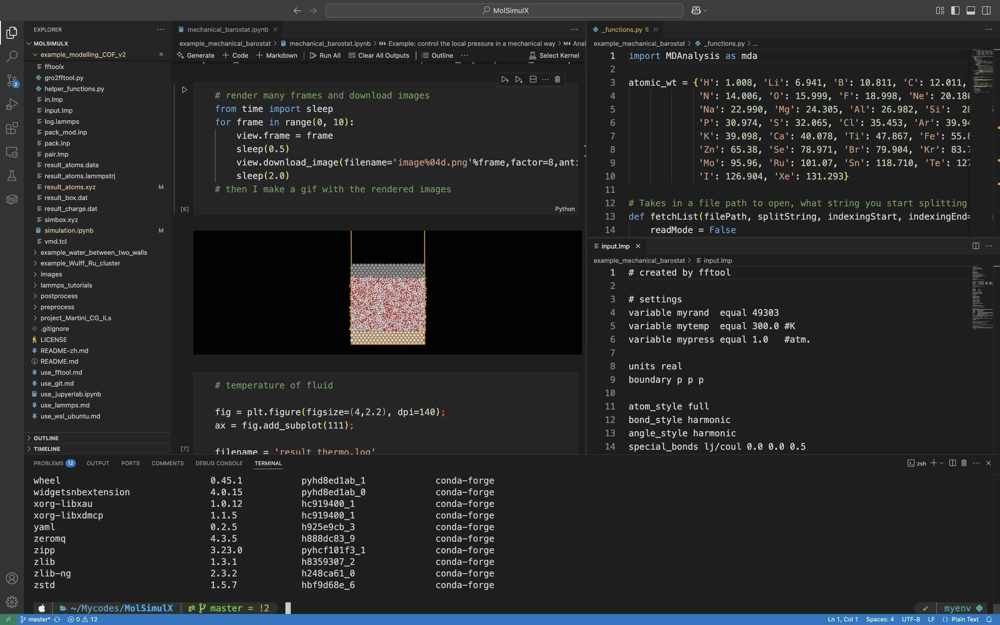
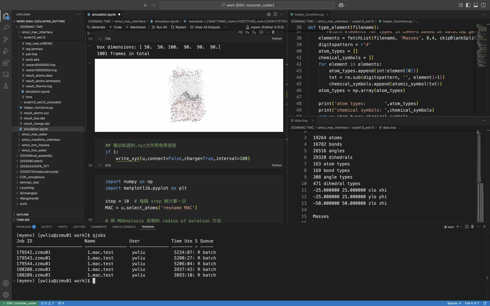

> **系列标签：** `技术文档` · `平台搭建` · `MolSimulX` · `环境配置`

做分子模拟，光会跑软件还不够——你还需要一套顺手的「工作台」：写脚本、管版本、装 Python 库、画轨迹图，有时还要连集群算大体系。

本文介绍一套跨平台（Mac / Ubuntu / Windows）工作平台怎么搭。核心组合是：**VSCode / Cursor**（写代码）+ **Git**（记版本）+ **Conda / Mamba**（管 Python 环境）+ **JupyterLab**（交互式分析）。装好后，建模、分析轨迹、出图这些常见活都能在同一套环境里完成。

**新电脑先打地基再读本文：** Mac / Ubuntu（含 WSL 里的 Ubuntu）见 [Mac与Ubuntu开发环境配置](T19-Mac与Ubuntu开发环境配置.md)（CLT、Homebrew、`apt` 基础包）；Windows 见 [WSL2安装与配置](T02-WSL2安装与配置.md)。各工具的日常用法另有专题教程；本文只讲**平台组件按什么顺序装**，以及分子模拟专用的 `myenv` 怎么一键部署。

**后续 MolSimulX 的案例与教程都默认你已具备这套平台。**



---

## 一、平台由哪些部分组成？

可以把整套平台想成一间「分子模拟工作室」：

| 组件                  | 含义                                       | 详细教程                                                                                            |
| ------------------- | ---------------------------------------- | ----------------------------------------------------------------------------------------------- |
| **终端 (Terminal)**   | 用文字下命令的窗口；装软件、连集群都从这里进                   | [Mac与Ubuntu开发环境配置](T19-Mac与Ubuntu开发环境配置.md)、[Linux终端与Shell简明教程](T03-Linux终端与Shell简明教程.md)、[SSH密钥与config配置简明教程](T08-SSH密钥与config配置简明教程.md) |
| **VSCode / Cursor** | 写 `.py`、跑 Notebook 的编辑器；也能远程连集群          | [VSCode与Cursor简明教程](T06-VSCode与Cursor简明教程.md)、[VSCode与Cursor远程连接集群](T07-VSCode与Cursor远程连接集群.md) |
| **Git**             | 项目的「时光机」，避免 `分析_最终版_v3.ipynb` 这种烂摊子      | [Git简明使用教程](T04-Git简明使用教程.md)                                                                   |
| **Conda / Mamba**   | 给每个项目单独隔一间「Python 小厨房」，依赖不打架             | [Conda与Mamba简明教程](T05-Conda与Mamba简明教程.md)                                                       |
| **JupyterLab**      | 浏览器或 VSCode / Cursor 里边写边跑的 Notebook 工作台 | [JupyterLab简明教程](T11-JupyterLab简明教程.md)                                                         |
| **myenv 环境**        | 本站预置好的分子模拟 Python 包合集                    | 本文第四节                                                                                           |

**一条典型一天：**

```
打开 VSCode/Cursor 项目 → 终端 conda activate myenv
→ 改 .py 或 .ipynb → 分析轨迹、画图 → git commit 存一版
→ 算力不够时 SSH 连集群，远程接着干
```

---

## 二、终端环境准备（跨平台）

装 Conda、连集群、提交作业，都离不开**终端**——就是那个黑底白字（或彩字）敲命令的窗口。按系统先把底座就绪，再回来装本节后面的工具：

| 系统 | 先做完 | 再继续本文 |
|------|--------|------------|
| **Mac / Ubuntu**（含 WSL 内 Ubuntu） | [Mac与Ubuntu开发环境配置](T19-Mac与Ubuntu开发环境配置.md)（CLT、Homebrew 或 `apt` 基础包） | 第三节起 |
| **Windows** | [WSL2安装与配置](T02-WSL2安装与配置.md)，之后按 Ubuntu | 第三节起（命令都在 WSL 里敲） |

命令怎么用见 [Linux终端与Shell简明教程](T03-Linux终端与Shell简明教程.md)。下面只需记住：**改长期配置时写哪个文件**。

| Shell | 配置文件 | 说明 |
|-------|----------|------|
| **Zsh**（Mac 默认） | `~/.zshrc` | 把 `conda init`、别名、`brew shellenv` 等写这里 |
| **Bash**（多数 Ubuntu / WSL） | `~/.bashrc` | 同上 |
| **Bash**（少数 Mac） | `~/.bash_profile` | 看你实际用的是哪种 Shell |

> **Tips：** `~` 就是你家目录，相当于 Windows 的 `C:\Users\你`。

改完配置后，**重新开一个终端**，或执行：

```bash
source ~/.zshrc          # Zsh
source ~/.bashrc         # Bash (Ubuntu / WSL)
source ~/.bash_profile   # Bash (Mac)
```

> **可选：美化终端界面（可跳过）**
>
> 终端能否正常工作不取决于主题。若希望提示符更清晰、显示 Git 分支与 Conda 环境名，可组合 **zsh** + [oh-my-zsh](https://ohmyz.sh/) + [powerlevel10k](https://github.com/romkatv/powerlevel10k)：

```bash
# 1. 安装 oh-my-zsh（需联网；需已能用 curl / git，见上文底座文）
sh -c "$(curl -fsSL https://raw.githubusercontent.com/ohmyzsh/ohmyzsh/master/tools/install.sh)"

# 2. 安装 powerlevel10k 主题
git clone --depth=1 https://github.com/romkatv/powerlevel10k.git \
  ${ZSH_CUSTOM:-$HOME/.oh-my-zsh/custom}/themes/powerlevel10k
```

编辑 `~/.zshrc`，将 `ZSH_THEME="..."` 改为 `ZSH_THEME="powerlevel10k/powerlevel10k"`，执行 `source ~/.zshrc` 后按向导完成配置即可。Ubuntu 默认 bash 时可先 `sudo apt install zsh` 并 `chsh -s $(which zsh)` 再装。

Windows 用户在 VSCode / Cursor 里把集成终端切成 **WSL**（见 [VSCode与Cursor简明教程](T06-VSCode与Cursor简明教程.md) 第五节），不要长期在纯 PowerShell 里跟科学软件较劲。

---

## 三、基础工具安装（按顺序）

下面按**推荐顺序**装，每步装完用「验证」命令看一眼，确认没问题再往下走。

### 步骤 1：安装 VSCode 或 Cursor

| 工具 | 怎么装 |
|------|--------|
| **VSCode** | [官网](https://code.visualstudio.com/) 下载；Mac 也可 `brew install --cask visual-studio-code` |
| **Cursor** | [cursor.com](https://cursor.com) 下载；可一键导入 VSCode 的设置和扩展 |

**建议必装扩展：** Python、Jupyter；以后要连集群，再加 **Remote - SSH**。

更多编辑器技巧见 [VSCode与Cursor简明教程](T06-VSCode与Cursor简明教程.md)。

### 步骤 2：安装 Git

若已按 [Mac与Ubuntu开发环境配置](T19-Mac与Ubuntu开发环境配置.md)（或 Windows 的 [WSL2安装与配置](T02-WSL2安装与配置.md) + Ubuntu 节）打好底座，多半**已经有 `git`**。先验证：

```bash
git --version
```

没有的话，各平台补装方式见 [Git简明使用教程](T04-Git简明使用教程.md) 第二节。然后告诉 Git 你是谁（全局只需配一次；名字和邮箱会出现在 commit 记录里）：

```bash
git config --global user.name "你的名字"
git config --global user.email "你的邮箱"
```

邮箱建议与 GitHub / Gitee 注册邮箱一致。查看 / 修改配置、本仓库单独覆盖，以及 `commit` / `push` 日常用法，一律见 [Git简明使用教程](T04-Git简明使用教程.md)，本文不展开。

### 步骤 3：安装 Miniconda 与 Mamba

**Miniconda** 管 Python 环境；**Mamba** 是它的「加速版」安装器，装包快很多，后面会常用。

1. 下载安装 [Miniconda](https://www.anaconda.com/docs/getting-started/miniconda/install/overview)
2. 让终端「认识」conda（按你的 Shell 选一行）：

```bash
conda init zsh         # Mac / Ubuntu (Zsh)
conda init bash        # Ubuntu / WSL (Bash)
conda init powershell  # Windows PowerShell（未用 WSL 时；WSL 用户按 bash/zsh，见 [WSL2安装与配置](T02-WSL2安装与配置.md)）
```

3. **关掉终端再打开**（或新开一个标签），看到提示符前面有 `(base)` 就说明 conda 生效了。然后在 `base` 里装 Mamba：

```bash
conda install mamba -n base -c conda-forge
mamba --version
```

装环境、查包的细节见 [Conda与Mamba简明教程](T05-Conda与Mamba简明教程.md)。

---

## 四、分子模拟 Python 环境（myenv）

别往系统自带的 Python 里硬塞包——容易和别的软件冲突。建议单独建一个叫 **`myenv`** 的环境，专门放分子模拟用的分析、可视化库。

### 方式 A：一键部署（推荐）

我们准备好了 **`myenv.zip`**，里面是一份配好的 `myenv.yml`，下载解压后一条命令就能建好环境。不想下 zip 也可以看 **第五节** 自己一步步装。

📥 **[Python 虚拟环境配置文件包 (myenv.zip)](http://molsimulx.local/wp-content/uploads/2026/07/myenv.zip)** — 含预置 `myenv.yml`。

下载解压后，在终端执行：

```bash
cd /path/to/myenv.yml    # 替换为解压后文件所在目录
mamba env create -f myenv.yml
conda activate myenv
```

> **Tips：**
> - 安装时保持网络畅通；国内慢的话，可在 [Conda与Mamba简明教程](T05-Conda与Mamba简明教程.md) 第四节配镜像
> - 嫌每次手动 `conda activate myenv` 麻烦？把这一行写到 `~/.zshrc` 或 `~/.bashrc` 末尾，新开终端会自动进环境

这份 `myenv.yml` 里已经有 Python 3.12、JupyterLab 和第五节列的那些核心库。

### 方式 B：分步手动安装

想搞清楚每个包装来干什么，或者 zip 下载不方便，就按 **第五节** 自己敲命令。环境名同样叫 `myenv`，效果和方式 A 一样。

---

## 五、分步手动安装核心库

下面命令假设你已经会 `mamba` / `conda`；不会的话先看 [Conda与Mamba简明教程](T05-Conda与Mamba简明教程.md)。

```bash
mamba create -n myenv python=3.12 -y
conda activate myenv
```

### 1. JupyterLab

```bash
mamba install jupyterlab ipykernel -y
python -m ipykernel install --user --name myenv --display-name "Python (myenv)"
```

第二行让 VSCode / Jupyter 的下拉菜单里出现 **Python (myenv)** 可选。用法见 [JupyterLab简明教程](T11-JupyterLab简明教程.md)。

### 2. 科学计算与轨迹分析

确认终端前面有 `(myenv)`，再**一行一行**执行（可以整段复制，但出错时方便定位是哪一步）：

```bash
# 基础科学计算与绘图
mamba install numpy pandas scipy matplotlib -y

# 前端插件（部分可视化依赖）
mamba install nodejs -y

# MD 轨迹分析
mamba install -c conda-forge mdanalysis mdanalysistests -y

# 轨迹三维可视化（Jupyter 交互）
mamba install -c conda-forge nglview -y

# 轨迹分析与光线追踪渲染
mamba install -c conda-forge freud fresnel -y
```

### 3. 结构与可视化扩展（pip）

```bash
pip install py3Dmol pythreejs plato-draw   # 分子 / 粒子可视化
pip install ase                           # 原子结构建模
pip install packmol                       # 多组分混合体系构建
```

### 4. 选装

```bash
pip install wulffpack    # 晶体颗粒 Wulff 形状构造
```

### 5. 各库是干什么的？

| 库 | 含义 |
|----|----------|
| **NumPy / Pandas / SciPy** | 算数、整理表格、科学计算的基础砖块 |
| **Matplotlib** | 画二维曲线、散点图等 |
| **MDAnalysis** | 读 MD 轨迹（xtc、dcd 等），算 RDF、扩散等 |
| **nglview** | 在 Notebook 里转着看三维轨迹 |
| **freud / fresnel** | 更高级的轨迹统计和渲染 |
| **py3Dmol / pythreejs** | 轻量级分子、晶体结构可视化 |
| **ASE** | 搭原子、纳米、晶体结构 |
| **Packmol** | 把很多分子「塞进」一个盒子里做初始结构 |
| **wulffpack** | 晶体颗粒形貌（选装） |

具体参数和 API 以各包官方文档为准。

---

## 六、和编辑器连上，跑一下试试

环境装好了，还要让 VSCode / Cursor **认到** `myenv`，不然它可能跑去用系统 Python。

### 1. 在 VSCode / Cursor 里选对环境

1. `Ctrl/Cmd + Shift + P` → 输入 **Python: Select Interpreter** → 选带 `myenv` 的那一项，例如 `Python 3.12.x ('myenv')`
2. 打开 `.ipynb` 时，右上角 **Select Kernel** → 选 **Python (myenv)**

图文步骤见 [VSCode与Cursor简明教程](T06-VSCode与Cursor简明教程.md) 第六、七节。

### 2. 快速自检（终端或 Notebook 里跑）

先确认用的是 `myenv`（终端提示符前应有 `(myenv)`）：

```bash
conda activate myenv
```

**终端里：** 先启动 Python，再贴下面几行（或把同样内容存成 `.py` 后执行 `python check_myenv.py`）：

```bash
python
```

进入 `>>>` 提示符后粘贴：

```python
import numpy as np
import MDAnalysis as mda
import nglview as nv
import ase
print("myenv OK:", np.__version__)
```

退出交互：`exit()` 或 `Ctrl+D`（Windows 上常为 `Ctrl+Z` 再回车）。

**Notebook 里：** 选好 **Python (myenv)** 内核后，把同样几行放进一个代码单元格运行即可，**不必**再先敲 `python`。

没有红字报错、能打印出版本号，就说明核心库 OK。

### 3. 启动 JupyterLab（可选）

喜欢在浏览器里写 Notebook 的可以：

```bash
conda activate myenv
cd /path/to/your/project
jupyter lab
```

终端会吐出一个 `http://127.0.0.1:8888/...` 链接，用浏览器打开即可。和 VSCode / Cursor 不冲突，`.ipynb` 文件两边都能开。

---

## 七、集群工作平台

课题组服务器、学校超算大多是 Linux。你可以在集群上也建一份同样的 `myenv`，本地用 **Remote - SSH** 连上去写代码、跑终端——就像远程桌面，但轻量很多。

> **外网要求：** 在集群上部署平台（`mamba env create -f myenv.yml`、装 Miniconda、首次 Remote SSH 下载 VS Code / Cursor Server）时，**登录节点需要能访问外网**，或管理员提供的校内软件源 / HTTP 代理。部分集群默认禁止出站，装之前先问管理员；连不上、下载一直转圈，也先查这一项。详见 [VSCode与Cursor远程连接集群](T07-VSCode与Cursor远程连接集群.md) 第一节。

### 1. 本地怎么连上去？

1. 在 VSCode / Cursor 里装好 **Remote - SSH** 扩展  
2. 按 [SSH密钥与config配置简明教程](T08-SSH密钥与config配置简明教程.md) 配好密钥和 `~/.ssh/config` 别名  
3. 连上后打开远程项目文件夹，终端里 `conda activate myenv`

更细的图文见 **[VSCode与Cursor远程连接集群](T07-VSCode与Cursor远程连接集群.md)**；怎么传轨迹见 [本地与集群文件传输](T09-本地与集群文件传输.md)；怎么交作业见 [集群与SLURM简明教程](T10-集群与SLURM简明教程.md)。



> 左下角出现 **SSH: 主机名** 就说明连上了；此时选的 Python 解释器、Notebook Kernel 都应该是**远程**的 `myenv`，不是本机的。

### 2. 登录节点 vs 计算节点（很重要！）

集群一般分两种机器，规矩不一样：

| 节点 | 可以干什么 | 不要干什么 |
|------|------------|------------|
| **登录节点** | 传文件、改代码、编译、`sbatch` 交作业 | 跑大轨迹分析、长时间 Jupyter、占满 CPU |
| **计算节点** | 重计算、交互式 Jupyter、VS Code Server | — |

**登录节点是「前台」，计算节点才是「厨房」。** 几 GB 的轨迹后处理、跑一整天的 Python，务必放到计算节点（通过 SLURM 等调度系统申请）。JupyterLab 和 VS Code Server 也要开在计算节点上，具体问集群管理员。

---

## 八、生态里还有哪些常用工具？

本站平台侧重 **Python 分析这条线**；真正跑 MD、写论文时，往往还会用到：

| 工具 | 含义 | 本站教程 |
|------|----------|----------|
| [Lammps](https://www.lammps.org/) | 经典分子动力学「发动机」 | [Lammps安装简明教程](T20-Lammps安装简明教程.md) |
| [VMD](https://www.ks.uiuc.edu/Research/vmd/) | 看轨迹、做分析的老牌可视化软件 | — |
| [Markdown](https://www.markdownguide.org/) | 写说明、记实验笔记的轻量格式 | [Markdown简明教程](T12-Markdown简明教程.md) |
| [LaTeX / Overleaf](https://www.overleaf.com/) | 写论文排版 | [LaTeX与Overleaf简明教程](T14-LaTeX与Overleaf简明教程.md) |
| [Obsidian](https://obsidian.md/) | 本地笔记库，适合攒文献和参数 | [Obsidian知识库搭建](T13-Obsidian知识库搭建.md) |

---

## 九、延伸阅读

本站教程在站点上按 **分类与标签** 浏览，不设全文总目录。对外短入口见 [资源导航](../资源导航.md)。

**与本文直接相关的下一步：**

| 主题 | 教程 |
|------|------|
| 概念（可选） | [分子动力学模拟概述](../00-知识文档/K02-分子动力学模拟概述.md)、[经典全原子力场](../00-知识文档/K03-经典全原子力场.md) |
| 版本与环境 | [Git简明使用教程](T04-Git简明使用教程.md)、[Conda与Mamba简明教程](T05-Conda与Mamba简明教程.md) |
| 编辑与 Notebook | [VSCode与Cursor简明教程](T06-VSCode与Cursor简明教程.md)、[JupyterLab简明教程](T11-JupyterLab简明教程.md) |
| 集群 | [SSH密钥与config配置简明教程](T08-SSH密钥与config配置简明教程.md)、[集群与SLURM简明教程](T10-集群与SLURM简明教程.md)、[VSCode与Cursor远程连接集群](T07-VSCode与Cursor远程连接集群.md) |
| ML 方向 | [机器学习与分子模拟导引](T30-机器学习与分子模拟导引.md) |

更完整的串联见文末「学习路径」；其余工具教程请在站点分类中按需打开。

---

## 十、常见问题

### 1. `conda env create` 很慢或失败

- 优先用 **mamba** 代替 conda；网络慢就配国内镜像（见 [Conda与Mamba简明教程](T05-Conda与Mamba简明教程.md) 第四节）
- 依赖冲突时，**新建环境**解决，别往 `base` 里硬装项目包

### 2. VSCode / Cursor 里找不到 myenv

多半是内核没注册。在终端执行：

```bash
conda activate myenv
python -m ipykernel install --user --name myenv --display-name "Python (myenv)"
```

然后**重启编辑器**，再选一次解释器 / Kernel。

### 3. `import MDAnalysis` 报错

十有八九是**用错 Python 了**。终端里 `which python` 应指向 `.../envs/myenv/...`；编辑器里选的解释器也要一致。

### 4. Windows 下部分 pip 包装不上

别和 PowerShell 较劲——进 **WSL** 按 Linux 流程装，和集群环境一致，省心很多。

### 5. Git 误把几 GB 轨迹提交上去了

在项目根目录加 `.gitignore`，把大轨迹挡在门外：

```gitignore
*.dcd
*.xtc
*.lammpstrj
__pycache__/
.ipynb_checkpoints/
```

更多 Git 习惯见 [Git简明使用教程](T04-Git简明使用教程.md)。

---

## 十一、小结

1. **平台组合**：终端 + VSCode/Cursor + Git + Conda/Mamba + JupyterLab + 专用环境 `myenv`。  
2. **搭建顺序**：本机底座（[Mac与Ubuntu开发环境配置](T19-Mac与Ubuntu开发环境配置.md) 或 [WSL2安装与配置](T02-WSL2安装与配置.md)）→ 编辑器与 Git → Miniconda + Mamba → `mamba env create -f myenv.yml`（或第五节手装）。  
3. **编辑器**：解释器和 Notebook Kernel 都选 **Python (myenv)**。  
4. **集群**：登录节点需能**访问外网**（或校内镜像）才能装 `myenv`、首次 Remote SSH；改代码用 Remote SSH，重活放**计算节点**。  
5. **卡住了**：把终端完整报错复制去搜，或翻对应工具的专题教程。

走完这些，本地和远程的分子模拟开发环境就齐了，可以开始跟 MolSimulX 的案例教程。

---

## 学习路径

**前置阅读：**

- [分子动力学模拟概述](../00-知识文档/K02-分子动力学模拟概述.md)（可选）
- Windows：[WSL2安装与配置](T02-WSL2安装与配置.md)
- Mac / Ubuntu：[Mac与Ubuntu开发环境配置](T19-Mac与Ubuntu开发环境配置.md)
- 本机装引擎：[Lammps安装简明教程](T20-Lammps安装简明教程.md)
- [Linux终端与Shell简明教程](T03-Linux终端与Shell简明教程.md)
- [SSH密钥与config配置简明教程](T08-SSH密钥与config配置简明教程.md)
- [Git简明使用教程](T04-Git简明使用教程.md)
- [Conda与Mamba简明教程](T05-Conda与Mamba简明教程.md)

**下一步（平台线）：**

- [VSCode与Cursor简明教程](T06-VSCode与Cursor简明教程.md)
- [JupyterLab简明教程](T11-JupyterLab简明教程.md) —— 工具操作；规范见 [Jupyter Notebook科研使用规范](T16-Jupyter Notebook科研使用规范.md)
- [本地与集群文件传输](T09-本地与集群文件传输.md) → [VSCode与Cursor远程连接集群](T07-VSCode与Cursor远程连接集群.md) → [集群与SLURM简明教程](T10-集群与SLURM简明教程.md)

**下一步（分析与示例）：**

- [NumPy与Matplotlib简明教程](T21-NumPy与Matplotlib简明教程.md)
- [MDAnalysis轨迹分析入门](../01-技术文档/T22-MDAnalysis轨迹分析入门.md)

**按需（工作流与写作 / 机器学习）：**

- [科研项目目录结构规范](T15-科研项目目录结构规范.md)、[从模拟到论文图的工作流](T18-从模拟到论文图的工作流.md)、[数据管理与备份](T17-数据管理与备份.md)
- [机器学习与分子模拟导引](T30-机器学习与分子模拟导引.md)
