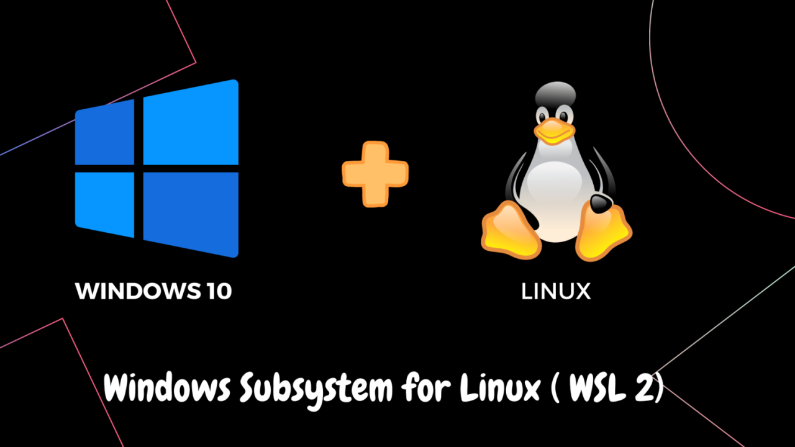
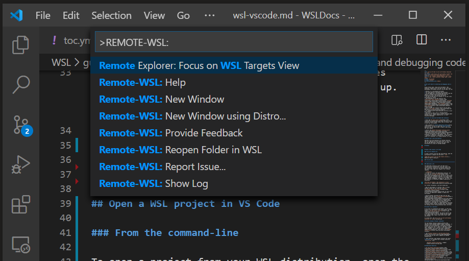
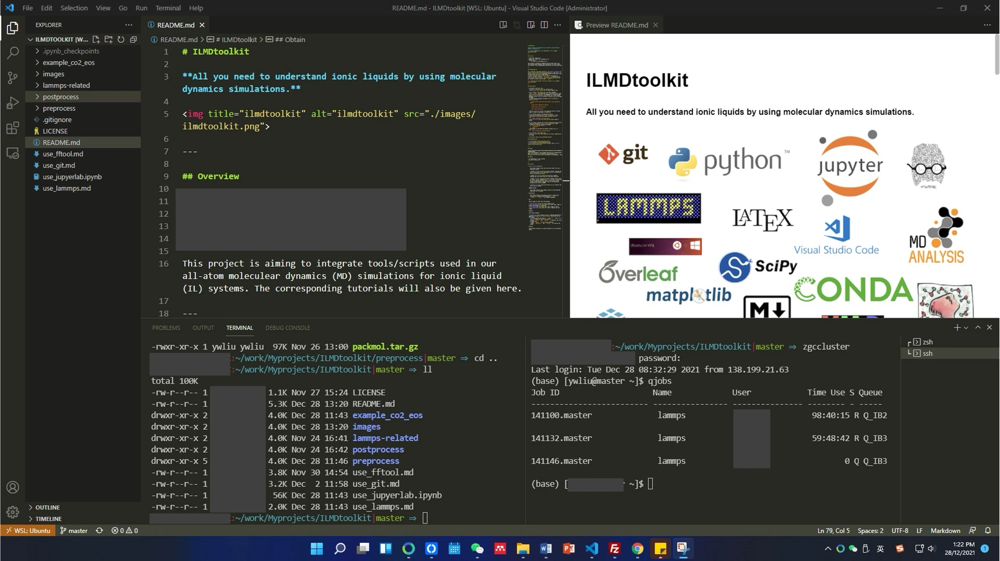

> **系列标签：** `技术文档` · `平台搭建` · `Windows` · `WSL2`

用 Windows 做分子模拟，经常会碰到这种事：教程里写的是 `apt install`、`bash`、`conda init bash`，你一打开却是 PowerShell，命令对不上，包装不上，连集群也别扭。

[**WSL 2**](https://learn.microsoft.com/en-us/windows/wsl/)（Windows Subsystem for Linux）帮你在 Windows 里「嵌」一套真正的 Ubuntu Linux。可以把它想成：**Windows 是外壳，WSL 是里面的 Linux 小房间**——Conda、Python、SSH、和 Mac / 服务器上的用法基本一致。

本文讲 WSL 2 怎么装、项目放哪、怎么和 VSCode / Cursor 连上。**Windows 用户**按文操作即可；Mac / 实体机 Ubuntu 用户请改看 [Mac与Ubuntu开发环境配置](T19-Mac与Ubuntu开发环境配置.md)，再回到 [分子模拟工作平台搭建](T01-分子模拟工作平台搭建.md)。



---

## 一、WSL 2 是什么？为啥推荐它？

| 对比 | WSL 1 | WSL 2 |
|------|-------|-------|
| 打个比方 | 把 Linux 命令「翻译」给 Windows | 在 Windows 里跑一个**真正的 Linux 内核**（轻量虚拟机） |
| 兼容性 | 一般，偶发奇怪问题 | **接近原生 Linux**，装科学软件省心 |
| 文件速度 | 访问 Windows 盘快 | 文件放在 Linux 家目录里更快 |

MolSimulX 推荐：**WSL 2 + Ubuntu**。后面所有「按 Linux 教程操作」的步骤，都在 WSL 的 Ubuntu 终端里做。

---

## 二、系统要求与安装

### 1. 先确认这几件事

- Windows 10（版本 2004 及以上）或 Windows 11
- 64 位系统
- BIOS 里打开了虚拟化（VT-x / AMD-V）；没开的话 `wsl --install` 可能报错

### 2. 一键安装（推荐，省事）

1. **右键「以管理员身份运行」** PowerShell 或 Windows 终端  
2. 输入下面一行，回车：

```powershell
wsl --install
```

默认会装 Ubuntu。跑完后**重启电脑**（很重要）。

### 3. 手动安装（老系统或想指定发行版）

```powershell
# 启用 WSL 相关功能
dism.exe /online /enable-feature /featurename:Microsoft-Windows-Subsystem-Linux /all /norestart
dism.exe /online /enable-feature /featurename:VirtualMachinePlatform /all /norestart
```

**重启**后执行：

```powershell
wsl --set-default-version 2
wsl --install -d Ubuntu
```

想看还有哪些 Linux 可装：`wsl --list --online`。

### 4. 第一次打开 Ubuntu

开始菜单里点 **Ubuntu**，按提示设一个 **Linux 用户名和密码**。

> **Tips：** 这个密码可以和 Windows 登录密码不同；输入时屏幕不显示字符，是正常的，输完回车即可。

验证是否装好：

```bash
uname -a
cat /etc/os-release    # 或 lsb_release -a（需 apt install lsb-release）
```

能看到 Linux / Ubuntu 字样就 OK。

---

## 三、常用 WSL 管理命令（在 PowerShell 里用）

```powershell
wsl --list --verbose      # 看装了哪些 Linux、是 WSL 1 还是 2
wsl --set-version Ubuntu 2   # 把某个发行版改成 WSL 2
wsl --shutdown            # 关掉所有 WSL（改内存配置后常要用）
wsl -d Ubuntu             # 启动 Ubuntu
```

确认列表里 `VERSION` 一列是 **`2`**，不是 `1`。

---

## 四、文件放哪？两套路径别搞混

WSL 和 Windows **各有一套文件系统**，混用容易慢、还容易路径搞错：

| 位置 | 在 Windows 资源管理器里怎么开 | 在 WSL 终端里路径 |
|------|------------------------------|-------------------|
| Linux 家目录（**推荐放项目**） | 地址栏输入 `\\wsl$\Ubuntu\home\你的用户名` | `~` 或 `/home/你的用户名` |
| Windows C 盘 | 照常打开 | `/mnt/c/Users/你的名字` |

**经验法则：**

- 代码、Conda 环境、经常读写的数据 → 放 **`~/projects`** 这类 Linux 路径里，快  
- **别**在 `/mnt/c/`（也就是 C 盘）下面建 Conda 环境、跑大量小文件——会明显变慢

```bash
mkdir -p ~/projects
cd ~/projects
```

---

## 五、在 WSL 里继续搭 MolSimulX 平台

WSL 里的 Ubuntu 终端打开后，**后面就和实体机 Ubuntu 用户一样了**：

1. [Mac与Ubuntu开发环境配置](T19-Mac与Ubuntu开发环境配置.md) 第三节 —— 装好 `apt` 基础包（`git`、`curl`、`build-essential` 等）
2. [Linux终端与Shell简明教程](T03-Linux终端与Shell简明教程.md) —— 先熟悉几条常用命令  
3. [分子模拟工作平台搭建](T01-分子模拟工作平台搭建.md) —— 装 Miniconda、myenv、编辑器等  
4. [Conda与Mamba简明教程](T05-Conda与Mamba简明教程.md) —— 环境管理细节

装好 Miniconda 后，默认 bash 用户执行：

```bash
# 示例：安装 Miniconda 后（默认 bash）
conda init bash
source ~/.bashrc
# 若已切换为 zsh（见下方 Tips），改执行：conda init zsh && source ~/.zshrc
```

> **Tips：** WSL 默认多是 **bash**，配置写在 `~/.bashrc`。想和 Mac 教程一样用 zsh，可以：
>
> ```bash
> sudo apt update && sudo apt install zsh -y
> chsh -s $(which zsh)    # 切换默认 Shell；关掉终端重新打开后生效
> ```
>
> `chsh` 时要输入 **WSL 用户密码**（就是第一次开 Ubuntu 时设的那个）。
>
> 之后执行 `conda init zsh`，再 `source ~/.zshrc`。终端美化（oh-my-zsh 等）见 [分子模拟工作平台搭建](T01-分子模拟工作平台搭建.md) 第二节，**可跳过**。

---

## 六、和 VSCode / Cursor 连上 WSL

### 1. 装扩展

在 VSCode / Cursor 扩展市场搜 **Remote - WSL**（Microsoft 出的，搜 **WSL** 也能找到）。和 [VSCode与Cursor简明教程](T06-VSCode与Cursor简明教程.md) 第四节一致。

### 2. 连上 WSL（图形界面）

1. 打开 VSCode / Cursor  
2. 点左下角绿色图标 → **Connect to WSL**  
3. 或者按 `Ctrl + Shift + P` 打开**命令面板**，输入 **`WSL: Connect to WSL`** 并选择  
4. **File → Open Folder** → 选 `~/projects/你的项目`





> 左下角显示 **WSL: Ubuntu** 就说明连上了。这时终端、Python、Git 用的都是 **Linux 里装的那套**，不是 Windows 自带的。

更多编辑器用法见 [VSCode与Cursor简明教程](T06-VSCode与Cursor简明教程.md)。

### 3. 从命令行进项目（可选）

```powershell
wsl
cd ~/projects/myproject
code .    # 用 VSCode 打开当前目录（需已装 Remote - WSL）
# cursor .  # Cursor 同理
```

> **Tips：** 如果提示找不到 `code` 命令，在 **Windows 侧**打开 VSCode，命令面板执行 **Shell Command: Install 'code' command in PATH**（Cursor 有类似选项）。WSL 里第一次跑 `code .` 时，扩展会自动在 Linux 侧配好启动脚本。

---

## 七、网络和 Windows 软件互通

- WSL 和 Windows **共用网络**，`localhost` 互通  
- 在 WSL 里 `jupyter lab` 启动后，用 **Windows 浏览器**打开终端里那行 `http://127.0.0.1:8888/...` 即可  
- 偶尔想调用 Windows 程序：在 WSL 里输入 `notepad.exe 文件名` 就能用记事本打开

---

## 八、常见问题

### 1. `wsl --install` 失败

- 把 Windows 更新到最新  
- 进 BIOS 确认虚拟化已开启  
- 公司电脑可能被组策略禁了，联系 IT

### 2. 显示还是 WSL 1

```powershell
wsl --set-version Ubuntu 2
```

转换可能要几分钟，耐心等。

### 3. Conda 在 C 盘 (`/mnt/c/`) 特别慢

把项目和环境挪到 `~/` 下，别放 Windows 盘。

### 4. WSL 占内存太多

在用户目录建或编辑 `%UserProfile%\.wslconfig`：

```ini
[wsl2]
memory=8GB
processors=4
```

保存后 PowerShell 执行 `wsl --shutdown`，再重新打开 WSL。

### 5. 怎么连集群？

在 WSL 里配 `~/.ssh/config` 和密钥，和 Linux 一模一样，见 [SSH密钥与config配置简明教程](T08-SSH密钥与config配置简明教程.md)。

---

## 九、小结

1. Windows 做科研，优先 **WSL 2 + Ubuntu**，别和 PowerShell 硬扛。  
2. 项目、Conda 环境放 **`~/`**，别放 `/mnt/c/`。  
3. VSCode / Cursor 用 **Remote - WSL**，体验和连 Linux 集群接近。  
4. 平台搭建、Git、conda 都在 **WSL 终端**里按 Linux 步骤做就行。

---

## 学习路径

**前置阅读：**

- 无（Windows 用户可以从本文开始）

**下一步：**

- [Mac与Ubuntu开发环境配置](T19-Mac与Ubuntu开发环境配置.md) —— WSL 内按 Ubuntu 节装底座
- [Linux终端与Shell简明教程](T03-Linux终端与Shell简明教程.md)
- [SSH密钥与config配置简明教程](T08-SSH密钥与config配置简明教程.md) —— 连集群 / Git 前建议完成
- [分子模拟工作平台搭建](T01-分子模拟工作平台搭建.md)
- [VSCode与Cursor简明教程](T06-VSCode与Cursor简明教程.md)
- [VSCode与Cursor远程连接集群](T07-VSCode与Cursor远程连接集群.md)
