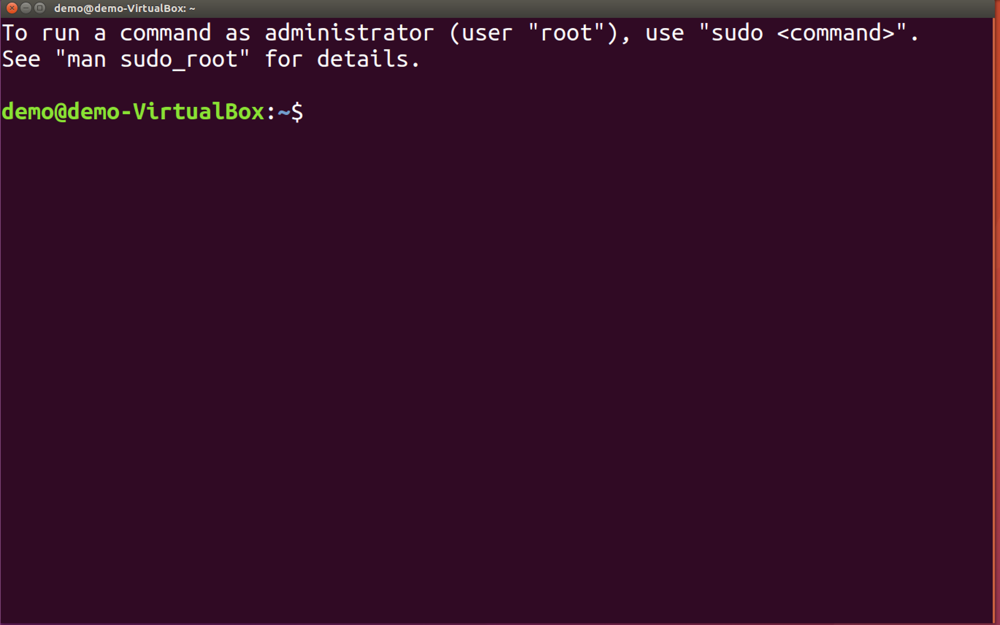

> **系列标签：** `技术文档` · `终端` · `Shell` · `命令行`

装 Conda、用 Git、连集群、看模拟日志——这些活都要在**终端**里敲命令完成。很多人第一眼觉得终端「黑乎乎很难」，其实日常科研用到的命令就二三十个，练几次就顺手了。

本文介绍 Mac / Linux / WSL 下最常用的终端操作，够你完成 [分子模拟工作平台搭建](T01-分子模拟工作平台搭建.md) 和后续连集群。Windows 用户请先在 WSL 里练（见 [WSL2安装与配置](T02-WSL2安装与配置.md)），命令和本文完全一致。



---

## 一、终端与 Shell 是什么？

| 概念 | 含义 |
|------|----------|
| **终端 (Terminal)** | 打字下命令的窗口：Mac「终端」、Ubuntu Terminal、WSL、VSCode 底部集成终端都算 |
| **Shell** | 真正「听懂」你命令的程序，常见有 **bash**、**zsh** |
| **提示符 (Prompt)** | 如 `user@host:~$`，表示「我准备好了，请输入」 |
| **主目录 `~`** | 你的「家」，Mac 在 `/Users/名字`，Linux 在 `/home/名字` |

Mac 新版默认 **zsh**；Ubuntu 多为 **bash**。命令本身通用，只是配置文件名字不同（第五节会讲）。

---

## 二、路径与目录操作

先弄清自己在哪、文件在哪——这是终端第一课。

```bash
pwd                    # 我在哪个文件夹？(Print Working Directory)
ls                     # 列出当前目录文件
ls -la                 # 详细列表（含隐藏文件）
cd /path/to/dir        # 进入某目录
cd ..                  # 上一级
cd ~                   # 回家目录
cd -                   # 回到上一次待的目录
```

**路径怎么写：**

| 写法 | 含义 |
|------|------|
| `/` 开头 | **绝对路径**，从根目录数起 |
| 不以 `/` 开头 | **相对路径**，从当前目录数起 |
| `~` | 你家目录 |
| `.` | 当前目录 |
| `..` | 上一级目录 |

**建文件夹、复制、移动、删除：**

```bash
mkdir project          # 新建文件夹
mkdir -p a/b/c         # 一次建好多级目录
cp file1 file2         # 复制文件
cp -r dir1 dir2        # 复制整个文件夹
mv old new             # 移动或重命名
rm file                # 删文件（删了找不回来，慎用）
rm -r dirname          # 删整个文件夹
```

> **Tips：** `rm -rf` 是「核弹级」删除，删前务必 `pwd` 和 `ls` 确认路径。模拟数据建议定期备份。

---

## 三、查看文件内容

改代码用编辑器；**瞄一眼日志**用终端更快：

```bash
cat file.txt           # 整个文件打到屏幕上
head -n 20 traj.log    # 看前 20 行
tail -n 50 traj.log    # 看后 50 行
tail -f job.out        # 实时盯着日志涨（跑作业时常用，Ctrl+C 停）
less bigfile.txt       # 分页翻看，按 q 退出
```

几百 MB 的轨迹文件别用 `cat` 硬刷，用 `head` / `less` 或 VSCode 打开。

---

## 四、重定向与管道

把命令的输出「导向」文件，或串起来用：

```bash
command > out.txt      # 输出写到文件（覆盖旧的）
command >> out.txt     # 追加到文件末尾
command 2> err.txt     # 只把报错信息写入文件
command > all.txt 2>&1 # 正常输出和报错都进同一个文件

ls -l | head -5        # 管道：前面命令的输出，喂给后面命令
grep "ERROR" log.txt   # 在文件里搜包含 ERROR 的行
grep -r "keyword" .    # 在当前目录及子目录里搜
```

**小例子：** 在 LAMMPS 日志里找势能行

```bash
grep "PotEng" log.lammps
```

---

## 五、环境变量与配置文件

环境变量告诉系统「去哪找程序」「一些默认设置是什么」。最常用的比如 `PATH`（系统按这个列表找 `python`、`conda` 等命令）。

```bash
echo $PATH             # 看 PATH（bash/zsh 通用）
echo $HOME             # 看家目录路径
export MY_VAR=hello    # 当前这个终端窗口里临时设变量
```

想**每次开终端都生效**，写进 Shell 配置文件：

| 系统 / Shell | 配置文件 |
|--------------|----------|
| Mac / Linux，**zsh** | `~/.zshrc` |
| Ubuntu，**bash** | `~/.bashrc` |
| Mac，**bash** | `~/.bash_profile` |

```bash
# 用 nano 或 VSCode 编辑
nano ~/.zshrc
# 或 code ~/.zshrc

# 改完后让配置立刻生效
source ~/.zshrc
```

你跑 `conda init` 时，conda 就是往这个文件里加了几行启动代码（详见 [Conda与Mamba简明教程](T05-Conda与Mamba简明教程.md)）。

**省事别名**（可选，追加到 `~/.zshrc`）：

```bash
alias ll='ls -la'
alias ..='cd ..'
```

---

## 六、权限与可执行脚本

Linux 里脚本默认可能不能双击运行，要先「允许执行」：

```bash
ls -l script.sh
# -rw-r--r--  表示还不能当程序跑
chmod +x script.sh     # 加上可执行权限
./script.sh            # 运行当前目录下的脚本
```

集群上交 LAMMPS 作业时，`.sh` 脚本也常要先 `chmod +x`，再用 `sbatch` 提交（见 [集群与SLURM简明教程](T10-集群与SLURM简明教程.md)）。

---

## 七、查找与进程

```bash
which python           # python 命令实际用的是哪一个
which conda
find . -name "*.lammpstrj"    # 在当前目录下找轨迹文件
ps aux | grep python          # 看有没有 python 在跑
top                  # 实时看 CPU/内存占用（q 退出）
kill 12345             # 结束某个进程（12345 是 PID，从 ps 里看）
```

模拟卡死了、想确认是不是自己的 Python 还在跑，这几条很实用。

---

## 八、网络和传文件（入门）

连集群、传脚本和轨迹的完整教程在 **[本地与集群文件传输](T09-本地与集群文件传输.md)**。这里先记三个最常用的：

```bash
ssh user@cluster.edu.cn      # 登录远程服务器
scp file.txt user@host:~/    # 把本地文件拷到远程
scp user@host:~/out.dat .    # 从远程拉回本地
```

目录很大、要断点续传，用 `rsync` 更合适，见 [集群与SLURM简明教程](T10-集群与SLURM简明教程.md) 与 [本地与集群文件传输](T09-本地与集群文件传输.md)。

SSH 密钥和 `~/.ssh/config` 别名怎么配，见 [SSH密钥与config配置简明教程](T08-SSH密钥与config配置简明教程.md)——配好后可以 `ssh 别名` 登录，省事很多。

---

## 九、Mac 和 Linux 有啥不一样？

日常科研命令（bash/zsh、git、conda、python）两边几乎一样。差别主要在装软件和默认 Shell：

| 项目 | Mac | Ubuntu / WSL |
|------|-----|----------------|
| 装软件 | Homebrew (`brew install`) | `sudo apt install` |
| 家目录 | `/Users/xxx` | `/home/xxx` |
| 默认 Shell | 多为 zsh | 多为 bash |
| 剪贴板 | `pbcopy` / `pbpaste` | 一般要装 `xclip` 或靠终端选中 |

新电脑怎么把 Homebrew / `apt` 底座装好，见 [Mac与Ubuntu开发环境配置](T19-Mac与Ubuntu开发环境配置.md)。Windows 用户：**别在原生 PowerShell 里硬练**，先进 WSL（[WSL2安装与配置](T02-WSL2安装与配置.md)），就和上表右侧一致了。

---

## 十、在 VSCode / Cursor 里用终端

编辑器底部的集成终端（`` Ctrl/Cmd + ` ``）就是一个 Shell 窗口，命令和系统终端**完全相同**。右上角下拉可以选 **zsh / bash / WSL**。

详见 [VSCode与Cursor简明教程](T06-VSCode与Cursor简明教程.md) 第五节。

---

## 十一、命令速查表

| 你想做的事 | 命令 |
|-----------|------|
| 我在哪 | `pwd` |
| 看文件列表 | `ls -la` |
| 进目录 | `cd 路径` |
| 建目录 | `mkdir -p 名` |
| 复制/移动 | `cp` / `mv` |
| 删文件 | `rm`（三思而后行） |
| 看文件头尾 | `head` / `tail` |
| 搜关键字 | `grep` |
| 命令装在哪 | `which` |
| 改长期配置 | 编辑 `~/.zshrc` 后 `source` |

---

## 十二、小结

1. **`cd`、`ls`、`cp`、`mv`** 够你管理项目文件夹了。  
2. **`grep`、`head`、`tail`** 适合查模拟日志。  
3. **`~/.zshrc`（或 `.bashrc`）** 是 conda、别名长期生效的地方。  
4. Mac、Ubuntu、WSL 命令通用；Windows 请先进 WSL 再练。

遇到报错，把终端**完整**报错信息复制去搜，通常很快能找到解决办法。

---

## 学习路径

**前置阅读：**

- Windows 用户：[WSL2安装与配置](T02-WSL2安装与配置.md)
- Mac / Ubuntu：[Mac与Ubuntu开发环境配置](T19-Mac与Ubuntu开发环境配置.md)（可选，先有终端也能读本文）
- 其他：可直接阅读本文

**下一步：**

- [SSH密钥与config配置简明教程](T08-SSH密钥与config配置简明教程.md) —— 连集群 / Git 前建议完成
- [分子模拟工作平台搭建](T01-分子模拟工作平台搭建.md) —— 在终端里完成平台安装
- [Git简明使用教程](T04-Git简明使用教程.md)
- [本地与集群文件传输](T09-本地与集群文件传输.md)
- [VSCode与Cursor远程连接集群](T07-VSCode与Cursor远程连接集群.md)
- [集群与SLURM简明教程](T10-集群与SLURM简明教程.md) —— 登录集群与提交作业
