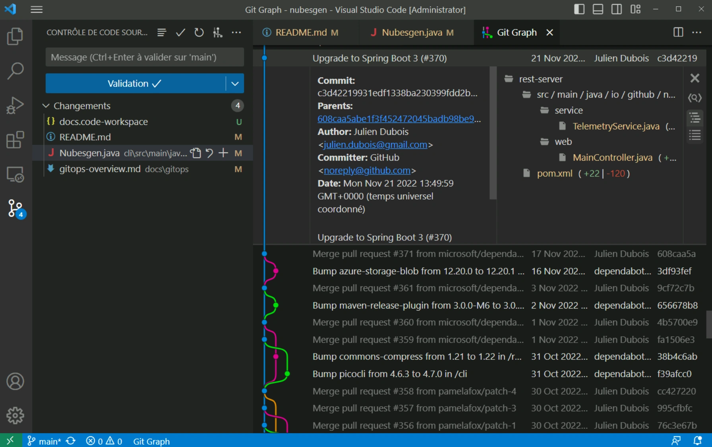

> **系列标签：** `技术文档` · `Git` · `版本控制` · `协作`

`in.npt` 改了三版、笔记本上的 `分析_最终版_v3.ipynb` 和队友手里的对不上——没有版本记录，半年后复现就全靠猜。Git 是当今最常用的**分布式版本控制系统**，帮你给项目拍「快照」、回溯历史、多人协作，也是 GitHub、Gitee 等远程仓库的基础。

学完能带走：确认本机已有 Git、完成姓名邮箱等基本配置，以及 `clone` / `commit` / `push` / `pull` 的日常协作套路。**新 Mac / Ubuntu 请先装好开发底座**（Command Line Tools、Homebrew 或 `apt` 基础包），见 [Mac与Ubuntu开发环境配置](T19-Mac与Ubuntu开发环境配置.md)，本文第二节只写「怎么确认 / 补装 Git」，不重复整段地基教程。项目目录怎么摆见 [科研项目目录结构规范](T15-科研项目目录结构规范.md)；几 GB 轨迹别硬 `git push`，分层规矩见 [数据管理与备份](T17-数据管理与备份.md)。Mac、Ubuntu、Windows 均可按文中步骤操作。


---

## 一、Git 是什么？为什么要学？

可以把 Git 想象成项目的「时光机」：

| 概念 | 含义 |
|------|----------|
| **仓库 (Repository)** | 一个项目的文件夹 + 完整修改历史 |
| **提交 (Commit)** | 给当前代码拍一张「快照」，附上说明 |
| **分支 (Branch)** | 在不影响主线的情况下，开辟一条独立开发线 |
| **远程仓库 (Remote)** | 放在 GitHub / Gitee 等网站上的备份，方便协作 |
| **克隆 (Clone)** | 把远程仓库完整复制到本地 |
| **推送 (Push)** | 把本地修改上传到远程 |
| **拉取 (Pull)** | 把远程最新修改下载到本地 |

分子模拟工作中，用 Git 管理脚本、配置文件和分析 notebook，可以避免「最终版_v3_真的最终版.ipynb」这类混乱。

---

## 二、各平台安装 Git

新电脑请先把本机开发底座配好，再确认 `git` 可用：

| 系统 | 底座 | 本文只需 |
|------|------|----------|
| **Mac / Ubuntu**（含 WSL 内 Ubuntu） | [Mac与Ubuntu开发环境配置](T19-Mac与Ubuntu开发环境配置.md) | 验证 `git --version`；没有再按下面补装 |
| **Windows** | 推荐 [WSL2安装与配置](T02-WSL2安装与配置.md) 后按 Ubuntu；或装官方 Git for Windows | 见本节第 3 小节 |

### 1. Mac

若已装好 **Xcode Command Line Tools**，系统通常自带 `git`：

```bash
git --version
```

没有输出或提示未安装时，回到底座文装 CLT；装完再跑一次上面的命令。需要**更新版 Git**、或希望用 Homebrew 统一管理时：

```bash
brew install git
git --version          # PATH 里 brew 优先时，会显示 Homebrew 版
```

Homebrew 本身的安装与 PATH 见 [Mac与Ubuntu开发环境配置](T19-Mac与Ubuntu开发环境配置.md)，此处不重复。

### 2. Ubuntu / Linux

底座文里的 `apt install` 基础包一般已含 `git`。若尚未安装：

```bash
sudo apt update
sudo apt install git -y
git --version
```

其他发行版可用对应包管理器，例如 Fedora：`sudo dnf install git`。

### 3. Windows

**方式一：官方安装包（推荐仅本机、不用 WSL 时）**

1. 访问 [https://git-scm.com/download/win](https://git-scm.com/download/win) 下载安装程序
2. 安装时大部分选项保持默认即可；建议勾选 **「Git Bash」**，方便运行与 Linux/Mac 一致的命令
3. 安装完成后，打开 **Git Bash** 或 VSCode 内置终端，运行：

```bash
git --version
```

**方式二：通过 WSL（适合分子模拟用户）**

若已按 [WSL2安装与配置](T02-WSL2安装与配置.md) 装好 WSL 2 + Ubuntu，在 WSL 终端中按上一小节 Ubuntu 步骤安装（或直接跟 [Mac与Ubuntu开发环境配置](T19-Mac与Ubuntu开发环境配置.md) 的 Ubuntu 节装齐基础包）。后续 `git` 命令与 Linux 完全一致。

> **Tips：** Windows 用户日常可在 VSCode 终端里切换为 **Git Bash** 或 **WSL**，避免 PowerShell 与部分脚本的兼容问题。
---

## 三、初次配置：告诉 Git 你是谁

安装后配置一次（**全局**生效，对本机所有仓库默认适用）：

```bash
git config --global user.name "你的名字"
git config --global user.email "你的邮箱"
```

邮箱建议与 GitHub / Gitee 注册邮箱一致，便于关联提交记录。名字和邮箱会出现在每次 `commit` 里。

### 查看配置信息

```bash
git config --global user.name          # 查看全局名字
git config --global user.email         # 查看全局邮箱
git config --global --list             # 列出全部全局配置
git config --list                      # 列出当前生效配置（全局 + 本仓库覆盖项）
git config --list --show-origin        # 同上，并显示每条配置来自哪个文件
```

在某个项目目录里执行时，`--list` 会合并「全局默认」和「仅本仓库」的设置；同名项以本仓库为准。

### 修改名字或邮箱

再执行一遍 `git config` 即可**覆盖**旧值，不必先删：

```bash
git config --global user.name "新名字"
git config --global user.email "新邮箱@example.com"
```

改完用上面的查看命令确认一眼。

只改**某一个项目**（例如个人仓库用私人邮箱、课题组仓库用学校邮箱），进入该项目后去掉 `--global`：

```bash
cd /path/to/your/project
git config user.name "仅本仓库用的名字"
git config user.email "仅本仓库用的邮箱"
git config --local --list              # 只看本仓库里的配置
```

| 范围 | 命令里 | 作用 |
|------|--------|------|
| **全局** | `--global` | 本机默认；写在 `~/.gitconfig` |
| **本仓库** | 不加，或 `--local` | 只影响当前项目；写在该仓 `.git/config` |

> **Tips：** 已经 `commit` 出去的历史记录不会因为你改了 `user.name` 而自动改写；新配置只影响**之后**的提交。若误用错邮箱刚提交、尚未 push，进阶可用 `git commit --amend` 等修正（见第八节）；已推远程的改历史要谨慎。

### 可选：设置默认分支名为 main

```bash
git config --global init.defaultBranch main
```

### 可选：记住凭据（减少重复输入密码）

```bash
git config --global credential.helper store
```

> 更安全的做法是使用 **SSH 密钥**（见 [SSH密钥与config配置简明教程](T08-SSH密钥与config配置简明教程.md) 与下文第五节），一次配置，长期使用。

---

## 四、从零开始：初始化本地仓库

### 场景 A：已有项目文件夹，想纳入 Git 管理

```bash
cd /path/to/your/project    # 进入项目目录
git init                    # 初始化，生成隐藏的 .git 文件夹
git status                  # 查看当前状态（哪些文件被修改、未跟踪）
```

创建 `.gitignore` 文件，列出**不需要**纳入版本控制的文件，例如：

```gitignore
# Python
__pycache__/
*.pyc
.env

# Jupyter
.ipynb_checkpoints/

# 大文件 / 模拟轨迹（按需添加）
*.dcd
*.xtc
```

第一次提交：

```bash
git add .                   # 将所有变更加入「暂存区」
git commit -m "初始提交：项目说明"   # 正式拍快照
```

### 场景 B：从远程仓库开始（更常见）

见第六节 **Clone**。

### 理解三个区域

```
工作区（你编辑的文件）
    ↓  git add
暂存区（准备提交的内容）
    ↓  git commit
本地仓库（已保存的历史）
    ↓  git push
远程仓库（GitHub / Gitee 等）
```

---

## 五、连接 GitHub、Gitee 等远程平台

### 1. 注册账号

| 平台            | 地址                                       | 说明                |
| ------------- | ---------------------------------------- | ----------------- |
| **GitHub**    | [https://github.com](https://github.com) | 全球最大开源社区，国内访问可能较慢 |
| **Gitee（码云）** | [https://gitee.com](https://gitee.com)   | 国内平台，访问速度快        |
| **GitLab**    | [https://gitlab.com](https://gitlab.com) | 常见于企业自建或科研组内部     |

流程类似：注册 → 登录 → 点击「新建仓库」→ 填写名称 → 创建（可先不勾选自动生成 README，便于与本地已有项目关联）。

### 2. HTTPS 方式（简单，适合入门）

远程地址形如：

```
https://github.com/用户名/仓库名.git
https://gitee.com/用户名/仓库名.git
```

关联本地仓库：

```bash
git remote add origin https://github.com/你的用户名/你的仓库名.git
git remote -v    # 查看已配置的远程地址
```

首次 `git push` 时，浏览器或终端会提示登录；Gitee/GitHub 现已普遍要求使用**个人访问令牌 (Personal Access Token)** 代替密码：

- GitHub：Settings → Developer settings → Personal access tokens
- Gitee：设置 → 私人令牌

将令牌粘贴为密码即可（只需记一次，若启用了 credential.helper）。

### 3. SSH 方式（推荐，长期使用）

密钥生成、`~/.ssh/config` 与权限的完整说明见 **[SSH密钥与config配置简明教程](T08-SSH密钥与config配置简明教程.md)**。下面是在 GitHub / Gitee 上用的**最短路径**：

**第一步：生成密钥**

也可按 [SSH密钥与config配置简明教程](T08-SSH密钥与config配置简明教程.md) 里的详细步骤操作（含多密钥、权限排错等）。

```bash
ssh-keygen -t ed25519 -C "你的邮箱"
```

一路回车即可（默认保存在 `~/.ssh/id_ed25519`）；可为密钥设口令，也可留空。

**第二步：查看并复制公钥**

```bash
cat ~/.ssh/id_ed25519.pub
```

终端会输出一行以 `ssh-ed25519` 开头的文字，**整行复制**（从 `ssh-ed25519` 到末尾邮箱备注），待会粘贴到网站。

**第三步：添加到平台**

- **GitHub**：Settings → SSH and GPG keys → New SSH key → 粘贴公钥
- **Gitee**：设置 → SSH 公钥 → 添加公钥

**第四步：测试连接**

```bash
ssh -T git@github.com
ssh -T git@gitee.com
```

看到欢迎信息即表示成功。

**第五步：用 SSH 地址关联远程**

```bash
git remote set-url origin git@github.com:你的用户名/你的仓库名.git
# 或 Gitee：
# git remote set-url origin git@gitee.com:你的用户名/你的仓库名.git
```

---

## 六、常用命令：Clone、Pull、Push

### 1. Clone —— 第一次把项目拿到本地

```bash
git clone https://github.com/用户名/仓库名.git
cd 仓库名
```

SSH 方式：

```bash
git clone git@github.com:用户名/仓库名.git
```

`clone` 会自动配置好 `origin` 远程，并拉取全部历史，无需再 `git init`。

### 2. 日常修改与提交

```bash
git status                        # 看改了哪些文件
git diff                          # 看具体改动内容（可选）
git add 文件名                    # 添加单个文件
git add .                         # 添加所有改动
git commit -m "简短说明本次修改"   # 提交到本地仓库
```

提交说明要**简短、说清楚做了什么**，例如：`fix: 修正轨迹分析脚本的单位换算`、`add: 新增 LAMMPS 输入文件模板`。

### 3. Push —— 上传到远程

第一次推送并设置上游分支：

```bash
git push -u origin main
```

之后每次提交后：

```bash
git push
```

若远程已有新提交而本地落后，需先 Pull 再 Push（见下）。

### 4. Pull —— 下载远程最新内容

```bash
git pull
```

等价于 `git fetch`（获取远程更新）+ `git merge`（合并到当前分支）。

**协作黄金法则：** 开始工作前先 `git pull`，结束工作后 `git commit` + `git push`，减少冲突。

### 5. 查看历史与分支

```bash
git log --oneline -10    # 最近 10 条提交（简洁模式）
git branch               # 查看本地分支
git branch -a            # 查看所有分支（含远程）
```

---

## 七、分支与协作：Pull Request 工作流

多人协作时，一般不直接在 `main` 主分支上改代码，而是：**建分支 → 改代码 → 提交 → 发起合并请求**。

### 1. 创建并切换分支

```bash
git checkout -b feature/trajectory-analysis
# 或 Git 2.23+ 推荐：
git switch -c feature/trajectory-analysis
```

在分支上正常 `add`、`commit`、`push`：

```bash
git push -u origin feature/trajectory-analysis
```

### 2. Pull Request（PR）/ Merge Request（MR）

| 平台 | 名称 | 作用 |
|------|------|------|
| GitHub | **Pull Request (PR)** | 请求把分支合并进主分支 |
| Gitee | **Pull Request** | 同上 |
| GitLab | **Merge Request (MR)** | 同上 |

**典型流程：**

1. 在网页端打开你的仓库，通常会提示「Compare & pull request」
2. 选择：从 `feature/xxx` 合并到 `main`
3. 填写说明：做了什么、如何测试
4. 指定审查人（如有），等待 Code Review
5. 审查通过后点击 **Merge**，合并进主分支
6. 本地切回主分支并更新：

```bash
git switch main
git pull
git branch -d feature/trajectory-analysis   # 删除已合并的本地分支（可选）
```

### 3. Fork 工作流（参与别人的开源项目）

若你没有原仓库的写权限：

1. 在 GitHub/Gitee 页面点击 **Fork**，复制到你账号下
2. `git clone` 你的 Fork
3. 添加上游仓库：`git remote add upstream https://github.com/原作者/原仓库.git`
4. 新建分支、修改、`commit`、`push` 到你的 Fork
5. 在网页发起 PR，请求合并到**原仓库**

同步上游更新：

```bash
git fetch upstream
git switch main
git merge upstream/main
git push
```

---

## 八、常见问题与实用技巧

### 1. 提交错了怎么办？

**仅改最后一次提交说明：**

```bash
git commit --amend -m "新的说明"
```

**撤销工作区未 add 的修改（危险，会丢失改动）：**

```bash
git checkout -- 文件名
# 或 Git 2.23+：
git restore 文件名
```

**已 add 但未 commit，取消暂存：**

```bash
git reset HEAD 文件名
# 或：
git restore --staged 文件名
```

### 2. 怎么回溯到某一版代码？

先看清历史，再决定「只看一眼」还是「真改回去」：

```bash
git log --oneline -20          # 最近提交；左边一串字符是 commit 编号（hash）
git show abc1234               # 把 abc1234 换成真实 hash，查看那次改了什么
```

| 你想做的事 | 推荐做法 | 注意 |
|------------|----------|------|
| **某个文件**恢复成旧版样子（保留其它文件现状） | `git restore --source=abc1234 -- 文件名` | 改的是工作区；需要留档再 `add` + `commit` |
| **整份项目**暂时回到旧提交「只读参观」 | `git switch --detach abc1234` | 游离态；看完用 `git switch 分支名` 回分支，勿在此乱提交 |
| **还没 push**，丢掉最近几次本地提交 | `git reset --hard abc1234` | **危险**：该点之后的本地提交与未提交改动会丢；确认 hash 无误再执行 |
| **已经 push**，公开历史上「撤销某次坏提交」 | `git revert abc1234` 再 `git push` | 会**新产生一次提交**来抵消坏改动，不改写远程历史，协作更安全 |

**只还原一个文件到某次提交（常用）：**

```bash
git log --oneline -- 路径/分析脚本.py    # 先找与该文件有关的提交
git restore --source=abc1234 -- 路径/分析脚本.py
git add 路径/分析脚本.py
git commit -m "restore: 将分析脚本恢复到 abc1234 时的版本"
```

**已推送到远程时，用 revert（推荐）：**

```bash
git revert abc1234                 # 打开编辑器写说明，或加 -m 一次完成
# 若该提交是合并提交，需指定父节点，入门阶段可先问熟手
git push
```

**尚未推送、自己仓库且确定不要中间几版时：**

```bash
git reset --hard abc1234           # 分支指针回到该提交；其后本地提交消失
```

> **Tips：**  
> - `reset --hard` 像「时光倒流并扔掉胶卷」；`revert` 像「在片尾加一段更正声明」。多人共用远程时，优先 `revert`。  
> - 图形界面：源代码管理 → **…** → **查看历史 / Checkout 到…**（名称因 VSCode/Cursor 版本略有不同）；危险操作前先 `git status`、必要时另开分支备份：`git branch backup-年月日`。

### 3. 合并冲突 (Conflict)

当两人改了同一处，Git 无法自动合并时，文件中会出现：

```
<<<<<<< HEAD
你的内容
=======
别人的内容
>>>>>>> branch-name
```

手动编辑保留正确内容，删除冲突标记，然后：

```bash
git add .
git commit -m "resolve: 解决合并冲突"
```

### 4. 大文件与 Git LFS

模拟轨迹、结构文件往往很大，不宜直接放进普通 Git 仓库。可使用 [Git LFS](https://git-lfs.com/)：

```bash
git lfs install
git lfs track "*.dcd"
git add .gitattributes
```

科研组内部也常把大文件放网盘或集群，仓库里只保留路径说明。

### 5. 想确认或改掉名字 / 邮箱

```bash
git config --global user.name            # 查看
git config --global user.name "新名字"   # 修改（覆盖）
git config --global --list               # 总览全局项
```

只影响某个仓库时，去掉 `--global`（见第三节）。改配置**不会**自动改写已经提交的历史。

### 6. 在 VSCode / Cursor 中使用 Git

[VSCode](https://code.visualstudio.com/) 和 [Cursor](https://cursor.com/) 都内置了 Git 图形界面，操作方式几乎相同（Cursor 基于 VSCode 开发，继承了同一套源代码管理功能）。不想记命令时，可以直接用界面完成日常协作。

#### 打开源代码管理面板

- 点击左侧边栏的 **「源代码管理」** 图标（分支形状），或快捷键：
  - Mac：`Control + Shift + G`
  - Windows / Linux：`Ctrl + Shift + G`



#### 常用图形化操作

| 界面操作 | 等价命令 | 说明 |
|----------|----------|------|
| 文件旁的 `+` 号 | `git add 文件名` | 将改动加入暂存区 |
| 「更改」标题旁的 `+` | `git add .` | 暂存所有改动 |
| 输入框写说明 → 点击 ✓ | `git commit -m "说明"` | 提交到本地仓库 |
| 顶部 `...` 菜单 → 推送 | `git push` | 上传到远程 |
| 顶部 `...` 菜单 → 拉取 | `git pull` | 下载远程更新 |
| 左下角分支名 → 创建/切换分支 | `git switch -c` / `git switch` | 分支管理 |
| 点击文件名查看 diff | `git diff` | 对比修改前后内容 |

#### 克隆仓库

- **命令面板**（Mac：`Command + Shift + P`；Windows：`Ctrl + Shift + P`）→ 输入 `Git: Clone` → 粘贴仓库地址 → 选择本地保存路径。

#### 解决冲突

发生冲突时，编辑器会在文件中高亮冲突区域，并提供 **「采用当前更改」「采用传入的更改」「保留双方」** 等按钮，比手动删 `<<<<<<<` 标记更直观。处理完后暂存并提交即可。

#### Cursor 使用 Git 的补充说明

Cursor 在 Git 能力与 VSCode 一致的基础上，还有几点值得注意：

1. **AI 修改也要走 Git 流程**  
   Agent 或对话帮你改动的文件，同样出现在「源代码管理」面板里。提交前建议逐文件查看 diff，确认改动符合预期，再 `commit` 和 `push`。

2. **用分支隔离 AI 实验**  
   让 Cursor 尝试较大改动时，可先 `git switch -c experiment/xxx` 开新分支。不满意时直接切回 `main`，避免污染主线。

3. **终端与界面可混用**  
   Cursor 内置终端（快捷键 `Ctrl + 反引号`，Mac 为 `Control + 反引号`）里执行的 `git` 命令与图形界面互通；在终端 `git push`，界面状态会同步更新。

4. **远程开发**  
   与 VSCode 一样，可安装 **Remote - SSH** 等扩展，在集群上编辑代码并用同一套 Git 面板提交（参见 [集群与SLURM简明教程](T10-集群与SLURM简明教程.md) 与 [分子模拟工作平台搭建](T01-分子模拟工作平台搭建.md)）。

> **Tips：** 图形界面适合日常提交；复杂操作（如 `rebase`、解决棘手冲突、Fork 同步 upstream）仍建议在终端执行，可控性更高。两者可以搭配使用。

### 7. 命令速查表

| 你想做的事 | 命令 |
|-----------|------|
| 查看 / 设置全局姓名邮箱 | `git config --global user.name` / `user.email`（加 `"值"` 为写入） |
| 列出配置 | `git config --global --list` 或 `git config --list --show-origin` |
| 初始化仓库 | `git init` |
| 克隆远程仓库 | `git clone <url>` |
| 查看状态 | `git status` |
| 暂存改动 | `git add .` |
| 提交 | `git commit -m "说明"` |
| 推送到远程 | `git push` |
| 拉取远程更新 | `git pull` |
| 查看历史 | `git log --oneline -20` |
| 某文件回到旧提交 | `git restore --source=<hash> -- 文件` |
| 未推送时硬回退 | `git reset --hard <hash>`（危险） |
| 已推送时撤销某提交 | `git revert <hash>` |
| 新建分支 | `git switch -c 分支名` |
| 切换分支 | `git switch 分支名` |
| 查看远程 | `git remote -v` |

---

## 九、推荐学习资源

- [Pro Git 中文版](https://git-scm.com/book/zh/v2) —— 权威且免费，由浅入深
- [GitHub Docs 中文](https://docs.github.com/zh) —— 官方协作与 PR 说明
- [Gitee 帮助中心](https://gitee.com/help) —— 国内平台操作指南
- [Learn Git Branching](https://learngitbranching.js.org/?locale=zh_CN) —— 可视化练习分支（浏览器互动）

---

## 十、小结

1. **安装**：先完成 [Mac与Ubuntu开发环境配置](T19-Mac与Ubuntu开发环境配置.md)（或 Windows 的 WSL / 官方安装包），确认 `git --version`；缺了再按第二节补装。  
2. **配置**：设好 `user.name` / `user.email`；会用 `git config` **查看**与**修改**（全局 `--global` 或本仓库）；推荐 SSH 密钥连接远程。
3. **本地流程**：`init` → `add` → `commit`。
4. **远程协作**：`clone` / `pull` / `push`；用分支 + Pull Request 合并代码。
5. **回溯**：先 `git log`；单文件用 `restore --source`；未 push 可用 `reset`；已 push 优先 `revert`。
6. **习惯**：先 pull 再改，小步提交，写清楚 commit message。

掌握以上步骤，就足以管理个人项目、参与课题组代码协作，以及在 GitHub/Gitee 上浏览和贡献开源分子模拟相关工具。遇到具体报错时，把终端完整错误信息复制到搜索引擎，通常能快速找到解决办法。

---

## 学习路径

**前置阅读：**

- [Mac与Ubuntu开发环境配置](T19-Mac与Ubuntu开发环境配置.md)（新 Mac / Ubuntu；Windows 先 [WSL2安装与配置](T02-WSL2安装与配置.md)）
- [Linux终端与Shell简明教程](T03-Linux终端与Shell简明教程.md)
- [分子模拟工作平台搭建](T01-分子模拟工作平台搭建.md)（第三节）

**下一步：**

- [科研项目目录结构规范](T15-科研项目目录结构规范.md)
- [VSCode与Cursor简明教程](T06-VSCode与Cursor简明教程.md) —— 图形化 Git 操作
- [Obsidian知识库搭建](T13-Obsidian知识库搭建.md) —— 用 Git 管理笔记库
