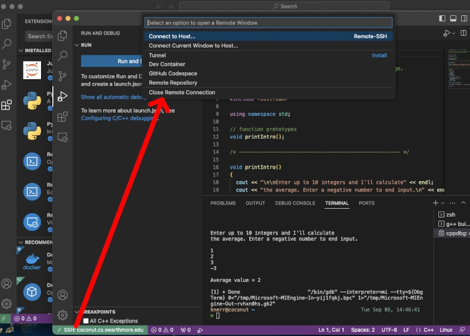

> **系列标签：** `技术文档` · `VSCode` · `Cursor` · `Remote SSH`

在本地用 **VSCode** 或 **Cursor** 通过 **Remote - SSH** 连上集群，可以像编辑本地项目一样：浏览远程文件、开终端、`git`、跑 Jupyter、选远程 Conda 环境——不用来回 `scp` 代码，也不用在登录节点上苦手搓 `vim`。

本文是 Remote SSH 的**专题实操**：怎么配、怎么连、连上后怎么选对 Python 和 Kernel。编辑器总览见 [VSCode与Cursor简明教程](T06-VSCode与Cursor简明教程.md)，SSH 密钥与 `config` 见 [SSH密钥与config配置简明教程](T08-SSH密钥与config配置简明教程.md)，传文件见 [本地与集群文件传输](T09-本地与集群文件传输.md)，交作业见 [集群与SLURM简明教程](T10-集群与SLURM简明教程.md)。

学完能带走：从装 Remote SSH 扩展、写 `config` 别名，到连上集群、选对远程 Conda 环境和 Jupyter Kernel 的一整套步骤，以及登录节点上哪些活能干、哪些别硬跑。本地装编辑器、配插件看 [VSCode与Cursor简明教程](T06-VSCode与Cursor简明教程.md)；钥匙和别名是一次性前置，见 [SSH密钥与config配置简明教程](T08-SSH密钥与config配置简明教程.md)。

| 你想… | 看这篇还是姊妹篇 |
|--------|------------------|
| Remote SSH 连集群、选 Kernel | **本篇** |
| 本地装编辑器、常用插件 | [VSCode与Cursor简明教程](T06-VSCode与Cursor简明教程.md) |
| 生成密钥、写 `~/.ssh/config` | [SSH密钥与config配置简明教程](T08-SSH密钥与config配置简明教程.md) |



---

[erphpdown]

## 一、原理：连上后发生了什么？

可以这么理解：**你的屏幕和键盘在本地，真正干活的是集群上的 Linux**。

```
┌─────────────────┐         SSH          ┌─────────────────────────────┐
│  你的电脑        │ ◄──────────────────► │  集群登录节点                │
│  VSCode/Cursor  │                      │  ~/.vscode-server/ 或       │
│  （界面、插件）   │                      │  ~/.cursor-server/（自动安装）│
└─────────────────┘                      │  你打开的项目文件夹            │
                                         └─────────────────────────────┘
```

- **界面**在本地；**文件读写、终端命令、Python** 在远程执行  
- 首次连接时，编辑器会在远程用户目录自动安装 **VS Code Server**（Cursor 为 **Cursor Server**），从外网下载组件，通常等一两分钟  
- 默认连到的是**登录节点**——适合改代码、`git`、`sbatch` 交作业，不适合长时间跑重计算（见第七节）

> **Tips：** 集群登录节点需要能**访问外网**（或站点提供的软件下载代理），才能完成 Server 首次安装。若一直卡在「Setting up SSH Host」，先问管理员：登录节点是否允许出站下载、是否需配置 HTTP 代理。在集群上 `mamba env create` 装 `myenv` 同样需要外网或校内镜像，见 [分子模拟工作平台搭建](T01-分子模拟工作平台搭建.md) 第七节。

---

## 二、准备工作

### 1. 本机已能 SSH 登录集群

先在**本机终端**试一把，能上去再开编辑器：

```bash
ssh your_username@cluster.university.edu.cn
```

若还不行，见 [SSH密钥与config配置简明教程](T08-SSH密钥与config配置简明教程.md)。

### 2. 安装编辑器与扩展

| 软件 | 扩展 |
|------|------|
| **VSCode** | [Remote - SSH](https://marketplace.visualstudio.com/items?itemName=ms-vscode-remote.remote-ssh)（Microsoft） |
| **Cursor** | 同样安装 **Remote - SSH**（扩展市场与 VSCode 兼容） |

建议一并装上 **Python**、**Jupyter**——远程跑 Notebook 时要用。

### 3. Windows 用户

在 **WSL** 内装 VSCode/Cursor 并配 SSH，或 Windows 版编辑器 + 本机 `C:\Users\你\.ssh\config`。  
推荐 WSL 路线，和集群 Linux 环境一致（[WSL2安装与配置](T02-WSL2安装与配置.md)）。

### 4. 集群侧（首次使用前）

SSH 登录集群后，建好项目目录；若还没部署 `myenv`，可一并创建（需登录节点能连外网或镜像源）：

```bash
ssh cluster
mkdir -p ~/project
# 可选：部署与本地相同的 Conda 环境（需外网或校内镜像，见 [分子模拟工作平台搭建](T01-分子模拟工作平台搭建.md) 第七节）
# mamba env create -f myenv.yml && conda activate myenv
```

完整环境清单见 [分子模拟工作平台搭建](T01-分子模拟工作平台搭建.md)。

---

## 三、配置 SSH 别名

完整字段说明、多集群与 `ProxyJump` 见 **[SSH密钥与config配置简明教程](T08-SSH密钥与config配置简明教程.md)**。常用示例：

```
Host molcluster
    HostName cluster.university.edu.cn
    User your_username
    IdentityFile ~/.ssh/id_ed25519
    ServerAliveInterval 60
    ServerAliveCountMax 3
```

| 字段 | 含义 |
|------|------|
| `Host` | 编辑器里显示的别名，随便起个好记的 |
| `HostName` | 集群真实地址 |
| `IdentityFile` | 私钥路径 |
| `ServerAliveInterval` | 每隔多少秒发心跳，防长时间空闲断线 |

多集群可写多段 `Host`（登录节点、数据传输节点等）。

**跳转登录（堡垒机）示例：**

```
Host molcluster
    HostName compute.login.cluster.edu
    User your_username
    ProxyJump bastion.university.edu
    IdentityFile ~/.ssh/id_ed25519
```

---

## 四、连接集群（分步操作）

### VSCode

1. 装好 **Remote - SSH**  
2. 点左下角 **><** → **Connect to Host…**  
3. 选 `molcluster`（或 **+ Add New SSH Host** 输入 `ssh user@host`）  
4. 新窗口打开 → 若密钥设了密码，按提示输入  
5. **File → Open Folder** → 如 `/home/you/project`  
6. 左下角出现 **SSH: molcluster** 即表示连上

### Cursor

1. 同样安装 **Remote - SSH**  
2. 左下角 **><** 或命令面板：`Remote-SSH: Connect to Host`  
3. 其余步骤与 VSCode 相同  
4. 首次可能提示在远程安装 Cursor Server，点同意并等待（需集群能访问外网下载）

### 命令面板常用项

记不住菜单位置时，`Ctrl/Cmd + Shift + P` 搜：

| 命令 | 干什么用 |
|------|----------|
| `Remote-SSH: Connect to Host` | 连接集群 |
| `Remote-SSH: Close Remote Connection` | 断开远程 |
| `Remote-SSH: Kill VS Code Server on Host` | Server 异常时删掉重装 |
| `Remote-SSH: Open SSH Configuration File` | 编辑 `~/.ssh/config` |

---

## 五、连接后必做配置

连上只是第一步；下面三项不对，就会出现「终端对了、Notebook 错了」或 `ModuleNotFoundError`。

### 1. 集成终端 = 远程 Shell

`` Ctrl/Cmd + ` `` 打开终端，提示符应是集群登录节点，不是本机：

```bash
hostname
pwd
conda activate myenv
```

这里跑的 `python`、`sbatch`、`git` 都在**远程**执行。

### 2. 选择远程 Python 解释器

1. `Ctrl/Cmd + Shift + P` → **Python: Select Interpreter**  
2. 选远程路径，如 `~/miniconda3/envs/myenv/bin/python`  
3. 状态栏应显示 `myenv` 或 `3.12.x ('myenv')`

验证一下路径别是本机的：

```python
import sys
print(sys.executable)   # 应含远程家目录，不是本机 /Users 或 C:\
```

### 3. 远程 Jupyter Notebook

1. 打开 `.ipynb`  
2. **Select Kernel** → `Python (myenv)`（必须是远程那条）  
3. 若列表为空，在**远程终端**执行：

```bash
conda activate myenv
python -m ipykernel install --user --name myenv --display-name "Python (myenv)"
```

重载窗口后再选 Kernel。

### 4. 项目级设置（可选）

在远程项目根目录建 `.vscode/settings.json`：

```json
{
  "python.defaultInterpreterPath": "~/miniconda3/envs/myenv/bin/python",
  "python.terminal.activateEnvironment": true
}
```

路径用远程家目录写法；提交 Git 前确认不含本机绝对路径（如 `/Users/你/...`）。

---

## 六、典型工作流

### 1. 日常链路

一条可复现的日常链路：

```
1. 本地打开 Cursor/VSCode → Connect to Host → 打开 ~/project
2. 改 lammps/in.npt、scripts/、notebooks/
3. 终端：sbatch lammps/job.slurm
4. squeue 看队列；tail -f *.out 盯日志
5. 分析：Notebook 或 python scripts/（轻量可在登录节点；
   大轨迹 MDAnalysis 申请计算节点，见下节）
6. git commit / push（远程需已配好 git 与 SSH 密钥）
```

目录怎么摆见 [科研项目目录结构规范](T15-科研项目目录结构规范.md)。

**和传文件的关系：** 日常改代码不必天天 `rsync`；**第一次**拷整个项目或大轨迹，仍用 [本地与集群文件传输](T09-本地与集群文件传输.md)。

### 2. tmux：SSH 断了，终端里的活还在

先分清两件事：

| 你在干什么 | SSH 断了之后 |
|-----------|-------------|
| 已经 `sbatch` 交出去的 Lammps | **还在跑**——作业归调度器管，跟你关不关终端无关 |
| 登录节点上**前台**跑的：`tail -f`、`mamba install`、没关的 `srun` 交互 shell | **多半会停**——SSH 会话一断，里面的进程常被一起带走 |

所以：**批处理靠 `sbatch`**；需要长时间占着终端盯日志、试命令、在 `srun` 里调试时，进 **`tmux`**（或老集群上的 `screen`）再干活——相当于在集群上开了一个「关盖也不休眠」的终端房间，断线后回来 `attach` 接着看。

**常用命令（`tmux`）：**

```bash
tmux new -s work              # 新建名叫 work 的会话
# … 在里面 sbatch、srun、tail -f …
# 按键：Ctrl+b 松开，再按 d        → detach，可以关 SSH 了

tmux ls                       # 回来先看有哪些会话
tmux attach -t work           # 重新连上 work
```

**多窗口调试（仍在 tmux 里）：**

| 操作 | 按键（先按 Ctrl+b 松开） |
|------|-------------------------|
| 新开一个窗口 | `c` |
| 下一个 / 上一个窗口 | `n` / `p` |
| 窗口里分屏（上下） | `"` |
| 在分屏间切换 | 方向键 |

典型用法：一个窗口 `squeue` + `tail -f *.out` 盯作业，另一个窗口改 `in` 文件或试小规模 `lmp`，第三个窗口 `rsync` 传文件——不用开三个 SSH 窗口乱成一团。

**`screen`（部分老机器只有它）：**

```bash
screen -S work        # 新建
# Ctrl+a 松开，再按 d   → detach
screen -r work        # 回来
```

> **Tips：** Remote SSH 的集成终端里也可以先 `tmux attach -t work` 再干活；编辑器断线重连后，终端里 attach 回同一会话即可。`sbatch` 交出去的大模拟不必包在 tmux 里；**交互式 `srun`、长时间 `tail -f`、登录节点装环境** 才值得用。详见 [集群与SLURM简明教程](T10-集群与SLURM简明教程.md) 第二节第 4 小节。

---

## 七、登录节点 vs 计算节点（重要）

Remote SSH **默认落在登录节点**。可以把它想成饭店**前台**：办手续、改订单行；真正炒菜要去**后厨**（计算节点）。

**登录节点通常可以：**

- 改文件、保存、`git`  
- `sbatch` / `qsub` 交作业  
- 短测试、`head` 看 log  
- 几秒级的轻量 `python`

**登录节点不要：**

- 长时间跑 Lammps  
- 大轨迹 `MDAnalysis` 全流程  
- 长时间占多核的 Jupyter  

### 在计算节点上用编辑器（三种思路）

**方式 A：交互式节点 + 端口转发（部分集群支持）**

```bash
# 在登录节点终端申请（SLURM 示例）
srun --partition=cpu --nodes=1 --ntasks=1 --cpus-per-task=8 --mem=32G --time=04:00:00 --pty bash
```

进入计算节点后，理论上可再启 Remote Server；多数站点**更推荐**方式 B 或 C——VS Code Server 多实例、网络策略各站不同。请以**集群手册或管理员**为准。

**方式 B：计算节点跑 Jupyter，本机浏览器连（常用）**

```bash
# 在计算节点（srun 之后）
conda activate myenv
jupyter lab --no-browser --port=8888
```

本机**另开一个终端**做端口转发：

```bash
ssh -L 8888:localhost:8888 molcluster
```

浏览器打开 Jupyter 吐出的 `http://127.0.0.1:8888/lab?token=...`。  
详见 [JupyterLab简明教程](T11-JupyterLab简明教程.md)、[集群与SLURM简明教程](T10-集群与SLURM简明教程.md)。

**方式 C：批处理分析（最省心）**

重分析写成 `scripts/analyze.py`，在作业脚本里 `python analyze.py`，结果写到 `data/processed/`，再回到 Remote SSH 里看图，或 `rsync` 拉回本地。

---

## 八、端口转发与多服务

在本机 `~/.ssh/config` 里写好转发，连上后本机端口自动映射到远程，省得每次手敲 `ssh -L`：

```
Host molcluster
    HostName cluster.university.edu.cn
    User your_username
    LocalForward 8888 localhost:8888
    LocalForward 8889 localhost:8889
```

连接后，本机 `http://127.0.0.1:8888` 即对应远程 Jupyter。部分编辑器版本在 **PORTS** 面板可查看已转发端口。

---

## 九、扩展与远程插件

连上远程后，扩展分 **本地** / **远程（SSH: molcluster）** 两套：

- **Python**、**Jupyter**、**GitLens** 等要在远程侧安装——连接时若提示 **Install in SSH**，点安装  
- 主题、部分纯 UI 扩展可以只装本地  

安装慢或失败，多半是集群访问不了扩展市场；内网集群常需代理，问管理员。

---

## 十、Cursor 使用远程时的注意点

| 项目 | 说明 |
|------|------|
| **编辑、终端、Git** | 与 VSCode 相同 |
| **Tab 补全 / Chat / Agent** | 对远程文件一般可用；以当前版本为准 |
| **AI 与数据隐私** | 远程轨迹、未发表数据是否上传云端——按课题组与 Cursor 政策自行判断 |
| **`.cursorignore`** | 在远程项目根目录配置，排除 `data/raw/` 等大目录 |

让 AI 做大改动前，建议 `git switch -c` 开分支（[Git简明使用教程](T04-Git简明使用教程.md)）。

---

## 十一、常见问题

### 1. 一直「Setting up SSH Host」

- 本机终端先测：`ssh molcluster` 能否登录  
- **集群登录节点能否访问外网**下载 Server 包（最常见原因之一）  
- 命令面板：**Remote-SSH: Kill VS Code Server on Host**，删掉后重连  
- **输出**面板 → **Remote - SSH** 看完整日志，复制去搜

### 2. 断线频繁

`config` 里加大 `ServerAliveInterval`；笔记本别休眠；校园网不稳时换 VPN。  
若断线后**前台命令**（`tail -f`、交互 `srun`）没了，下次先进 `tmux` 再干活（见上文第六节第 2 小节）。

### 3. 解释器列表只有 `/usr/bin/python`

远程还没装 Conda，或没 `conda activate`；手动 **Enter interpreter path** 填 `~/miniconda3/envs/myenv/bin/python`。

### 4. Notebook 内核启动失败

远程缺包：`mamba install ipykernel`；登录节点负载高时，改到计算节点跑或交批处理作业。

### 5. 保存文件 Permission denied

查 `ls -la`、磁盘 quota、路径是否在只读区（scratch vs home 搞混了）。

### 6. Windows 找不到 SSH

设置里搜 `remote.SSH.path`，指向 `C:\Windows\System32\OpenSSH\ssh.exe`，或改用 WSL 里的 `ssh`。

### 7. 远程与本地扩展版本冲突

**Remote-SSH: Uninstall VS Code Server** 后重连，让远程重装一份。

### 8. 多窗口连同一集群

可以；每个窗口开不同文件夹即可，Server 一般共用，问题不大。

---

## 十二、安全与习惯

- 用密钥登录，别在 `config` 里写明文密码  
- 用完 **Close Remote Connection**，公用电脑尤其要注意  
- 未发表数据：仓库设私有；用 Cursor AI 前确认组内规定  
- 遵守集群使用规范：**编辑**在登录节点，**算力**走调度系统  

---

## 十三、检查清单

连上后花一分钟对一下：

- [ ] 左下角 **SSH: molcluster**（或你的 Host 名）  
- [ ] 终端 `hostname` 显示的是集群节点  
- [ ] Python 解释器在远程 `.../envs/myenv/...`  
- [ ] Notebook Kernel 是远程 `Python (myenv)`  
- [ ] `git status` 在项目根目录正常  
- [ ] 大轨迹分析不在登录节点长时间跑  

---

## 十四、小结

1. 装好 **Remote - SSH**，在 `~/.ssh/config` 里配好别名。  
2. **Connect to Host** → **Open Folder** → 远程终端 + 远程解释器 + 远程 Kernel。  
3. 首次连接需集群登录节点能**访问外网**（或代理）下载 Server；装 `myenv` 同理。  
4. 改代码、`sbatch` 在登录节点；**重计算**走计算节点或批处理作业。  
5. 长时间占终端（盯日志、交互 `srun`）用 **`tmux`**，SSH 断了能 `attach` 回来；`sbatch` 作业本身不依赖 SSH。  
6. Cursor 与 VSCode 流程一致；AI 改动纳入 Git 审查。  
7. 大文件传输仍用 `rsync`，见 [本地与集群文件传输](T09-本地与集群文件传输.md)。

连不上、Kernel 起不来时，把 **Remote - SSH** 输出面板的完整日志复制去搜，往往能快速定位。

---

[/erphpdown]

## 学习路径

**前置阅读：**

- [VSCode与Cursor简明教程](T06-VSCode与Cursor简明教程.md) —— 界面与扩展基础
- [SSH密钥与config配置简明教程](T08-SSH密钥与config配置简明教程.md) —— 密钥与 `~/.ssh/config`
- [分子模拟工作平台搭建](T01-分子模拟工作平台搭建.md) —— 远程 myenv

**下一步：**

- [集群与SLURM简明教程](T10-集群与SLURM简明教程.md) —— 提交 Lammps 作业
- [本地与集群文件传输](T09-本地与集群文件传输.md) —— 大轨迹 rsync
- [Jupyter Notebook科研使用规范](T16-Jupyter Notebook科研使用规范.md) —— 远程 Notebook 规范
- [数据管理与备份](T17-数据管理与备份.md)
