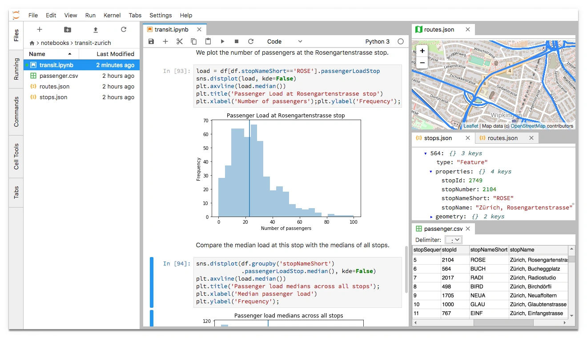

> **系列标签：** `技术文档` · `Jupyter` · `JupyterLab` · `Notebook`

分析轨迹、试绘图、调参数——改一行跑一行、立刻看结果，往往比反复改 `.py` 再执行省事。**JupyterLab** 就是在浏览器里干这个活的「交互式工作台」：代码、说明文字、公式、图表都写进同一个 `.ipynb` 文件。

分子模拟里的轨迹处理、可视化脚本，用 Notebook 边写边试很顺手。本文讲**安装、界面和基本操作**（会不会用工具）；Notebook 在科研项目里怎么摆目录、怎么配合 Git，见 [Jupyter Notebook科研使用规范](T16-Jupyter Notebook科研使用规范.md)（用得规范）。Python 环境先配好，见 [Conda与Mamba简明教程](T05-Conda与Mamba简明教程.md) 与 [分子模拟工作平台搭建](T01-分子模拟工作平台搭建.md)。


---

## 一、JupyterLab 是什么？

可以把 Notebook 想成**带格子的实验记录本**：每一格（单元格）里写一段代码或一段说明，从上到下依次跑。

| 概念 | 含义 |
|------|------|
| **Notebook（笔记本）** | 一个 `.ipynb` 文件，由多个「单元格」组成 |
| **Cell（单元格）** | 最小编辑块，可以是代码、Markdown 说明或原始文本 |
| **Kernel（内核）** | 在后台跑的 Python 进程，真正执行代码 |
| **JupyterLab** | 浏览器里管 Notebook、终端、文件的「工作台」 |
| **Jupyter Notebook** | 旧版单页界面；JupyterLab 是其升级版，功能更全 |

**和 VSCode / Cursor 怎么选？**

| 工具 | 特点 |
|------|------|
| **JupyterLab** | 浏览器打开，边试边看结果；和 Conda 环境配合紧密 |
| **VSCode / Cursor** | 也能开 `.ipynb`，和 `.py`、Git 混在一套界面里更顺手 |

二者都是 `.ipynb` 格式，**同一个文件两边都能打开**。本站习惯：**Conda 环境 + JupyterLab 或 VSCode / Cursor**，按场景切换即可。

---

## 二、安装与启动

### 1. 在 Conda 环境里安装

先激活项目环境（示例名 `myenv`）：

```bash
conda activate myenv
mamba install jupyterlab ipykernel -y
```

`ipykernel` 让 Jupyter 的下拉菜单里能选到这个环境。

还没配 Conda？见 [Conda与Mamba简明教程](T05-Conda与Mamba简明教程.md)。

### 2. 注册内核（多环境时建议做）

给环境起一个一眼能认的名字：

```bash
python -m ipykernel install --user --name myenv --display-name "Python (myenv)"
```

### 3. 启动 JupyterLab

**在项目目录里启动**，相对路径读轨迹、写结果才不乱：

```bash
cd /path/to/your/project
jupyter lab
```

终端会吐出一行地址，一般是：

```
http://localhost:8888/lab?token=...
```

浏览器通常会自动打开；若没有，把链接复制到浏览器即可。

### 4. 停止服务

在跑着 `jupyter lab` 的那个终端按 `Ctrl + C`，确认退出。

### 5. 常用启动参数

```bash
jupyter lab --no-browser          # 不自动开浏览器（远程 / 集群常用）
jupyter lab --port 8889           # 换端口（8888 被占用时）
jupyter lab --ip 0.0.0.0          # 允许其他机器访问（注意安全，集群按手册来）
```

---

## 三、界面一览

`jupyter lab` 启动后，浏览器里大致是下面这样（对照下图认位置）：



| 序号 | 区域 | 含义 | 分子模拟里常用来 |
|:----:|------|------|------------------|
| **①** | **菜单栏**（顶部） | File / Edit / Run / Kernel 等 | 新建 Notebook、改内核、导出 |
| **②** | **文件浏览器**（左侧） | 当前目录下的文件和文件夹 | 打开已有 `.ipynb`、找轨迹目录 |
| **③** | **主工作区**（中间） | Launcher 或已打开的 Notebook 标签页 | 写分析代码、看输出和图 |
| **④** | **Launcher**（启动器） | 点图标新建 Notebook、终端等 | 点 **Notebook** → 选 `Python (myenv)` |
| **⑤** | **内核名称**（右上角） | 当前用的是哪个 Python 环境 | 确认是不是 `Python (myenv)`，不对就 **Change Kernel** |

**三个建议先点熟的地方：**

1. **左侧文件树** — 双击 `.ipynb` 打开已有笔记本  
2. **Launcher 里的 Notebook** — 新建笔记本并选对内核（见第六节）  
3. **右上角内核名** — 和终端里 `conda activate myenv` 保持一致，避免 `ModuleNotFoundError`

**常用入口：**

- **Launcher** → 点 **Notebook** → 选 `Python (myenv)` → 新建  
- 左侧文件树 → 双击已有 `.ipynb`  
- 菜单 **File → New → Notebook**

---

## 四、单元格类型与基本操作

Notebook 就是一格一格从上往下排。先分清**两种模式**，快捷键才用得顺。

### 1. 三种单元格

| 类型 | 干什么用 | 命令模式下按 |
|------|----------|--------------|
| **Code** | 写 Python 并执行 | `Y` |
| **Markdown** | 写标题、说明、公式 | `M` |
| **Raw** | 原样保留文本，一般不执行 | — |

### 2. 两种模式

| 模式 | 怎么进入 | 干什么 |
|------|----------|--------|
| **编辑模式** | 单击单元格内部 | 像普通编辑器一样打字 |
| **命令模式** | 单击左侧蓝条，或按 `Esc` | 用快捷键插格、删格、运行 |

命令模式下单元格边框偏蓝；编辑模式下偏绿。

### 3. 运行单元格

| 你想做的事 | 快捷键（Mac 把 Ctrl 换成 Command） |
|-----------|-------------------------------------|
| 运行并跳到下一格 | `Shift + Enter` |
| 运行但留在当前格 | `Ctrl + Enter` |
| 运行并在下面插一格 | `Alt + Enter` |
| 强行停下 | 工具栏 ⏹ 或 **Kernel → Interrupt** |
| 清空变量重来 | **Kernel → Restart** |

左侧 `In [1]:` 里的数字是**执行顺序**，不必严格从上到下跑；但要复现结果时，建议 **Kernel → Restart & Run All** 从头跑一遍。

### 4. 增删移单元格（命令模式下）

| 快捷键 | 作用 |
|--------|------|
| `A` | 在上方插入 |
| `B` | 在下方插入 |
| `D` + `D` | 删除当前格 |
| `Z` | 撤销删除 |
| `↑` / `↓` | 切换单元格 |

---

## 五、Markdown 单元格速成

Markdown 单元格用来写说明：模拟条件、力场、笔记。编辑完按 `Shift + Enter` 渲染成排版好的文字。更完整的语法见 [Markdown简明教程](T12-Markdown简明教程.md)。

```markdown
# 一级标题
## 二级标题

正文支持 **粗体**、*斜体*、`行内代码`。

- 列表项一
- 列表项二

1. 有序列表
2. 第二项

[链接文字](https://example.com)

行内公式：$E = mc^2$

独立公式块：
$$
\int_0^1 x^2 \, dx = \frac{1}{3}
$$

> 引用块：记录注意事项
```

分子模拟笔记中，常用 Markdown 记录模拟参数、力场、体系尺寸等，与代码交错，方便日后复现。

---

## 六、Kernel：选对 Python 环境

Kernel 决定「这段代码在哪个 Python 里跑」。选错环境，最常见就是 `ModuleNotFoundError`——明明终端里 `conda activate myenv` 过了，Notebook 还在用系统 Python。

**切换内核：**

- 右上角内核名 → **Change Kernel** → 选 `Python (myenv)`
- 或菜单 **Kernel → Change Kernel**

**确认一下（Code 单元格里运行）：**

```python
import sys
print(sys.executable)
```

路径应含 `.../envs/myenv/bin/python`。

**内核卡住、变量乱了：**

**Kernel → Restart Kernel**，再从头运行需要的单元格。

---

## 七、常用 Magic 命令

以 `%` 或 `%%` 开头，只在 Notebook 里好用，`.py` 脚本里没有。

```python
%pwd                    # 当前目录
%cd data/raw            # 切到轨迹目录
%ls                     # 列文件

%timeit sum(range(1000))   # 测一行代码多快
%%time                     # 测整个单元格（%% 放第一行）
for i in range(10000):
    pass

%matplotlib inline      # 图直接嵌在 Notebook 里（绘图必开）

%whos                   # 看当前有哪些变量

!head traj.xyz          # 当 shell 用，快速瞄一眼文件头
!ls -la
```

`!` 适合临时看一眼；正经分析还是写 Python（`pathlib`、`subprocess`）更稳。

---

## 八、一个简单的数据分析示例

新建 Notebook，内核选 `Python (myenv)`，依次在 Code 单元格输入：

```python
import numpy as np
import matplotlib.pyplot as plt

%matplotlib inline

x = np.linspace(0, 10, 100)
y = np.sin(x)

plt.figure(figsize=(6, 4))
plt.plot(x, y, label="sin(x)")
plt.xlabel("x")
plt.ylabel("y")
plt.legend()
plt.title("示例图")
plt.show()
```

上面一个 Markdown 单元格写实验目的，下面 Code 单元格写代码——这是 Jupyter 最典型的用法。

---

## 九、文件管理与导出

### 1. 保存

JupyterLab 会**自动定期保存**；也可 `Ctrl + S` 手动存。`.ipynb` 本质是 JSON，能进 Git，但 diff 往往很吵——提交前清输出见 [Jupyter Notebook科研使用规范](T16-Jupyter Notebook科研使用规范.md)。

### 2. 重命名与移动

左侧文件树里右键 → **Rename** / **Move**。

### 3. 导出

**File → Save and Export Notebook As...**

| 格式 | 干什么用 |
|------|----------|
| **Notebook (.ipynb)** | 默认，继续改 |
| **HTML** | 发只读报告，图能保留 |
| **PDF** | 正式报告（本机要有 LaTeX） |
| **Python (.py)** | 转成脚本，方便部署 |

### 4. 和 Git 配合

- 提交前 **Kernel → Restart & Run All**，确保别人能复现  
- 输出太多时 **Cell → All Output → Clear** 再提交  
- 进阶可用 `nbstripout` 自动剥输出

---

## 十、在 VSCode / Cursor 中使用

不必每次开浏览器——同一个 `.ipynb` 在 [VSCode与Cursor简明教程](T06-VSCode与Cursor简明教程.md) 里也能写。

### 1. 扩展

- **Jupyter**、**Python**（一般装 Python 扩展时会带上）

### 2. 打开与运行

1. 打开 `.ipynb`  
2. 右上角 **Select Kernel** → `Python (myenv)`  
3. 单元格旁 ▶ 或 `Shift + Enter`

### 3. 和 JupyterLab 怎么选？

| 场景 | 更顺手 |
|------|--------|
| 快速试代码、看图 | JupyterLab 浏览器 |
| 项目里 `.py` 和 `.ipynb` 混写、用 Git | VSCode / Cursor |
| 连集群远程编辑 | [VSCode与Cursor远程连接集群](T07-VSCode与Cursor远程连接集群.md)；或在计算节点开 Jupyter + 端口转发（第十二节） |

两边打开的是同一种文件，**Kernel 指向同一 Conda 环境**即可。

---

## 十一、实用扩展（可选）

在已激活环境中安装：

```bash
mamba install -c conda-forge jupyterlab-git     # 图形化 Git
mamba install -c conda-forge jupyterlab-lsp       # 代码补全增强
pip install jupyterlab-code-formatter black       # 代码格式化
```

安装后重启 JupyterLab。扩展不是必需，先把第四节、第六节练熟再装也行。

---

## 十二、在集群上使用（简要）

集群上常在**计算节点**开 JupyterLab，本机浏览器通过 SSH 端口转发访问。**别在登录节点跑大轨迹分析。** 登录节点规则、SLURM 交作业见 [集群与SLURM简明教程](T10-集群与SLURM简明教程.md)；Remote SSH 连集群见 [VSCode与Cursor远程连接集群](T07-VSCode与Cursor远程连接集群.md) 第七节；平台外网要求见 [分子模拟工作平台搭建](T01-分子模拟工作平台搭建.md) 第七节。

**典型流程概要：**

```bash
# 1. SSH 登录集群（示例）
ssh user@cluster.edu

# 2. 激活环境，在计算节点启动（具体以集群文档为准）
conda activate myenv
jupyter lab --no-browser --port 8888

# 3. 本地另开终端做端口转发
ssh -L 8888:localhost:8888 user@cluster.edu
```

然后在本地浏览器打开 `http://localhost:8888/lab?token=...`。

---

## 十三、常见问题

### 1. `ModuleNotFoundError`

包未装进**当前 Kernel 对应的环境**。在终端：

```bash
conda activate myenv
mamba install 缺失的包名
```

然后在 Notebook 里 **Kernel → Restart** 再运行。

### 2. 浏览器打不开 / 端口被占用

换端口：`jupyter lab --port 8890`  
或关闭占用进程后重试。

### 3. 单元格一直 `[*]` 不结束

可能计算量大或死循环。点 ⏹ 中断，或 **Kernel → Interrupt**；必要时 **Restart**。

### 4. 图片不显示

绘图前运行 `%matplotlib inline`；若用交互式三维视图（如 nglview），需额外配置，参见对应库文档。

### 5. Notebook 乱了、结果对不上

变量状态与执行顺序有关。**Kernel → Restart Kernel and Run All Cells** 从头跑一遍最可靠。

### 6. VSCode 里 Kernel 列表没有我的环境

```bash
conda activate myenv
python -m ipykernel install --user --name myenv --display-name "Python (myenv)"
```

重启 VSCode / Cursor 后再选 Kernel。

---

## 十四、快捷键速查（命令模式下）

| 快捷键 | 作用 |
|--------|------|
| `Enter` | 进入编辑模式 |
| `Esc` | 回到命令模式 |
| `Shift + Enter` | 运行单元格 |
| `A` / `B` | 上/下插入单元格 |
| `M` / `Y` | 设为 Markdown / Code |
| `D` `D` | 删除单元格 |
| `C` / `V` | 复制 / 粘贴单元格 |
| `S` | 保存 Notebook |

Mac 用户：`Ctrl` 换为 `Command`（如 `Cmd + Enter` 运行并停留）。

---

## 十五、推荐学习资源

- [JupyterLab 官方文档](https://jupyterlab.readthedocs.io/)
- [Jupyter Notebook 快捷键说明](https://jupyter-notebook.readthedocs.io/en/stable/notebook.html#keyboard-shortcuts)
- [Markdown 指南](https://www.markdownguide.org/)
- [Conda与Mamba简明教程](T05-Conda与Mamba简明教程.md)
- [分子模拟工作平台搭建](T01-分子模拟工作平台搭建.md)

---

## 十六、小结

1. **JupyterLab** = 浏览器里的交互式 Python 工作台，产出物主要是 `.ipynb`。  
2. **安装**：`mamba install jupyterlab ipykernel`，在项目目录 `jupyter lab` 启动。  
3. **日常三板斧**：认界面 → 选对 **Kernel** → `Shift + Enter` 跑单元格。  
4. **Magic**：`%matplotlib inline`、`%cd`、`!head traj.xyz` 等省事。  
5. **协作**：和 VSCode / Cursor、Git、Conda 同一套 `myenv`；集群上重活放计算节点。

`ModuleNotFoundError`、内核一直 `[*]` 时，把报错和 `print(sys.executable)` 的输出复制去搜，往往能快速定位；Notebook 规范见 [Jupyter Notebook科研使用规范](T16-Jupyter Notebook科研使用规范.md)。

---

## 学习路径

**前置阅读：**

- [Conda与Mamba简明教程](T05-Conda与Mamba简明教程.md)
- [分子模拟工作平台搭建](T01-分子模拟工作平台搭建.md)（第四节 myenv）

**下一步：**

- [Markdown简明教程](T12-Markdown简明教程.md) —— Notebook 文档化
- [Jupyter Notebook科研使用规范](T16-Jupyter Notebook科研使用规范.md)
- [NumPy与Matplotlib简明教程](T21-NumPy与Matplotlib简明教程.md)
- [VSCode与Cursor简明教程](T06-VSCode与Cursor简明教程.md) —— 在编辑器中打开 Notebook
