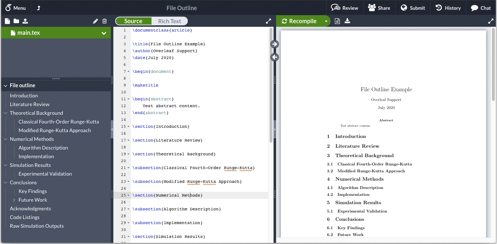

> **系列标签：** `技术文档` · `写作` · `LaTeX` · `论文排版`

论文里的公式要对齐、图要编号、参考文献改一处全文跟着变——用 Word 硬调常常越改越乱。**LaTeX** 像一台「排版发动机」：你写带标记的纯文本，编译器吐出版式稳定的 PDF。**Overleaf** 把这套流程搬到浏览器里，不用本机装几个 G 的 TeX，还能和导师在线改稿。

日常记实验、攒素材仍用 [Markdown简明教程](T12-Markdown简明教程.md)、[Obsidian知识库搭建](T13-Obsidian知识库搭建.md)；**成稿、投稿、答辩幻灯**再进 LaTeX。图从 [NumPy与Matplotlib简明教程](C01-NumPy与Matplotlib简明教程.md) 导出 PDF 插进来即可。

学完能带走：Overleaf 上从空白项目到能编译的论文骨架、常用公式环境和插图插入、`refs.bib` 参考文献怎么挂、以及和导师在线改稿时要注意啥。整条「模拟 → 出图 → 排版」链路见 [从模拟到论文图的工作流](T18-从模拟到论文图的工作流.md)；记方法与参数仍留在 Markdown / Obsidian，别一上来就把实验笔记搬进 `.tex`。



---

[erphpdown]

## 一、LaTeX、Word、Markdown 各干什么的？

| 格式 | 好比 | 适合 |
|------|------|------|
| **Markdown** | 便签 + 轻排版 | 实验记录、README、Notebook 说明 |
| **Word** | 所见即所得写字 | 行政表格、期刊非要 Word 时 |
| **LaTeX** | 按规则自动排版 | **期刊论文、学位论文、Beamer 幻灯** |

分子模拟文章里 $g(r)$、势函数、统计力学公式多，LaTeX 写起来往往比 Word 省事；交叉引用（「见图 3」「式 (2)」）也不会因为前面增删一段就全乱套。

**一条常见路线：**

```
Obsidian / Markdown 记方法与参数
    → Jupyter + Matplotlib 出图（PDF）
    → Overleaf 写成稿 + 参考文献
    → 按期刊模板调格式投稿
```

更完整的作图链路见 [从模拟到论文图的工作流](T18-从模拟到论文图的工作流.md)。

---

## 二、Overleaf 快速上手

### 1. 注册与新建项目

1. 打开 [overleaf.com](https://www.overleaf.com) 注册（教育邮箱有时有 **Overleaf Professional** 优惠，可看官网说明）  
2. **New Project** → **Blank Project**（空白）或搜期刊名用官方模板  
3. 左侧文件、中间源码、右侧 **Recompile** 后的 PDF  

### 2. 界面四块

| 区域 | 干啥 |
|------|------|
| **左栏** | 文件树：`main.tex`、`refs.bib`、`figures/` |
| **中栏** | 写 `.tex` 源码 |
| **右栏** | PDF 预览；点行号可跳到对应源码 |
| **顶部** | 下载 PDF、分享、查看编译日志 |

### 3. 协作改稿

**Share** → 邀请导师 / 合作者（只读或可编辑）。和 Google 文档类似，但底层仍是 LaTeX——**别两个人同时改同一行**，容易冲突；大改前用 **History** 看版本、必要时 **Restore** 回滚。

### 4. 项目怎么摆文件

```
my-paper/
├── main.tex          # 主文档（或期刊模板规定的入口）
├── refs.bib          # 参考文献数据库
├── figures/
│   ├── rdf.pdf       # Matplotlib 导出的矢量图
│   └── scheme.pdf
└── sections/         # 可选：长文拆成多个 .tex
    ├── intro.tex
    └── methods.tex
```

主文件里用 `\input{sections/methods}` 拆开写，单章别上千行，Git 和 Overleaf 都好 diff。

> **Tips：** 图片名用小写、无空格（`rdf_300k.pdf`），`\includegraphics` 路径就和文件名一致，少踩坑。

---

## 三、第一篇能编译的短文

在 `main.tex` 粘贴下面最小例子，再建 `refs.bib`，点 **Recompile**。

`main.tex`：

```latex
\documentclass[12pt,a4paper]{article}

\usepackage[utf8]{inputenc}
\usepackage{amsmath,amssymb}   % 数学符号
\usepackage{graphicx}          % 插图
\usepackage[margin=2.5cm]{geometry}

\title{分子动力学模拟中径向分布函数的分析}
\author{你的名字}
\date{\today}

\begin{document}
\maketitle

\section{引言}
径向分布函数 $g(r)$ 描述局部密度与体密度的比值\cite{allen1987}.

\section{方法}
LJ 势可写为
\begin{equation}
U(r) = 4\epsilon\left[\left(\frac{\sigma}{r}\right)^{12}
      - \left(\frac{\sigma}{r}\right)^{6}\right].
\label{eq:lj}
\end{equation}

由式~\eqref{eq:lj} 可得力 $\mathbf{F}=-\nabla U$。

\section{结果}
图~\ref{fig:rdf} 展示了 300~K 下的 $g(r)$。

\begin{figure}[htbp]
  \centering
  \includegraphics[width=0.6\textwidth]{figures/rdf.pdf}
  \caption{TIP3P 水的径向分布函数.}
  \label{fig:rdf}
\end{figure}

\bibliographystyle{plain}
\bibliography{refs}

\end{document}
```

`refs.bib`：

```bibtex
@book{allen1987,
  author    = {Allen, M. P. and Tildesley, D. J.},
  title     = {Computer Simulation of Liquids},
  year      = {1987},
  publisher = {Oxford University Press}
}
```

**编译成功后你应该看到：** 标题、带编号的公式 (1)、带「Figure 1」的图、文末参考文献。改 `\caption` 或增删一节，再 Recompile，编号会自动重排——这就是 LaTeX 省心的地方。

---

## 四、常用语法（够写 Methods 和 Results）

### 1. 章节结构

```latex
\section{方法}           % 1 级
\subsection{模拟细节}     % 1.1
\subsubsection{力场}      % 1.1.1
```

学位论文、书籍才用 `\chapter`；期刊 `article` 类一般到 `\section` 就够。

### 2. 数学公式

```latex
行内：$g(r)$、$E = k_{\mathrm{B}} T$

独立一行（带编号）：
\begin{equation}
  F = -\nabla U
  \label{eq:force}
\end{equation}

多行对齐：
\begin{align}
  \sigma_{ij} &= A_{ij} r^{-12} - B_{ij} r^{-6} \\
  U_{\mathrm{tot}} &= \sum_{i<j} \sigma_{ij}
\end{align}
```

**分子模拟常写的：** 下标用 `_{}`（`k_{\mathrm{B}}` 比 `k_B` 好看），向量用 `\mathbf{r}`，百分号在正文里写作 `\%`。

### 3. 表格（模拟参数表）

```latex
\begin{table}[htbp]
  \centering
  \caption{NPT 模拟参数}
  \label{tab:params}
  \begin{tabular}{lcc}
    \hline
    参数 & 值 & 单位 \\
    \hline
    温度 & 300 & K \\
    压强 & 1 & atm \\
    步长 & 1 & fs \\
    力场 & TIP3P & -- \\
    \hline
  \end{tabular}
\end{table}
```

正文里写「见表~\ref{tab:params}」。列太多挤不下时，用 `tabularx` 或把大表放补充材料（Supplementary Information）。

### 4. 列表

```latex
\begin{itemize}
  \item 系综：NPT
  \item 截断：12~\AA
\end{itemize}

\begin{enumerate}
  \item 能量最小化
  \item NVT 平衡 100~ps
  \item NPT 生产 10~ns
\end{enumerate}
```

### 5. 引用：图、式、文献

```latex
\label{fig:rdf}              % 贴在 figure 或 section 里
图~\ref{fig:rdf}              % 输出 Figure 编号
式~\eqref{eq:lj}              % 输出公式编号
\cite{allen1987}              % 参考文献 [1]
\cite{allen1987,hess2008}    % 多篇
```

**规矩：** 每个 `\label` 名字在项目里**唯一**；习惯用前缀 `fig:`、`eq:`、`sec:`、`tab:`，自己好认。

### 6. 单位与数字

```latex
300~K                    % ~ 是不换行空格
10~\mathrm{ns}           % 正体单位
\SI{300}{\kelvin}        % 需 siunitx 宏包，更规范
```

导言区加 `\usepackage{siunitx}` 后：

```latex
\SI{1.0e6}{step}         % 步数
\SI{12}{\angstrom}       % 截断半径
```

### 7. 分子模拟常用公式（复制改数）

下面这段是 **Methods / 理论分析** 里高频出现的式子，粘进 Overleaf 后改符号、加 `\label` 即可。行内用 `$...$`，重要推导用 `equation` 或 `align`。

**统计与热力学：**

```latex
行内：$E = k_{\mathrm{B}} T$，$\beta = 1/(k_{\mathrm{B}} T)$

时间平均（遍历系综下）：
\begin{equation}
  \langle A \rangle = \lim_{\tau \to \infty} \frac{1}{\tau}
  \int_0^{\tau} A(t)\,\mathrm{d}t
  \label{eq:time-avg}
\end{equation}
```

**LJ 势与力（与第三节最小例一致，可并排引用）：**

```latex
\begin{equation}
  U_{\mathrm{LJ}}(r) = 4\epsilon
  \left[ \left(\frac{\sigma}{r}\right)^{12}
       - \left(\frac{\sigma}{r}\right)^{6} \right]
  \label{eq:lj}
\end{equation}

\begin{equation}
  \mathbf{F}_i = -\sum_{j \neq i} \nabla_i U(r_{ij})
  \label{eq:force}
\end{equation}
```

**径向分布函数 $g(r)$（正文里常要文字 + 式子）：**

```latex
局部数密度与 $g(r)$ 的关系可写为
\begin{equation}
  \rho(r) = \rho_0 \, g(r),
  \label{eq:rdf-density}
\end{equation}
其中 $\rho_0$ 为体相平均数密度。$g(r)\gt 1$ 表示该距离处粒子比均匀分布更密。
```

（严格定义含壳层积分与归一化，投稿时按期刊习惯与参考教材补全；上式够写结果讨论。）

**均方位移 MSD（扩散）：**

```latex
\begin{equation}
  \mathrm{MSD}(t) = \left\langle
  \left| \mathbf{r}(t) - \mathbf{r}(0) \right|^2
  \right\rangle
  \label{eq:msd}
\end{equation}

长时极限下三维扩散系数：
\begin{equation}
  D = \lim_{t \to \infty} \frac{\mathrm{MSD}(t)}{6t}
  \label{eq:D}
\end{equation}
```

**部分电荷、静电（力场小节常写）：**

```latex
库仑项（真空介电常数 $\epsilon_0$）：
\begin{equation}
  U_{\mathrm{Coul}}(r) = \frac{1}{4\pi\epsilon_0}
  \frac{q_i q_j}{r}
  \label{eq:coul}
\end{equation}
```

实际模拟多用截断或 Ewald/PPPM；文中说明「本工作采用 … 处理长程静电」即可，不必在正文展开全套公式。

**下标、希腊字母、常见坑：**

| 想写 | LaTeX | 别写成 |
|------|-------|--------|
| $g(r)$ | `$g(r)$` | `$gr$`（缺括号） |
| $k_{\mathrm{B}}$ | `k_{\mathrm{B}}` | `k_B`（斜体 B 不好看） |
| $\rho_0$ | `\rho_0` | `\rho0` |
| Å | `\AA` 或 `\si{\angstrom}` | 直接打特殊字符（编码易炸） |
| 乘号 | `\times` 或 `\cdot` | `x` |
| 约等于 | `\approx` | `~`（在数学模式外） |

> **Tips：** 公式旁一定加 `\label{eq:xxx}`，正文用 `式~\eqref{eq:xxx}` 引用——改顺序后编号自动更新。符号表太长时放 **Supporting Information**，正文只保留读者理解结果必需的式子。

---

## 五、插入论文图（接 Matplotlib）

期刊多半要 **PDF / EPS 矢量图**，放大不糊。在 Python 里：

```python
import matplotlib.pyplot as plt

fig, ax = plt.subplots(figsize=(3.5, 2.6))  # 英寸，按期刊单栏宽估
ax.plot(r, g_r)
ax.set_xlabel(r"$r$ (Å)")
ax.set_ylabel(r"$g(r)$")
plt.savefig("figures/rdf.pdf", bbox_inches="tight")
```

上传到 Overleaf 的 `figures/`，文中：

```latex
\includegraphics[width=0.48\textwidth]{figures/rdf.pdf}
```

**双栏图（a）（b）并排：**

```latex
\begin{figure}[htbp]
  \centering
  \begin{minipage}{0.48\textwidth}
    \centering
    \includegraphics[width=\linewidth]{figures/rdf.pdf}
    \caption{径向分布函数}
    \label{fig:rdf}
  \end{minipage}\hfill
  \begin{minipage}{0.48\textwidth}
    \centering
    \includegraphics[width=\linewidth]{figures/msd.pdf}
    \caption{均方位移}
    \label{fig:msd}
  \end{minipage}
\end{figure}
```

图注里写清：体系、温度、力场、轨迹长度。作图规范见 [从模拟到论文图的工作流](T18-从模拟到论文图的工作流.md)、[NumPy与Matplotlib简明教程](C01-NumPy与Matplotlib简明教程.md)。

---

## 六、参考文献（BibTeX）

### 1. 条目从哪来

| 来源 | 做法 |
|------|------|
| **Google Scholar** | 点「引用」→ **BibTeX** → 复制进 `refs.bib` |
| **Zotero / EndNote** | 导出 BibTeX |
| **期刊官网** | 部分提供 `.bib` 片段 |

每条有个 **cite key**（上例 `allen1987`），正文 `\cite{allen1987}` 必须和 key **完全一致**。

### 2. 常用条目类型

```bibtex
@article{hess2008,
  author  = {Hess, B. and others},
  title   = {GROMACS 4: Algorithms for ...},
  journal = {J. Chem. Theory Comput.},
  year    = {2008},
  volume  = {4},
  pages   = {435--447}
}

@software{lammps2023,
  author = {Thompson, A. P. and others},
  title  = {{LAMMPS}},
  year   = {2023},
  url    = {https://www.lammps.org}
}
```

### 3. 样式

`\bibliographystyle{plain}` 只是示例；**期刊模板会指定**（如 `achemso`、`rsc`）。用 Overleaf 期刊模板时，别自己乱换 style，否则和投稿系统不一致。

---

## 七、期刊模板与投稿

1. Overleaf **Templates** 搜期刊全名或缩写（如 *J. Chem. Phys.*）  
2. 看清要求：**单栏 / 双栏**、摘要字数、图表是否分文件上传  
3. 把你在空白项目里写好的 `\section` 内容**迁进模板**，不要反过来在模板里从零憋  
4. 终稿 **Download PDF**；部分期刊支持 Overleaf **Submit** 直传（看期刊说明）  

> **Tips：** 投稿前 checklist：图都是矢量 PDF、轴标签带单位、参考文献 key 无问号、补充材料轨迹说明与 runlog 一致（见 [数据管理与备份](T17-数据管理与备份.md)）。

---

## 八、本地 LaTeX（可选）

不想依赖网络、或模板编译很慢时，可本机装：

| 平台 | 方案 |
|------|------|
| **Mac** | [MacTeX](https://www.tug.org/mactex/) |
| **Windows** | [TeX Live](https://www.tug.org/texlive/) 或 MiKTeX |
| **Ubuntu** | `sudo apt install texlive-full`（体积大，可先装 `texlive-latex-extra`） |

本地编译经典四步（有参考文献时）：

```bash
pdflatex main.tex
bibtex main
pdflatex main.tex
pdflatex main.tex
```

Overleaf 会自动多遍编译；本地报错时看 `.log` 最后几十行。**初学者建议先用 Overleaf**，通了再考虑本地。

---

## 九、Beamer：组会幻灯片

答辩、组会常用 **Beamer**（仍是 LaTeX，不是 PowerPoint）：

```latex
\documentclass{beamer}
\usetheme{Madrid}
\title{水盒子 NPT 模拟结果}
\author{你的名字}
\date{\today}

\begin{document}
\begin{frame}
  \titlepage
\end{frame}

\begin{frame}{模拟设置}
  \begin{itemize}
    \item 力场：TIP3P
    \item 系综：NPT，300~K，1~atm
    \item 软件：LAMMPS
  \end{itemize}
\end{frame}

\begin{frame}{径向分布函数}
  \includegraphics[width=0.75\textwidth]{figures/rdf.pdf}
\end{frame}
\end{document}
```

图照样 `\includegraphics`；公式和论文里同一套语法。幻灯片字号用 `\large`、少堆字，一页一个结论。

---

## 十、从 Markdown / Obsidian 迁过来

| 内容 | 建议 |
|------|------|
| 段落文字 | 复制进 `\section`，手改一次格式 |
| `$公式$` | 大多可直接用 |
| `[[双链]]` | Obsidian 专有，需改成 `\cite` 或 `\ref` |
| 图片 | 改成 `\includegraphics` |

**Pandoc** 可试：`pandoc notes.md -o draft.tex`，公式多的长文仍建议**直接在 Overleaf 写**，修一次比修 Pandoc 样式省事。

---

## 十一、常见问题

### 1. `Undefined control sequence`

多半缺宏包：在导言区 `\usepackage{...}`；或命令拼错。看 **Logs and output files** 里标红行号。

### 2. 参考文献是问号 `?`

`refs.bib` 里没有对应 key，或 BibTeX 没跑完。Overleaf 一般自动处理；本地记得 `bibtex main`。

### 3. `File 'figures/rdf.pdf' not found`

文件名大小写、路径、是否已上传到 Overleaf 左侧文件树；LaTeX 在 Linux 服务器上**区分大小写**。

### 4. 中文标题或摘要

英文期刊通常全英文即可。若要中文文档：`\usepackage{ctex}`，编译器选 **XeLaTeX**（Overleaf 菜单 → Settings → Compiler）。

### 5. 表格太宽溢出页边

换 `tabularx`、`\resizebox{\textwidth}{!}{...}`，或改附表。

### 6. 编译超时

图片太大、无限循环的 `\includegraphics`；换小 PDF、删掉无用宏包。免费 Overleaf 有编译时间上限。

### 7. 和导师协作冲突

约定「谁改哪一节」；用 Comments 批注；大版本用 Git 导出 zip 或 Overleaf Git 同步（进阶）。

看不懂报错时，把 **完整 log 最后 20 行**复制去搜，比只搜第一行准。

---

## 十二、小结

1. **LaTeX** 负责成稿排版；**Markdown / Obsidian** 负责记过程——分工清楚。  
2. **Overleaf** 免安装、易协作；掌握 `section`、公式、`figure`/`table`、`\cite`、`\ref` 就能写大部分 MD 论文。  
3. §四「分子模拟常用公式」可整段复制，再按体系改符号、加 `\label`。  
4. 图用 Matplotlib 存 **PDF**，表用 `tabular`，文献用 **BibTeX** 统一管理。  
5. 投稿用**期刊官方模板**；组会用 **Beamer**。  
6. 整条模拟→作图→排版链路见 [从模拟到论文图的工作流](T18-从模拟到论文图的工作流.md)。

---

[/erphpdown]

## 学习路径

**前置阅读：**

- [Markdown简明教程](T12-Markdown简明教程.md)
- [NumPy与Matplotlib简明教程](C01-NumPy与Matplotlib简明教程.md) —— 导出论文级图片
- [Obsidian知识库搭建](T13-Obsidian知识库搭建.md) —— 写作素材积累

**下一步：**

- 在 Overleaf 选目标期刊模板，练一篇短 Methods + 一图一文
- [从模拟到论文图的工作流](T18-从模拟到论文图的工作流.md)
- [科研项目目录结构规范](T15-科研项目目录结构规范.md) —— `figures/`、`docs/` 怎么摆
- `02-实战案例` —— 把模拟结果整理成图表与文字（陆续更新）
