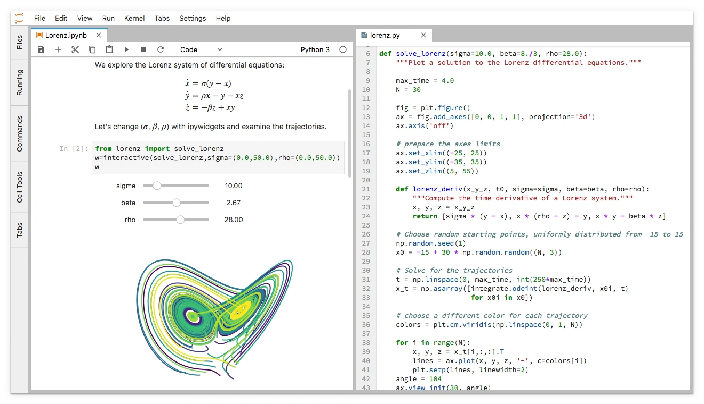

> **系列标签：** `技术文档` · `工作流` · `Jupyter` · `可复现`

Notebook 边跑边看图，探索轨迹、试参数很爽——但你也可能遇到过：上面改了温度**没重跑**，下面图还是旧的；`git diff` 刷出几万行图片乱码；队友打开你的 ipynb **内核不对、路径全挂**。这些不是 Jupyter 坏了，是**用得不够规矩**。

本文讲分子模拟科研里 **Notebook 怎么写才可复现、好协作**——放哪、怎么组织单元格、怎么交 Git、啥时候该改成 `.py`。**不会开关 Jupyter、不懂单元格快捷键**的，先看 [JupyterLab简明教程](T11-JupyterLab简明教程.md)；本文不管「会不会用工具」，管「用得对不对」。

读完你应该能自查：Notebook 该放 `notebooks/` 哪一层、Kernel 是不是项目环境、提交 Git 前要不要清输出、探索完了怎么收成 `scripts/` 里的 `.py`。目录摆法跟 [科研项目目录结构规范](T15-科研项目目录结构规范.md) 对齐；在 VSCode / Cursor 里跑见 [VSCode与Cursor简明教程](T06-VSCode与Cursor简明教程.md)，远程集群见 [VSCode与Cursor远程连接集群](T07-VSCode与Cursor远程连接集群.md)。

| 本文 | [JupyterLab简明教程](T11-JupyterLab简明教程.md) |
|------|------------------------------------------------|
| 目录、复现、Git、清输出 | 安装、界面、单元格、快捷键 |
| 探索完了收成脚本 | 怎么启动、选 Kernel |



---

[erphpdown]

## 一、和 JupyterLab 教程怎么分工？Notebook 适合干啥？

| 本文（科研使用规范） | [JupyterLab简明教程](T11-JupyterLab简明教程.md)（工具操作） |
|-------------|------------------------------------------------------|
| 目录、复现、Git、清输出 | 安装、界面、单元格、快捷键 |
| 探索完了怎么收成脚本 | 怎么启动、选 Kernel |

**Notebook 适合：**

| 适合 | 不太适合 |
|------|----------|
| 轨迹分析试参数、交互出图 | 几天几夜的纯生产跑模拟（用 `sbatch` + `.py`） |
| 带文字说明的分析报告、组会展示 | 极致性能热点（改向量化或 C++） |
| 记录「这一步为什么这么画图」 | 写密码、写死 `C:\Users\你\...` 绝对路径 |

在 VSCode / Cursor 里跑 Notebook 见 [VSCode与Cursor简明教程](T06-VSCode与Cursor简明教程.md)；远程集群上见 [VSCode与Cursor远程连接集群](T07-VSCode与Cursor远程连接集群.md)。

---

## 二、放哪、叫啥名

跟 [科研项目目录结构规范](T15-科研项目目录结构规范.md) 对齐：

- 文件放 **`notebooks/`**，别和 `lammps/`、`data/` 混一团  
- **数字前缀**表顺序：`01_load_traj.ipynb` → `02_rdf.ipynb` → `03_plot.ipynb`  
- 逻辑稳定后抽到 **`scripts/`** 或 **`src/`**，Notebook 里只 `import`：

```python
# notebooks/02_rdf.ipynb 第一格代码
import sys
from pathlib import Path
ROOT = Path("..").resolve()
sys.path.insert(0, str(ROOT / "src"))

from analysis.rdf import compute_rdf
```

> **Tips：** 探索可以乱一点；要进 Git、要给导师看的版本——名字和顺序得让**陌生人能猜出先跑哪个**。

---

## 三、Kernel 与环境：别用错 Python

装内核、注册 `ipykernel` 见 [JupyterLab简明教程](T11-JupyterLab简明教程.md)。这里只强调**科研必查**：

1. **用项目环境**（如 `myenv`），别用 `base`  
2. 终端 `conda activate myenv` 和 Notebook 右上角 **Kernel** 必须是**同一条** `python`  

```python
import sys
print(sys.executable)   # 应含 .../envs/myenv/...
```

3. 第一个 Markdown 格写清「这篇 Notebook 吃什么数据」：

```markdown
## 环境
- Kernel：`myenv` (Python 3.12)
- 数据：`../data/processed/npt300_rdf.csv`
- 对应模拟：`docs/runlog.md` 2026-06-30 JOB 12345
```

换电脑、半年后你自己看，靠这几行能少踩一半坑。

---

## 四、单元格怎么排：从上到下能讲完一个故事

**推荐骨架：**

```
[Markdown]  目的、体系、参数（链到 runlog）
[Code]      import + 路径
[Code]      读数据
[Code]      计算
[Code]      绘图 + savefig 到 figures/
[Markdown]  结论与待办
```

习惯：

- **一格一事**；改参数就从上往下重跑，别跳着跑  
- 单格别堆几百行；长函数挪到 `scripts/rdf.py`  
- 路径用 `pathlib`，别 `%cd` 到处跳：

```python
from pathlib import Path
ROOT = Path("..").resolve()
DATA = ROOT / "data" / "processed"
FIGS = ROOT / "figures"
```

- 图注、力场、温度写在 **Markdown 格**（语法见 [Markdown简明教程](T12-Markdown简明教程.md)）  
- 分析图开头可加 `%matplotlib inline`（Jupyter 里显示图）

---

## 五、复现金标准：Restart & Run All

交作业、发导师、写进论文补充材料之前，做这三步：

1. **Kernel → Restart Kernel and Run All Cells**（VSCode / Cursor 命令面板里也能搜到）  
2. 全程无报错，图和数字对得上  
3. 再保存

避免经典事故：**上面某格改了 `T=350`，下面 RDF 图还是 300 K 时跑出来的旧输出**。

> **Tips：** 组会前 10 分钟再 Run All 一遍——比你口头说「我这边显示是对的」靠谱。

---

## 六、随机种子与参数（ML / 统计也要一致）

分析里涉及随机抽样、train/test 划分时，**开头固定种子**：

```python
import numpy as np
RANDOM_SEED = 42
np.random.seed(RANDOM_SEED)
```

模拟参数别散落在各格魔法数字里，首格集中写：

```python
PARAMS = {
    "T_K": 300,
    "dt_fs": 1.0,
    "run_id": "npt300",
}
```

成熟项目可读 `config/params.yaml`（见 [科研项目目录结构规范](T15-科研项目目录结构规范.md)）。

---

## 七、Git：输出是 diff 地狱

`.ipynb` 本质是 JSON，**图、print 结果会嵌进文件** → `git diff` 巨长、仓库发胖。

| 做法 | 说明 |
|------|------|
| **提交前清空输出** | Jupyter：**Cell → All Output → Clear**；VSCode 也有清输出命令 |
| **`nbstripout`** | 提交时自动剥输出（进阶，可选） |
| **探索用 ipynb，定稿用 .py** | 稳定流程进 `scripts/`，Notebook 只留说明性分析 |

```bash
pip install nbstripout
# 仅当前仓库启用（推荐）
nbstripout --install
```

**千万别**把几 GB 轨迹嵌进 Notebook；用路径读 `data/raw/`（见 [数据管理与备份](T17-数据管理与备份.md)）。论文用图 **`savefig` 到 `figures/`**，别只靠单元格输出里那张图。

---

## 八、探索完了 → 收成脚本

流程跑通、参数定了，建议迁到 `.py`，方便集群批处理、一键重跑：

```bash
jupyter nbconvert --to script notebooks/02_rdf.ipynb
# 整理生成的 02_rdf.py → 移入 scripts/
```

或在 VSCode **Export to Python**。脚本适合：

- 登录节点 / 计算节点无界面跑：`python scripts/run_rdf.py`  
- 和 `sbatch` 联用（见 [集群与SLURM简明教程](T10-集群与SLURM简明教程.md)）  
- 以后加单元测试

**两阶段心法：** `notebooks/` **试错** → `scripts/` **定稿** → Notebook 变薄，只负责展示和说明。

---

## 九、VSCode / Cursor 上多留神

- **Select Kernel** 必须选远程 / 本地的 `myenv`  
- AI 改了一大段 Notebook：**逐格看一眼**，再 Run All  
- 项目根 `.cursorignore` 排除 `data/raw/`，别让 AI 读巨文件  
- 远程集群：重分析在计算节点或批处理，别在登录节点长时间占着（见 [VSCode与Cursor远程连接集群](T07-VSCode与Cursor远程连接集群.md)）

---

## 十、提交 / 归档前检查清单

- [ ] **Restart & Run All** 通过  
- [ ] Kernel 是项目 Conda 环境（`sys.executable` 对）  
- [ ] 无本机绝对路径 `/Users/...`、`C:\...`  
- [ ] 已清空无关输出，或仓库已配 `nbstripout`  
- [ ] Markdown 格写了参数、数据来源、对应 runlog  
- [ ] 论文级图已存 `figures/*.pdf`，不只留在单元格输出里  

---

## 十一、常见问题

### 1. 内核一直转 `[*]` 不动

数据路径错、轨迹太大、登录节点被限——看下方报错；`print(sys.executable)` 确认环境。完整报错复制去搜。

### 2. `ModuleNotFoundError`

Kernel 不是 `myenv`；或在当前环境 `mamba install 缺的包`。

### 3. 图对了但同事跑全是错

你没 Run All 就保存；或用了绝对路径。按第十节清单过一遍。

### 4. Git 提交 diff 看不懂

输出没清；用 Clear All Output 或 `nbstripout` 后再 commit。

### 5. Notebook 和脚本哪个为准？

**定稿以 `scripts/` 为准**；Notebook 是说明书 + 探索记录，别两边各改一套逻辑不 sync。

---

## 十二、小结

1. **JupyterLab 教操作，本文教规矩**——Kernel、路径、参数写清楚。  
2. 探索在 `notebooks/`，定稿进 `scripts/`；提交前 **Run All**。  
3. Git 前**清输出**；轨迹走 `data/`，图存 `figures/`。  
4. 和 [科研项目目录结构规范](T15-科研项目目录结构规范.md)、[从模拟到论文图的工作流](T18-从模拟到论文图的工作流.md) 一起用，整条分析链才站得住。

---

[/erphpdown]

## 学习路径

**前置阅读：**

- [JupyterLab简明教程](T11-JupyterLab简明教程.md)
- [科研项目目录结构规范](T15-科研项目目录结构规范.md)
- [Git简明使用教程](T04-Git简明使用教程.md)

**下一步：**

- [从模拟到论文图的工作流](T18-从模拟到论文图的工作流.md)
- [NumPy与Matplotlib简明教程](C01-NumPy与Matplotlib简明教程.md)
