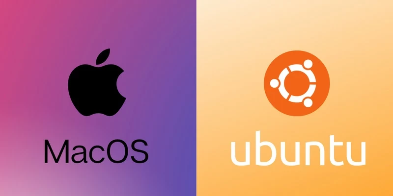

> **系列标签：** `技术文档` · `平台搭建` · `macOS` · `Ubuntu`

新 Mac 拆箱，终端里敲第一条命令就被拦住：系统要你先装「开发者工具」；新装的 Ubuntu 一干净，想下个安装脚本却没有 `curl`，编译小工具又缺 `gcc`——还没碰分子模拟软件，本机「底座」就卡壳了。

本文是 **新 Mac / 新 Ubuntu（含 WSL 里的 Ubuntu）的第一步**：Mac 装好 **Xcode Command Line Tools** 和 **Homebrew**；Ubuntu 做好 **`apt` 更新、编译工具链与常用命令行工具**。装完之后，终端才能正常装软件、拉脚本，再去跟平台总览装编辑器、Conda、`myenv` 才顺畅。

**本文不讲** VSCode / Cursor、Conda、Git 日常用法——那些留给总览与专题文。Windows 原生系统请先走 [WSL2安装与配置](T02-WSL2安装与配置.md)，装好后再按文中 **Ubuntu** 步骤操作。

| 你在哪一步 | 读哪篇 |
|------------|--------|
| Windows 要先嵌一套 Linux | [WSL2安装与配置](T02-WSL2安装与配置.md) |
| **新 Mac / 新 Ubuntu 打地基（本文）** | 往下读 |
| 平台总览、装编辑器 / Conda / myenv | [分子模拟工作平台搭建](T01-分子模拟工作平台搭建.md) |
| 终端日常命令 | [Linux终端与Shell简明教程](T03-Linux终端与Shell简明教程.md) |
| Git 提交、分支、远程 | [Git简明使用教程](T04-Git简明使用教程.md) |



---

## 一、为什么要先配「底座」？

分子模拟教程里到处是 `brew install`、`apt install`、`git clone`、偶尔还要本地编译一个小工具。这些都假定本机已经具备：

| 底座 | Mac | Ubuntu / WSL |
|------|-----|----------------|
| 开发者命令行 | Xcode Command Line Tools（CLT） | `build-essential` 等 |
| 包管理器 | [Homebrew](https://brew.sh/) | `apt`（系统自带） |
| 常见小工具 | 多半随后用 `brew` 装 | 用 `apt` 装（`curl`、`git`、`wget`…） |

缺 CLT 时，Homebrew 装不上，不少科学软件的源码依赖也会失败。Ubuntu 侧若系统太「干净」，一上 `apt install` 就缺依赖、缺证书、缺编译器。所以 **先做本文 → 再跟 [分子模拟工作平台搭建](T01-分子模拟工作平台搭建.md)**，少踩两轮坑。

---

## 二、Mac：Command Line Tools → Homebrew

推荐顺序：**先装 CLT，再装 Homebrew**。Homebrew 官方安装脚本会检查 CLT；没有 CLT，`brew` 本身也跑不起来。

### 1. 安装 Xcode Command Line Tools

打开「终端」（启动台搜 Terminal，或 Spotlight 搜「终端」），执行：

```bash
xcode-select --install
```

弹出窗口点「安装」，等待完成（体积不小，视网速可能要十几分钟）。

**验证：**

```bash
xcode-select -p
# 常见输出：/Library/Developer/CommandLineTools

git --version
clang --version
```

CLT 自带的 `git`、`clang`、`make` 一般就够日常科研使用。

> **Tips：** 若提示已经安装，或 `--install` 报错，可试：`sudo xcode-select --reset` 后再执行一次 `xcode-select --install`。不必为了分子模拟去装完整版 Xcode App（体积大得多）。

### 2. 安装 Homebrew

打开 [https://brew.sh](https://brew.sh)，复制官网给出的一键安装命令在终端执行（需联网）。装完后按屏幕提示，把 brew 加入 PATH。

**Apple Silicon（M 芯片）** 常见前缀是 `/opt/homebrew`。若新开终端找不到 `brew`，把下面两行写入 `~/.zshrc`（Mac 默认 zsh），再执行 `source ~/.zshrc`：

```bash
eval "$(/opt/homebrew/bin/brew shellenv)"
```

**Intel Mac** 多为 `/usr/local`；官网安装结束时的提示为准。

**验证：**

```bash
brew --version
brew doctor          # 有警告按提示处理即可，不一定全是硬错误
```

### 3. 用 Homebrew 装几个「马上会用到」的工具（可选）

CLT 已带 `git` 时，这一步可跳过；想用 brew 统一管理、或要较新版本时再装：

```bash
brew install git curl wget
git --version        # PATH 里 brew 优先时，会显示 Homebrew 版
```

以后装图形软件常用 cask，例如：

```bash
brew install --cask visual-studio-code
```

编辑器安装细节见 [VSCode与Cursor简明教程](T06-VSCode与Cursor简明教程.md)；平台整条链路见 [分子模拟工作平台搭建](T01-分子模拟工作平台搭建.md)。

> **Tips：** 国内网络若拉 Homebrew 瓶子很慢，可自行查当前可用的镜像说明；换源属于可选优化，不是必做。

---

## 三、Ubuntu：更新源与基础工具包

适用于：实体机 Ubuntu、虚拟机，以及 **WSL 2 里的 Ubuntu**（WSL 本身怎么装见 [WSL2安装与配置](T02-WSL2安装与配置.md)）。

### 1. 更新软件索引并升级（建议先做一次）

在终端执行：

```bash
sudo apt update
sudo apt upgrade -y
```

`sudo` 会要你输当前用户密码；输入时屏幕不回显字符，是正常的。

### 2. 安装编译工具链与常用命令行工具

```bash
sudo apt install -y build-essential curl wget git ca-certificates \
  software-properties-common
```

| 包 | 作用 |
|----|------|
| **build-essential** | `gcc` / `g++` / `make` 等，源码编译、部分 pip/conda 扩展会用到 |
| **curl / wget** | 下安装脚本、拉资源 |
| **git** | 版本控制（用法见 [Git简明使用教程](T04-Git简明使用教程.md)） |
| **ca-certificates** | HTTPS 证书，避免 `curl` / `apt` 拉包时报证书错误 |
| **software-properties-common** | 后续加 PPA、管源时常用 |

**验证：**

```bash
gcc --version
git --version
curl --version
```

### 3. Shell 配置文件（知道即可）

Ubuntu 默认多为 **bash**，长期配置写在 `~/.bashrc`；若已改用 zsh，则写 `~/.zshrc`。改完执行 `source ~/.bashrc`（或对应文件），或新开一个终端。命令细节见 [Linux终端与Shell简明教程](T03-Linux终端与Shell简明教程.md)。

> **可选：** 想和许多 Mac 教程一样用 zsh + 美化主题，可 `sudo apt install zsh`，再 `chsh -s $(which zsh)`，按 [分子模拟工作平台搭建](T01-分子模拟工作平台搭建.md) 第二节里的可选美化步骤做。终端能不能干活**不取决于**主题。

---

## 四、装完对照检查清单

两边都跑一遍，有输出且无「command not found」即可进入下一篇：

```bash
# 通用
git --version
curl --version

# Mac 再确认
xcode-select -p
brew --version          # 若已按本文装 Homebrew

# Ubuntu / WSL 再确认
gcc --version
apt --version
```

| 通过意味着… | 接下来 |
|-------------|--------|
| 能装包、能拉脚本、有基本编译器 / git | 按 [分子模拟工作平台搭建](T01-分子模拟工作平台搭建.md) 装编辑器、Conda、myenv |
| 终端命令还不熟 | 并行看 [Linux终端与Shell简明教程](T03-Linux终端与Shell简明教程.md) |
| 马上要连集群 | [SSH密钥与config配置简明教程](T08-SSH密钥与config配置简明教程.md) |

---

## 五、常见问题

### 1. Mac：`xcode-select --install` 一直失败或网络超时

多换网络时段再试；或从 App Store / Apple 开发者页确认系统已更新。完整 Xcode 能间接带上 CLT，但体积大，一般不推荐仅为科研终端去装。

### 2. Mac：装完 brew 仍提示 `command not found: brew`

多半是 **PATH 未写入** 或写完没 `source`。Apple Silicon 确认 `~/.zshrc` 里有 `eval "$(/opt/homebrew/bin/brew shellenv)"`，新开终端再试。

### 3. Ubuntu：`apt` 报证书或 Hash Sum mismatch

先确认系统时间大致正确；再 `sudo apt update`。仍不行时查镜像源是否过期，换回官方源或校内镜像后再更新。

### 4. WSL 里该跟 Mac 还是跟 Ubuntu？

跟 **Ubuntu**。WSL 只是「Windows 里的 Linux 小房间」，包管理用 `apt`，不要在 WSL 终端里装 Homebrew（除非你有明确理由）。

### 5. 要不要现在就装 Conda / VSCode？

底座就绪即可。Conda、编辑器、myenv 的顺序与验证命令集中在 [分子模拟工作平台搭建](T01-分子模拟工作平台搭建.md)，避免这篇变成第二份总览。

---

## 六、小结

1. **新 Mac**：CLT → Homebrew（并处理好 PATH）→ 可选 `brew install git` 等。  
2. **新 Ubuntu / WSL**：`apt update` → 装 `build-essential`、`curl`、`git` 等基础包。  
3. **Windows**：先 [WSL2安装与配置](T02-WSL2安装与配置.md)，再按本文 Ubuntu 节操作。  
4. **底座通过检查清单后**，再去搭平台总览里的编辑器、Conda、myenv，不要两边颠倒硬装。

---

## 学习路径

**前置阅读：**

- Windows：[WSL2安装与配置](T02-WSL2安装与配置.md)（装好 Ubuntu 后再读本文第三节）
- 纯 Mac / 实体机 Ubuntu：无（可从本文开始）

**下一步：**

- [分子模拟工作平台搭建](T01-分子模拟工作平台搭建.md)
- [Lammps安装简明教程](T20-Lammps安装简明教程.md) —— 本机装引擎（Mac / Ubuntu / WSL）
- [Linux终端与Shell简明教程](T03-Linux终端与Shell简明教程.md)
- [SSH密钥与config配置简明教程](T08-SSH密钥与config配置简明教程.md)
- [Git简明使用教程](T04-Git简明使用教程.md)
- [Conda与Mamba简明教程](T05-Conda与Mamba简明教程.md)
